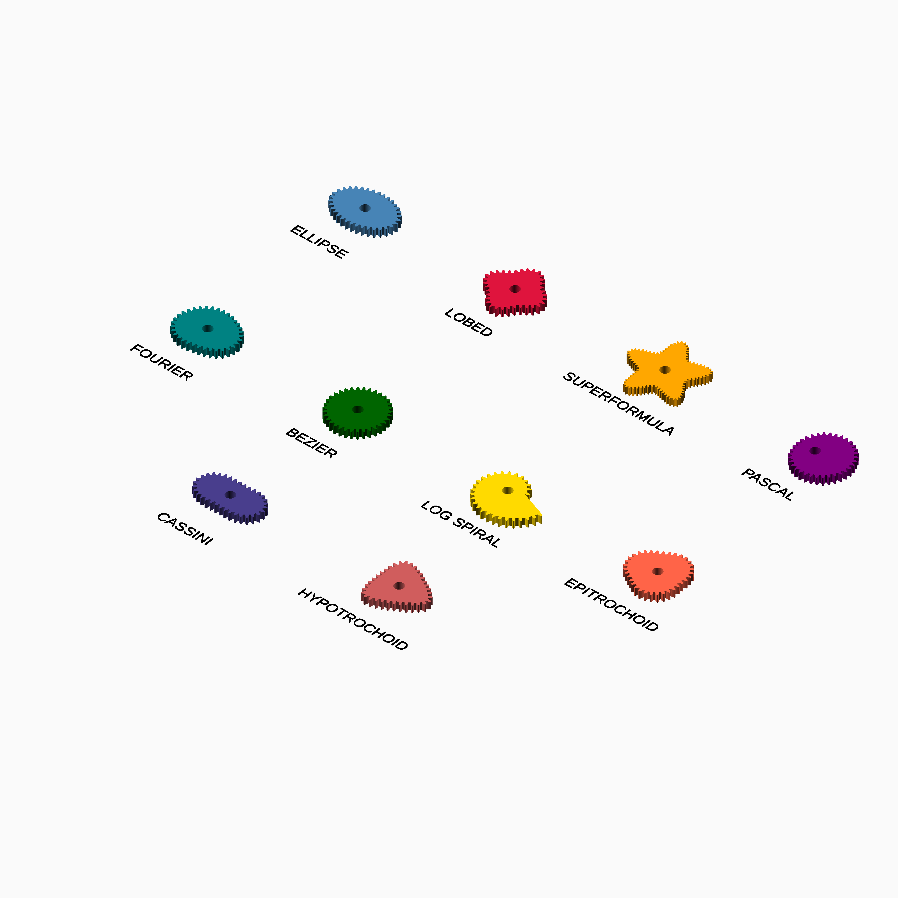

# CurveGears

## Beyond the circle

What happens when a gear no longer has to be round?

CurveGears explores that question in OpenSCAD. Ellipses, lobes, superformulae,
Fourier curves, Bézier paths, Cassini ovals, spirals and epitrochoids become pitch curves;
teeth follow those curves; and, where the geometry permits it, a conjugate mate
is derived from the motion rather than guessed from a second outline.

The result is a small laboratory for non-circular gears: part geometry library,
part visual catalogue, and part invitation to experiment with how changing a
curve changes the motion of a mechanism.

## An experiment, carefully supervised

CurveGears is intended as an experimental companion to the spirit of
[`Gears.scad`](https://github.com/chrisspen/gears): a reusable OpenSCAD library
for exploring gears, extended here into non-circular territory. It is not a
production transmission library or a guarantee of mechanical performance.

The implementation was written with AI assistance, but it is highly authored,
reviewed and architecturally supervised. The source, algorithms, examples and
regression fixtures are deliberately organised and checked as a coherent
library. That discipline makes the project useful for study and prototyping;
it does not remove the need for engineering judgement. Validate clearance,
strength, backlash, meshing, printability and material behaviour on the actual
printer and mechanism before relying on any generated gear.

## A tour of the families

The image below places one canonical gear from every maintained family together.
It is a quick glimpse of the different geometric languages available in the
library; the generated image is kept in `images/`:



## Quick start

Copy `src` into an OpenSCAD library path, then include the family file you need:

```scad
include <src/ellipse/gear.scad>;
curve_gear_ellipse(.8,34,4,4.8,eccentricity=.72);
```

Use a family `mate.scad` or `pair.scad` only when conjugate behaviour is
required. Gears are centred on X=0,Y=0, start at Z=0, and extrude in positive
Z. Dimensions use millimetres and angles use degrees, as documented by each
callable.

## Families at a glance

- **[Circle](docs/circle.md)** — constant-radius reference family for testing and regression purposes, with the standard gear, mate, and pair APIs.
Most families follow the same API shape:

- `curve_gear_<family>` — complete gear
- `curve_gear_<family>_body` — body only
- `curve_gear_<family>_mate` — conjugate mate
- `curve_gear_<family>_pair` — assembled pair

The available families are:

- **[Bézier](docs/bezier.md)** — arbitrary Cartesian control curves; single and body APIs are always available, while the mate adapter accepts only closed paths that are positive, single-valued in polar angle, continuously traversed and free of self-intersection.
- **[Cassini](docs/cassini.md)** — single-loop oval and peanut-shaped pitch curves with a dynamically conjugate mate; the lemniscate and two-loop regimes are rejected.
- **[Circle](docs/circle.md)** — constant-radius reference family for testing and regression purposes, with the standard gear, mate, and pair APIs.
- **[Ellipse](docs/ellipse.md)** — smooth, continuously varying transmission ratio.
- **[Epitrochoid](docs/epitrochoid.md)** — rolling-circle geometry with controlled curvature.
- **[Fourier](docs/fourier.md)** — user-defined harmonic polar profiles.
- **[Hypotrochoid](docs/hypotrochoid.md)** — inner-rolling trochoidal pitch curves with conjugate mate support.
- **[Lobed](docs/lobed.md)** — harmonic radial modulation with repeated lobes.
- **[Logarithmic spiral](docs/logarithmic_spiral.md)** — experimental growth curves with radial returns.
- **[Pascal](docs/pascal.md)** — limaçon-based curves, including deliberately non-convex forms.
- **[Superformula](docs/superformula.md)** — highly adjustable symmetric and polygon-like forms.

## Executable API examples

Every documented public callable has one matching source example under
[`examples/functions`](examples/functions). Geometry examples have generated
previews under `images/functions`; scalar functions print their result with
`echo`. The complete catalogue is [`examples/README.md`](examples/README.md).

## Detailed API documentation

Source comments are canonical. `make docs-pages` merges them into the focused
pages below; do not edit generated pages directly.

- Families
  - [Bézier](docs/bezier.md) · [Cassini](docs/cassini.md) · [Circle](docs/circle.md) · [Ellipse](docs/ellipse.md) · [Epitrochoid](docs/epitrochoid.md) · [Fourier](docs/fourier.md)
  - [Hypotrochoid](docs/hypotrochoid.md) · [Lobed](docs/lobed.md) · [Logarithmic spiral](docs/logarithmic_spiral.md) · [Pascal](docs/pascal.md) · [Superformula](docs/superformula.md)
- Shared
  - [Examples catalogue](examples/README.md) · [Test layout](tests/README.md)
  - [Tooth construction](docs/tooth-construction.md) · [Tooth placement](docs/tooth-placement.md) · [Mate motion](docs/mate-motion.md) · [Mate generation](docs/mate-generation.md) · [Pair assembly](docs/pair-assembly.md)

## Implementation notes

The shared tooth, placement, mate and pair-processing details are documented
in the focused technical pages above. The build and regression fixtures under
`tests/` provide evidence of the supported geometry paths.

They do not replace mechanical validation of a printed or assembled mechanism.
