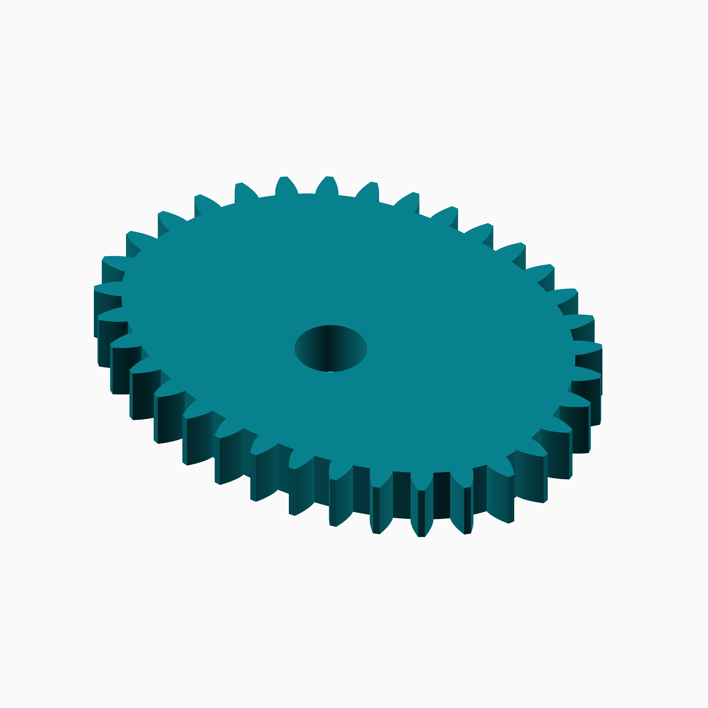
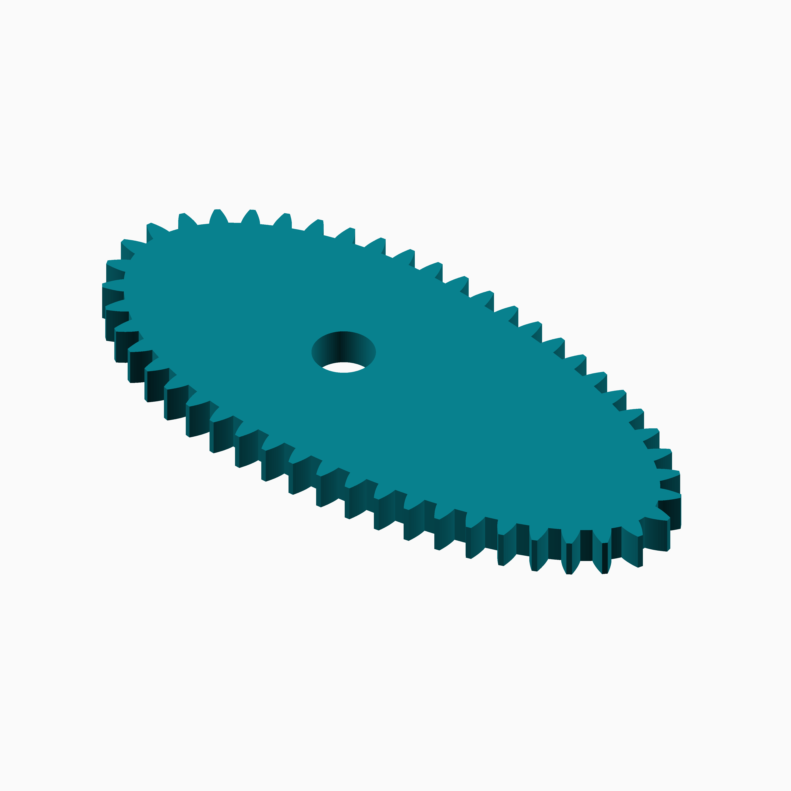
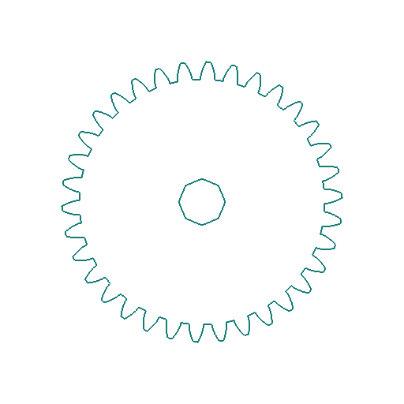
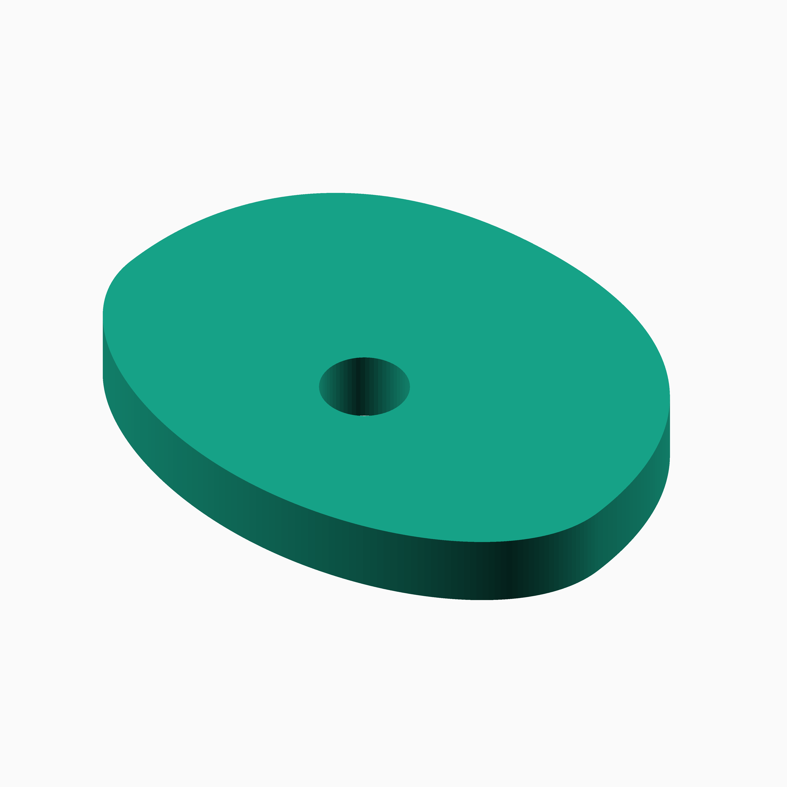
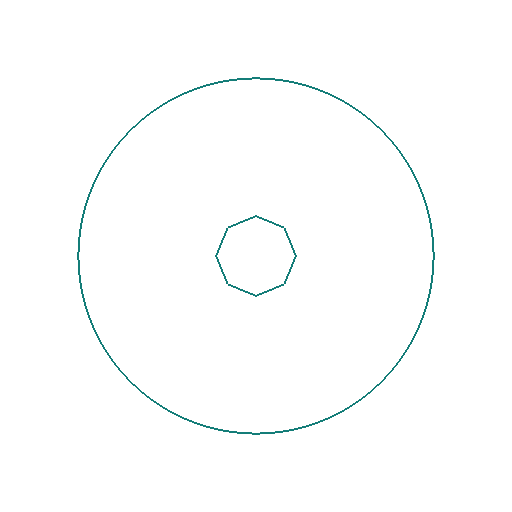
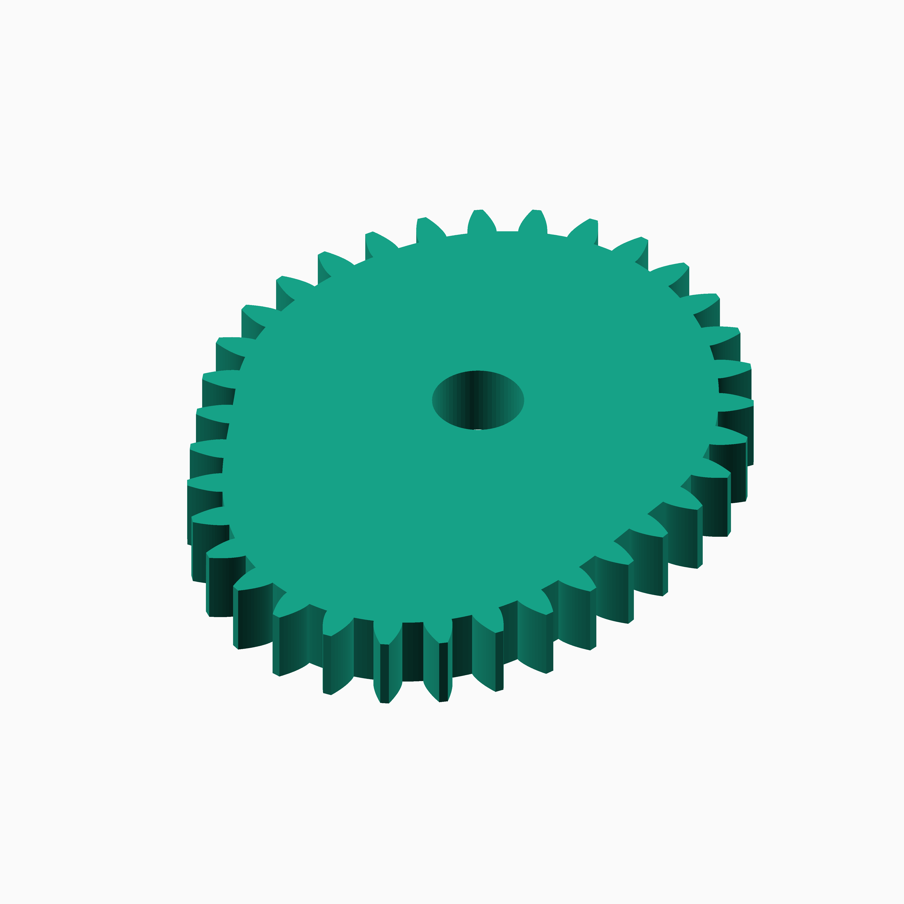
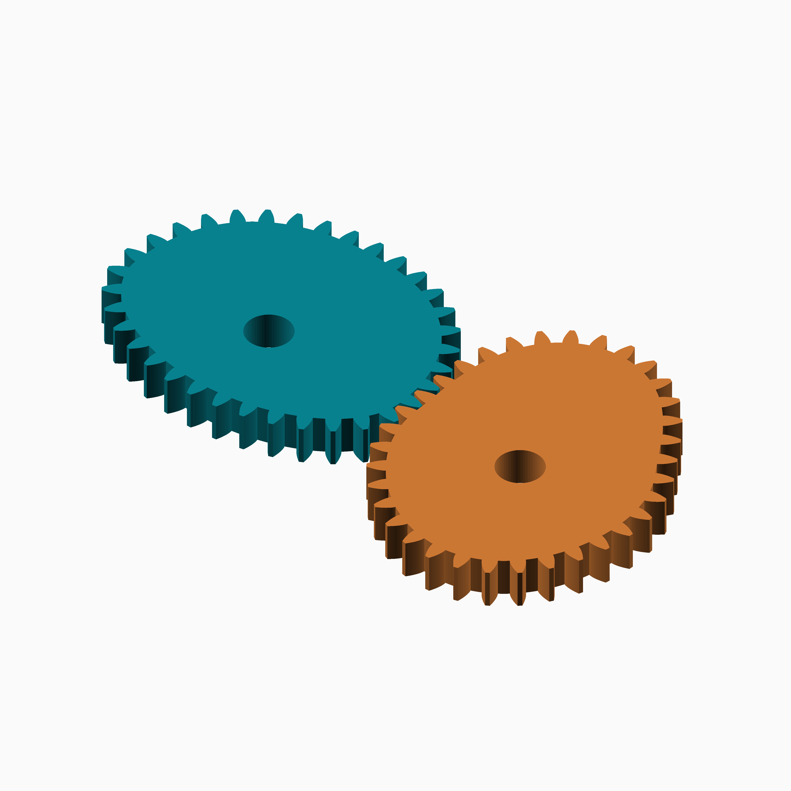
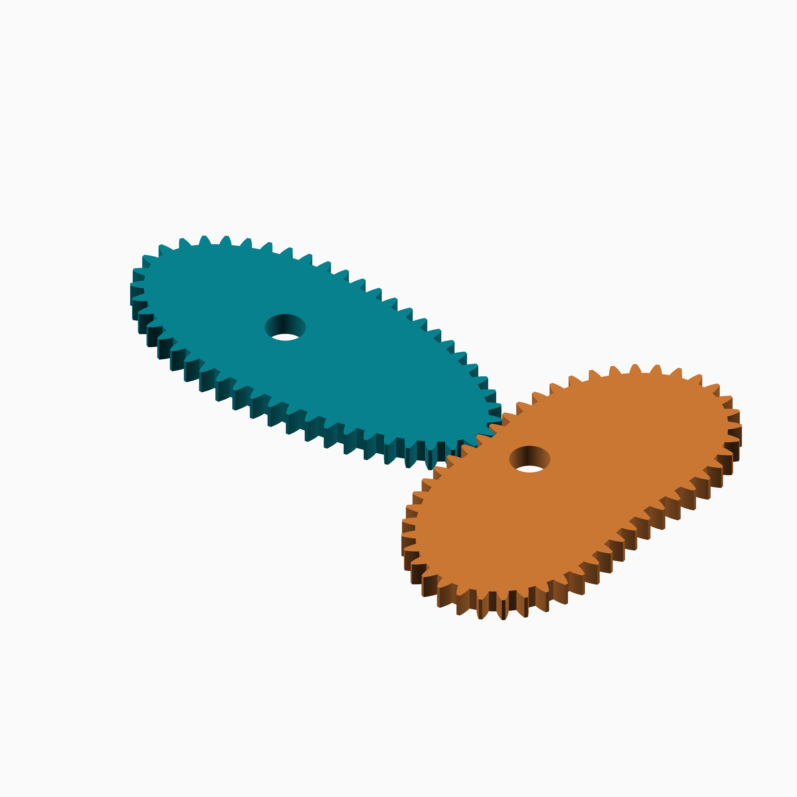

# Bézier

## Documentation navigation

- [README](../README.md)
- Families
  - [Bézier](bezier.md) · [Cassini](cassini.md) · [Circle](circle.md) · [Cusp](cusp.md) · [Ellipse](ellipse.md) · [Epitrochoid](epitrochoid.md)
  - [Fourier](fourier.md) · [Hypotrochoid](hypotrochoid.md) · [Lobed](lobed.md) · [Logarithmic spiral](logarithmic_spiral.md) · [Pascal](pascal.md) · [Superformula](superformula.md)
- Shared
  - [Examples catalogue](../examples/README.md) · [Test layout](../tests/README.md)
  - [Tooth construction](tooth-construction.md) · [Tooth placement](tooth-placement.md) · [Mate motion](mate-motion.md) · [Mate generation](mate-generation.md) · [Pair assembly](pair-assembly.md)

## Module `Bezier`

Control points are supplied in groups of three per segment:
[start, handle, handle, end, handle, handle, end, ...]. The final point
must equal the first point. Join tangents must be collinear and forward;
this prevents a hidden corner from entering the tooth sampler.
The cubic curve is exact between controls; the gear boundary uses a sampled
polyline for OpenSCAD polygon construction. Dense sampling is required for
sharp curvature, and arbitrary Cartesian controls are not promised to be a
single-valued radial pitch curve.

The basic curve is `B(t)=(1-t)^3 P0+3(1-t)^2 t P1+3(1-t)t^2 P2+t^3 P3`,
for `0 <= t <= 1`. Reference:
https://www.cs.sjsu.edu/~bruce/fall_2016_cs_116a_lecture_splines.html.

### Brief content:

**Functions**:

> [`curve_gear_bezier(modul, tooth_number, width, bore, ...)`](#function-curve_gear_beziermodul-tooth_number-width-bore-): Build a closed cubic Bézier gear from user-controlled normalised points.

> [`curve_gear_bezier_2d`](#function-curve_gear_bezier_2d): Emit the complete bezier gear profile as 2D geometry.

> [`curve_gear_bezier_body(modul, tooth_number, width, bore, ...)`](#function-curve_gear_bezier_bodymodul-tooth_number-width-bore-): Build the closed Bézier body without teeth.

> [`curve_gear_bezier_body_2d`](#function-curve_gear_bezier_body_2d): Emit the bezier body as 2D geometry with an optional signed outer-contour offset.

> [`curve_gear_bezier_mate`](#function-curve_gear_bezier_mate): Build a conjugate mate for an admissible radial Bézier pitch curve.

> [`curve_gear_bezier_mate_centre_distance(modul, tooth_number, ...)`](#function-curve_gear_bezier_mate_centre_distancemodul-tooth_number-): Return the conjugate centre distance for an admissible Bézier curve.

> [`curve_gear_bezier_mate_rotation(modul, tooth_number, ...)`](#function-curve_gear_bezier_mate_rotationmodul-tooth_number-): Return the conjugate mate rotation for a driver phase.

> [`curve_gear_bezier_pair(modul, tooth_number, width, bore, ...)`](#function-curve_gear_bezier_pairmodul-tooth_number-width-bore-): Build a meshed or separated pair using the admissible Bézier radial-mate adapter.

> [`_cg_bezier_build(modul,tooth_number,width,bore,control_points=_cg_bezier_default_control_points,pressure_angle=20,tooth_phase=0,backlash=undef,clearance=undef,samples=720,orientation=0,body_only=false)`](#function-_cg_bezier_buildmodultooth_numberwidthborecontrol_points_cg_bezier_default_control_pointspressure_angle20tooth_phase0backlashundefclearanceundefsamples720orientation0body_onlyfalse): Internal bezier construction dispatcher.

> [`_cg_bezier_controls_valid`](#function-_cg_bezier_controls_valid): Validate closure, segment grouping and forward tangent continuity.

> [`_cg_bezier_driver_radii_from_table(table, n)`](#function-_cg_bezier_driver_radii_from_tabletable-n): Sample Bézier pitch radii at driver-phase boundaries.

> [`_cg_bezier_mate_admissibility(control_points, scale, n)`](#function-_cg_bezier_mate_admissibilitycontrol_points-scale-n): Return the first failed radial-curve condition for mate construction.

> [`_cg_bezier_mate_centre_distance(control_points, scale, n)`](#function-_cg_bezier_mate_centre_distancecontrol_points-scale-n): Solve the fixed centre distance for an admissible Bézier curve.

> [`_cg_bezier_mate_points(control_points, scale, D, n)`](#function-_cg_bezier_mate_pointscontrol_points-scale-d-n): Construct conjugate mate pitch points for an admissible Bézier curve.

> [`_cg_bezier_mid_radii_from_table(table, n)`](#function-_cg_bezier_mid_radii_from_tabletable-n): Sample Bézier pitch radii at phase-interval midpoints.

> [`_cg_bezier_point`](#function-_cg_bezier_point): Evaluate one cubic Bézier segment.

> [`_cg_bezier_points`](#function-_cg_bezier_points): Sample a closed Bézier pitch curve into the shared tooth engine.

> [`_cg_bezier_polar_monotonic(samples, i=0)`](#function-_cg_bezier_polar_monotonicsamples-i0): Check that polar sample angles increase strictly through the table.

> [`_cg_bezier_polar_samples(control_points, scale, n)`](#function-_cg_bezier_polar_samplescontrol_points-scale-n): Convert sampled Bézier points to polar angle and radius pairs.

> [`_cg_bezier_polar_table(control_points, scale, n)`](#function-_cg_bezier_polar_tablecontrol_points-scale-n): Build a closed polar interpolation table for a Bézier curve.

> [`_cg_bezier_radius_from_polar_table(table, theta)`](#function-_cg_bezier_radius_from_polar_tabletable-theta): Interpolate a Bézier pitch radius at one polar angle.

> [`_cg_bezier_segment_count`](#function-_cg_bezier_segment_count): Return the number of cubic segments in a closed control-point list.

## Functions

The module `Bezier` defines the following functions.

### Function `curve_gear_bezier(modul, tooth_number, width, bore, ...)`

| Bézier gear preview | Bézier asymmetric alternative |
| --- | --- |
|  |  |

Build a closed cubic Bézier gear from user-controlled normalised points.

**Parameters:**

- `modul`: {number > 0} Tooth module in mm.
- `tooth_number`: {integer >= 3} Number of teeth.
- `width`: {number > 0} Extrusion width in mm.
- `bore`: {number >= 0} Centre bore diameter in mm.
- `control_points`: {closed array grouped as 3n+1 points} Segment endpoints and handles; final point must equal first.
- `pressure_angle`: {0 < angle < 90, default 20} Involute pressure angle in degrees.
- `tooth_phase`: {angle, default 0} Tooth placement phase in degrees.
- `backlash`: {undef or >= 0} Tangential tooth-thickness reduction in mm.
- `clearance`: {undef or >= 0} Additional radial root clearance in mm.
- `samples`: {integer >= 120, default 720} Curve sampling density.
- `orientation`: {angle, default 0} Single-gear display rotation in degrees.

**Returns:**

No return

### Example:

~~~c
curve_gear_bezier(1, 24, 4, 8);
~~~

Back to [module description](#module-bezier).

### Function `curve_gear_bezier_2d`

| bezier 2D gear outline | ⠀ |
| --- | --- |
|  |  |

Emit the complete bezier gear profile as 2D geometry.

**Parameters:**

- `modul`: {value} Tooth module in mm.
- `tooth_number`: {value} Number of teeth.
- `bore`: {value} Centre bore diameter in mm.
- `control_points`: {value} Same family-specific parameter as curve_gear_bezier.
- `pressure_angle`: {value} Same family-specific parameter as curve_gear_bezier.
- `tooth_phase`: {value} Same family-specific parameter as curve_gear_bezier.
- `backlash`: {value} Same family-specific parameter as curve_gear_bezier.
- `clearance`: {value} Same family-specific parameter as curve_gear_bezier.
- `samples`: {value} Same family-specific parameter as curve_gear_bezier.
- `orientation`: {value} Rotation in degrees.

**Returns:**

No return

### Example:

~~~c
curve_gear_bezier_2d(0.8, 34, 4.8);
~~~

Back to [module description](#module-bezier).

### Function `curve_gear_bezier_body(modul, tooth_number, width, bore, ...)`

| Bézier body preview | ⠀ |
| --- | --- |
|  |  |

Build the closed Bézier body without teeth.

**Parameters:**

- `modul`: {number > 0} Tooth module in mm.
- `tooth_number`: {integer >= 3} Number of teeth.
- `width`: {number > 0} Extrusion width in mm.
- `bore`: {number >= 0} Centre bore diameter in mm.
- `control_points`: {closed array grouped as 3n+1 points} Segment endpoints and handles; final point must equal first.
- `pressure_angle`: {0 < angle < 90, default 20} Involute pressure angle in degrees.
- `tooth_phase`: {angle, default 0} Tooth placement phase in degrees.
- `backlash`: {undef or >= 0} Tangential tooth-thickness reduction in mm.
- `clearance`: {undef or >= 0} Additional radial root clearance in mm.
- `samples`: {integer >= 120, default 720} Curve sampling density.
- `orientation`: {angle, default 0} Single-gear display rotation in degrees.

**Returns:**

No return

Back to [module description](#module-bezier).

### Function `curve_gear_bezier_body_2d`

| bezier 2D body outline | ⠀ |
| --- | --- |
|  |  |

Emit the bezier body as 2D geometry with an optional signed outer-contour offset.

**Parameters:**

- `modul`: {value} Tooth module in mm.
- `tooth_number`: {value} Number of teeth.
- `bore`: {value} Centre bore diameter in mm.
- `control_points`: {value} Same family-specific parameter as curve_gear_bezier_body.
- `pressure_angle`: {value} Same family-specific parameter as curve_gear_bezier_body.
- `tooth_phase`: {value} Same family-specific parameter as curve_gear_bezier_body.
- `backlash`: {value} Same family-specific parameter as curve_gear_bezier_body.
- `clearance`: {value} Same family-specific parameter as curve_gear_bezier_body.
- `samples`: {value} Same family-specific parameter as curve_gear_bezier_body.
- `orientation`: {value} Rotation in degrees.
- `body_offset`: {value} Signed offset in mm; negative values shrink the outer body contour while preserving the bore.

**Returns:**

No return

### Example:

~~~c
curve_gear_bezier_body_2d(0.8, 34, 4.8, body_offset=-2);
~~~

Back to [module description](#module-bezier).

### Function `curve_gear_bezier_mate`

| Bézier mate preview | ⠀ |
| --- | --- |
|  |  |

Build a conjugate mate for an admissible radial Bézier pitch curve.

**Parameters:**

- `modul`: {number > 0} Tooth module in mm.
- `tooth_number`: {integer >= 3} Number of teeth.
- `width`: {number > 0} Extrusion width in mm.
- `bore`: {number >= 0} Centre bore diameter in mm.
- `control_points`: {closed array grouped as 3n+1 points} Bézier controls.
- `pressure_angle`: {0 < angle < 90, default 20} Involute pressure angle in degrees.
- `tooth_phase`: {angle, default 0} Tooth placement phase in degrees.
- `backlash`: {undef or >= 0} Tangential tooth-thickness reduction in mm.
- `clearance`: {undef or >= 0} Additional radial root clearance in mm.
- `samples`: {integer >= 120, default 720} Adapter and pitch sampling density.

**Returns:**

No return

Back to [module description](#module-bezier).

### Function `curve_gear_bezier_mate_centre_distance(modul, tooth_number, ...)`

Return the conjugate centre distance for an admissible Bézier curve.

**Parameters:**

- `modul`: {number > 0} Tooth module in mm.
- `tooth_number`: {integer >= 3} Number of teeth.
- `control_points`: {closed array grouped as 3n+1 points} Bézier controls.
- `samples`: {integer >= 120, default 720} Adapter and pitch sampling density.

**Returns:**

- `{number}`: Conjugate centre distance in mm.

Back to [module description](#module-bezier).

### Function `curve_gear_bezier_mate_rotation(modul, tooth_number, ...)`

Return the conjugate mate rotation for a driver phase.

**Parameters:**

- `modul`: {number > 0} Tooth module in mm.
- `tooth_number`: {integer >= 3} Number of teeth.
- `control_points`: {closed array grouped as 3n+1 points} Bézier controls.
- `samples`: {integer >= 120, default 720} Adapter and pitch sampling density.
- `phase`: {angle, default 0} Driver motion phase in degrees.

**Returns:**

- `{angle}`: Conjugate mate rotation in degrees.

Back to [module description](#module-bezier).

### Function `curve_gear_bezier_pair(modul, tooth_number, width, bore, ...)`

| Bézier pair preview | Bézier asymmetric alternative pair |
| --- | --- |
|  |  |

Build a meshed or separated pair using the admissible Bézier radial-mate adapter.

**Parameters:**

- `modul`: {number > 0} Tooth module in mm.
- `tooth_number`: {integer >= 3} Number of teeth.
- `width`: {number > 0} Extrusion width in mm.
- `bore`: {number >= 0} Centre bore diameter in mm.
- `control_points`: {closed array grouped as 3n+1 points} Bézier controls.
- `pressure_angle`: {0 < angle < 90, default 20} Involute pressure angle in degrees.
- `samples`: {integer >= 120, default 720} Adapter and pitch sampling density.
- `phase`: {angle, default 0} Driver motion phase in degrees.
- `together_built`: {boolean, default true} Build the pair as one assembled object when true.
- `backlash`: {undef or >= 0} Tangential tooth-thickness reduction in mm.
- `clearance`: {undef or >= 0} Additional radial root clearance in mm.
- `tooth_phase`: {angle, default 0} Tooth placement phase in degrees.
- `driver_color`: {colour, default SteelBlue} Driver gear colour.
- `mate_color`: {colour, default Gold} Mate gear colour.

**Returns:**

No return

Back to [module description](#module-bezier).

### Function `_cg_bezier_build(modul,tooth_number,width,bore,control_points=_cg_bezier_default_control_points,pressure_angle=20,tooth_phase=0,backlash=undef,clearance=undef,samples=720,orientation=0,body_only=false)`

Internal bezier construction dispatcher.

**Parameters:**

- `modul`: {number} Tooth module in mm.
- `tooth_number`: {integer} Number of teeth.
- `width`: {number} Extrusion width in mm.
- `bore`: {number} Centre bore diameter in mm.
- `control_points`: {value, default _cg_bezier_default_control_points} Internal construction parameter.
- `pressure_angle`: {number, default 20} Involute pressure angle in degrees.
- `tooth_phase`: {number, default 0} Tooth placement phase in degrees.
- `backlash`: {number, default undef} Tangential tooth-thickness reduction in mm.
- `clearance`: {number, default undef} Additional radial root clearance in mm.
- `samples`: {integer, default 720} Pitch-curve or motion-table sampling density.
- `orientation`: {number, default 0} Single-gear display rotation in degrees.
- `body_only`: {boolean, default false} Emit the body without teeth.

**Returns:**

- `{geometry}`: Constructed family geometry.

Back to [module description](#module-bezier).

### Function `_cg_bezier_controls_valid`

Validate closure, segment grouping and forward tangent continuity.

**Parameters:**

- `control_points`: {array of points} Closed Bézier control-point list.

**Returns:**

- `{boolean}`: True when the control list is structurally valid.

Back to [module description](#module-bezier).

### Function `_cg_bezier_driver_radii_from_table(table, n)`

Sample Bézier pitch radii at driver-phase boundaries.

**Parameters:**

- `table`: {array} Closed angle-radius interpolation table.
- `n`: {integer >= 1} Number of phase intervals.

**Returns:**

- `{array of number}`: Driver radii in angular order.

Back to [module description](#module-bezier).

### Function `_cg_bezier_mate_admissibility(control_points, scale, n)`

Return the first failed radial-curve condition for mate construction.

**Parameters:**

- `control_points`: {array of points} Bézier control points.
- `scale`: {number > 0} Pitch-curve scale in millimetres.
- `n`: {integer >= 1} Number of samples used for checks.

**Returns:**

- `{string}`: `PASS` or the failed admissibility condition code.

Back to [module description](#module-bezier).

### Function `_cg_bezier_mate_centre_distance(control_points, scale, n)`

Solve the fixed centre distance for an admissible Bézier curve.

**Parameters:**

- `control_points`: {array of points} Bézier control points.
- `scale`: {number > 0} Pitch-curve scale in millimetres.
- `n`: {integer >= 1} Number of motion samples.

**Returns:**

- `{number}`: Solved centre distance in millimetres.

Back to [module description](#module-bezier).

### Function `_cg_bezier_mate_points(control_points, scale, D, n)`

Construct conjugate mate pitch points for an admissible Bézier curve.

**Parameters:**

- `control_points`: {array of points} Bézier control points.
- `scale`: {number > 0} Pitch-curve scale in millimetres.
- `D`: {number > 0} Fixed centre distance in millimetres.
- `n`: {integer >= 1} Number of pitch and motion samples.

**Returns:**

- `{array of points}`: Mate pitch curve in millimetres.

Back to [module description](#module-bezier).

### Function `_cg_bezier_mid_radii_from_table(table, n)`

Sample Bézier pitch radii at phase-interval midpoints.

**Parameters:**

- `table`: {array} Closed angle-radius interpolation table.
- `n`: {integer >= 1} Number of phase intervals.

**Returns:**

- `{array of number}`: Midpoint radii in angular order.

Back to [module description](#module-bezier).

### Function `_cg_bezier_point`

Evaluate one cubic Bézier segment.

**Parameters:**

- `p0`: {point} Segment start point.
- `p1`: {point} First control point.
- `p2`: {point} Second control point.
- `p3`: {point} Segment end point.
- `t`: {number, 0 <= t <= 1} Segment interpolation parameter.

**Returns:**

- `{point}`: Evaluated Cartesian point.

Back to [module description](#module-bezier).

### Function `_cg_bezier_points`

Sample a closed Bézier pitch curve into the shared tooth engine.

**Parameters:**

- `control_points`: {array of points} Valid closed Bézier control-point list.
- `scale`: {number > 0} Radial scale applied to each sampled point.
- `samples`: {integer >= 1} Number of output samples.

**Returns:**

- `{array of points}`: Sampled Cartesian pitch points.

Back to [module description](#module-bezier).

### Function `_cg_bezier_polar_monotonic(samples, i=0)`

Check that polar sample angles increase strictly through the table.

**Parameters:**

- `samples`: {array} Polar samples ordered by traversal.
- `i`: {integer >= 0, default 0} Current sample index.

**Returns:**

- `{boolean}`: True when the angular traversal is monotonic.

Back to [module description](#module-bezier).

### Function `_cg_bezier_polar_samples(control_points, scale, n)`

Convert sampled Bézier points to polar angle and radius pairs.

**Parameters:**

- `control_points`: {array of points} Bézier control points.
- `scale`: {number > 0} Pitch-curve scale in millimetres.
- `n`: {integer >= 1} Number of samples.

**Returns:**

- `{array}`: Polar samples as `[angle, radius]` pairs.

Back to [module description](#module-bezier).

### Function `_cg_bezier_polar_table(control_points, scale, n)`

Build a closed polar interpolation table for a Bézier curve.

**Parameters:**

- `control_points`: {array of points} Bézier control points.
- `scale`: {number > 0} Pitch-curve scale in millimetres.
- `n`: {integer >= 1} Number of samples.

**Returns:**

- `{array}`: Polar table spanning zero through 360 degrees.

Back to [module description](#module-bezier).

### Function `_cg_bezier_radius_from_polar_table(table, theta)`

Interpolate a Bézier pitch radius at one polar angle.

**Parameters:**

- `table`: {array} Closed angle-radius interpolation table.
- `theta`: {angle} Polar angle in degrees.

**Returns:**

- `{number}`: Interpolated pitch radius.

Back to [module description](#module-bezier).

### Function `_cg_bezier_segment_count`

Return the number of cubic segments in a closed control-point list.

**Parameters:**

- `control_points`: {array of points} Closed Bézier control-point list.

**Returns:**

- `{integer}`: Number of cubic segments.

Back to [module description](#module-bezier).

Back to [top](#).

---

[Back to the CurveGears README](../README.md)

*Generated by Doxydown from repository source comments; do not edit this page directly.*
