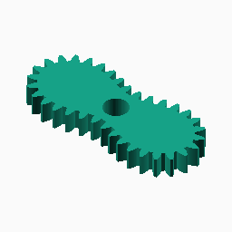
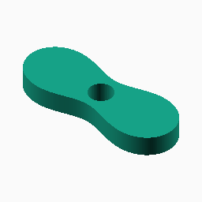
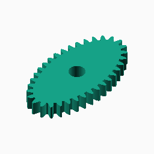
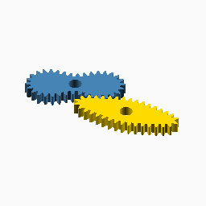

# Cassini

## Documentation navigation

- [README](../README.md)
- Families
  - [Bézier](bezier.md) · [Cassini](cassini.md) · [Circle](circle.md) · [Ellipse](ellipse.md) · [Epitrochoid](epitrochoid.md) · [Fourier](fourier.md)
  - [Hypotrochoid](hypotrochoid.md) · [Lobed](lobed.md) · [Logarithmic spiral](logarithmic_spiral.md) · [Pascal](pascal.md) · [Superformula](superformula.md)
- Shared
  - [Examples catalogue](../examples/README.md) · [Test layout](../tests/README.md)
  - [Tooth construction](tooth-construction.md) · [Tooth placement](tooth-placement.md) · [Mate motion](mate-motion.md) · [Mate generation](mate-generation.md) · [Pair assembly](pair-assembly.md)

## Module `Cassini`

The foci are at `+/-c` and the product of distances to the foci is `b^2`.
This family uses only the single-loop branch `0 <= c/b < 1`; the lemniscate
and two-loop regimes are intentionally rejected because the common gear
pipeline requires one positive, origin-centred polar pitch curve.
Reference: https://mathworld.wolfram.com/CassiniOvals.html.

### Brief content:

**Functions**:

> [`_cg_cassini_focus_ratio_valid`](#function-_cg_cassini_focus_ratio_valid): Check the supported single-loop Cassini parameter range.

> [`_cg_cassini_unit_radius`](#function-_cg_cassini_unit_radius): Evaluate the normalised positive Cassini polar branch.

> [`_cg_cassini_point`](#function-_cg_cassini_point): Convert a scaled Cassini radius to a Cartesian pitch point.

> [`_cg_cassini_points`](#function-_cg_cassini_points): Sample one complete single-loop Cassini pitch curve.

> [`_cg_cassini_scale`](#function-_cg_cassini_scale): Scale a Cassini curve to the requested tooth pitch.

> [`_cg_cassini_radius`](#function-_cg_cassini_radius): Evaluate a scaled Cassini radius.

> [`_cg_cassini_max_radius`](#function-_cg_cassini_max_radius): Calculate the exact maximum scaled radius on the supported branch.

> [`curve_gear_cassini`](#function-curve_gear_cassini): Build a single-loop Cassini non-circular gear.

> [`curve_gear_cassini_body`](#function-curve_gear_cassini_body): Build the Cassini body solid without teeth.

> [`_cg_cassini_motion_radii`](#function-_cg_cassini_motion_radii): Evaluate Cassini radii at integration midpoints.

> [`_cg_cassini_driver_radii`](#function-_cg_cassini_driver_radii): Evaluate Cassini radii at direct mate-construction angles.

> [`_cg_cassini_centre_distance`](#function-_cg_cassini_centre_distance): Solve the Cassini conjugate centre distance.

> [`_cg_cassini_motion_table`](#function-_cg_cassini_motion_table): Build the shared Cassini phase-motion table.

> [`_cg_cassini_mate_points_from_driver`](#function-_cg_cassini_mate_points_from_driver): Build Cassini mate pitch points by advancing driver angle directly.

> [`_cg_cassini_mate_points`](#function-_cg_cassini_mate_points): Build Cassini mate pitch points.

> [`curve_gear_cassini_mate`](#function-curve_gear_cassini_mate): Build the standalone conjugate mate for a Cassini driver.

> [`curve_gear_cassini_centre_distance`](#function-curve_gear_cassini_centre_distance): Return the mathematical centre distance for a Cassini pair.

> [`curve_gear_cassini_mate_rotation`](#function-curve_gear_cassini_mate_rotation): Return the conjugate Cassini mate rotation for a driver phase.

> [`curve_gear_cassini_pair`](#function-curve_gear_cassini_pair): Build a meshed or separated Cassini driver/mate pair.

## Functions

The module `Cassini` defines the following functions.

### Function `_cg_cassini_focus_ratio_valid`

Check the supported single-loop Cassini parameter range.

**Parameters:**

- `focus_ratio`: {0 <= number < 1} Ratio of focal half-distance to the product parameter.

**Returns:**

- `{boolean}`: True for the positive single-loop polar branch.

Back to [module description](#module-cassini).

### Function `_cg_cassini_unit_radius`

Evaluate the normalised positive Cassini polar branch.

**Parameters:**

- `focus_ratio`: {0 <= number < 1} Ratio `c/b`.
- `theta`: {angle} Polar angle in degrees.

**Returns:**

- `{number}`: Unit Cassini radius.

Back to [module description](#module-cassini).

### Function `_cg_cassini_point`

Convert a scaled Cassini radius to a Cartesian pitch point.

**Parameters:**

- `scale`: {number > 0} Curve scale in mm.
- `focus_ratio`: {0 <= number < 1} Ratio `c/b`.
- `theta`: {angle} Polar angle in degrees.

**Returns:**

- `{array}`: Cartesian pitch point in mm.

Back to [module description](#module-cassini).

### Function `_cg_cassini_points`

Sample one complete single-loop Cassini pitch curve.

**Parameters:**

- `scale`: {number > 0} Curve scale in mm.
- `focus_ratio`: {0 <= number < 1} Ratio `c/b`.
- `n`: {integer >= 1, default 720} Number of samples.

**Returns:**

- `{array of points}`: Closed sampled pitch curve.

Back to [module description](#module-cassini).

### Function `_cg_cassini_scale`

Scale a Cassini curve to the requested tooth pitch.

**Parameters:**

- `modul`: {number > 0} Tooth module in mm.
- `tooth_number`: {integer >= 3} Number of teeth.
- `focus_ratio`: {0 <= number < 1} Ratio `c/b`.
- `n`: {integer >= 1, default 720} Number of perimeter samples.

**Returns:**

- `{number}`: Curve scale in mm.

Back to [module description](#module-cassini).

### Function `_cg_cassini_radius`

Evaluate a scaled Cassini radius.

**Parameters:**

- `scale`: {number > 0} Curve scale in mm.
- `focus_ratio`: {0 <= number < 1} Ratio `c/b`.
- `theta`: {angle} Polar angle in degrees.

**Returns:**

- `{number}`: Cassini radius in mm.

Back to [module description](#module-cassini).

### Function `_cg_cassini_max_radius`

Calculate the exact maximum scaled radius on the supported branch.

**Parameters:**

- `scale`: {number > 0} Curve scale in mm.
- `focus_ratio`: {0 <= number < 1} Ratio `c/b`.
- `n`: {integer >= 1, default 1440} Retained for internal call compatibility; the exact maximum needs no sampling.

**Returns:**

- `{number}`: Maximum radius in mm.

Back to [module description](#module-cassini).

### Function `curve_gear_cassini`

The supported branch is a positive single loop. `focus_ratio >= 1` is rejected.

**Parameters:**

- `modul`: {number > 0} Tooth module in mm.
- `tooth_number`: {integer >= 3} Number of teeth.
- `width`: {number > 0} Extrusion width in mm.
- `bore`: {number >= 0} Centre bore diameter in mm.
- `focus_ratio`: {0 <= number < 1, default 0.78} Focal half-distance divided by the Cassini product parameter.
- `pressure_angle`: {0 < angle < 90, default 20} Involute pressure angle.
- `tooth_phase`: {angle, default 0} Tooth placement phase.
- `backlash`: {undef or >= 0} Tangential tooth-thickness reduction in mm.
- `clearance`: {undef or >= 0} Additional radial root clearance in mm.
- `samples`: {integer >= 120, default 720} Pitch-curve sampling density.
- `orientation`: {angle, default 0} Single-gear display rotation.

**Returns:**

No return

### Example:

~~~c
curve_gear_cassini(1, 24, 4, 8);
~~~

Back to [module description](#module-cassini).

### Function `curve_gear_cassini_body`

Build the Cassini body solid without teeth.

**Parameters:**

- `modul`: {number > 0} Tooth module in mm.
- `tooth_number`: {integer >= 3} Number of teeth.
- `width`: {number > 0} Extrusion width in mm.
- `bore`: {number >= 0} Centre bore diameter in mm.
- `focus_ratio`: {0 <= number < 1, default 0.78} Focal half-distance divided by the Cassini product parameter.
- `pressure_angle`: {0 < angle < 90, default 20} Involute pressure angle.
- `tooth_phase`: {angle, default 0} Tooth placement phase.
- `backlash`: {undef or >= 0} Tangential tooth-thickness reduction in mm.
- `clearance`: {undef or >= 0} Additional radial root clearance in mm.
- `samples`: {integer >= 120, default 720} Pitch-curve sampling density.
- `orientation`: {angle, default 0} Single-gear display rotation.

**Returns:**

No return

### Example:

~~~c
curve_gear_cassini_body(1, 24, 4, 8);
~~~

Back to [module description](#module-cassini).

### Function `_cg_cassini_motion_radii`

Evaluate Cassini radii at integration midpoints.

**Parameters:**

No parameters

**Returns:**

No return

Back to [module description](#module-cassini).

### Function `_cg_cassini_driver_radii`

Evaluate Cassini radii at direct mate-construction angles.

**Parameters:**

No parameters

**Returns:**

No return

Back to [module description](#module-cassini).

### Function `_cg_cassini_centre_distance`

Solve the Cassini conjugate centre distance.

**Parameters:**

No parameters

**Returns:**

No return

Back to [module description](#module-cassini).

### Function `_cg_cassini_motion_table`

Build the shared Cassini phase-motion table.

**Parameters:**

No parameters

**Returns:**

No return

Back to [module description](#module-cassini).

### Function `_cg_cassini_mate_points_from_driver`

Build Cassini mate pitch points by advancing driver angle directly.

**Parameters:**

No parameters

**Returns:**

No return

Back to [module description](#module-cassini).

### Function `_cg_cassini_mate_points`

Build Cassini mate pitch points.

**Parameters:**

No parameters

**Returns:**

No return

Back to [module description](#module-cassini).

### Function `curve_gear_cassini_mate`

Build the standalone conjugate mate for a Cassini driver.

**Parameters:**

- `modul`: {number > 0} Tooth module in mm.
- `tooth_number`: {integer >= 3} Number of teeth.
- `width`: {number > 0} Extrusion width in mm.
- `bore`: {number >= 0} Centre bore diameter in mm.
- `focus_ratio`: {0 <= number < 1, default 0.78} Cassini focal ratio.
- `pressure_angle`: {0 < angle < 90, default 20} Involute pressure angle.
- `tooth_phase`: {angle, default 0} Tooth placement phase.
- `backlash`: {undef or >= 0} Tangential tooth-thickness reduction in mm.
- `clearance`: {undef or >= 0} Additional radial root clearance in mm.
- `samples`: {integer >= 120, default 720} Pitch-curve sampling density.

**Returns:**

No return

Back to [module description](#module-cassini).

### Function `curve_gear_cassini_centre_distance`

Return the mathematical centre distance for a Cassini pair.

**Parameters:**

- `modul`: {number > 0} Tooth module in mm.
- `tooth_number`: {integer >= 3} Number of teeth.
- `focus_ratio`: {0 <= number < 1, default 0.78} Cassini focal ratio.
- `samples`: {integer >= 120, default 720} Motion sampling density.

**Returns:**

- `{number}`: Pair centre distance in mm.

Back to [module description](#module-cassini).

### Function `curve_gear_cassini_mate_rotation`

Return the conjugate Cassini mate rotation for a driver phase.

**Parameters:**

- `modul`: {number > 0} Tooth module in mm.
- `tooth_number`: {integer >= 3} Number of teeth.
- `focus_ratio`: {0 <= number < 1, default 0.78} Cassini focal ratio.
- `samples`: {integer >= 120, default 720} Motion sampling density.
- `phase`: {angle, default 0} Driver motion phase.

**Returns:**

- `{angle}`: Mate display rotation.

Back to [module description](#module-cassini).

### Function `curve_gear_cassini_pair`

Build a meshed or separated Cassini driver/mate pair.

**Parameters:**

- `modul`: {number > 0} Tooth module in mm.
- `tooth_number`: {integer >= 3} Number of teeth.
- `width`: {number > 0} Extrusion width in mm.
- `bore`: {number >= 0} Centre bore diameter in mm.
- `focus_ratio`: {0 <= number < 1, default 0.78} Cassini focal ratio.
- `pressure_angle`: {0 < angle < 90, default 20} Involute pressure angle.
- `samples`: {integer >= 120, default 720} Pitch-curve and motion sampling density.
- `phase`: {angle, default 0} Driver motion phase.
- `tooth_phase`: {angle, default 0} Tooth placement phase.
- `backlash`: {undef or >= 0} Tangential tooth-thickness reduction in mm.
- `clearance`: {undef or >= 0} Additional radial root clearance in mm.
- `together_built`: {boolean, default true} Place the pair meshed when true.
- `driver_color`: {OpenSCAD colour, default SteelBlue} Driver display colour.
- `mate_color`: {OpenSCAD colour, default Gold} Mate display colour.

**Returns:**

No return

### Example:

~~~c
curve_gear_cassini_pair(1, 24, 4, 8);
~~~

Back to [module description](#module-cassini).

Back to [top](#).

---

[Back to the CurveGears README](../README.md)

*Generated by Doxydown from repository source comments; do not edit this page directly.*
