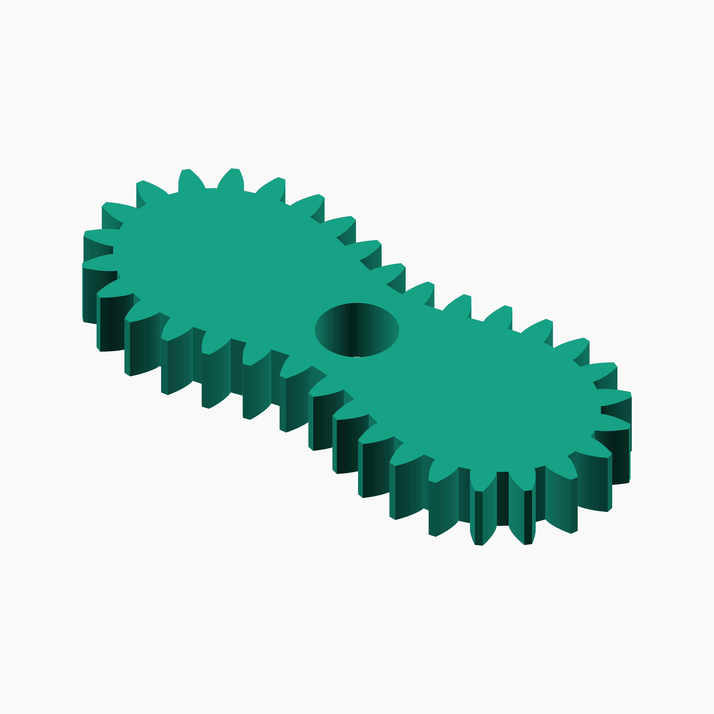
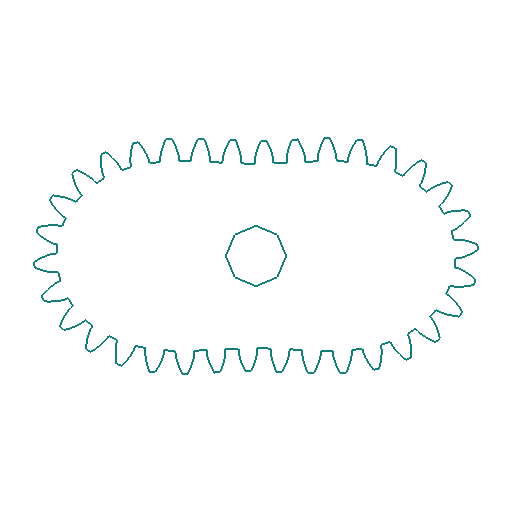
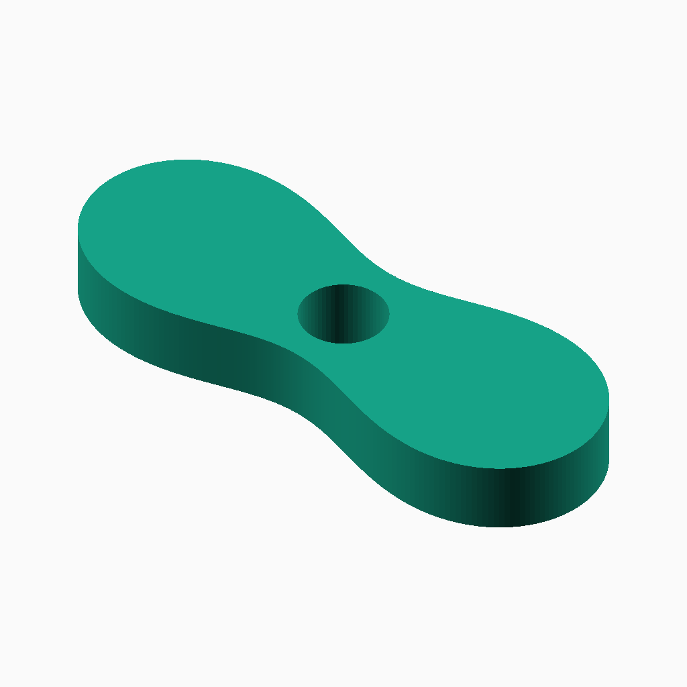
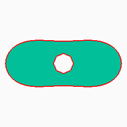
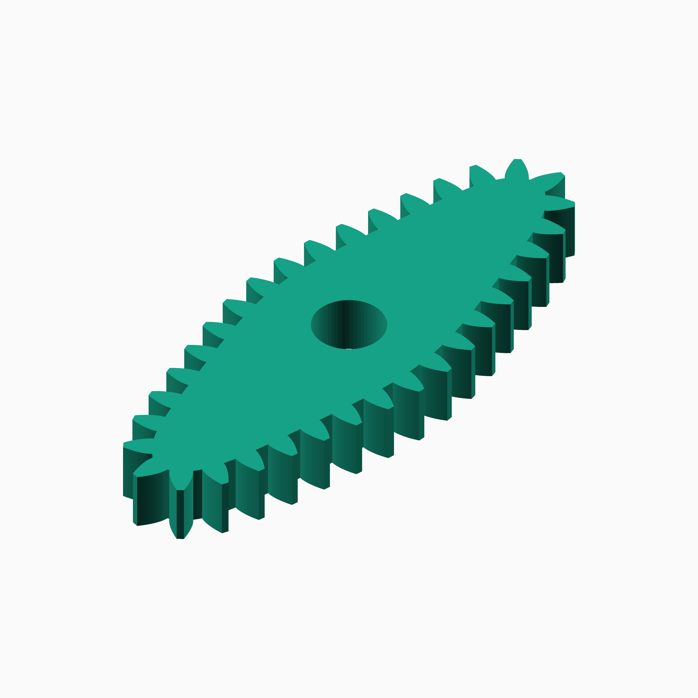
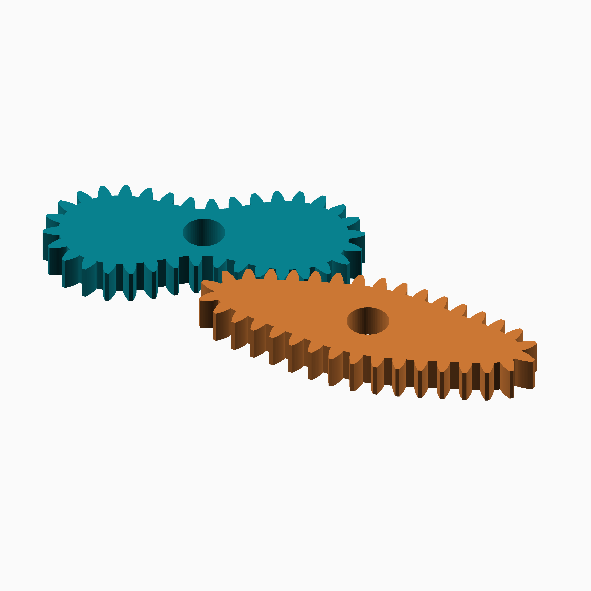

# Cassini

## Documentation navigation

- [README](../README.md)
- Families
  - [Bézier](bezier.md) · [Cassini](cassini.md) · [Circle](circle.md) · [Cusp](cusp.md) · [Ellipse](ellipse.md) · [Epitrochoid](epitrochoid.md)
  - [Fourier](fourier.md) · [Hypotrochoid](hypotrochoid.md) · [Lobed](lobed.md) · [Logarithmic spiral](logarithmic_spiral.md) · [Pascal](pascal.md) · [Superformula](superformula.md) · [Tanh Triad](tanh_triad.md)
- Shared
  - [Examples catalogue](../examples/README.md) · [Test layout](../tests/README.md)
  - [Tooth construction](tooth-construction.md) · [Tooth placement](tooth-placement.md) · [Mate motion](mate-motion.md) · [Mate generation](mate-generation.md) · [Pair assembly](pair-assembly.md)

## Module `Cassini`

The foci are at `+/-c` and the product of distances to the foci is `b^2`.
This family uses only the single-loop branch `0 <= c/b < 1`; the lemniscate
and two-loop regimes are intentionally rejected because the common gear
pipeline requires one positive, origin-centred polar pitch curve.
Reference: https://mathworld.wolfram.com/CassiniOvals.html.

### Brief content:

**Functions**:

> [`curve_gear_cassini`](#function-curve_gear_cassini): Build a single-loop Cassini non-circular gear.

> [`curve_gear_cassini_2d`](#function-curve_gear_cassini_2d): Emit the complete cassini gear profile as 2D geometry.

> [`curve_gear_cassini_body`](#function-curve_gear_cassini_body): Build the Cassini body solid without teeth.

> [`curve_gear_cassini_body_2d`](#function-curve_gear_cassini_body_2d): Emit the cassini body as 2D geometry with an optional signed outer-contour offset.

> [`curve_gear_cassini_centre_distance`](#function-curve_gear_cassini_centre_distance): Return the mathematical centre distance for a Cassini pair.

> [`curve_gear_cassini_mate`](#function-curve_gear_cassini_mate): Build the standalone conjugate mate for a Cassini driver.

> [`curve_gear_cassini_mate_rotation`](#function-curve_gear_cassini_mate_rotation): Return the conjugate Cassini mate rotation for a driver phase.

> [`curve_gear_cassini_pair`](#function-curve_gear_cassini_pair): Build a meshed or separated Cassini driver/mate pair.

> [`_cg_cassini_build(modul, tooth_number, width, bore, focus_ratio=0.78, pressure_angle=20, tooth_phase=0, backlash=undef, clearance=undef, samples=720, orientation=0, body_only=false)`](#function-_cg_cassini_buildmodul-tooth_number-width-bore-focus_ratio078-pressure_angle20-tooth_phase0-backlashundef-clearanceundef-samples720-orientation0-body_onlyfalse): Construct a validated Cassini body, gear, or mate boundary.

> [`_cg_cassini_centre_distance(scale, focus_ratio, n=720)`](#function-_cg_cassini_centre_distancescale-focus_ratio-n720): Solve the Cassini conjugate centre distance.

> [`_cg_cassini_driver_radii(scale, focus_ratio, n=720)`](#function-_cg_cassini_driver_radiiscale-focus_ratio-n720): Evaluate Cassini radii at direct mate-construction angles.

> [`_cg_cassini_focus_ratio_valid`](#function-_cg_cassini_focus_ratio_valid): Check the supported single-loop Cassini parameter range.

> [`_cg_cassini_mate_points(scale, focus_ratio, D, n=720)`](#function-_cg_cassini_mate_pointsscale-focus_ratio-d-n720): Build Cassini mate pitch points and their motion data.

> [`_cg_cassini_mate_points_from_driver(scale, focus_ratio, D, n=720)`](#function-_cg_cassini_mate_points_from_driverscale-focus_ratio-d-n720): Build Cassini mate pitch points from driver-phase samples.

> [`_cg_cassini_max_radius`](#function-_cg_cassini_max_radius): Calculate the exact maximum scaled radius on the supported branch.

> [`_cg_cassini_motion_radii(scale, focus_ratio, n=720)`](#function-_cg_cassini_motion_radiiscale-focus_ratio-n720): Evaluate Cassini radii at integration midpoints.

> [`_cg_cassini_motion_table(scale, focus_ratio, D, n=720)`](#function-_cg_cassini_motion_tablescale-focus_ratio-d-n720): Build the shared Cassini phase-motion table.

> [`_cg_cassini_pair_build(modul, tooth_number, width, bore, focus_ratio=0.78, pressure_angle=20, samples=720, phase=0, together_built=true, backlash=undef, clearance=undef, tooth_phase=0, driver_color="SteelBlue", mate_color="Gold")`](#function-_cg_cassini_pair_buildmodul-tooth_number-width-bore-focus_ratio078-pressure_angle20-samples720-phase0-together_builttrue-backlashundef-clearanceundef-tooth_phase0-driver_colorsteelblue-mate_colorgold): Construct the Cassini driver and its conjugate mate as a pair.

> [`_cg_cassini_point`](#function-_cg_cassini_point): Convert a scaled Cassini radius to a Cartesian pitch point.

> [`_cg_cassini_points`](#function-_cg_cassini_points): Sample one complete single-loop Cassini pitch curve.

> [`_cg_cassini_radius`](#function-_cg_cassini_radius): Evaluate a scaled Cassini radius.

> [`_cg_cassini_scale(modul, tooth_number, focus_ratio, n=720, unit_points=undef)`](#function-_cg_cassini_scalemodul-tooth_number-focus_ratio-n720-unit_pointsundef): Scale a Cassini curve to the requested tooth pitch.

> [`_cg_cassini_unit_radius`](#function-_cg_cassini_unit_radius): Evaluate the normalised positive Cassini polar branch.

## Functions

The module `Cassini` defines the following functions.

### Function `curve_gear_cassini`

| Cassini gear preview | ⠀ |
| --- | --- |
|  |  |

The supported branch is a positive single loop. `focus_ratio >= 1` is rejected.

**Parameters:**

- `modul`: {number > 0} Tooth module in mm.
- `tooth_number`: {integer >= 3} Number of teeth.
- `width`: {number > 0} Extrusion width in mm.
- `bore`: {number >= 0} Centre bore diameter in mm.
- `focus_ratio`: {0 <= number < 1, default 0.78} Focal half-distance divided by the Cassini product parameter.
- `pressure_angle`: {0 < angle < 90, default 20} Involute pressure angle.
- `tooth_phase`: {angle, default 0} Tooth placement phase.
- `backlash`: {undef or >= 0} Tangential tooth-thickness reduction in mm.
- `clearance`: {undef or >= 0} Additional radial root clearance in mm.
- `samples`: {integer >= 120, default 720} Pitch-curve sampling density.
- `orientation`: {angle, default 0} Single-gear display rotation.

**Returns:**

No return

### Example:

~~~c
curve_gear_cassini(1, 24, 4, 8);
~~~

Back to [module description](#module-cassini).

### Function `curve_gear_cassini_2d`

| cassini 2D gear outline | ⠀ |
| --- | --- |
|  |  |

Emit the complete cassini gear profile as 2D geometry.

**Parameters:**

- `modul`: {value} Tooth module in mm.
- `tooth_number`: {value} Number of teeth.
- `bore`: {value} Centre bore diameter in mm.
- `focus_ratio`: {value} Same family-specific parameter as curve_gear_cassini.
- `pressure_angle`: {value} Same family-specific parameter as curve_gear_cassini.
- `tooth_phase`: {value} Same family-specific parameter as curve_gear_cassini.
- `backlash`: {value} Same family-specific parameter as curve_gear_cassini.
- `clearance`: {value} Same family-specific parameter as curve_gear_cassini.
- `samples`: {value} Same family-specific parameter as curve_gear_cassini.
- `orientation`: {value} Rotation in degrees.

**Returns:**

No return

### Example:

~~~c
curve_gear_cassini_2d(0.8, 34, 4.8);
~~~

Back to [module description](#module-cassini).

### Function `curve_gear_cassini_body`

| Cassini body preview | ⠀ |
| --- | --- |
|  |  |

Build the Cassini body solid without teeth.

**Parameters:**

- `modul`: {number > 0} Tooth module in mm.
- `tooth_number`: {integer >= 3} Number of teeth.
- `width`: {number > 0} Extrusion width in mm.
- `bore`: {number >= 0} Centre bore diameter in mm.
- `focus_ratio`: {0 <= number < 1, default 0.78} Focal half-distance divided by the Cassini product parameter.
- `pressure_angle`: {0 < angle < 90, default 20} Involute pressure angle.
- `tooth_phase`: {angle, default 0} Tooth placement phase.
- `backlash`: {undef or >= 0} Tangential tooth-thickness reduction in mm.
- `clearance`: {undef or >= 0} Additional radial root clearance in mm.
- `samples`: {integer >= 120, default 720} Pitch-curve sampling density.
- `orientation`: {angle, default 0} Single-gear display rotation.

**Returns:**

No return

### Example:

~~~c
curve_gear_cassini_body(1, 24, 4, 8);
~~~

Back to [module description](#module-cassini).

### Function `curve_gear_cassini_body_2d`

| cassini 2D body outline | ⠀ |
| --- | --- |
|  |  |

Emit the cassini body as 2D geometry with an optional signed outer-contour offset.

**Parameters:**

- `modul`: {value} Tooth module in mm.
- `tooth_number`: {value} Number of teeth.
- `bore`: {value} Centre bore diameter in mm.
- `focus_ratio`: {value} Same family-specific parameter as curve_gear_cassini_body.
- `pressure_angle`: {value} Same family-specific parameter as curve_gear_cassini_body.
- `tooth_phase`: {value} Same family-specific parameter as curve_gear_cassini_body.
- `backlash`: {value} Same family-specific parameter as curve_gear_cassini_body.
- `clearance`: {value} Same family-specific parameter as curve_gear_cassini_body.
- `samples`: {value} Same family-specific parameter as curve_gear_cassini_body.
- `orientation`: {value} Rotation in degrees.
- `body_offset`: {value} Signed offset in mm; negative values shrink the outer body contour while preserving the bore.

**Returns:**

No return

### Example:

~~~c
curve_gear_cassini_body_2d(0.8, 34, 4.8, body_offset=-2);
~~~

Back to [module description](#module-cassini).

### Function `curve_gear_cassini_centre_distance`

Return the mathematical centre distance for a Cassini pair.

**Parameters:**

- `modul`: {number > 0} Tooth module in mm.
- `tooth_number`: {integer >= 3} Number of teeth.
- `focus_ratio`: {0 <= number < 1, default 0.78} Cassini focal ratio.
- `samples`: {integer >= 120, default 720} Motion sampling density.

**Returns:**

- `{number}`: Pair centre distance in mm.

Back to [module description](#module-cassini).

### Function `curve_gear_cassini_mate`

| Cassini mate preview | ⠀ |
| --- | --- |
|  |  |

Build the standalone conjugate mate for a Cassini driver.

**Parameters:**

- `modul`: {number > 0} Tooth module in mm.
- `tooth_number`: {integer >= 3} Number of teeth.
- `width`: {number > 0} Extrusion width in mm.
- `bore`: {number >= 0} Centre bore diameter in mm.
- `focus_ratio`: {0 <= number < 1, default 0.78} Cassini focal ratio.
- `pressure_angle`: {0 < angle < 90, default 20} Involute pressure angle.
- `tooth_phase`: {angle, default 0} Tooth placement phase.
- `backlash`: {undef or >= 0} Tangential tooth-thickness reduction in mm.
- `clearance`: {undef or >= 0} Additional radial root clearance in mm.
- `samples`: {integer >= 120, default 720} Pitch-curve sampling density.

**Returns:**

No return

Back to [module description](#module-cassini).

### Function `curve_gear_cassini_mate_rotation`

Return the conjugate Cassini mate rotation for a driver phase.

**Parameters:**

- `modul`: {number > 0} Tooth module in mm.
- `tooth_number`: {integer >= 3} Number of teeth.
- `focus_ratio`: {0 <= number < 1, default 0.78} Cassini focal ratio.
- `samples`: {integer >= 120, default 720} Motion sampling density.
- `phase`: {angle, default 0} Driver motion phase.

**Returns:**

- `{angle}`: Mate display rotation.

Back to [module description](#module-cassini).

### Function `curve_gear_cassini_pair`

| Cassini pair preview | ⠀ |
| --- | --- |
|  |  |

Build a meshed or separated Cassini driver/mate pair.

**Parameters:**

- `modul`: {number > 0} Tooth module in mm.
- `tooth_number`: {integer >= 3} Number of teeth.
- `width`: {number > 0} Extrusion width in mm.
- `bore`: {number >= 0} Centre bore diameter in mm.
- `focus_ratio`: {0 <= number < 1, default 0.78} Cassini focal ratio.
- `pressure_angle`: {0 < angle < 90, default 20} Involute pressure angle.
- `samples`: {integer >= 120, default 720} Pitch-curve and motion sampling density.
- `phase`: {angle, default 0} Driver motion phase.
- `tooth_phase`: {angle, default 0} Tooth placement phase.
- `backlash`: {undef or >= 0} Tangential tooth-thickness reduction in mm.
- `clearance`: {undef or >= 0} Additional radial root clearance in mm.
- `together_built`: {boolean, default true} Place the pair meshed when true.
- `driver_color`: {OpenSCAD colour, default SteelBlue} Driver display colour.
- `mate_color`: {OpenSCAD colour, default Gold} Mate display colour.

**Returns:**

No return

### Example:

~~~c
curve_gear_cassini_pair(1, 24, 4, 8);
~~~

Back to [module description](#module-cassini).

### Function `_cg_cassini_build(modul, tooth_number, width, bore, focus_ratio=0.78, pressure_angle=20, tooth_phase=0, backlash=undef, clearance=undef, samples=720, orientation=0, body_only=false)`

Construct a validated Cassini body, gear, or mate boundary.

**Parameters:**

- `modul`: {number > 0} Tooth module in millimetres.
- `tooth_number`: {integer >= 3} Number of teeth.
- `width`: {number > 0} Extrusion width in millimetres.
- `bore`: {number >= 0} Centre bore diameter in millimetres.
- `focus_ratio`: {0 <= number < 1, default 0.78} Cassini focal ratio.
- `pressure_angle`: {0 < angle < 90, default 20} Involute pressure angle.
- `tooth_phase`: {angle, default 0} Tooth placement phase in degrees.
- `backlash`: {undef or >= 0} Tangential tooth-thickness reduction.
- `clearance`: {undef or >= 0} Additional radial root clearance.
- `samples`: {integer >= 120, default 720} Pitch-curve sample count.
- `orientation`: {angle, default 0} Display rotation in degrees.
- `body_only`: {boolean, default false} Emit the body without teeth.

**Returns:**

No return

Back to [module description](#module-cassini).

### Function `_cg_cassini_centre_distance(scale, focus_ratio, n=720)`

Solve the Cassini conjugate centre distance.

**Parameters:**

- `scale`: {number > 0} Curve scale in millimetres.
- `focus_ratio`: {0 <= number < 1} Cassini focal ratio.
- `n`: {integer >= 1, default 720} Number of motion intervals.

**Returns:**

- `{number}`: Conjugate centre distance in millimetres.

Back to [module description](#module-cassini).

### Function `_cg_cassini_driver_radii(scale, focus_ratio, n=720)`

Evaluate Cassini radii at direct mate-construction angles.

**Parameters:**

- `scale`: {number > 0} Curve scale in millimetres.
- `focus_ratio`: {0 <= number < 1} Cassini focal ratio.
- `n`: {integer >= 1, default 720} Number of boundary intervals.

**Returns:**

- `{array of number}`: Driver radii in angular order.

Back to [module description](#module-cassini).

### Function `_cg_cassini_focus_ratio_valid`

Check the supported single-loop Cassini parameter range.

**Parameters:**

- `focus_ratio`: {0 <= number < 1} Ratio of focal half-distance to the product parameter.

**Returns:**

- `{boolean}`: True for the positive single-loop polar branch.

Back to [module description](#module-cassini).

### Function `_cg_cassini_mate_points(scale, focus_ratio, D, n=720)`

Build Cassini mate pitch points and their motion data.

**Parameters:**

- `scale`: {number > 0} Curve scale in millimetres.
- `focus_ratio`: {0 <= number < 1} Cassini focal ratio.
- `D`: {number > 0} Fixed centre distance in millimetres.
- `n`: {integer >= 1, default 720} Number of phase intervals.

**Returns:**

- `{array of points}`: Conjugate mate pitch points.

Back to [module description](#module-cassini).

### Function `_cg_cassini_mate_points_from_driver(scale, focus_ratio, D, n=720)`

Build Cassini mate pitch points from driver-phase samples.

**Parameters:**

- `scale`: {number > 0} Curve scale in millimetres.
- `focus_ratio`: {0 <= number < 1} Cassini focal ratio.
- `D`: {number > 0} Fixed centre distance in millimetres.
- `n`: {integer >= 1, default 720} Number of phase intervals.

**Returns:**

- `{array of points}`: Conjugate mate pitch points.

Back to [module description](#module-cassini).

### Function `_cg_cassini_max_radius`

On the supported `focus_ratio < 1` branch, squared radius increases with
`cos(2*theta)`, so its maximum occurs at `theta=0`.

**Parameters:**

- `scale`: {number > 0} Curve scale in mm.
- `focus_ratio`: {0 <= number < 1} Ratio `c/b`.
- `n`: {integer >= 1, default 1440} Retained for internal call compatibility; the exact maximum needs no sampling.

**Returns:**

- `{number}`: Maximum radius in mm.

Back to [module description](#module-cassini).

### Function `_cg_cassini_motion_radii(scale, focus_ratio, n=720)`

Evaluate Cassini radii at integration midpoints.

**Parameters:**

- `scale`: {number > 0} Curve scale in millimetres.
- `focus_ratio`: {0 <= number < 1} Cassini focal ratio.
- `n`: {integer >= 1, default 720} Number of motion intervals.

**Returns:**

- `{array of number}`: Midpoint radii in angular order.

Back to [module description](#module-cassini).

### Function `_cg_cassini_motion_table(scale, focus_ratio, D, n=720)`

Build the shared Cassini phase-motion table.

**Parameters:**

- `scale`: {number > 0} Curve scale in millimetres.
- `focus_ratio`: {0 <= number < 1} Cassini focal ratio.
- `D`: {number > 0} Fixed centre distance in millimetres.
- `n`: {integer >= 1, default 720} Number of motion intervals.

**Returns:**

- `{array}`: Integrated driver-to-mate phase table.

Back to [module description](#module-cassini).

### Function `_cg_cassini_pair_build(modul, tooth_number, width, bore, focus_ratio=0.78, pressure_angle=20, samples=720, phase=0, together_built=true, backlash=undef, clearance=undef, tooth_phase=0, driver_color="SteelBlue", mate_color="Gold")`

Construct the Cassini driver and its conjugate mate as a pair.

**Parameters:**

- `modul`: {number > 0} Tooth module in millimetres.
- `tooth_number`: {integer >= 3} Number of teeth.
- `width`: {number > 0} Extrusion width in millimetres.
- `bore`: {number >= 0} Centre bore diameter in millimetres.
- `focus_ratio`: {0 <= number < 1, default 0.78} Cassini focal ratio.
- `pressure_angle`: {0 < angle < 90, default 20} Involute pressure angle.
- `samples`: {integer >= 120, default 720} Pitch and motion sample count.
- `phase`: {angle, default 0} Driver motion phase in degrees.
- `together_built`: {boolean, default true} Mesh the pair when true.
- `backlash`: {undef or >= 0} Tangential tooth-thickness reduction.
- `clearance`: {undef or >= 0} Additional radial root clearance.
- `tooth_phase`: {angle, default 0} Tooth placement phase in degrees.
- `driver_color`: {OpenSCAD colour, default SteelBlue} Driver display colour.
- `mate_color`: {OpenSCAD colour, default Gold} Mate display colour.

**Returns:**

No return

Back to [module description](#module-cassini).

### Function `_cg_cassini_point`

Convert a scaled Cassini radius to a Cartesian pitch point.

**Parameters:**

- `scale`: {number > 0} Curve scale in mm.
- `focus_ratio`: {0 <= number < 1} Ratio `c/b`.
- `theta`: {angle} Polar angle in degrees.

**Returns:**

- `{array}`: Cartesian pitch point in mm.

Back to [module description](#module-cassini).

### Function `_cg_cassini_points`

Sample one complete single-loop Cassini pitch curve.

**Parameters:**

- `scale`: {number > 0} Curve scale in mm.
- `focus_ratio`: {0 <= number < 1} Ratio `c/b`.
- `n`: {integer >= 1, default 720} Number of samples.

**Returns:**

- `{array of points}`: Closed sampled pitch curve.

Back to [module description](#module-cassini).

### Function `_cg_cassini_radius`

Evaluate a scaled Cassini radius.

**Parameters:**

- `scale`: {number > 0} Curve scale in mm.
- `focus_ratio`: {0 <= number < 1} Ratio `c/b`.
- `theta`: {angle} Polar angle in degrees.

**Returns:**

- `{number}`: Cassini radius in mm.

Back to [module description](#module-cassini).

### Function `_cg_cassini_scale(modul, tooth_number, focus_ratio, n=720, unit_points=undef)`

Scale a Cassini curve to the requested tooth pitch.

**Parameters:**

- `modul`: {number > 0} Tooth module in mm.
- `tooth_number`: {integer >= 3} Number of teeth.
- `focus_ratio`: {0 <= number < 1} Ratio `c/b`.
- `n`: {integer >= 1, default 720} Number of perimeter samples.
- `unit_points`: {array of points, default undef} Optional pre-sampled unit curve.

**Returns:**

- `{number}`: Curve scale in mm.

Back to [module description](#module-cassini).

### Function `_cg_cassini_unit_radius`

Evaluate the normalised positive Cassini polar branch.

**Parameters:**

- `focus_ratio`: {0 <= number < 1} Ratio `c/b`.
- `theta`: {angle} Polar angle in degrees.

**Returns:**

- `{number}`: Unit Cassini radius.

Back to [module description](#module-cassini).

Back to [top](#).

---

[Back to the CurveGears README](../README.md)

*Generated by Doxydown from repository source comments; do not edit this page directly.*
