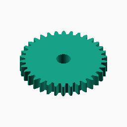
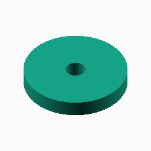
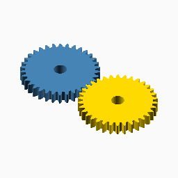

# Circle

## Documentation navigation

- [README](../README.md)
- Families
  - [Bézier](bezier.md) · [Cassini](cassini.md) · [Circle](circle.md) · [Ellipse](ellipse.md) · [Epitrochoid](epitrochoid.md) · [Fourier](fourier.md)
  - [Hypotrochoid](hypotrochoid.md) · [Lobed](lobed.md) · [Logarithmic spiral](logarithmic_spiral.md) · [Pascal](pascal.md) · [Superformula](superformula.md)
- Shared
  - [Examples catalogue](../examples/README.md) · [Test layout](../tests/README.md)
  - [Tooth construction](tooth-construction.md) · [Tooth placement](tooth-placement.md) · [Mate motion](mate-motion.md) · [Mate generation](mate-generation.md) · [Pair assembly](pair-assembly.md)

## Module `Circle`

The circle family exists primarily for testing and reference purposes. It
is the constant-radius control case used to exercise the same public gear,
mate, and pair contracts as every curved family.

### Brief content:

**Functions**:

> [`curve_gear_circle`](#function-curve_gear_circle): Build a circular reference gear.

> [`curve_gear_circle_body`](#function-curve_gear_circle_body): Build the circular reference body without teeth.

> [`curve_gear_circle_centre_distance`](#function-curve_gear_circle_centre_distance): Return the reference centre distance for a circular pair.

> [`curve_gear_circle_mate`](#function-curve_gear_circle_mate): Build the circular reference mate boundary at the origin.

> [`curve_gear_circle_pair`](#function-curve_gear_circle_pair): Build a meshed or separated circular reference pair.

## Functions

The module `Circle` defines the following functions.

### Function `curve_gear_circle`

Build a circular reference gear.

**Parameters:**

- `modul`: {number > 0} Tooth module in mm.
- `tooth_number`: {integer >= 3} Number of teeth.
- `width`: {number > 0} Extrusion width in mm.
- `bore`: {number >= 0} Centre bore diameter in mm.
- `pressure_angle`: {0 < angle < 90, default 20} Involute pressure angle in degrees.
- `tooth_phase`: {angle, default 0} Tooth placement phase in degrees.
- `backlash`: {undef or >= 0} Tangential tooth-thickness reduction in mm.
- `clearance`: {undef or >= 0} Additional radial root clearance in mm.
- `samples`: {integer >= 120, default 480} Circular pitch-curve sampling density.

**Returns:**

No return

Back to [module description](#module-circle).

### Function `curve_gear_circle_body`

Build the circular reference body without teeth.

**Parameters:**

- `modul`: {number > 0} Tooth module in mm.
- `tooth_number`: {integer >= 3} Number of teeth.
- `width`: {number > 0} Extrusion width in mm.
- `bore`: {number >= 0} Centre bore diameter in mm.
- `samples`: {integer >= 120, default 480} Circular pitch-curve sampling density.

**Returns:**

No return

Back to [module description](#module-circle).

### Function `curve_gear_circle_centre_distance`

Return the reference centre distance for a circular pair.

**Parameters:**

- `modul`: {number > 0} Tooth module in mm.
- `tooth_number`: {integer >= 3} Number of teeth.

**Returns:**

- `{number}`: Pair centre distance in mm.

Back to [module description](#module-circle).

### Function `curve_gear_circle_mate`

Build the circular reference mate boundary at the origin.

**Parameters:**

- `modul`: {number > 0} Tooth module in mm.
- `tooth_number`: {integer >= 3} Number of teeth.
- `width`: {number > 0} Extrusion width in mm.
- `bore`: {number >= 0} Centre bore diameter in mm.
- `pressure_angle`: {0 < angle < 90, default 20} Involute pressure angle in degrees.
- `tooth_phase`: {angle, default 0} Tooth placement phase in degrees.
- `backlash`: {undef or >= 0} Tangential tooth-thickness reduction in mm.
- `clearance`: {undef or >= 0} Additional radial root clearance in mm.
- `samples`: {integer >= 120, default 480} Circular pitch-curve sampling density.

**Returns:**

No return

Back to [module description](#module-circle).

### Function `curve_gear_circle_pair`

Build a meshed or separated circular reference pair.

**Parameters:**

- `modul`: {number > 0} Tooth module in mm.
- `tooth_number`: {integer >= 3} Number of teeth.
- `width`: {number > 0} Extrusion width in mm.
- `bore`: {number >= 0} Centre bore diameter in mm.
- `pressure_angle`: {0 < angle < 90, default 20} Involute pressure angle in degrees.
- `samples`: {integer >= 120, default 480} Circular pitch-curve sampling density.
- `phase`: {angle, default 0} Driver motion phase in degrees.
- `together_built`: {boolean, default true} Place the pair meshed when true, separated when false.
- `backlash`: {undef or >= 0} Tangential tooth-thickness reduction in mm.
- `clearance`: {undef or >= 0} Additional radial root clearance in mm.
- `tooth_phase`: {angle, default 0} Tooth placement phase in degrees.
- `driver_color`: {OpenSCAD colour, default SteelBlue} Driver display colour.
- `mate_color`: {OpenSCAD colour, default Gold} Mate display colour.

**Returns:**

No return

Back to [module description](#module-circle).

Back to [top](#).

---

[Back to the CurveGears README](../README.md)

*Generated by Doxydown from repository source comments; do not edit this page directly.*
