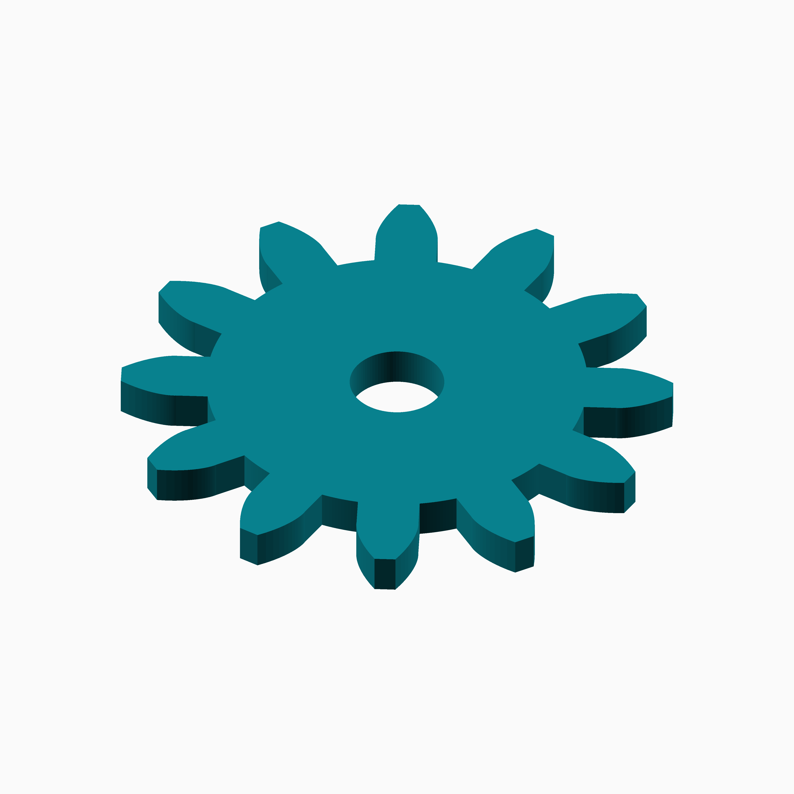
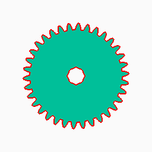
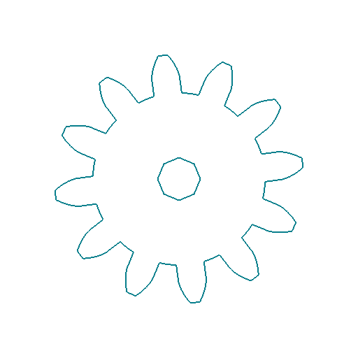
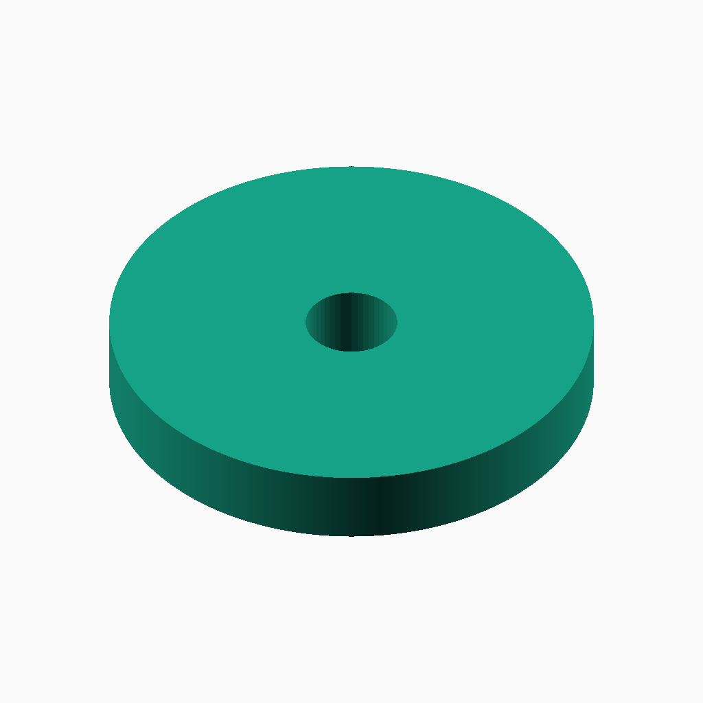
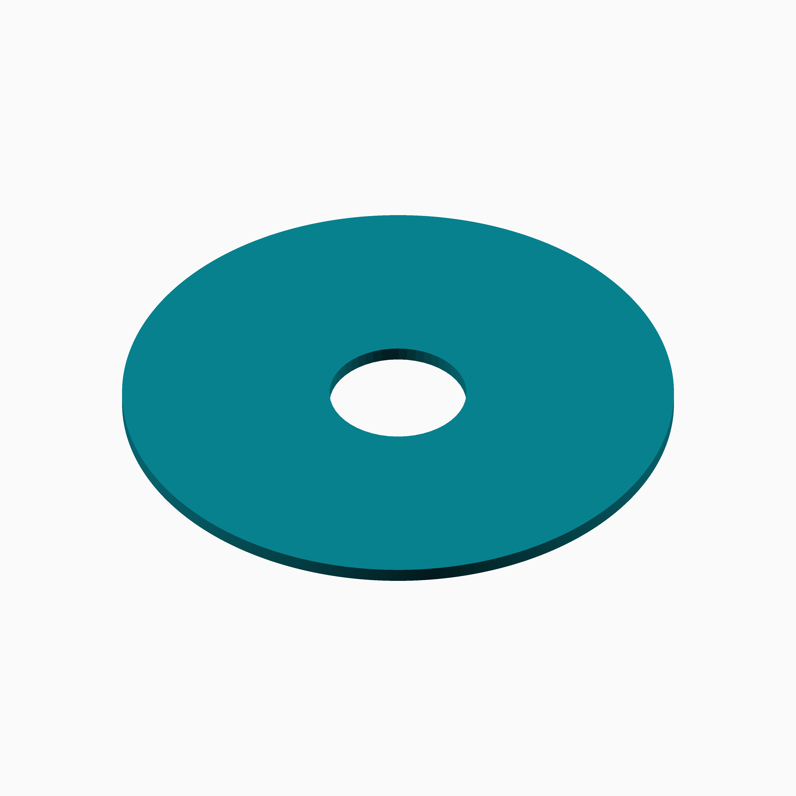
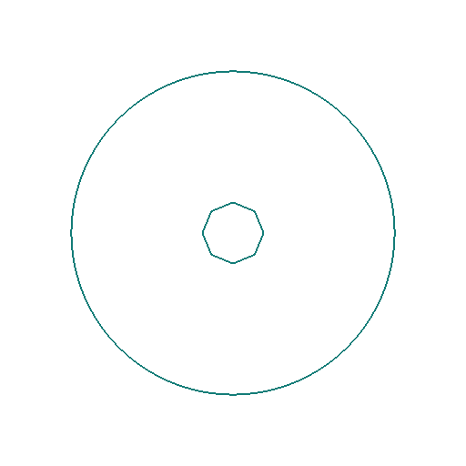
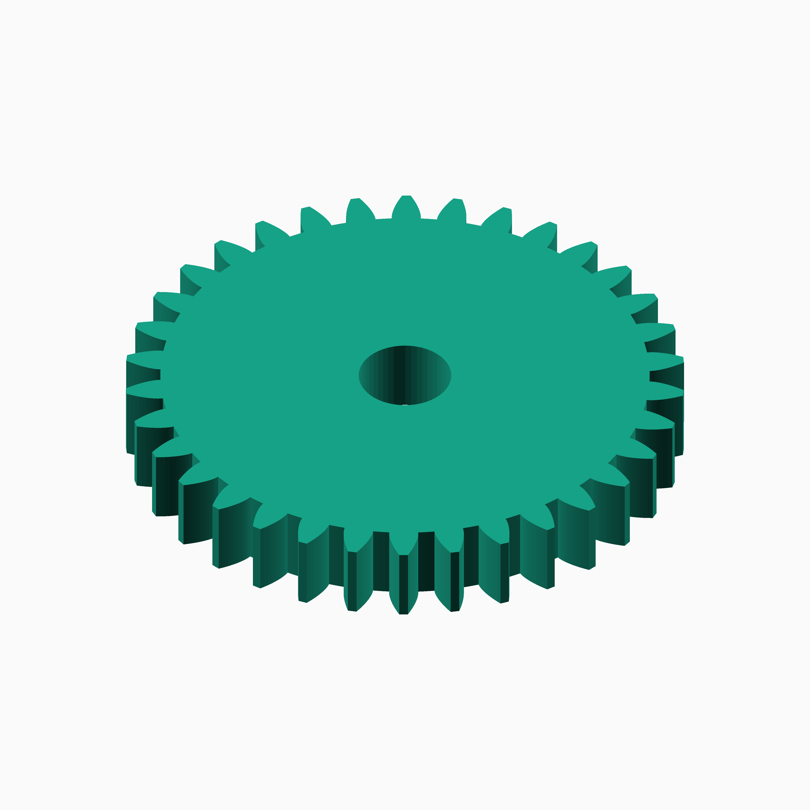
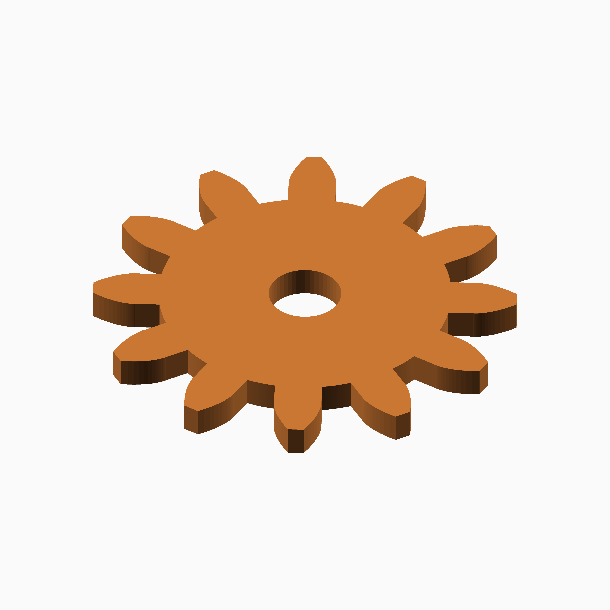
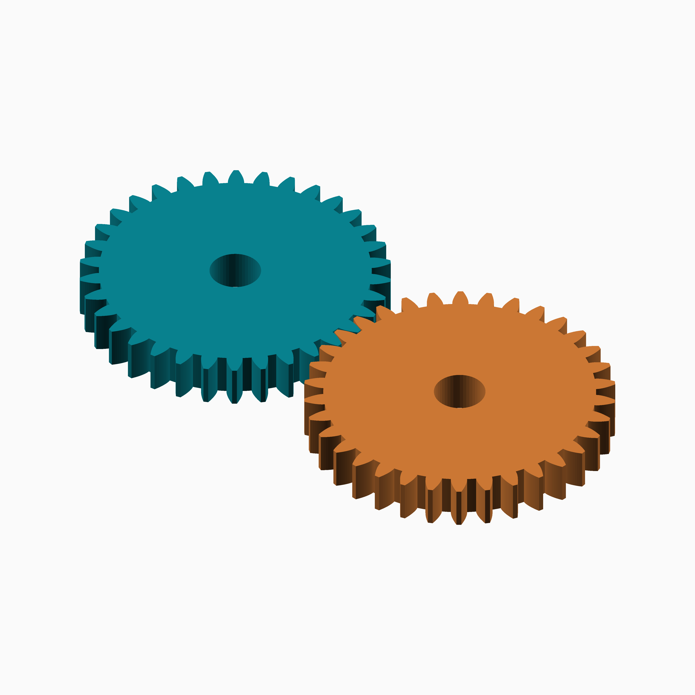
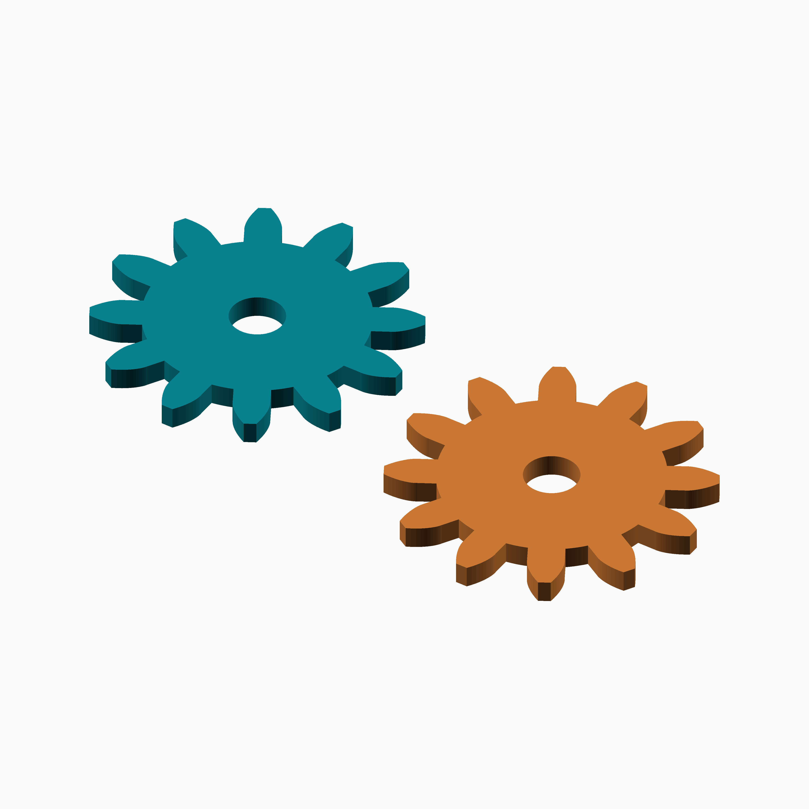

# Circle

## Documentation navigation

- [README](../README.md)
- Families
  - [Bézier](bezier.md) · [Cassini](cassini.md) · [Circle](circle.md) · [Cosine Quintic](cosine_quintic.md) · [Cusp](cusp.md) · [Ellipse](ellipse.md) · [Epitrochoid](epitrochoid.md)
  - [Fourier](fourier.md) · [Hypotrochoid](hypotrochoid.md) · [Lobed](lobed.md) · [Logarithmic spiral](logarithmic_spiral.md) · [Logistic Dwell](logistic_dwell.md) · [Pascal](pascal.md) · [Superformula](superformula.md) · [Tanh Triad](tanh_triad.md) · [Temple Fay](temple_fay.md)
- Shared
  - [Examples catalogue](../examples/README.md) · [Test layout](../tests/README.md)
  - [Tooth construction](tooth-construction.md) · [Tooth placement](tooth-placement.md) · [Mate motion](mate-motion.md) · [Mate generation](mate-generation.md) · [Pair assembly](pair-assembly.md)

## Module `Circle`

Circle is the constant-radius reference family. Its public gear, body,
mate, centre-distance, and pair APIs provide the control case for the same
construction contracts used by the non-circular families.

### Brief content:

**Functions**:

> [`curve_gear_circle`](#function-curve_gear_circle): Build a circular reference gear.

> [`curve_gear_circle_2d`](#function-curve_gear_circle_2d): Emit the complete circular gear profile as 2D geometry.

> [`curve_gear_circle_body`](#function-curve_gear_circle_body): Build the circular reference body without teeth.

> [`curve_gear_circle_body_2d`](#function-curve_gear_circle_body_2d): Emit the circular body as 2D geometry; negative body_offset shrinks its outer contour.

> [`curve_gear_circle_centre_distance`](#function-curve_gear_circle_centre_distance): Return the reference centre distance for a circular pair.

> [`curve_gear_circle_mate`](#function-curve_gear_circle_mate): Build the circular reference mate boundary at the origin.

> [`curve_gear_circle_pair`](#function-curve_gear_circle_pair): Build a meshed or separated circular reference pair.

> [`_cg_circle_points`](#function-_cg_circle_points): Sample the circular pitch curve in angular order.

> [`_cg_circle_radius`](#function-_cg_circle_radius): Calculate the circular pitch radius from module and tooth count.

## Functions

The module `Circle` defines the following functions.

### Function `curve_gear_circle`

| Circle gear 1 | Circle gear 2 |
| --- | --- |
|  |  |

Twelve coarse teeth replace the fine-toothed reference; the bore remains 4.8 mm. Circle has no non-circular shape control; the circular pitch law is deliberately preserved.

**Parameters:**

- `modul`: {number > 0} Tooth module in mm.
- `tooth_number`: {integer >= 3} Number of teeth.
- `width`: {number > 0} Extrusion width in mm.
- `bore`: {number >= 0} Centre bore diameter in mm.
- `pressure_angle`: {0 < angle < 90, default 20} Involute pressure angle in degrees.
- `tooth_phase`: {angle, default 0} Tooth placement phase in degrees.
- `backlash`: {undef or >= 0} Tangential tooth-thickness reduction in mm.
- `clearance`: {undef or >= 0} Additional radial root clearance in mm.
- `samples`: {integer >= 120, default 480} Circular pitch-curve sampling density.

**Returns:**

No return

Back to [module description](#module-circle).

### Function `curve_gear_circle_2d`

| Circle 2D gear 1 | Circle 2D gear 2 |
| --- | --- |
|  |  |

Emit the complete circular gear profile as 2D geometry.

**Parameters:**

- `modul`: {number > 0} Tooth module in mm.
- `tooth_number`: {integer >= 3} Number of teeth.
- `bore`: {number >= 0} Centre bore diameter in mm.
- `pressure_angle`: {angle, default 20} Involute pressure angle.
- `tooth_phase`: {angle, default 0} Tooth placement phase.
- `backlash`: {undef or >= 0} Tangential tooth-thickness reduction.
- `clearance`: {undef or >= 0} Additional radial root clearance.
- `samples`: {integer >= 120, default 480} Pitch-curve sampling density.

**Returns:**

No return

### Example:

~~~c
curve_gear_circle_2d(0.8, 34, 4.8);
~~~

Back to [module description](#module-circle).

### Function `curve_gear_circle_body`

| Circle body 1 | Circle body 2 |
| --- | --- |
|  |  |

Build the circular reference body without teeth.

**Parameters:**

- `modul`: {number > 0} Tooth module in mm.
- `tooth_number`: {integer >= 3} Number of teeth.
- `width`: {number > 0} Extrusion width in mm.
- `bore`: {number >= 0} Centre bore diameter in mm.
- `samples`: {integer >= 120, default 480} Circular pitch-curve sampling density.

**Returns:**

No return

Back to [module description](#module-circle).

### Function `curve_gear_circle_body_2d`

| Circle 2D body 1 | Circle 2D body 2 |
| --- | --- |
|  |  |

Emit the circular body as 2D geometry; negative body_offset shrinks its outer contour.

**Parameters:**

- `modul`: {number > 0} Tooth module in mm.
- `tooth_number`: {integer >= 3} Number of teeth.
- `bore`: {number >= 0} Centre bore diameter in mm.
- `samples`: {integer >= 120, default 480} Pitch-curve sampling density.
- `body_offset`: {number, default 0} Signed outer-contour offset in mm; the bore is preserved.

**Returns:**

No return

### Example:

~~~c
curve_gear_circle_body_2d(0.8, 34, 4.8, body_offset=-2);
~~~

Back to [module description](#module-circle).

### Function `curve_gear_circle_centre_distance`

Return the reference centre distance for a circular pair.

**Parameters:**

- `modul`: {number > 0} Tooth module in mm.
- `tooth_number`: {integer >= 3} Number of teeth.

**Returns:**

- `{number}`: Pair centre distance in mm.

Back to [module description](#module-circle).

### Function `curve_gear_circle_mate`

| Circle mate 1 | Circle mate 2 |
| --- | --- |
|  |  |

Build the circular reference mate boundary at the origin.

**Parameters:**

- `modul`: {number > 0} Tooth module in mm.
- `tooth_number`: {integer >= 3} Number of teeth.
- `width`: {number > 0} Extrusion width in mm.
- `bore`: {number >= 0} Centre bore diameter in mm.
- `pressure_angle`: {0 < angle < 90, default 20} Involute pressure angle in degrees.
- `tooth_phase`: {angle, default 0} Tooth placement phase in degrees.
- `backlash`: {undef or >= 0} Tangential tooth-thickness reduction in mm.
- `clearance`: {undef or >= 0} Additional radial root clearance in mm.
- `samples`: {integer >= 120, default 480} Circular pitch-curve sampling density.

**Returns:**

No return

Back to [module description](#module-circle).

### Function `curve_gear_circle_pair`

| Circle pair 1 | Circle pair 2 |
| --- | --- |
|  |  |

Build a meshed or separated circular reference pair.

**Parameters:**

- `modul`: {number > 0, default .8} Tooth module in mm.
- `tooth_number`: {integer >= 3, default 34} Number of teeth.
- `width`: {number > 0, default 4} Extrusion width in mm.
- `bore`: {number >= 0, default 4.8} Centre bore diameter in mm.
- `pressure_angle`: {0 < angle < 90, default 20} Involute pressure angle in degrees.
- `samples`: {integer >= 120, default 480} Circular pitch-curve sampling density.
- `phase`: {angle, default 0} Driver motion phase in degrees.
- `together_built`: {boolean, default true} Place the pair meshed when true, separated when false.
- `backlash`: {undef or >= 0, default undef} Tangential tooth-thickness reduction in mm.
- `clearance`: {undef or >= 0, default undef} Additional radial root clearance in mm.
- `tooth_phase`: {angle, default 0} Tooth placement phase in degrees.
- `driver_color`: {OpenSCAD colour, default SteelBlue} Driver display colour.
- `mate_color`: {OpenSCAD colour, default Gold} Mate display colour.

**Returns:**

No return

Back to [module description](#module-circle).

### Function `_cg_circle_points`

Sample the circular pitch curve in angular order.

**Parameters:**

- `modul`: {number > 0} Tooth module in millimetres.
- `tooth_number`: {integer >= 3} Number of teeth.
- `samples`: {integer >= 1, default 480} Number of pitch-curve samples.

**Returns:**

- `{array of points}`: Closed circular pitch curve in millimetres.

Back to [module description](#module-circle).

### Function `_cg_circle_radius`

Calculate the circular pitch radius from module and tooth count.

**Parameters:**

- `modul`: {number > 0} Tooth module in millimetres.
- `tooth_number`: {integer >= 3} Number of teeth.

**Returns:**

- `{number}`: Pitch radius in millimetres.

Back to [module description](#module-circle).

Back to [top](#).

---

[Back to the CurveGears README](../README.md)

*Generated by Doxydown from repository source comments; do not edit this page directly.*
