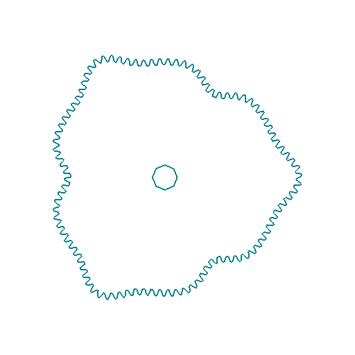
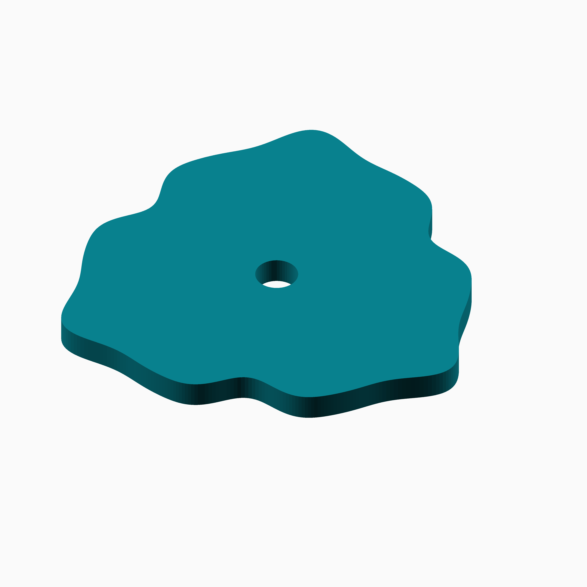
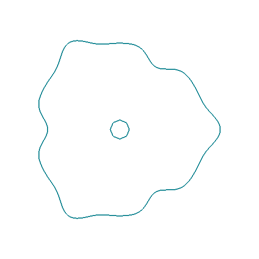
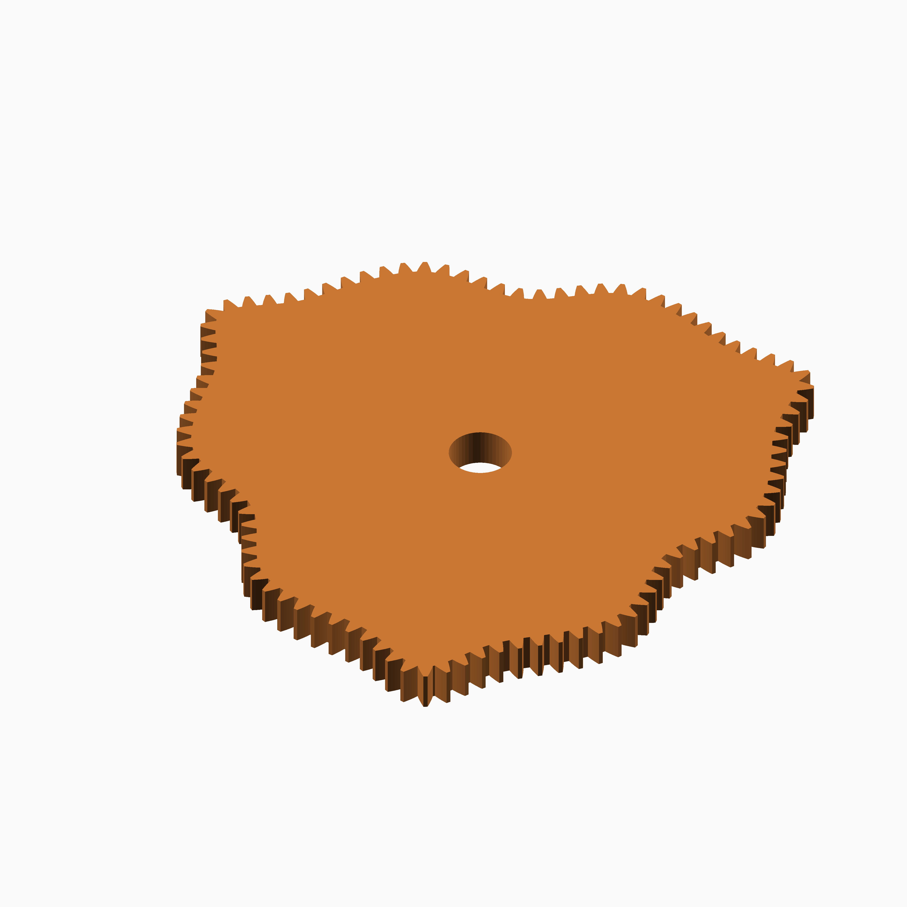

# Cosine Quintic

## Documentation navigation

- [README](../README.md)
- Families
  - [Bézier](bezier.md) · [Cassini](cassini.md) · [Circle](circle.md) · [Cosine Quintic](cosine_quintic.md) · [Cusp](cusp.md) · [Ellipse](ellipse.md) · [Epitrochoid](epitrochoid.md)
  - [Fourier](fourier.md) · [Hypotrochoid](hypotrochoid.md) · [Lobed](lobed.md) · [Logarithmic spiral](logarithmic_spiral.md) · [Logistic Dwell](logistic_dwell.md) · [Pascal](pascal.md) · [Superformula](superformula.md) · [Tanh Triad](tanh_triad.md) · [Temple Fay](temple_fay.md)
- Shared
  - [Examples catalogue](../examples/README.md) · [Test layout](../tests/README.md)
  - [Tooth construction](tooth-construction.md) · [Tooth placement](tooth-placement.md) · [Mate motion](mate-motion.md) · [Mate generation](mate-generation.md) · [Pair assembly](pair-assembly.md)

## Module `Cosine Quintic`

The unit law is `r(theta)=1+0.19*sgn(cos(2 theta))*abs(cos(2 theta))^5`.
The odd signed power preserves continuity while flattening the plateaux.
Reference: https://en.wikipedia.org/wiki/Power_function.

### Brief content:

**Functions**:

> [`curve_gear_cosine_quintic`](#function-curve_gear_cosine_quintic): Build a signed fifth-power cosine gear.

> [`curve_gear_cosine_quintic_2d`](#function-curve_gear_cosine_quintic_2d): Build the Cosine Quintic 2D outline.

> [`curve_gear_cosine_quintic_body`](#function-curve_gear_cosine_quintic_body): Build the Cosine Quintic body.

> [`curve_gear_cosine_quintic_body_2d`](#function-curve_gear_cosine_quintic_body_2d): Build the Cosine Quintic 2D body outline.

> [`curve_gear_cosine_quintic_centre_distance`](#function-curve_gear_cosine_quintic_centre_distance): Return the Cosine Quintic centre distance.

> [`curve_gear_cosine_quintic_mate`](#function-curve_gear_cosine_quintic_mate): Build a Cosine Quintic mating gear.

> [`curve_gear_cosine_quintic_mate_rotation`](#function-curve_gear_cosine_quintic_mate_rotation): Return the Cosine Quintic mate rotation.

> [`curve_gear_cosine_quintic_pair`](#function-curve_gear_cosine_quintic_pair): Build a Cosine Quintic gear pair.

> [`_cg_cosine_quintic_parameters_valid`](#function-_cg_cosine_quintic_parameters_valid): Check the shared curve-parameter contract for every family entry point.

> [`_cg_cosine_quintic_shape`](#function-_cg_cosine_quintic_shape): Bind the named curve once for driver, mate and numeric consumers.

## Functions

The module `Cosine Quintic` defines the following functions.

### Function `curve_gear_cosine_quintic`

| Cosine Quintic gear 1 | Cosine Quintic gear 2 |
| --- | --- |
|  |  |

Three pronounced signed-cosine plateaux replace the canonical two-harmonic form. Harmonic 3 and depth 0.16 expose how the fifth power concentrates the radial excursions.

**Parameters:**

- `modul`: {number} Tooth module.
- `tooth_number`: {integer} Tooth count.
- `width`: {number} Width.
- `bore`: {number} Bore.
- `depth`: {number} Quintic depth.
- `harmonic`: {integer} Cosine harmonic.
- `pressure_angle`: {number} Pressure angle.
- `tooth_phase`: {number} Tooth phase.
- `backlash`: {number} Backlash.
- `clearance`: {number} Clearance.
- `samples`: {integer} Samples.
- `orientation`: {number} Orientation.

**Returns:**

No return

Back to [module description](#module-cosine-quintic).

### Function `curve_gear_cosine_quintic_2d`

| Cosine Quintic 2D gear 1 | Cosine Quintic 2D gear 2 |
| --- | --- |
|  |  |

**Parameters:**

- `modul`: {number} Tooth module.
- `tooth_number`: {integer} Tooth count.
- `bore`: {number} Bore.
- `depth`: {number} Quintic depth.
- `harmonic`: {integer} Cosine harmonic.
- `pressure_angle`: {number} Pressure angle.
- `tooth_phase`: {number} Tooth phase.
- `backlash`: {number} Backlash.
- `clearance`: {number} Clearance.
- `samples`: {integer} Samples.
- `orientation`: {number} Orientation.

**Returns:**

No return

Back to [module description](#module-cosine-quintic).

### Function `curve_gear_cosine_quintic_body`

| Cosine Quintic body 1 | Cosine Quintic body 2 |
| --- | --- |
|  |  |

**Parameters:**

- `modul`: {number} Tooth module.
- `tooth_number`: {integer} Tooth count.
- `width`: {number} Width.
- `bore`: {number} Bore.
- `depth`: {number} Quintic depth.
- `harmonic`: {integer} Cosine harmonic.
- `pressure_angle`: {number} Pressure angle.
- `tooth_phase`: {number} Tooth phase.
- `backlash`: {number} Backlash.
- `clearance`: {number} Clearance.
- `samples`: {integer} Samples.
- `orientation`: {number} Orientation.

**Returns:**

No return

Back to [module description](#module-cosine-quintic).

### Function `curve_gear_cosine_quintic_body_2d`

| Cosine Quintic 2D body 1 | Cosine Quintic 2D body 2 |
| --- | --- |
|  |  |

**Parameters:**

- `modul`: {number} Tooth module.
- `tooth_number`: {integer} Tooth count.
- `bore`: {number} Bore.
- `depth`: {number} Quintic depth.
- `harmonic`: {integer} Cosine harmonic.
- `pressure_angle`: {number} Pressure angle.
- `tooth_phase`: {number} Tooth phase.
- `backlash`: {number} Backlash.
- `clearance`: {number} Clearance.
- `samples`: {integer} Samples.
- `orientation`: {number} Orientation.
- `body_offset`: {number} Body offset.

**Returns:**

No return

Back to [module description](#module-cosine-quintic).

### Function `curve_gear_cosine_quintic_centre_distance`

**Parameters:**

- `modul`: {number} Tooth module.
- `tooth_number`: {integer} Tooth count.
- `depth`: {number} Quintic depth.
- `harmonic`: {integer} Cosine harmonic.
- `samples`: {integer} Samples.

**Returns:**

No return

Back to [module description](#module-cosine-quintic).

### Function `curve_gear_cosine_quintic_mate`

| Cosine Quintic mate 1 | Cosine Quintic mate 2 |
| --- | --- |
|  |  |

**Parameters:**

- `modul`: {number} Tooth module.
- `tooth_number`: {integer} Tooth count.
- `width`: {number} Width.
- `bore`: {number} Bore.
- `depth`: {number} Quintic depth.
- `harmonic`: {integer} Cosine harmonic.
- `pressure_angle`: {number} Pressure angle.
- `tooth_phase`: {number} Tooth phase.
- `backlash`: {number} Backlash.
- `clearance`: {number} Clearance.
- `samples`: {integer} Samples.

**Returns:**

No return

Back to [module description](#module-cosine-quintic).

### Function `curve_gear_cosine_quintic_mate_rotation`

**Parameters:**

- `modul`: {number} Tooth module.
- `tooth_number`: {integer} Tooth count.
- `depth`: {number} Quintic depth.
- `harmonic`: {integer} Cosine harmonic.
- `samples`: {integer} Samples.
- `phase`: {number} Driver phase.

**Returns:**

No return

Back to [module description](#module-cosine-quintic).

### Function `curve_gear_cosine_quintic_pair`

| Cosine Quintic pair 1 | Cosine Quintic pair 2 |
| --- | --- |
|  |  |

**Parameters:**

- `modul`: {number, default .8} Tooth module.
- `tooth_number`: {integer, default 34} Tooth count.
- `width`: {number, default 4} Width.
- `bore`: {number, default 4.8} Bore.
- `depth`: {number, default .19} Quintic depth.
- `harmonic`: {integer, default 2} Cosine harmonic.
- `pressure_angle`: {number, default 20} Pressure angle.
- `samples`: {integer, default 720} Samples.
- `phase`: {number, default 0} Pair phase.
- `together_built`: {boolean, default true} Mesh pair.
- `backlash`: {number, default undef} Backlash.
- `clearance`: {number, default undef} Clearance.
- `tooth_phase`: {number, default 0} Tooth phase.
- `driver_color`: {string, default "SteelBlue"} Driver colour.
- `mate_color`: {string, default "Gold"} Mate colour.

**Returns:**

No return

Back to [module description](#module-cosine-quintic).

### Function `_cg_cosine_quintic_parameters_valid`

Check the shared curve-parameter contract for every family entry point.

**Parameters:**

- `depth`: {number between 0 and 0.5} Curve parameter.
- `harmonic`: {integer >= 1} Curve parameter.

**Returns:**

- `{boolean}`: True when all curve parameters are supported.

Back to [module description](#module-cosine-quintic).

### Function `_cg_cosine_quintic_shape`

Bind the named curve once for driver, mate and numeric consumers.

**Parameters:**

- `modul`: {number > 0} Tooth module in mm.
- `tooth_number`: {integer >= 3} Number of teeth.
- `depth`: {number} Named curve control.
- `harmonic`: {number} Named curve control.
- `samples`: {integer, default 720} Curve and motion sampling count.

**Returns:**

- `{array}`: Shared polar shape descriptor; the family owns only its mathematical controls.

Back to [module description](#module-cosine-quintic).

Back to [top](#).

## Module `Mate preparation`

Families own their radius laws, sampling and distance bounds. This layer
composes the existing solver and integration once per invocation.

### Brief content:

**Functions**:

> [`_cg_mate_distance_from_radii`](#function-_cg_mate_distance_from_radii): Solve the existing rolling equation after checking its physical bracket.

> [`_cg_mate_preparation`](#function-_cg_mate_preparation): Share distance, motion integration and conjugate pitch construction.

> [`_cg_mate_radii_valid`](#function-_cg_mate_radii_valid): Check finite positive physical radii without building geometry.

> [`_cg_polar_mate_distance`](#function-_cg_polar_mate_distance): Solve one named shape's physical centre distance without building unused geometry.

> [`_cg_polar_mate_rotation`](#function-_cg_polar_mate_rotation): Solve distance and integrated rolling motion for a named shape and phase.

## Functions

The module `Mate preparation` defines the following functions.

### Function `_cg_mate_distance_from_radii`

Solve the existing rolling equation after checking its physical bracket.

**Parameters:**

- `mid_radii`: {array of number} Physical radii at integration midpoints.
- `lower`: {number or function} Lower distance bound strictly above the midpoint radii.
- `upper`: {number} Upper distance bound enclosing one-turn closure.

**Returns:**

- `{number}`: Solved centre distance in millimetres.

Back to [module description](#module-mate-preparation).

### Function `_cg_mate_preparation`

Share distance, motion integration and conjugate pitch construction.

**Parameters:**

- `driver_radii`: {array of number} Radii at output angle boundaries.
- `mid_radii`: {array of number} Radii at the corresponding interval midpoints.
- `lower`: {number, function or undef} Family-selected lower solver bound.
- `upper`: {number or undef} Family-selected upper solver bound.
- `distance`: {number or undef} Optional already solved centre distance.

**Returns:**

- `{array}`: `[distance, motion table, mate pitch points]`, consumed by shared geometry operators.

Back to [module description](#module-mate-preparation).

### Function `_cg_mate_radii_valid`

Check finite positive physical radii without building geometry.

**Parameters:**

- `radii`: {array of number} Boundary or midpoint radii in millimetres.

**Returns:**

- `{boolean}`: True for at least three finite positive radii.

Back to [module description](#module-mate-preparation).

### Function `_cg_polar_mate_distance`

Solve one named shape's physical centre distance without building unused geometry.

**Parameters:**

- `shape`: {array} `[driver points, radius function, lower bound, upper bound, radial root]`.
- `n`: {integer >= 3} Number of motion intervals.

**Returns:**

- `{number}`: Centre distance in millimetres.

Back to [module description](#module-mate-preparation).

### Function `_cg_polar_mate_rotation`

Solve distance and integrated rolling motion for a named shape and phase.

**Parameters:**

- `shape`: {array} Physical shape and bound descriptor.
- `n`: {integer >= 3} Number of motion intervals.
- `phase`: {angle} Unwrapped driver phase in degrees.

**Returns:**

- `{angle}`: Mate display rotation in degrees.

Back to [module description](#module-mate-preparation).

Back to [top](#).

## Module `Harmonic common`

Coefficients are [harmonic, amplitude, phase in degrees]. Family adapters
own admissibility, pitch scaling and sampling; this evaluator does not
inherit the public Fourier family's coefficient-domain restrictions.

### Brief content:

**Functions**:

> [`_cg_harmonic_unit_radius`](#function-_cg_harmonic_unit_radius): Evaluate a finite cosine series around unit mean radius.

## Functions

The module `Harmonic common` defines the following functions.

### Function `_cg_harmonic_unit_radius`

Evaluate a finite cosine series around unit mean radius.

**Parameters:**

- `coefficients`: {array} Harmonic, amplitude and phase rows.
- `theta`: {angle} Physical polar angle in degrees.

**Returns:**

- `{number}`: Unit radius before family-specific scaling.

Back to [module description](#module-harmonic-common).

Back to [top](#).

---

[Back to the CurveGears README](../README.md)

*Generated by Doxydown from repository source comments; do not edit this page directly.*
