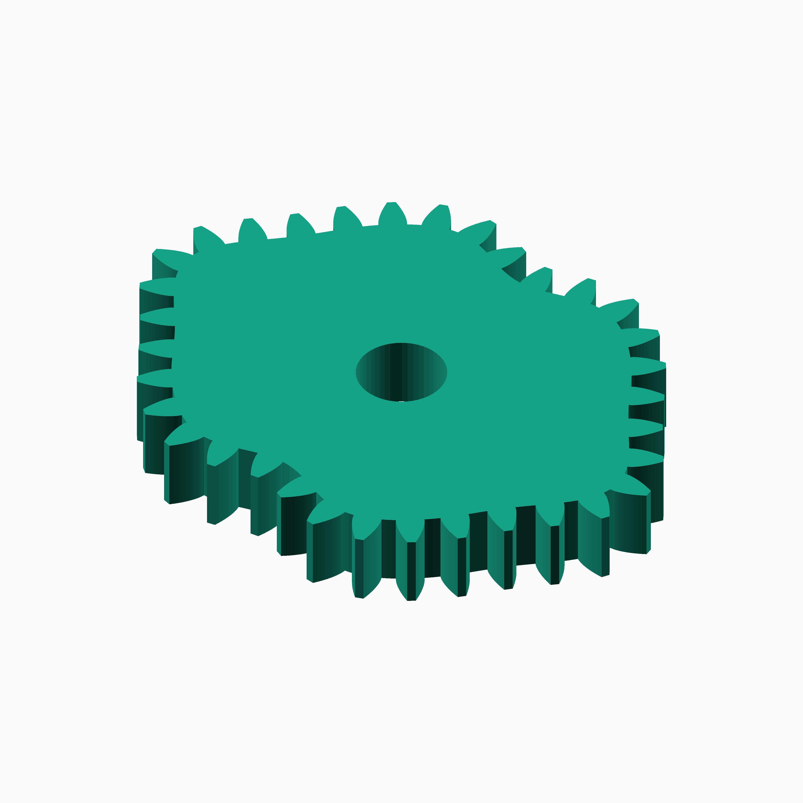
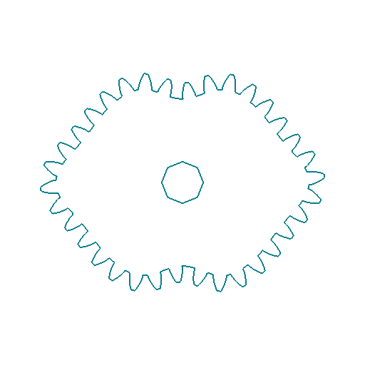
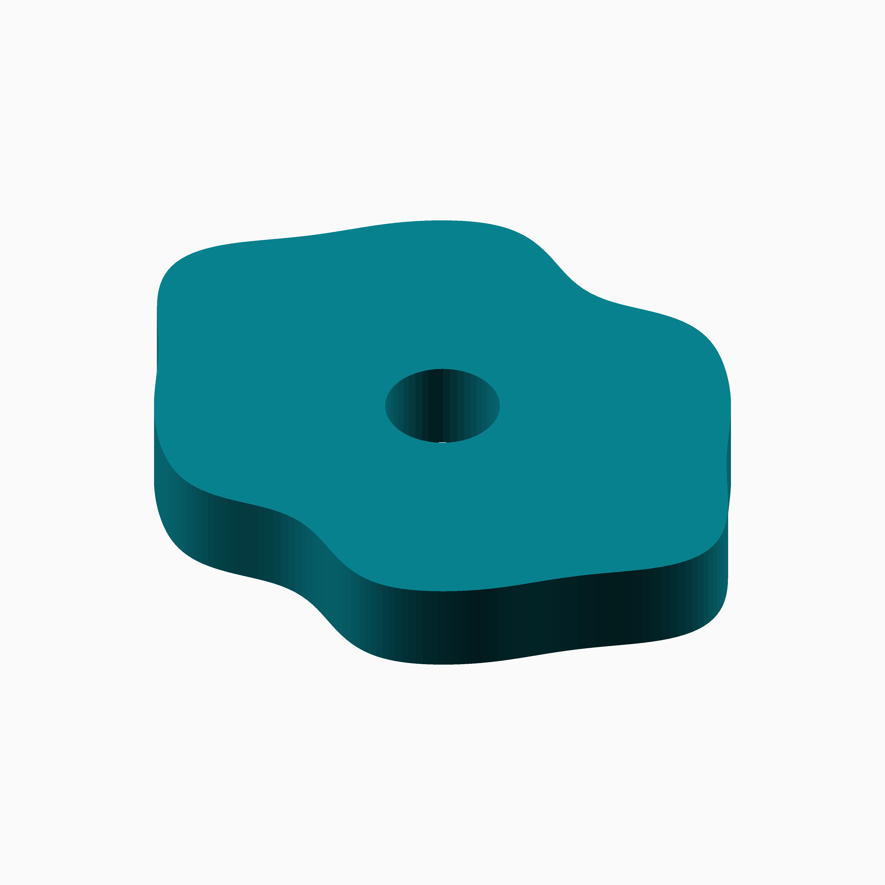
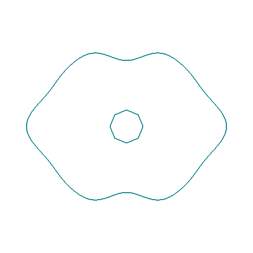
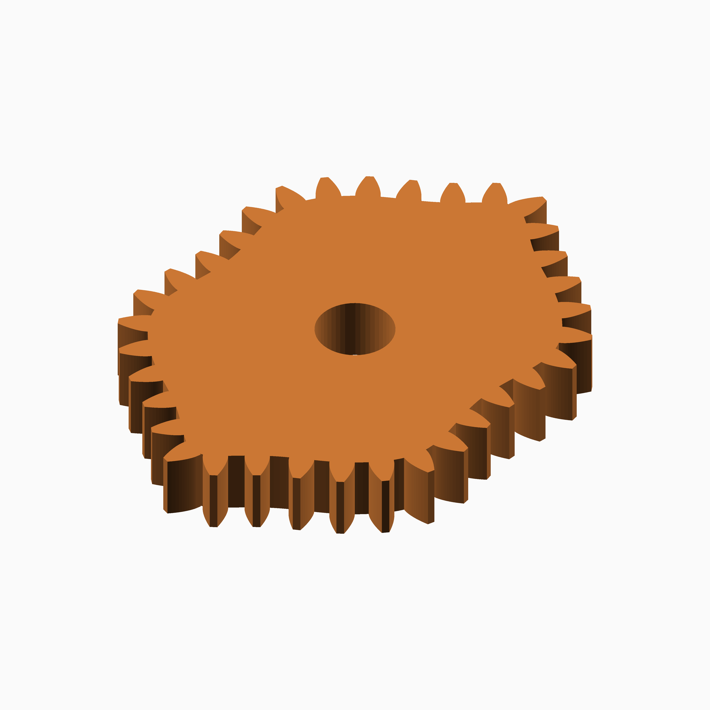
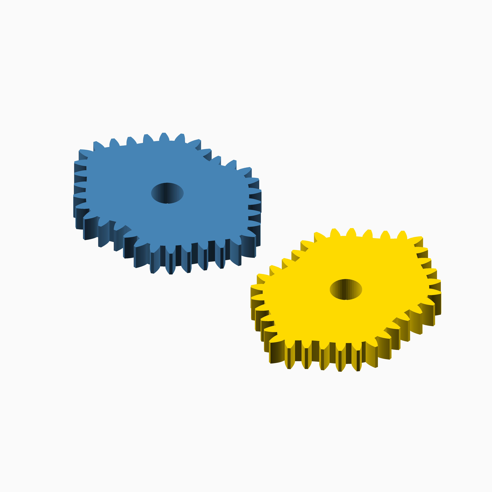

# Cosine Quintic

## Documentation navigation

- [README](../README.md)
- Families
  - [Bézier](bezier.md) · [Cassini](cassini.md) · [Circle](circle.md) · [Cosine Quintic](cosine_quintic.md) · [Cusp](cusp.md) · [Ellipse](ellipse.md) · [Epitrochoid](epitrochoid.md)
  - [Fourier](fourier.md) · [Hypotrochoid](hypotrochoid.md) · [Lobed](lobed.md) · [Logarithmic spiral](logarithmic_spiral.md) · [Logistic Dwell](logistic_dwell.md) · [Pascal](pascal.md) · [Superformula](superformula.md) · [Tanh Triad](tanh_triad.md) · [Temple Fay](temple_fay.md)
- Shared
  - [Examples catalogue](../examples/README.md) · [Test layout](../tests/README.md)
  - [Tooth construction](tooth-construction.md) · [Tooth placement](tooth-placement.md) · [Mate motion](mate-motion.md) · [Mate generation](mate-generation.md) · [Pair assembly](pair-assembly.md)

## Module `Cosine Quintic`

The unit law is `r(theta)=1+0.19*sgn(cos(2 theta))*abs(cos(2 theta))^5`.
The odd signed power preserves continuity while flattening the plateaux.
Reference: https://en.wikipedia.org/wiki/Power_function.

### Brief content:

**Functions**:

> [`curve_gear_cosine_quintic`](#function-curve_gear_cosine_quintic): Build a signed fifth-power cosine gear.

> [`curve_gear_cosine_quintic_2d`](#function-curve_gear_cosine_quintic_2d): Build the Cosine Quintic 2D outline.

> [`curve_gear_cosine_quintic_body`](#function-curve_gear_cosine_quintic_body): Build the Cosine Quintic body.

> [`curve_gear_cosine_quintic_body_2d`](#function-curve_gear_cosine_quintic_body_2d): Build the Cosine Quintic 2D body outline.

> [`curve_gear_cosine_quintic_centre_distance`](#function-curve_gear_cosine_quintic_centre_distance): Return the Cosine Quintic centre distance.

> [`curve_gear_cosine_quintic_mate`](#function-curve_gear_cosine_quintic_mate): Build a Cosine Quintic mating gear.

> [`curve_gear_cosine_quintic_mate_rotation`](#function-curve_gear_cosine_quintic_mate_rotation): Return the Cosine Quintic mate rotation.

> [`curve_gear_cosine_quintic_pair`](#function-curve_gear_cosine_quintic_pair): Build a Cosine Quintic gear pair.

## Functions

The module `Cosine Quintic` defines the following functions.

### Function `curve_gear_cosine_quintic`

| Cosine Quintic gear preview | ⠀ |
| --- | --- |
|  |  |

**Parameters:**

- `modul`: {number} Tooth module.
- `tooth_number`: {integer} Tooth count.
- `width`: {number} Width.
- `bore`: {number} Bore.
- `depth`: {number} Quintic depth.
- `harmonic`: {integer} Cosine harmonic.
- `pressure_angle`: {number} Pressure angle.
- `tooth_phase`: {number} Tooth phase.
- `backlash`: {number} Backlash.
- `clearance`: {number} Clearance.
- `samples`: {integer} Samples.
- `orientation`: {number} Orientation.

**Returns:**

No return

Back to [module description](#module-cosine-quintic).

### Function `curve_gear_cosine_quintic_2d`

| Cosine Quintic 2D outline | Full size |
| --- | --- |
|  | [Open full-size image](../images/functions/cosine_quintic/curve_gear_cosine_quintic_2d.png)  |

**Parameters:**

- `modul`: {number} Tooth module.
- `tooth_number`: {integer} Tooth count.
- `bore`: {number} Bore.
- `depth`: {number} Quintic depth.
- `harmonic`: {integer} Cosine harmonic.
- `pressure_angle`: {number} Pressure angle.
- `tooth_phase`: {number} Tooth phase.
- `backlash`: {number} Backlash.
- `clearance`: {number} Clearance.
- `samples`: {integer} Samples.
- `orientation`: {number} Orientation.

**Returns:**

No return

Back to [module description](#module-cosine-quintic).

### Function `curve_gear_cosine_quintic_body`

| Cosine Quintic body preview | Full size |
| --- | --- |
|  | [Open full-size image](../images/functions/cosine_quintic/curve_gear_cosine_quintic_body.png)  |

**Parameters:**

- `modul`: {number} Tooth module.
- `tooth_number`: {integer} Tooth count.
- `width`: {number} Width.
- `bore`: {number} Bore.
- `depth`: {number} Quintic depth.
- `harmonic`: {integer} Cosine harmonic.
- `pressure_angle`: {number} Pressure angle.
- `tooth_phase`: {number} Tooth phase.
- `backlash`: {number} Backlash.
- `clearance`: {number} Clearance.
- `samples`: {integer} Samples.
- `orientation`: {number} Orientation.

**Returns:**

No return

Back to [module description](#module-cosine-quintic).

### Function `curve_gear_cosine_quintic_body_2d`

| Cosine Quintic 2D body outline | Full size |
| --- | --- |
|  | [Open full-size image](../images/functions/cosine_quintic/curve_gear_cosine_quintic_body_2d.png)  |

**Parameters:**

- `modul`: {number} Tooth module.
- `tooth_number`: {integer} Tooth count.
- `bore`: {number} Bore.
- `depth`: {number} Quintic depth.
- `harmonic`: {integer} Cosine harmonic.
- `pressure_angle`: {number} Pressure angle.
- `tooth_phase`: {number} Tooth phase.
- `backlash`: {number} Backlash.
- `clearance`: {number} Clearance.
- `samples`: {integer} Samples.
- `orientation`: {number} Orientation.
- `body_offset`: {number} Body offset.

**Returns:**

No return

Back to [module description](#module-cosine-quintic).

### Function `curve_gear_cosine_quintic_centre_distance`

**Parameters:**

- `modul`: {number} Tooth module.
- `tooth_number`: {integer} Tooth count.
- `depth`: {number} Quintic depth.
- `harmonic`: {integer} Cosine harmonic.
- `samples`: {integer} Samples.

**Returns:**

No return

Back to [module description](#module-cosine-quintic).

### Function `curve_gear_cosine_quintic_mate`

| Cosine Quintic mate preview | Full size |
| --- | --- |
|  | [Open full-size image](../images/functions/cosine_quintic/curve_gear_cosine_quintic_mate.png)  |

**Parameters:**

- `modul`: {number} Tooth module.
- `tooth_number`: {integer} Tooth count.
- `width`: {number} Width.
- `bore`: {number} Bore.
- `depth`: {number} Quintic depth.
- `harmonic`: {integer} Cosine harmonic.
- `pressure_angle`: {number} Pressure angle.
- `tooth_phase`: {number} Tooth phase.
- `backlash`: {number} Backlash.
- `clearance`: {number} Clearance.
- `samples`: {integer} Samples.

**Returns:**

No return

Back to [module description](#module-cosine-quintic).

### Function `curve_gear_cosine_quintic_mate_rotation`

**Parameters:**

- `modul`: {number} Tooth module.
- `tooth_number`: {integer} Tooth count.
- `depth`: {number} Quintic depth.
- `harmonic`: {integer} Cosine harmonic.
- `samples`: {integer} Samples.
- `phase`: {number} Driver phase.

**Returns:**

No return

Back to [module description](#module-cosine-quintic).

### Function `curve_gear_cosine_quintic_pair`

| Cosine Quintic pair preview | Full size |
| --- | --- |
|  | [Open full-size image](../images/functions/cosine_quintic/curve_gear_cosine_quintic_pair.png)  |

**Parameters:**

- `modul`: {number} Tooth module.
- `tooth_number`: {integer} Tooth count.
- `width`: {number} Width.
- `bore`: {number} Bore.
- `depth`: {number} Quintic depth.
- `harmonic`: {integer} Cosine harmonic.
- `pressure_angle`: {number} Pressure angle.
- `samples`: {integer} Samples.
- `phase`: {number} Pair phase.
- `together_built`: {boolean} Mesh pair.
- `backlash`: {number} Backlash.
- `clearance`: {number} Clearance.
- `tooth_phase`: {number} Tooth phase.
- `driver_color`: {string} Driver colour.
- `mate_color`: {string} Mate colour.

**Returns:**

No return

Back to [module description](#module-cosine-quintic).

Back to [top](#).

---

[Back to the CurveGears README](../README.md)

*Generated by Doxydown from repository source comments; do not edit this page directly.*
