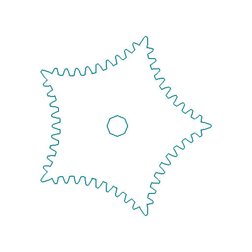
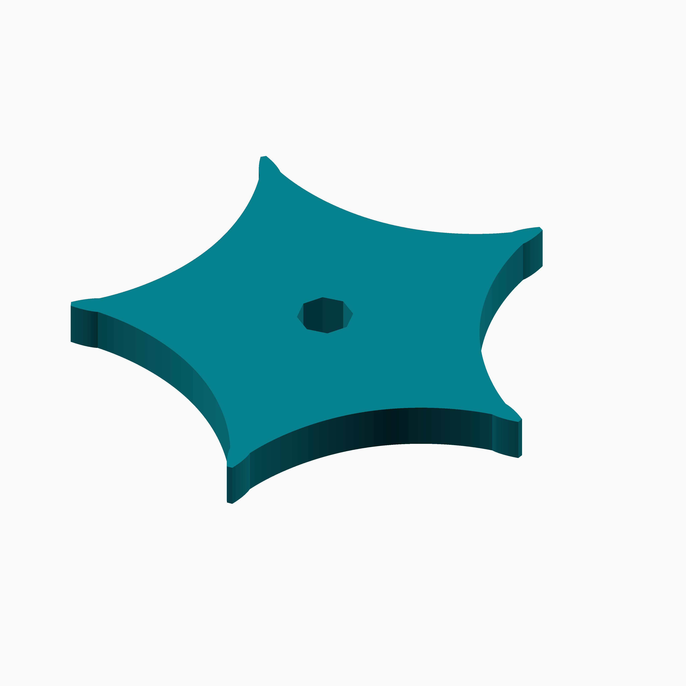
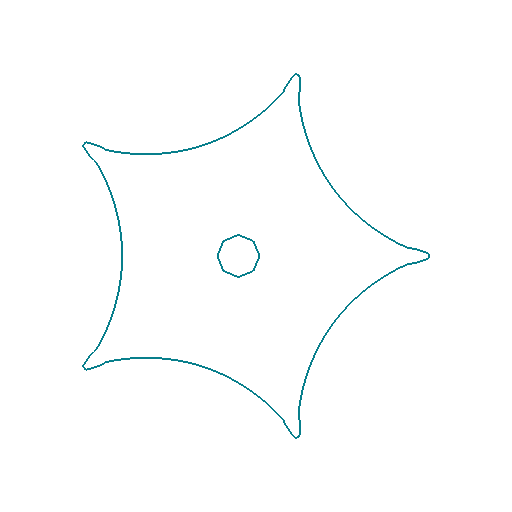
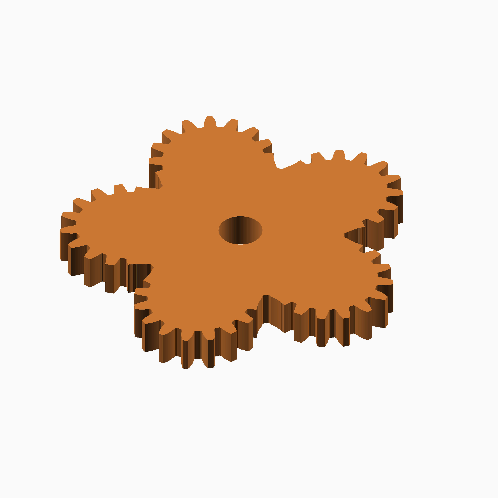

# Cusp

## Documentation navigation

- [README](../README.md)
- Families
  - [Bézier](bezier.md) · [Cassini](cassini.md) · [Circle](circle.md) · [Cosine Quintic](cosine_quintic.md) · [Cusp](cusp.md) · [Ellipse](ellipse.md) · [Epitrochoid](epitrochoid.md)
  - [Fourier](fourier.md) · [Hypotrochoid](hypotrochoid.md) · [Lobed](lobed.md) · [Logarithmic spiral](logarithmic_spiral.md) · [Logistic Dwell](logistic_dwell.md) · [Pascal](pascal.md) · [Superformula](superformula.md) · [Tanh Triad](tanh_triad.md) · [Temple Fay](temple_fay.md)
- Shared
  - [Examples catalogue](../examples/README.md) · [Test layout](../tests/README.md)
  - [Tooth construction](tooth-construction.md) · [Tooth placement](tooth-placement.md) · [Mate motion](mate-motion.md) · [Mate generation](mate-generation.md) · [Pair assembly](pair-assembly.md)

## Module `Cusp`

The hypocycloid pitch curve has `cusps` equally spaced cusps (default 3),
so tooth count and samples must be divisible by `cusps`. A standard validated tooth profile is placed at
each cusp after being shifted inward to fit the local curve width. The mate
is generated from the complete placed driver outline and the closed motion
table. The pitch law is x=a*((cusps-1)*cos(t)+cos((cusps-1)*t)),
y=a*((cusps-1)*sin(t)-sin((cusps-1)*t)); perimeter is 8*a*(cusps-1).
Three cusps give the deltoid; five give a five-pointed hypocycloid.
Tooth count sets pitch spacing; ordinary teeth inaccessible beside cusp
tips or inside a cusp tooth's occupied shoulder interval are omitted.
Reference: https://mathworld.wolfram.com/Hypocycloid.html.
The public gear, body, mate, centre-distance, rotation, and pair APIs
are documented together below.

### Brief content:

**Functions**:

> [`curve_gear_cusp`](#function-curve_gear_cusp): Build the hypocycloid cusp gear with regular radial teeth at its cusps.

> [`curve_gear_cusp_2d`](#function-curve_gear_cusp_2d): Emit the complete cusp gear profile as 2D geometry.

> [`curve_gear_cusp_body`](#function-curve_gear_cusp_body): Build the hypocycloid body with its integrated cusp-tip teeth.

> [`curve_gear_cusp_body_2d`](#function-curve_gear_cusp_body_2d): Emit the integrated-tip cusp body as 2D geometry with an optional inward offset.

> [`curve_gear_cusp_centre_distance`](#function-curve_gear_cusp_centre_distance): Return the solved pitch-curve centre distance for a cusp pair.

> [`curve_gear_cusp_mate`](#function-curve_gear_cusp_mate): Build the standalone swept-envelope mate for a cusp gear.

> [`curve_gear_cusp_mate_rotation`](#function-curve_gear_cusp_mate_rotation): Return the integrated mate angle at one driver phase.

> [`curve_gear_cusp_pair`](#function-curve_gear_cusp_pair): Build a meshed or separated hypocycloid cusp gear pair with a swept-envelope mate.

> [`_cg_cusp_anchor_placement`](#function-_cg_cusp_anchor_placement): Place a standard tooth in the analytic cusp-axis frame and trim its shoulder interval.

> [`_cg_cusp_body_branch_point`](#function-_cg_cusp_body_branch_point): Find a radial-root point on one hypocycloid branch.

> [`_cg_cusp_body_outline`](#function-_cg_cusp_body_outline): Build the cusp-family body outline with its integrated tip teeth.

> [`_cg_cusp_build`](#function-_cg_cusp_build): Construct the validated cusp body or complete gear.

> [`_cg_cusp_clear_shoulder_placement`](#function-_cg_cusp_clear_shoulder_placement): Classify an ordinary tooth as inaccessible when a cusp shoulder owns its splice interval.

> [`_cg_cusp_cross2`](#function-_cg_cusp_cross2): Calculate the scalar 2D cross product of two vectors.

> [`_cg_cusp_envelope_driver_outline`](#function-_cg_cusp_envelope_driver_outline): Extract the complete placed driver outline from its validated state.

> [`_cg_cusp_envelope_mate_from_geometry`](#function-_cg_cusp_envelope_mate_from_geometry): Build the cusp mate by sweeping the complete validated driver outline.

> [`_cg_cusp_envelope_mate_outer_radius`](#function-_cg_cusp_envelope_mate_outer_radius): Calculate the swept-envelope mate's outer blank radius.

> [`_cg_cusp_indices`](#function-_cg_cusp_indices): Return the tooth indices aligned with the hypocycloid cusps.

> [`_cg_cusp_pair_build`](#function-_cg_cusp_pair_build): Construct the cusp driver and swept-envelope mate as a pair.

> [`_cg_cusp_pair_motion_geometry`](#function-_cg_cusp_pair_motion_geometry): Build the validated cusp driver, radial motion data, solved distance, and motion table from the unmodified hypocycloid pitch curve.

> [`_cg_cusp_parameter_for_body_y`](#function-_cg_cusp_parameter_for_body_y): Solve for the hypocycloid parameter at a requested body-branch height.

> [`_cg_cusp_points`](#function-_cg_cusp_points): Sample one closed n-cusp hypocycloid pitch curve.

> [`_cg_cusp_prepared_state`](#function-_cg_cusp_prepared_state): Assemble ordinary and cusp-anchor teeth into one validated state.

> [`_cg_cusp_radius_on_outline`](#function-_cg_cusp_radius_on_outline): Find the furthest outline intersection along a radial direction.

> [`_cg_cusp_ray_segment_radius`](#function-_cg_cusp_ray_segment_radius): Find a non-negative ray intersection radius on one outline segment.

> [`_cg_cusp_repeated_radii`](#function-_cg_cusp_repeated_radii): Sample outline radii for all repeated hypocycloid sectors.

> [`_cg_cusp_scale`](#function-_cg_cusp_scale): Scale the hypocycloid to the requested module and tooth count.

> [`_cg_cusp_state`](#function-_cg_cusp_state): Construct the complete validated state for a cusp gear.

> [`_cg_cusp_tip_candidate`](#function-_cg_cusp_tip_candidate): Prepare the standard tooth profile and cusp-anchor dimensions.

## Functions

The module `Cusp` defines the following functions.

### Function `curve_gear_cusp`

| Cusp gear 1 | Cusp gear 2 |
| --- | --- |
|  |  |

Five cusps replace the canonical three-cusp deltoid. With 60 tooth positions, each cusp sector retains twelve tooth positions; the bore remains 4.8 mm. Set `cusps=5` and keep tooth count and samples divisible by five.
The common candidate validator accepts the full regular radial-root profile. Each cusp tooth is translated inward until its root width meets the local cusp-branch width; the cusp interval is then cropped and replaced by that unchanged tooth profile.
The mate is derived from the full placed driver outline and closed motion table.

**Parameters:**

- `modul`: {number > 0} Tooth module in mm.
- `tooth_number`: {integer >= 3, divisible by cusps} Tooth count; one radial tooth is centred on each cusp.
- `width`: {number > 0} Extrusion width in mm.
- `bore`: {number >= 0} Centre bore diameter in mm.
- `pressure_angle`: {0 < angle < 90, default 20} Standard-flank pressure angle.
- `backlash`: {undef or >= 0} Tangential tooth-thickness reduction in mm.
- `clearance`: {undef or >= 0} Additional radial root clearance in mm.
- `samples`: {integer >= 720, divisible by cusps, default 720} Hypocycloid pitch-curve sampling density for validated cusp teeth.
- `orientation`: {angle, default 0} Whole-gear display rotation in degrees.
- `cusps`: {integer >= 3, default 3} Number of equally spaced hypocycloid cusps; tooth count and samples must be divisible by it.

**Returns:**

No return

Back to [module description](#module-cusp).

### Function `curve_gear_cusp_2d`

| Cusp 2D gear 1 | Cusp 2D gear 2 |
| --- | --- |
|  |  |

Alternative 2 uses the contrasting controls described in the gear example.

**Parameters:**

- `modul`: {number > 0} Tooth module in mm.
- `tooth_number`: {integer >= 3, divisible by cusps} Tooth count.
- `bore`: {number >= 0} Centre bore diameter in mm.
- `pressure_angle`: {angle, default 20} Standard-flank pressure angle.
- `backlash`: {undef or >= 0} Tangential tooth-thickness reduction.
- `clearance`: {undef or >= 0} Additional radial root clearance.
- `samples`: {integer >= 720, divisible by cusps} Hypocycloid curve sampling density.
- `orientation`: {angle, default 0} Whole-gear rotation in degrees.
- `cusps`: {integer >= 3, default 3} Number of equally spaced hypocycloid cusps; tooth count and samples must be divisible by it.

**Returns:**

No return

### Example:

~~~c
curve_gear_cusp_2d(0.8, 36, 4.8);
~~~

Back to [module description](#module-cusp).

### Function `curve_gear_cusp_body`

| Cusp body 1 | Cusp body 2 |
| --- | --- |
|  |  |

Alternative 2 uses the contrasting controls described in the gear example.

**Parameters:**

- `modul`: {number > 0} Tooth module in mm.
- `tooth_number`: {integer >= 3, divisible by cusps} Tooth count scale.
- `width`: {number > 0} Extrusion width in mm.
- `bore`: {number >= 0} Centre bore diameter in mm.
- `samples`: {integer >= 720, divisible by cusps, default 720} Pitch-curve sampling density for validated cusp geometry.
- `orientation`: {angle, default 0} Whole-body display rotation.
- `cusps`: {integer >= 3, default 3} Number of equally spaced hypocycloid cusps; tooth count and samples must be divisible by it.

**Returns:**

No return

Back to [module description](#module-cusp).

### Function `curve_gear_cusp_body_2d`

| Cusp 2D body 1 | Cusp 2D body 2 |
| --- | --- |
|  |  |

Alternative 2 uses the contrasting controls described in the gear example.

**Parameters:**

- `modul`: {number > 0} Tooth module in mm.
- `tooth_number`: {integer >= 3, divisible by cusps} Tooth count.
- `bore`: {number >= 0} Centre bore diameter in mm.
- `samples`: {integer >= 720, divisible by cusps} Hypocycloid curve sampling density.
- `orientation`: {angle, default 0} Whole-body rotation in degrees.
- `body_offset`: {number, default 0} Signed offset in mm; negative shrinks the outer contour and preserves the bore.
- `cusps`: {integer >= 3, default 3} Number of equally spaced hypocycloid cusps; tooth count and samples must be divisible by it.

**Returns:**

No return

### Example:

~~~c
curve_gear_cusp_body_2d(0.8, 36, 4.8, body_offset=-2);
~~~

Back to [module description](#module-cusp).

### Function `curve_gear_cusp_centre_distance`

Return the solved pitch-curve centre distance for a cusp pair.

**Parameters:**

- `modul`: {number > 0} Tooth module in mm.
- `tooth_number`: {integer >= 3, divisible by cusps} Shared tooth count.
- `samples`: {integer >= 120, divisible by cusps, default 720} Motion sampling density.
- `cusps`: {integer >= 3, default 3} Number of equally spaced hypocycloid cusps; tooth count and samples must be divisible by it.

**Returns:**

- `{number}`: Fixed centre distance in mm.

Back to [module description](#module-cusp).

### Function `curve_gear_cusp_mate`

| Cusp mate 1 | Cusp mate 2 |
| --- | --- |
|  |  |

Alternative 2 uses the contrasting controls described in the gear example.

**Parameters:**

- `modul`: {number > 0} Tooth module in mm.
- `tooth_number`: {integer >= 3, divisible by cusps} Shared tooth count.
- `width`: {number > 0} Extrusion width in mm.
- `bore`: {number >= 0} Centre bore diameter in mm.
- `pressure_angle`: {0 < angle < 90, default 20} Tooth pressure angle.
- `backlash`: {undef or >= 0} Tangential tooth-thickness reduction.
- `clearance`: {undef or >= 0} Additional radial root clearance.
- `samples`: {integer >= 720, divisible by cusps, default 720} Motion and pitch-curve sampling density for the validated cusp outline.
- `sweep_steps`: {integer >= 36, default 360} Base driver-phase intervals for envelope construction.
- `max_pose_step`: {number > 0, default 0.5} Maximum angular step of either member in degrees.
- `sweep_clearance`: {number > 0, default 0.08} Envelope cutter clearance as a module fraction.
- `phase`: {angle, default 0} Driver phase used to orient the displayed mate.
- `cusps`: {integer >= 3, default 3} Number of equally spaced hypocycloid cusps; tooth count and samples must be divisible by it.

**Returns:**

No return

Back to [module description](#module-cusp).

### Function `curve_gear_cusp_mate_rotation`

Return the integrated mate angle at one driver phase.

**Parameters:**

- `modul`: {number > 0} Tooth module in mm.
- `tooth_number`: {integer >= 3, divisible by cusps} Shared tooth count.
- `samples`: {integer >= 120, divisible by cusps, default 720} Motion sampling density.
- `phase`: {angle, default 0} Driver angle in degrees.
- `cusps`: {integer >= 3, default 3} Number of equally spaced hypocycloid cusps; tooth count and samples must be divisible by it.

**Returns:**

- `{angle}`: Mate display rotation in degrees.

Back to [module description](#module-cusp).

### Function `curve_gear_cusp_pair`

| Cusp pair 1 | Cusp pair 2 |
| --- | --- |
|  |  |

Alternative 2 separates the driver and mate and uses the contrasting gear controls described above.

**Parameters:**

- `modul`: {number > 0} Tooth module in mm.
- `tooth_number`: {integer >= 3, divisible by cusps} Shared tooth count.
- `width`: {number > 0} Gear extrusion width in mm.
- `bore`: {number >= 0} Centre bore diameter in mm.
- `pressure_angle`: {0 < angle < 90, default 20} Tooth pressure angle.
- `samples`: {integer >= 720, divisible by cusps, default 720} Pitch and motion sampling density for the validated swept mate.
- `phase`: {angle, default 0} Driver motion phase.
- `together_built`: {boolean, default true} Place gears at the solved pitch distance when true.
- `backlash`: {undef or >= 0, default undef} Tangential tooth-thickness reduction.
- `clearance`: {undef or >= 0, default undef} Additional radial root clearance.
- `driver_color`: {OpenSCAD colour, default SteelBlue} Driver colour.
- `mate_color`: {OpenSCAD colour, default Gold} Mate colour.
- `sweep_steps`: {integer >= 36, default 360} Base driver-phase intervals for envelope construction.
- `max_pose_step`: {number > 0, default 0.5} Maximum angular step of either member in degrees.
- `sweep_clearance`: {number > 0, default 0.08} Envelope cutter clearance as a module fraction.
- `cusps`: {integer >= 3, default 3} Number of equally spaced hypocycloid cusps; tooth count and samples must be divisible by it.

**Returns:**

No return

Back to [module description](#module-cusp).

### Function `_cg_cusp_anchor_placement`

Place a standard tooth in the analytic cusp-axis frame and trim its shoulder interval.

**Parameters:**

- `points`: {array of points} Sampled hypocycloid pitch curve.
- `arc`: {array} Pitch-curve arc-length table.
- `perimeter`: {number > 0} Pitch-curve perimeter in millimetres.
- `body`: {array of points} Radial-root body polyline.
- `modul`: {number > 0} Tooth module in millimetres.
- `tooth_number`: {integer >= 3, divisible by cusps} Number of teeth.
- `index`: {integer >= 0} Tooth index at this cusp.
- `candidate`: {array} Prepared standard tooth candidate with cusp data.
- `phase`: {angle, default -90} Tooth-placement phase in degrees.
- `cusps`: {integer >= 3, default 3} Number of equally spaced hypocycloid cusps.

**Returns:**

- `{array}`: Validated cusp-anchor tooth placement record.

Back to [module description](#module-cusp).

### Function `_cg_cusp_body_branch_point`

Find a radial-root point on one hypocycloid branch.

**Parameters:**

- `a`: {number > 0} Rolling-circle radius in millimetres.
- `t`: {angle} Hypocycloid parameter in degrees.
- `dedendum`: {number >= 0} Tooth-root depth in millimetres.
- `cusps`: {integer >= 3, default 3} Number of equally spaced hypocycloid cusps; tooth count and samples must be divisible by it.

**Returns:**

- `{array}`: Cartesian body point in millimetres.

Back to [module description](#module-cusp).

### Function `_cg_cusp_body_outline`

Build the cusp-family body outline with its integrated tip teeth.

**Parameters:**

- `state`: {array} Validated cusp gear state.
- `tooth_number`: {integer >= 3, divisible by cusps} Number of teeth.
- `cusps`: {integer >= 3, default 3} Number of equally spaced hypocycloid cusps; tooth count and samples must be divisible by it.

**Returns:**

- `{array of points}`: Closed body and cusp-tip outline.

Back to [module description](#module-cusp).

### Function `_cg_cusp_build`

Construct the validated cusp body or complete gear.

**Parameters:**

- `modul`: {number > 0} Tooth module in millimetres.
- `tooth_number`: {integer >= 3, divisible by cusps} Number of teeth.
- `width`: {number > 0} Extrusion width in millimetres.
- `bore`: {number >= 0} Centre bore diameter in millimetres.
- `pressure_angle`: {0 < angle < 90, default 20} Standard-flank pressure angle.
- `backlash`: {undef or >= 0} Tangential tooth-thickness reduction.
- `clearance`: {undef or >= 0} Additional radial root clearance.
- `samples`: {integer >= 720, divisible by cusps, default 720} Pitch-curve sample count.
- `orientation`: {angle, default 0} Display rotation in degrees.
- `body_only`: {boolean, default false} Emit the integrated body without ordinary teeth.
- `is_2d`: {boolean, default false} Emit a planar outline instead of an extrusion.
- `body_offset`: {number, default 0} Signed planar-body offset in millimetres.
- `cusps`: {integer >= 3, default 3} Number of equally spaced hypocycloid cusps; tooth count and samples must be divisible by it.

**Returns:**

No return

Back to [module description](#module-cusp).

### Function `_cg_cusp_clear_shoulder_placement`

Classify an ordinary tooth as inaccessible when a cusp shoulder owns its splice interval.

**Parameters:**

- `placement`: {array} Ordinary tooth placement from the shared validator.
- `anchors`: {array} Prepared radial cusp-anchor placements.
- `perimeter`: {number > 0} Closed pitch-curve perimeter in millimetres.

**Returns:**

- `{array}`: Original placement or an inaccessible placement with its diagnostic geometry retained.

Back to [module description](#module-cusp).

### Function `_cg_cusp_cross2`

Calculate the scalar 2D cross product of two vectors.

**Parameters:**

- `a`: {array of number} First 2D vector.
- `b`: {array of number} Second 2D vector.

**Returns:**

- `{number}`: Scalar cross product.

Back to [module description](#module-cusp).

### Function `_cg_cusp_envelope_driver_outline`

Extract the complete placed driver outline from its validated state.

**Parameters:**

- `state`: {array} Validated cusp tooth-geometry state.

**Returns:**

- `{array of points}`: Closed outline in millimetres.

Back to [module description](#module-cusp).

### Function `_cg_cusp_envelope_mate_from_geometry`

Build the cusp mate by sweeping the complete validated driver outline.

**Parameters:**

- `geometry`: {array} Validated cusp pitch and motion state.
- `modul`: {number > 0} Tooth module in millimetres.
- `width`: {number > 0} Extrusion width in millimetres.
- `bore`: {number >= 0} Centre bore diameter in millimetres.
- `sweep_steps`: {integer >= 36, default 360} Base driver-phase intervals.
- `max_pose_step`: {number > 0, default 0.5} Maximum member pose step in degrees.
- `sweep_clearance`: {number > 0, default 0.08} Cutter clearance as a module fraction.
- `phase`: {angle, default 0} Driver phase in degrees.

**Returns:**

No return

Back to [module description](#module-cusp).

### Function `_cg_cusp_envelope_mate_outer_radius`

Calculate the swept-envelope mate's outer blank radius.

**Parameters:**

- `geometry`: {array} Cusp pitch and motion geometry state.
- `modul`: {number > 0} Tooth module in millimetres.

**Returns:**

- `{number}`: Mate blank radius in millimetres.

Back to [module description](#module-cusp).

### Function `_cg_cusp_indices`

Return the tooth indices aligned with the hypocycloid cusps.

**Parameters:**

- `tooth_number`: {integer >= 3, divisible by cusps} Number of teeth.
- `cusps`: {integer >= 3, default 3} Number of equally spaced hypocycloid cusps; tooth count and samples must be divisible by it.

**Returns:**

- `{array of integer}`: Cusp-aligned tooth indices.

Back to [module description](#module-cusp).

### Function `_cg_cusp_pair_build`

Construct the cusp driver and swept-envelope mate as a pair.

**Parameters:**

- `modul`: {number > 0, default 1.2} Tooth module in millimetres.
- `tooth_number`: {integer >= 3, divisible by cusps, default 36} Number of teeth.
- `width`: {number > 0, default 4} Extrusion width in millimetres.
- `bore`: {number >= 0, default 4.8} Centre bore diameter in millimetres.
- `pressure_angle`: {0 < angle < 90, default 20} Standard-flank pressure angle.
- `samples`: {integer >= 720, divisible by cusps, default 720} Pitch and motion sample count.
- `phase`: {angle, default 0} Driver motion phase in degrees.
- `together_built`: {boolean, default true} Mesh the pair when true.
- `backlash`: {undef or >= 0, default undef} Tangential tooth-thickness reduction.
- `clearance`: {undef or >= 0, default undef} Additional radial root clearance.
- `driver_color`: {OpenSCAD colour, default SteelBlue} Driver display colour.
- `mate_color`: {OpenSCAD colour, default Gold} Mate display colour.
- `sweep_steps`: {integer >= 36, default 360} Base driver-phase intervals.
- `max_pose_step`: {number > 0, default 0.5} Maximum member pose step in degrees.
- `sweep_clearance`: {number > 0, default 0.08} Cutter clearance as a module fraction.
- `cusps`: {integer >= 3, default 3} Number of equally spaced hypocycloid cusps; tooth count and samples must be divisible by it.

**Returns:**

No return

Back to [module description](#module-cusp).

### Function `_cg_cusp_pair_motion_geometry`

Build the validated cusp driver, radial motion data, solved distance, and motion table from the unmodified hypocycloid pitch curve.

**Parameters:**

- `modul`: {number > 0} Tooth module in millimetres.
- `tooth_number`: {integer >= 3, divisible by cusps} Number of teeth.
- `pressure_angle`: {0 < angle < 90} Standard-flank pressure angle.
- `backlash`: {undef or >= 0} Tangential tooth-thickness reduction.
- `clearance`: {undef or >= 0} Additional radial root clearance.
- `samples`: {integer >= 120, divisible by cusps} Motion sampling density.
- `cusps`: {integer >= 3, default 3} Number of equally spaced hypocycloid cusps; tooth count and samples must be divisible by it.

**Returns:**

- `{array}`: Driver state, radii, solved distance, and integrated motion.

Back to [module description](#module-cusp).

### Function `_cg_cusp_parameter_for_body_y`

Solve for the hypocycloid parameter at a requested body-branch height.

**Parameters:**

- `a`: {number > 0} Rolling-circle radius in millimetres.
- `target`: {number} Target Cartesian y coordinate in millimetres.
- `dedendum`: {number >= 0} Tooth-root depth in millimetres.
- `lo`: {angle, default 0} Lower parameter bound in degrees.
- `hi`: {undef or angle, default undef} Upper bound in degrees; undef uses 180/cusps.
- `i`: {integer >= 0, default 0} Recursion iteration.
- `cusps`: {integer >= 3, default 3} Number of equally spaced hypocycloid cusps; tooth count and samples must be divisible by it.

**Returns:**

- `{angle}`: Solved hypocycloid parameter in degrees.

Back to [module description](#module-cusp).

### Function `_cg_cusp_points`

Sample one closed n-cusp hypocycloid pitch curve.

**Parameters:**

- `a`: {number > 0} Rolling-circle radius in millimetres.
- `samples`: {integer >= 3, divisible by cusps, default 720} Sample count.
- `cusps`: {integer >= 3, default 3} Number of equally spaced hypocycloid cusps; tooth count and samples must be divisible by it.

**Returns:**

- `{array of points}`: Hypocycloid pitch curve in millimetres.

Back to [module description](#module-cusp).

### Function `_cg_cusp_prepared_state`

Assemble ordinary and cusp-anchor teeth into one validated state.

**Parameters:**

- `points`: {array of points} Sampled hypocycloid pitch curve.
- `modul`: {number > 0} Tooth module in millimetres.
- `tooth_number`: {integer >= 3, divisible by cusps} Number of teeth.
- `pressure_angle`: {0 < angle < 90} Standard-flank pressure angle.
- `backlash`: {undef or >= 0} Tangential tooth-thickness reduction.
- `clearance`: {undef or >= 0} Additional radial root clearance.
- `tip_candidate`: {array} Prepared standard tooth candidate with cusp data.
- `phase`: {angle, default -90} Tooth-placement phase in degrees.
- `cusps`: {integer >= 3, default 3} Number of equally spaced hypocycloid cusps; tooth count and samples must be divisible by it.

**Returns:**

- `{array}`: Validated complete cusp-gear geometry state.

Back to [module description](#module-cusp).

### Function `_cg_cusp_radius_on_outline`

Find the furthest outline intersection along a radial direction.

**Parameters:**

- `outline`: {array of points} Closed gear outline.
- `angle`: {angle} Ray direction in degrees.

**Returns:**

- `{number}`: Furthest intersection radius in millimetres.

Back to [module description](#module-cusp).

### Function `_cg_cusp_ray_segment_radius`

Find a non-negative ray intersection radius on one outline segment.

**Parameters:**

- `a`: {array of number} First segment endpoint.
- `b`: {array of number} Second segment endpoint.
- `angle`: {angle} Ray direction in degrees.

**Returns:**

- `{number}`: Intersection radius, or zero when there is no hit.

Back to [module description](#module-cusp).

### Function `_cg_cusp_repeated_radii`

Sample outline radii for all repeated hypocycloid sectors.

**Parameters:**

- `outline`: {array of points} Pitch curve or closed driver outline.
- `samples`: {integer >= 3, divisible by cusps} Total angular sample count.
- `midpoint`: {boolean} Sample at interval midpoints when true.
- `pitch_offset`: {number} Radial offset in millimetres.
- `cusps`: {integer >= 3, default 3} Number of equally spaced hypocycloid cusps; tooth count and samples must be divisible by it.

**Returns:**

- `{array of number}`: Repeated radius samples.

Back to [module description](#module-cusp).

### Function `_cg_cusp_scale`

Scale the hypocycloid to the requested module and tooth count.

**Parameters:**

- `modul`: {number > 0} Tooth module in millimetres.
- `tooth_number`: {integer >= 3, divisible by cusps} Number of teeth.
- `cusps`: {integer >= 3, default 3} Number of equally spaced hypocycloid cusps; tooth count and samples must be divisible by it.

**Returns:**

- `{number}`: Rolling-circle radius in millimetres.

Back to [module description](#module-cusp).

### Function `_cg_cusp_state`

Construct the complete validated state for a cusp gear.

**Parameters:**

- `modul`: {number > 0} Tooth module in millimetres.
- `tooth_number`: {integer >= 3, divisible by cusps} Number of teeth.
- `pressure_angle`: {0 < angle < 90, default 20} Standard-flank pressure angle.
- `backlash`: {undef or >= 0} Tangential tooth-thickness reduction.
- `clearance`: {undef or >= 0} Additional radial root clearance.
- `samples`: {integer >= 720, divisible by cusps, default 720} Pitch-curve samples.
- `cusps`: {integer >= 3, default 3} Number of equally spaced hypocycloid cusps; tooth count and samples must be divisible by it.

**Returns:**

- `{array}`: Validated cusp gear state.

Back to [module description](#module-cusp).

### Function `_cg_cusp_tip_candidate`

Prepare the standard tooth profile and cusp-anchor dimensions.

**Parameters:**

- `modul`: {number > 0} Tooth module in millimetres.
- `tooth_number`: {integer >= 3, divisible by cusps} Number of teeth.
- `pressure_angle`: {0 < angle < 90} Standard-flank pressure angle.
- `backlash`: {undef or >= 0} Tangential tooth-thickness reduction.
- `clearance`: {undef or >= 0} Additional radial root clearance.
- `cusps`: {integer >= 3, default 3} Number of equally spaced hypocycloid cusps; tooth count and samples must be divisible by it.

**Returns:**

- `{array}`: Standard tooth candidate extended with cusp dimensions.

Back to [module description](#module-cusp).

Back to [top](#).

---

[Back to the CurveGears README](../README.md)

*Generated by Doxydown from repository source comments; do not edit this page directly.*
