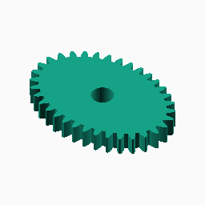
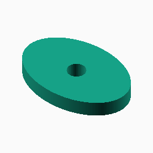
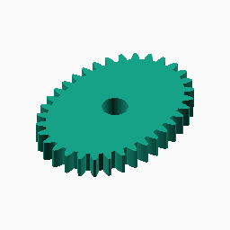
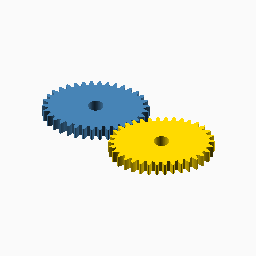

# Ellipse

## Documentation navigation

- [README](../README.md)
- Families
  - [Bézier](bezier.md) · [Cassini](cassini.md) · [Circle](circle.md) · [Ellipse](ellipse.md) · [Epitrochoid](epitrochoid.md) · [Fourier](fourier.md)
  - [Hypotrochoid](hypotrochoid.md) · [Lobed](lobed.md) · [Logarithmic spiral](logarithmic_spiral.md) · [Pascal](pascal.md) · [Superformula](superformula.md)
- Shared
  - [Examples catalogue](../examples/README.md) · [Test layout](../tests/README.md)
  - [Tooth construction](tooth-construction.md) · [Tooth placement](tooth-placement.md) · [Mate motion](mate-motion.md) · [Mate generation](mate-generation.md) · [Pair assembly](pair-assembly.md)

## Module `Ellipse`

The centred pitch curve is `x=a cos(theta)`, `y=b sin(theta)`, or
`r=ab/sqrt(b^2 cos^2(theta)+a^2 sin^2(theta))` in polar form. Eccentricity
zero is circular; increasing eccentricity increases the varying transmission
ratio. The public gear, mate and pair APIs consume these primitives.
Reference: https://mathworld.wolfram.com/Ellipse.html.

### Brief content:

**Functions**:

> [`_cg_ellipse_axes(modul, tooth_number, eccentricity)`](#function-_cg_ellipse_axesmodul-tooth_number-eccentricity): Calculate the ellipse semi-axes for a requested module and tooth count.

> [`_cg_ellipse_radius(a, b, theta)`](#function-_cg_ellipse_radiusa-b-theta): Evaluate the ellipse radius at an angular position.

> [`_cg_ellipse_driver_point(a, b, theta)`](#function-_cg_ellipse_driver_pointa-b-theta): Convert an ellipse radius and angle into a Cartesian pitch point.

> [`curve_gear_ellipse(modul, tooth_number, width, bore, ...)`](#function-curve_gear_ellipsemodul-tooth_number-width-bore-): Build an elliptical non-circular gear.

> [`_cg_ellipse_build(modul,tooth_number,width,bore,eccentricity=0.62,pressure_angle=20,tooth_phase=0,backlash=undef,clearance=undef,samples=480,orientation=0,body_only=false)`](#function-_cg_ellipse_buildmodultooth_numberwidthboreeccentricity062pressure_angle20tooth_phase0backlashundefclearanceundefsamples480orientation0body_onlyfalse): Internal ellipse construction dispatcher.

> [`curve_gear_ellipse_body(modul, tooth_number, width, bore, ...)`](#function-curve_gear_ellipse_bodymodul-tooth_number-width-bore-): Build the elliptical body solid without teeth.

> [`_cg_ellipse_motion_radii`](#function-_cg_ellipse_motion_radii): Evaluate ellipse radii at integration midpoints.

> [`_cg_ellipse_driver_radii`](#function-_cg_ellipse_driver_radii): Evaluate ellipse radii at direct mate-construction angles.

> [`_cg_ellipse_centre_distance`](#function-_cg_ellipse_centre_distance): Solve the ellipse conjugate centre distance.

> [`_cg_ellipse_motion_table`](#function-_cg_ellipse_motion_table): Build the shared ellipse phase-motion table.

> [`_cg_ellipse_mate_points_from_driver`](#function-_cg_ellipse_mate_points_from_driver): Build ellipse mate pitch points by advancing driver angle directly.

> [`_cg_ellipse_mate_points`](#function-_cg_ellipse_mate_points): Build ellipse mate pitch points and their shared motion table.

> [`curve_gear_ellipse_mate(modul, tooth_number, width, bore, ...)`](#function-curve_gear_ellipse_matemodul-tooth_number-width-bore-): Build the standalone elliptical mate boundary at the origin.

> [`curve_gear_ellipse_centre_distance(modul, tooth_number, eccentricity, ...)`](#function-curve_gear_ellipse_centre_distancemodul-tooth_number-eccentricity-): Return the mathematical centre distance for an elliptical pair.

> [`curve_gear_ellipse_mate_rotation(modul, tooth_number, eccentricity, ...)`](#function-curve_gear_ellipse_mate_rotationmodul-tooth_number-eccentricity-): Return the conjugate elliptical mate rotation for a driver phase.

> [`curve_gear_ellipse_pair(modul, tooth_number, width, bore, ...)`](#function-curve_gear_ellipse_pairmodul-tooth_number-width-bore-): Build a meshed or separated elliptical pair.

> [`_cg_ellipse_pair_build(modul,tooth_number,width,bore,eccentricity=0.62,pressure_angle=20,samples=480,phase=0,together_built=true,backlash=undef,clearance=undef,tooth_phase=0,driver_color="SteelBlue",mate_color="Gold")`](#function-_cg_ellipse_pair_buildmodultooth_numberwidthboreeccentricity062pressure_angle20samples480phase0together_builttruebacklashundefclearanceundeftooth_phase0driver_colorsteelbluemate_colorgold): Internal ellipse pair construction dispatcher.

## Functions

The module `Ellipse` defines the following functions.

### Function `_cg_ellipse_axes(modul, tooth_number, eccentricity)`

Calculate the ellipse semi-axes for a requested module and tooth count.

**Parameters:**

- `modul`: {number > 0} Tooth module in mm.
- `tooth_number`: {integer >= 3} Number of teeth.
- `eccentricity`: {0 <= e < 1} Ellipse eccentricity.

**Returns:**

- `{array}`: Semi-major and semi-minor axes as `[a, b]` in mm.

Back to [module description](#module-ellipse).

### Function `_cg_ellipse_radius(a, b, theta)`

Evaluate the ellipse radius at an angular position.

**Parameters:**

- `a`: {number > 0} Ellipse semi-major axis in mm.
- `b`: {number > 0} Ellipse semi-minor axis in mm.
- `theta`: {angle} Polar angle in degrees.

**Returns:**

- `{number}`: Radius in mm.

Back to [module description](#module-ellipse).

### Function `_cg_ellipse_driver_point(a, b, theta)`

Convert an ellipse radius and angle into a Cartesian pitch point.

**Parameters:**

- `a`: {number > 0} Ellipse semi-major axis in mm.
- `b`: {number > 0} Ellipse semi-minor axis in mm.
- `theta`: {angle} Polar angle in degrees.

**Returns:**

- `{array}`: Cartesian point `[x, y]` in mm.

Back to [module description](#module-ellipse).

### Function `curve_gear_ellipse(modul, tooth_number, width, bore, ...)`

Public single-gear construction for the ellipse family.
The gear is centred on X=0,Y=0 with its lower face at Z=0.
[`curve_gear_ellipse_body`](#f-curve_gear_ellipse_body)

**Parameters:**

- `modul`: {number > 0} Tooth module in mm.
- `tooth_number`: {integer >= 3} Number of teeth.
- `width`: {number > 0} Extrusion width in mm.
- `bore`: {number >= 0} Centre bore diameter in mm.
- `eccentricity`: {0 <= e < 1, default 0.62} Ellipse eccentricity; zero is circular.
- `pressure_angle`: {0 < angle < 90, default 20} Involute pressure angle in degrees.
- `tooth_phase`: {angle, default 0} Tooth placement phase in degrees.
- `backlash`: {undef or >= 0} Tangential tooth-thickness reduction in mm.
- `clearance`: {undef or >= 0} Additional radial root clearance in mm.
- `samples`: {integer >= 120, default 480} Pitch-curve sampling density.
- `orientation`: {angle, default 0} Single-gear display rotation in degrees.

**Returns:**

No return

### Example:

~~~c
curve_gear_ellipse(1, 24, 4, 8);
~~~

Back to [module description](#module-ellipse).

### Function `_cg_ellipse_build(modul,tooth_number,width,bore,eccentricity=0.62,pressure_angle=20,tooth_phase=0,backlash=undef,clearance=undef,samples=480,orientation=0,body_only=false)`

Internal ellipse construction dispatcher.

**Parameters:**

- `modul`: {number} Tooth module in mm.
- `tooth_number`: {integer} Number of teeth.
- `width`: {number} Extrusion width in mm.
- `bore`: {number} Centre bore diameter in mm.
- `eccentricity`: {number, default 0.62} Internal construction parameter.
- `pressure_angle`: {number, default 20} Involute pressure angle in degrees.
- `tooth_phase`: {number, default 0} Tooth placement phase in degrees.
- `backlash`: {number, default undef} Tangential tooth-thickness reduction in mm.
- `clearance`: {number, default undef} Additional radial root clearance in mm.
- `samples`: {integer, default 480} Pitch-curve or motion-table sampling density.
- `orientation`: {number, default 0} Single-gear display rotation in degrees.
- `body_only`: {boolean, default false} Emit the body without teeth.

**Returns:**

- `{geometry}`: Constructed family geometry.

Back to [module description](#module-ellipse).

### Function `curve_gear_ellipse_body(modul, tooth_number, width, bore, ...)`

Build the elliptical body solid without teeth.

**Parameters:**

- `modul`: {number > 0} Tooth module in mm.
- `tooth_number`: {integer >= 3} Number of teeth.
- `width`: {number > 0} Extrusion width in mm.
- `bore`: {number >= 0} Centre bore diameter in mm.
- `eccentricity`: {0 <= e < 1, default 0.62} Ellipse eccentricity.
- `pressure_angle`: {0 < angle < 90, default 20} Involute pressure angle.
- `tooth_phase`: {angle, default 0} Tooth placement phase in degrees.
- `backlash`: {undef or >= 0} Tangential tooth-thickness reduction in mm.
- `clearance`: {undef or >= 0} Additional radial root clearance in mm.
- `samples`: {integer >= 120, default 480} Pitch-curve sampling density.
- `orientation`: {angle, default 0} Single-gear display rotation in degrees.

**Returns:**

No return

### Example:

~~~c
curve_gear_ellipse_body(1, 24, 4, 8);
~~~

Back to [module description](#module-ellipse).

### Function `_cg_ellipse_motion_radii`

Evaluate ellipse radii at integration midpoints.

**Parameters:**

- `a`: {number > 0} Ellipse semi-major scale.
- `b`: {number > 0} Ellipse semi-minor scale.
- `n`: {integer >= 1, default 360} Number of midpoint samples.

**Returns:**

- `{array of number}`: Sampled radii in angular order.

Back to [module description](#module-ellipse).

### Function `_cg_ellipse_driver_radii`

Evaluate ellipse radii at direct mate-construction angles.

**Parameters:**

No parameters

**Returns:**

No return

Back to [module description](#module-ellipse).

### Function `_cg_ellipse_centre_distance`

Solve the ellipse conjugate centre distance.

**Parameters:**

- `a`: {number > 0} Ellipse semi-major scale.
- `b`: {number > 0} Ellipse semi-minor scale.

**Returns:**

- `{number}`: Conjugate centre distance.

Back to [module description](#module-ellipse).

### Function `_cg_ellipse_motion_table`

Build the shared ellipse phase-motion table.

**Parameters:**

- `a`: {number > 0} Ellipse semi-major scale.
- `b`: {number > 0} Ellipse semi-minor scale.
- `D`: {number > 0} Driver-to-mate centre distance.
- `n`: {integer >= 1, default 480} Number of midpoint samples.

**Returns:**

- `{array}`: Monotonic driver-to-mate phase-motion table.

Back to [module description](#module-ellipse).

### Function `_cg_ellipse_mate_points_from_driver`

Build ellipse mate pitch points by advancing driver angle directly.

**Parameters:**

- `a`: {number > 0} Ellipse semi-major scale.
- `b`: {number > 0} Ellipse semi-minor scale.
- `D`: {number > 0} Driver-to-mate centre distance.
- `motion`: {array} Shared driver-to-mate phase-motion table.
- `n`: {integer >= 1, default 480} Number of output points.

**Returns:**

- `{array of points}`: Cartesian mate pitch points.

Back to [module description](#module-ellipse).

### Function `_cg_ellipse_mate_points`

Build ellipse mate pitch points and their shared motion table.

**Parameters:**

- `a`: {number > 0} Ellipse semi-major scale.
- `b`: {number > 0} Ellipse semi-minor scale.
- `D`: {number > 0} Driver-to-mate centre distance.
- `n`: {integer >= 1, default 480} Number of output points.

**Returns:**

- `{array of points}`: Cartesian mate pitch points.

Back to [module description](#module-ellipse).

### Function `curve_gear_ellipse_mate(modul, tooth_number, width, bore, ...)`

Build the standalone elliptical mate boundary at the origin.

**Parameters:**

- `modul`: {number > 0} Tooth module in mm.
- `tooth_number`: {integer >= 3} Number of teeth.
- `width`: {number > 0} Extrusion width in mm.
- `bore`: {number >= 0} Centre bore diameter in mm.
- `eccentricity`: {0 <= e < 1, default 0.62} Ellipse eccentricity.
- `pressure_angle`: {0 < angle < 90, default 20} Involute pressure angle.
- `tooth_phase`: {angle, default 0} Tooth placement phase in degrees.
- `backlash`: {undef or >= 0} Tangential tooth-thickness reduction in mm.
- `clearance`: {undef or >= 0} Additional radial root clearance in mm.
- `samples`: {integer >= 120, default 480} Pitch-curve sampling density.

**Returns:**

No return

Back to [module description](#module-ellipse).

### Function `curve_gear_ellipse_centre_distance(modul, tooth_number, eccentricity, ...)`

Return the mathematical centre distance for an elliptical pair.

**Parameters:**

- `modul`: {number > 0} Tooth module in mm.
- `tooth_number`: {integer >= 3} Number of teeth.
- `eccentricity`: {0 <= e < 1, default 0.62} Ellipse eccentricity.
- `samples`: {integer >= 120, default 480} Motion-table sampling density.

**Returns:**

- `{number}`: Pair centre distance in mm.

Back to [module description](#module-ellipse).

### Function `curve_gear_ellipse_mate_rotation(modul, tooth_number, eccentricity, ...)`

Return the conjugate elliptical mate rotation for a driver phase.

**Parameters:**

- `modul`: {number > 0} Tooth module in mm.
- `tooth_number`: {integer >= 3} Number of teeth.
- `eccentricity`: {0 <= e < 1, default 0.62} Ellipse eccentricity.
- `samples`: {integer >= 120, default 480} Motion-table sampling density.
- `phase`: {angle, default 0} Driver motion phase in degrees.

**Returns:**

- `{angle}`: Mate rotation in degrees.

Back to [module description](#module-ellipse).

### Function `curve_gear_ellipse_pair(modul, tooth_number, width, bore, ...)`

Pair geometry uses the single-gear parameters documented in gear.scad.
[`curve_gear_ellipse`](#f-curve_gear_ellipse)

**Parameters:**

- `modul`: {number > 0} Tooth module in mm.
- `tooth_number`: {integer >= 3} Number of teeth.
- `width`: {number > 0} Extrusion width in mm.
- `bore`: {number >= 0} Centre bore diameter in mm.
- `eccentricity`: {0 <= e < 1, default 0.62} Ellipse eccentricity.
- `pressure_angle`: {0 < angle < 90, default 20} Involute pressure angle.
- `samples`: {integer >= 120, default 480} Pitch-curve sampling density.
- `phase`: {angle, default 0} Driver motion phase in degrees.
- `tooth_phase`: {angle, default 0} Tooth placement phase in degrees.
- `backlash`: {undef or >= 0} Tangential tooth-thickness reduction in mm.
- `clearance`: {undef or >= 0} Additional radial root clearance in mm.
- `together_built`: {boolean, default true} Place the pair meshed when true, separated when false.
- `driver_color`: {OpenSCAD colour, default SteelBlue} Driver display colour.
- `mate_color`: {OpenSCAD colour, default Gold} Mate display colour.

**Returns:**

No return

### Example:

~~~c
curve_gear_ellipse_pair(1, 24, 4, 8);
~~~

Back to [module description](#module-ellipse).

### Function `_cg_ellipse_pair_build(modul,tooth_number,width,bore,eccentricity=0.62,pressure_angle=20,samples=480,phase=0,together_built=true,backlash=undef,clearance=undef,tooth_phase=0,driver_color="SteelBlue",mate_color="Gold")`

Internal ellipse pair construction dispatcher.

**Parameters:**

- `modul`: {number} Tooth module in mm.
- `tooth_number`: {integer} Number of teeth.
- `width`: {number} Extrusion width in mm.
- `bore`: {number} Centre bore diameter in mm.
- `eccentricity`: {number, default 0.62} Internal construction parameter.
- `pressure_angle`: {number, default 20} Involute pressure angle in degrees.
- `samples`: {integer, default 480} Pitch-curve or motion-table sampling density.
- `phase`: {number, default 0} Driver motion phase in degrees.
- `together_built`: {boolean, default true} Use meshed placement when true, display placement otherwise.
- `backlash`: {number, default undef} Tangential tooth-thickness reduction in mm.
- `clearance`: {number, default undef} Additional radial root clearance in mm.
- `tooth_phase`: {number, default 0} Tooth placement phase in degrees.
- `driver_color`: {string, default "SteelBlue"} Driver display colour.
- `mate_color`: {string, default "Gold"} Mate display colour.

**Returns:**

- `{geometry}`: Constructed family geometry.

Back to [module description](#module-ellipse).

Back to [top](#).

---

[Back to the CurveGears README](../README.md)

*Generated by Doxydown from repository source comments; do not edit this page directly.*
