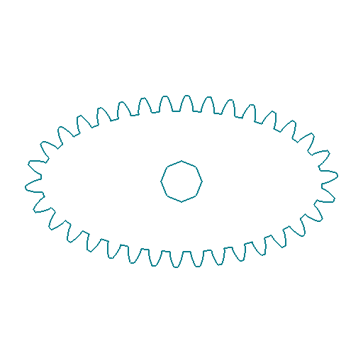
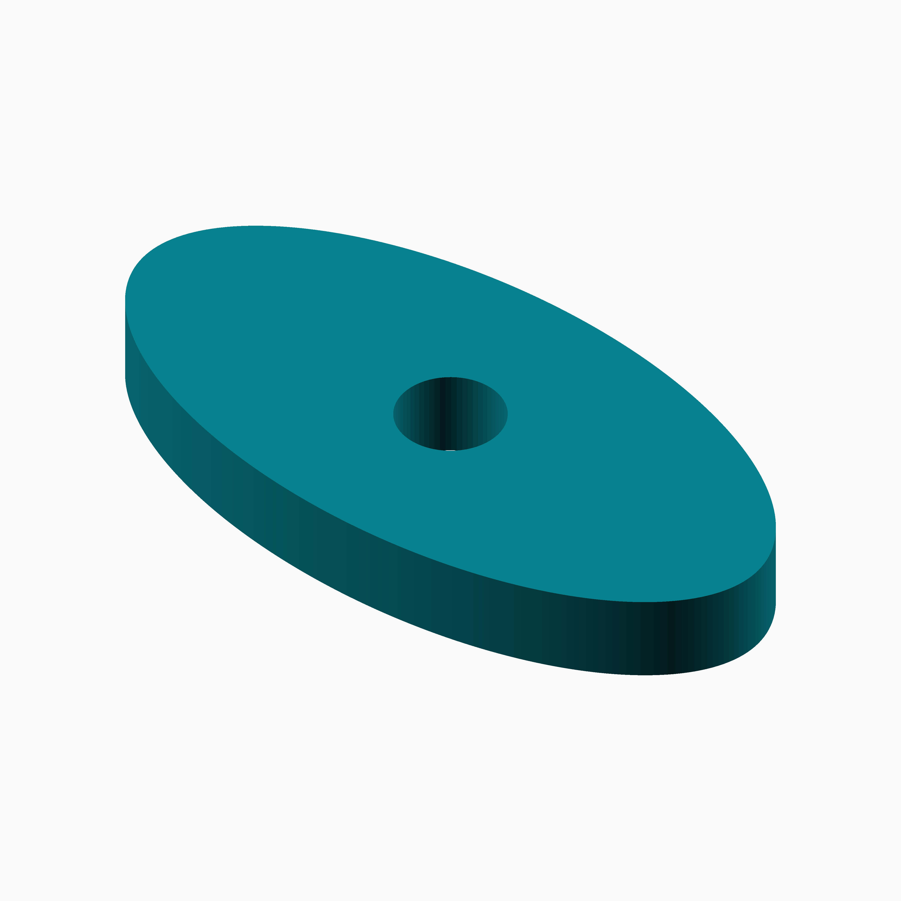
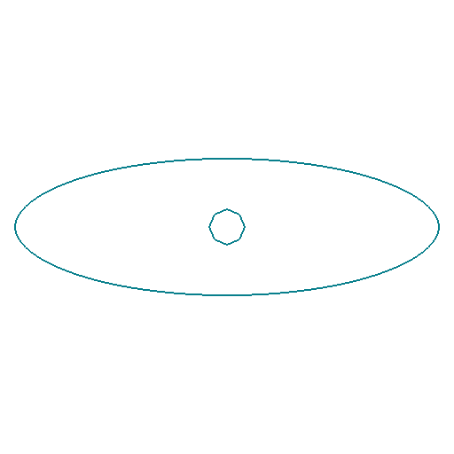
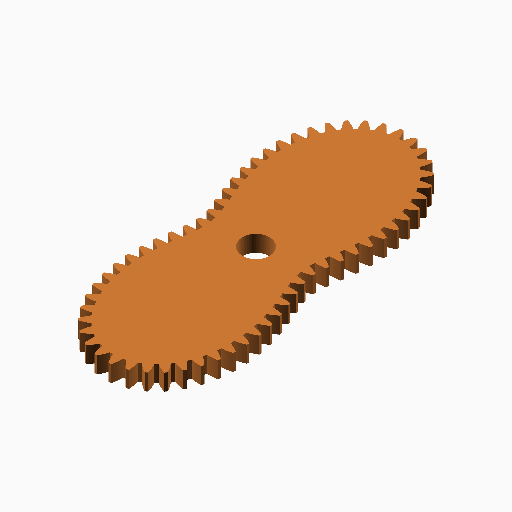

# Ellipse

## Documentation navigation

- [README](../README.md)
- Families
  - [Bézier](bezier.md) · [Cassini](cassini.md) · [Circle](circle.md) · [Cosine Quintic](cosine_quintic.md) · [Cusp](cusp.md) · [Ellipse](ellipse.md) · [Epitrochoid](epitrochoid.md)
  - [Fourier](fourier.md) · [Hypotrochoid](hypotrochoid.md) · [Lobed](lobed.md) · [Logarithmic spiral](logarithmic_spiral.md) · [Logistic Dwell](logistic_dwell.md) · [Pascal](pascal.md) · [Superformula](superformula.md) · [Tanh Triad](tanh_triad.md) · [Temple Fay](temple_fay.md)
- Shared
  - [Examples catalogue](../examples/README.md) · [Test layout](../tests/README.md)
  - [Tooth construction](tooth-construction.md) · [Tooth placement](tooth-placement.md) · [Mate motion](mate-motion.md) · [Mate generation](mate-generation.md) · [Pair assembly](pair-assembly.md)

## Module `Ellipse`

The centred pitch curve is `x=a cos(theta)`, `y=b sin(theta)`, or
`r=ab/sqrt(b^2 cos^2(theta)+a^2 sin^2(theta))` in polar form. Eccentricity
zero is circular; increasing eccentricity increases the varying transmission
ratio. The public gear, mate and pair APIs consume these primitives.
Reference: https://mathworld.wolfram.com/Ellipse.html.

### Brief content:

**Functions**:

> [`curve_gear_ellipse`](#function-curve_gear_ellipse): Build an elliptical non-circular gear.

> [`curve_gear_ellipse_2d`](#function-curve_gear_ellipse_2d): Emit the complete ellipse gear profile as 2D geometry.

> [`curve_gear_ellipse_body`](#function-curve_gear_ellipse_body): Build the elliptical body solid without teeth.

> [`curve_gear_ellipse_body_2d`](#function-curve_gear_ellipse_body_2d): Emit the ellipse body as 2D geometry with an optional signed outer-contour offset.

> [`curve_gear_ellipse_centre_distance`](#function-curve_gear_ellipse_centre_distance): Return the mathematical centre distance for an elliptical pair.

> [`curve_gear_ellipse_mate`](#function-curve_gear_ellipse_mate): Build the standalone elliptical mate boundary at the origin.

> [`curve_gear_ellipse_mate_rotation`](#function-curve_gear_ellipse_mate_rotation): Return the conjugate elliptical mate rotation for a driver phase.

> [`curve_gear_ellipse_pair`](#function-curve_gear_ellipse_pair): Build a meshed or separated elliptical pair.

> [`_cg_ellipse_axes`](#function-_cg_ellipse_axes): Calculate the ellipse semi-axes for a requested module and tooth count using the centred radius r=ab/sqrt(b² cos²θ+a² sin²θ) and a Ramanujan perimeter approximation.

> [`_cg_ellipse_build`](#function-_cg_ellipse_build): Internal ellipse construction dispatcher.

> [`_cg_ellipse_driver_point`](#function-_cg_ellipse_driver_point): Convert an ellipse radius and angle into a Cartesian pitch point.

> [`_cg_ellipse_pair_build`](#function-_cg_ellipse_pair_build): Internal ellipse pair construction dispatcher.

> [`_cg_ellipse_radius`](#function-_cg_ellipse_radius): Evaluate the ellipse radius at an angular position.

## Functions

The module `Ellipse` defines the following functions.

### Function `curve_gear_ellipse`

| Ellipse gear 1 | Ellipse gear 2 |
| --- | --- |
|  |  |

Public single-gear construction for the ellipse family.
Eccentricity 0.94 produces a long narrow ellipse rather than the canonical 0.72 oval. The sharper ends and narrow transverse span reveal where tooth placement becomes demanding.
The gear is centred on X=0,Y=0 with its lower face at Z=0.
[`curve_gear_ellipse_body`](#f-curve_gear_ellipse_body)

**Parameters:**

- `modul`: {number > 0} Tooth module in mm.
- `tooth_number`: {integer >= 3} Number of teeth.
- `width`: {number > 0} Extrusion width in mm.
- `bore`: {number >= 0} Centre bore diameter in mm.
- `eccentricity`: {0 <= e < 1, default 0.62} Ellipse eccentricity; zero is circular.
- `pressure_angle`: {0 < angle < 90, default 20} Involute pressure angle in degrees.
- `tooth_phase`: {angle, default 0} Tooth placement phase in degrees.
- `backlash`: {undef or >= 0} Tangential tooth-thickness reduction in mm.
- `clearance`: {undef or >= 0} Additional radial root clearance in mm.
- `samples`: {integer >= 120, default 480} Pitch-curve sampling density.
- `orientation`: {angle, default 0} Single-gear display rotation in degrees.

**Returns:**

No return

### Example:

~~~c
curve_gear_ellipse(1, 24, 4, 8);
~~~

Back to [module description](#module-ellipse).

### Function `curve_gear_ellipse_2d`

| Ellipse 2D gear 1 | Ellipse 2D gear 2 |
| --- | --- |
|  |  |

Emit the complete ellipse gear profile as 2D geometry.

**Parameters:**

- `modul`: {value} Tooth module in mm.
- `tooth_number`: {value} Number of teeth.
- `bore`: {value} Centre bore diameter in mm.
- `eccentricity`: {value} Same family-specific parameter as curve_gear_ellipse.
- `pressure_angle`: {value} Same family-specific parameter as curve_gear_ellipse.
- `tooth_phase`: {value} Same family-specific parameter as curve_gear_ellipse.
- `backlash`: {value} Same family-specific parameter as curve_gear_ellipse.
- `clearance`: {value} Same family-specific parameter as curve_gear_ellipse.
- `samples`: {value} Same family-specific parameter as curve_gear_ellipse.
- `orientation`: {value} Rotation in degrees.

**Returns:**

No return

### Example:

~~~c
curve_gear_ellipse_2d(0.8, 34, 4.8);
~~~

Back to [module description](#module-ellipse).

### Function `curve_gear_ellipse_body`

| Ellipse body 1 | Ellipse body 2 |
| --- | --- |
|  |  |

Build the elliptical body solid without teeth.

**Parameters:**

- `modul`: {number > 0} Tooth module in mm.
- `tooth_number`: {integer >= 3} Number of teeth.
- `width`: {number > 0} Extrusion width in mm.
- `bore`: {number >= 0} Centre bore diameter in mm.
- `eccentricity`: {0 <= e < 1, default 0.62} Ellipse eccentricity.
- `pressure_angle`: {0 < angle < 90, default 20} Involute pressure angle.
- `tooth_phase`: {angle, default 0} Tooth placement phase in degrees.
- `backlash`: {undef or >= 0} Tangential tooth-thickness reduction in mm.
- `clearance`: {undef or >= 0} Additional radial root clearance in mm.
- `samples`: {integer >= 120, default 480} Pitch-curve sampling density.
- `orientation`: {angle, default 0} Single-gear display rotation in degrees.

**Returns:**

No return

### Example:

~~~c
curve_gear_ellipse_body(1, 24, 4, 8);
~~~

Back to [module description](#module-ellipse).

### Function `curve_gear_ellipse_body_2d`

| Ellipse 2D body 1 | Ellipse 2D body 2 |
| --- | --- |
|  |  |

Emit the ellipse body as 2D geometry with an optional signed outer-contour offset.

**Parameters:**

- `modul`: {value} Tooth module in mm.
- `tooth_number`: {value} Number of teeth.
- `bore`: {value} Centre bore diameter in mm.
- `eccentricity`: {value} Same family-specific parameter as curve_gear_ellipse_body.
- `pressure_angle`: {value} Same family-specific parameter as curve_gear_ellipse_body.
- `tooth_phase`: {value} Same family-specific parameter as curve_gear_ellipse_body.
- `backlash`: {value} Same family-specific parameter as curve_gear_ellipse_body.
- `clearance`: {value} Same family-specific parameter as curve_gear_ellipse_body.
- `samples`: {value} Same family-specific parameter as curve_gear_ellipse_body.
- `orientation`: {value} Rotation in degrees.
- `body_offset`: {value} Signed offset in mm; negative values shrink the outer body contour while preserving the bore.

**Returns:**

No return

### Example:

~~~c
curve_gear_ellipse_body_2d(0.8, 34, 4.8, body_offset=-2);
~~~

Back to [module description](#module-ellipse).

### Function `curve_gear_ellipse_centre_distance`

Return the mathematical centre distance for an elliptical pair.

**Parameters:**

- `modul`: {number > 0} Tooth module in mm.
- `tooth_number`: {integer >= 3} Number of teeth.
- `eccentricity`: {0 <= e < 1, default 0.62} Ellipse eccentricity.
- `samples`: {integer >= 120, default 480} Motion-table sampling density.

**Returns:**

- `{number}`: Pair centre distance in mm.

Back to [module description](#module-ellipse).

### Function `curve_gear_ellipse_mate`

| Ellipse mate 1 | Ellipse mate 2 |
| --- | --- |
|  |  |

Build the standalone elliptical mate boundary at the origin.

**Parameters:**

- `modul`: {number > 0} Tooth module in mm.
- `tooth_number`: {integer >= 3} Number of teeth.
- `width`: {number > 0} Extrusion width in mm.
- `bore`: {number >= 0} Centre bore diameter in mm.
- `eccentricity`: {0 <= e < 1, default 0.62} Ellipse eccentricity.
- `pressure_angle`: {0 < angle < 90, default 20} Involute pressure angle.
- `tooth_phase`: {angle, default 0} Tooth placement phase in degrees.
- `backlash`: {undef or >= 0} Tangential tooth-thickness reduction in mm.
- `clearance`: {undef or >= 0} Additional radial root clearance in mm.
- `samples`: {integer >= 120, default 480} Pitch-curve sampling density.

**Returns:**

No return

Back to [module description](#module-ellipse).

### Function `curve_gear_ellipse_mate_rotation`

Return the conjugate elliptical mate rotation for a driver phase.

**Parameters:**

- `modul`: {number > 0} Tooth module in mm.
- `tooth_number`: {integer >= 3} Number of teeth.
- `eccentricity`: {0 <= e < 1, default 0.62} Ellipse eccentricity.
- `samples`: {integer >= 120, default 480} Motion-table sampling density.
- `phase`: {angle, default 0} Driver motion phase in degrees.

**Returns:**

- `{angle}`: Mate rotation in degrees.

Back to [module description](#module-ellipse).

### Function `curve_gear_ellipse_pair`

| Ellipse pair 1 | Ellipse pair 2 |
| --- | --- |
|  |  |

Pair geometry uses the single-gear parameters documented in gear.scad.
[`curve_gear_ellipse`](#f-curve_gear_ellipse)

**Parameters:**

- `modul`: {number > 0, default .8} Tooth module in mm.
- `tooth_number`: {integer >= 3, default 34} Number of teeth.
- `width`: {number > 0, default 4} Extrusion width in mm.
- `bore`: {number >= 0, default 4.8} Centre bore diameter in mm.
- `eccentricity`: {0 <= e < 1, default 0.62} Ellipse eccentricity.
- `pressure_angle`: {0 < angle < 90, default 20} Involute pressure angle.
- `samples`: {integer >= 120, default 480} Pitch-curve sampling density.
- `phase`: {angle, default 0} Driver motion phase in degrees.
- `tooth_phase`: {angle, default 0} Tooth placement phase in degrees.
- `backlash`: {undef or >= 0, default undef} Tangential tooth-thickness reduction in mm.
- `clearance`: {undef or >= 0, default undef} Additional radial root clearance in mm.
- `together_built`: {boolean, default true} Place the pair meshed when true, separated when false.
- `driver_color`: {OpenSCAD colour, default SteelBlue} Driver display colour.
- `mate_color`: {OpenSCAD colour, default Gold} Mate display colour.

**Returns:**

No return

### Example:

~~~c
curve_gear_ellipse_pair(1, 24, 4, 8);
~~~

Back to [module description](#module-ellipse).

### Function `_cg_ellipse_axes`

Calculate the ellipse semi-axes for a requested module and tooth count using the centred radius r=ab/sqrt(b² cos²θ+a² sin²θ) and a Ramanujan perimeter approximation.

**Parameters:**

- `modul`: {number > 0} Tooth module in mm.
- `tooth_number`: {integer >= 3} Number of teeth.
- `eccentricity`: {0 <= e < 1} Ellipse eccentricity.

**Returns:**

- `{array}`: Semi-major and semi-minor axes as `[a, b]` in mm.

Back to [module description](#module-ellipse).

### Function `_cg_ellipse_build`

Internal ellipse construction dispatcher.

**Parameters:**

- `modul`: {number} Tooth module in mm.
- `tooth_number`: {integer} Number of teeth.
- `width`: {number} Extrusion width in mm.
- `bore`: {number} Centre bore diameter in mm.
- `eccentricity`: {number, default 0.62} Internal construction parameter.
- `pressure_angle`: {number, default 20} Involute pressure angle in degrees.
- `tooth_phase`: {number, default 0} Tooth placement phase in degrees.
- `backlash`: {number, default undef} Tangential tooth-thickness reduction in mm.
- `clearance`: {number, default undef} Additional radial root clearance in mm.
- `samples`: {integer, default 480} Pitch-curve or motion-table sampling density.
- `orientation`: {number, default 0} Single-gear display rotation in degrees.
- `body_only`: {boolean, default false} Emit the body without teeth.

**Returns:**

- `{geometry}`: Constructed family geometry.

Back to [module description](#module-ellipse).

### Function `_cg_ellipse_driver_point`

Convert an ellipse radius and angle into a Cartesian pitch point.

**Parameters:**

- `a`: {number > 0} Ellipse semi-major axis in mm.
- `b`: {number > 0} Ellipse semi-minor axis in mm.
- `theta`: {angle} Polar angle in degrees.

**Returns:**

- `{array}`: Cartesian point `[x, y]` in mm.

Back to [module description](#module-ellipse).

### Function `_cg_ellipse_pair_build`

Internal ellipse pair construction dispatcher.

**Parameters:**

- `modul`: {number} Tooth module in mm.
- `tooth_number`: {integer} Number of teeth.
- `width`: {number} Extrusion width in mm.
- `bore`: {number} Centre bore diameter in mm.
- `eccentricity`: {number, default 0.62} Internal construction parameter.
- `pressure_angle`: {number, default 20} Involute pressure angle in degrees.
- `samples`: {integer, default 480} Pitch-curve or motion-table sampling density.
- `phase`: {number, default 0} Driver motion phase in degrees.
- `together_built`: {boolean, default true} Use meshed placement when true, display placement otherwise.
- `backlash`: {number, default undef} Tangential tooth-thickness reduction in mm.
- `clearance`: {number, default undef} Additional radial root clearance in mm.
- `tooth_phase`: {number, default 0} Tooth placement phase in degrees.
- `driver_color`: {string, default "SteelBlue"} Driver display colour.
- `mate_color`: {string, default "Gold"} Mate display colour.

**Returns:**

- `{geometry}`: Constructed family geometry.

Back to [module description](#module-ellipse).

### Function `_cg_ellipse_radius`

Evaluate the ellipse radius at an angular position.

**Parameters:**

- `a`: {number > 0} Ellipse semi-major axis in mm.
- `b`: {number > 0} Ellipse semi-minor axis in mm.
- `theta`: {angle} Polar angle in degrees.

**Returns:**

- `{number}`: Radius in mm.

Back to [module description](#module-ellipse).

Back to [top](#).

---

[Back to the CurveGears README](../README.md)

*Generated by Doxydown from repository source comments; do not edit this page directly.*
