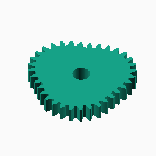
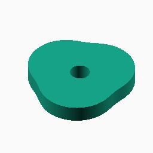
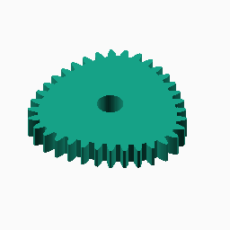
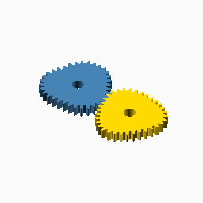

# Epitrochoid

## Documentation navigation

- [README](../README.md)
- Families
  - [Bézier](bezier.md) · [Cassini](cassini.md) · [Circle](circle.md) · [Ellipse](ellipse.md) · [Epitrochoid](epitrochoid.md) · [Fourier](fourier.md)
  - [Hypotrochoid](hypotrochoid.md) · [Lobed](lobed.md) · [Logarithmic spiral](logarithmic_spiral.md) · [Pascal](pascal.md) · [Superformula](superformula.md)
- Shared
  - [Examples catalogue](../examples/README.md) · [Test layout](../tests/README.md)
  - [Tooth construction](tooth-construction.md) · [Tooth placement](tooth-placement.md) · [Mate motion](mate-motion.md) · [Mate generation](mate-generation.md) · [Pair assembly](pair-assembly.md)

## Module `Epitrochoid`

The curve is generated by a point on a rolling circle:
`x=(R+r)cos(theta)-d cos((R+r)theta/r)` and
`y=(R+r)sin(theta)-d sin((R+r)theta/r)`. The documented ratio constraints
reject cusp and loop cases; high curvature may require more samples.
Reference: https://encyclopediaofmath.org/wiki/Epitrochoid.

### Brief content:

**Functions**:

> [`_cg_epitrochoid_point(R, r, d, theta)`](#function-_cg_epitrochoid_pointr-r-d-theta): Evaluate one point on the unit rolling-circle epitrochoid.

> [`_cg_epitrochoid_points(R, r, d, n)`](#function-_cg_epitrochoid_pointsr-r-d-n): Sample one complete unit epitrochoid curve.

> [`_cg_epitrochoid_scale(modul, tooth_number, R, r, d, n)`](#function-_cg_epitrochoid_scalemodul-tooth_number-r-r-d-n): Scale an epitrochoid to the requested tooth pitch.

> [`_cg_epitrochoid_radius(R, r, d, theta)`](#function-_cg_epitrochoid_radiusr-r-d-theta): Evaluate the radial distance of the unit epitrochoid.

> [`_cg_epitrochoid_curve_radius(scale, R, r, d, theta)`](#function-_cg_epitrochoid_curve_radiusscale-r-r-d-theta): Evaluate a scaled epitrochoid radius.

> [`_cg_epitrochoid_points_scaled(scale, R, r, d, n)`](#function-_cg_epitrochoid_points_scaledscale-r-r-d-n): Sample a scaled epitrochoid curve.

> [`curve_gear_epitrochoid(modul, tooth_number, width, bore, ...)`](#function-curve_gear_epitrochoidmodul-tooth_number-width-bore-): Build an epitrochoid non-circular gear.

> [`_cg_epitrochoid_build(modul,tooth_number,width,bore,major_ratio=3,rolling_ratio=1,offset_ratio=.35,pressure_angle=20,tooth_phase=0,backlash=undef,clearance=undef,samples=720,orientation=0,body_only=false)`](#function-_cg_epitrochoid_buildmodultooth_numberwidthboremajor_ratio3rolling_ratio1offset_ratio35pressure_angle20tooth_phase0backlashundefclearanceundefsamples720orientation0body_onlyfalse): Internal epitrochoid construction dispatcher.

> [`curve_gear_epitrochoid_body(modul, tooth_number, width, bore, ...)`](#function-curve_gear_epitrochoid_bodymodul-tooth_number-width-bore-): Build the epitrochoid body solid without teeth.

> [`_cg_epitrochoid_motion_radii`](#function-_cg_epitrochoid_motion_radii): Evaluate epitrochoid radii at integration midpoints.

> [`_cg_epitrochoid_driver_radii`](#function-_cg_epitrochoid_driver_radii): Evaluate epitrochoid radii at direct mate-construction angles.

> [`_cg_epitrochoid_centre_distance`](#function-_cg_epitrochoid_centre_distance): Solve the epitrochoid conjugate centre distance.

> [`_cg_epitrochoid_motion_table`](#function-_cg_epitrochoid_motion_table): Build the shared epitrochoid phase-motion table.

> [`_cg_epitrochoid_mate_points_from_driver`](#function-_cg_epitrochoid_mate_points_from_driver): Build epitrochoid mate pitch points by advancing driver angle directly.

> [`_cg_epitrochoid_mate_points`](#function-_cg_epitrochoid_mate_points): Build epitrochoid mate pitch points and their shared motion table.

> [`curve_gear_epitrochoid_mate(modul, tooth_number, width, bore, ...)`](#function-curve_gear_epitrochoid_matemodul-tooth_number-width-bore-): Build the standalone epitrochoid mate boundary at the origin.

> [`curve_gear_epitrochoid_centre_distance(modul, tooth_number, major_ratio, rolling_ratio, offset_ratio, ...)`](#function-curve_gear_epitrochoid_centre_distancemodul-tooth_number-major_ratio-rolling_ratio-offset_ratio-): Return the mathematical centre distance for an epitrochoid pair.

> [`curve_gear_epitrochoid_mate_rotation(modul, tooth_number, major_ratio, rolling_ratio, offset_ratio, ...)`](#function-curve_gear_epitrochoid_mate_rotationmodul-tooth_number-major_ratio-rolling_ratio-offset_ratio-): Return the conjugate epitrochoid mate rotation for a driver phase.

> [`curve_gear_epitrochoid_pair(modul, tooth_number, width, bore, ...)`](#function-curve_gear_epitrochoid_pairmodul-tooth_number-width-bore-): Build a meshed or separated epitrochoid pair.

## Functions

The module `Epitrochoid` defines the following functions.

### Function `_cg_epitrochoid_point(R, r, d, theta)`

Evaluate one point on the unit rolling-circle epitrochoid.

**Parameters:**

- `R`: {number > 0} Fixed-circle ratio.
- `r`: {number > 0} Rolling-circle ratio.
- `d`: {number >= 0} Pen offset ratio.
- `theta`: {angle} Curve parameter in degrees.

**Returns:**

- `{array}`: Cartesian point `[x, y]` in unit-curve coordinates.

Back to [module description](#module-epitrochoid).

### Function `_cg_epitrochoid_points(R, r, d, n)`

Sample one complete unit epitrochoid curve.

**Parameters:**

- `R`: {number > 0} Fixed-circle ratio.
- `r`: {number > 0} Rolling-circle ratio.
- `d`: {number >= 0} Pen offset ratio.
- `n`: {integer >= 1, default 720} Number of samples.

**Returns:**

- `{array}`: Closed list of sampled Cartesian points.

Back to [module description](#module-epitrochoid).

### Function `_cg_epitrochoid_scale(modul, tooth_number, R, r, d, n)`

Scale an epitrochoid to the requested tooth pitch.

**Parameters:**

- `modul`: {number > 0} Tooth module in mm.
- `tooth_number`: {integer >= 3} Number of teeth.
- `R`: {number > 0, default 3} Fixed-circle ratio.
- `r`: {number > 0, default 1} Rolling-circle ratio.
- `d`: {number >= 0, default 2} Pen offset ratio in the unit model.
- `n`: {integer >= 1, default 720} Number of samples used for arc length.

**Returns:**

- `{number}`: Curve scale in mm.

Back to [module description](#module-epitrochoid).

### Function `_cg_epitrochoid_radius(R, r, d, theta)`

Evaluate the radial distance of the unit epitrochoid.

**Parameters:**

- `R`: {number > 0} Fixed-circle ratio.
- `r`: {number > 0} Rolling-circle ratio.
- `d`: {number >= 0} Pen offset ratio.
- `theta`: {angle} Curve parameter in degrees.

**Returns:**

- `{number}`: Unit-curve radius.

Back to [module description](#module-epitrochoid).

### Function `_cg_epitrochoid_curve_radius(scale, R, r, d, theta)`

Evaluate a scaled epitrochoid radius.

**Parameters:**

- `scale`: {number > 0} Curve scale in mm.
- `R`: {number > 0} Fixed-circle ratio.
- `r`: {number > 0} Rolling-circle ratio.
- `d`: {number >= 0} Pen offset ratio.
- `theta`: {angle} Curve parameter in degrees.

**Returns:**

- `{number}`: Radius in mm.

Back to [module description](#module-epitrochoid).

### Function `_cg_epitrochoid_points_scaled(scale, R, r, d, n)`

Sample a scaled epitrochoid curve.

**Parameters:**

- `scale`: {number > 0} Curve scale in mm.
- `R`: {number > 0} Fixed-circle ratio.
- `r`: {number > 0} Rolling-circle ratio.
- `d`: {number >= 0} Pen offset ratio.
- `n`: {integer >= 1, default 720} Number of samples.

**Returns:**

- `{array}`: Closed list of sampled Cartesian points in mm.

Back to [module description](#module-epitrochoid).

### Function `curve_gear_epitrochoid(modul, tooth_number, width, bore, ...)`

Public single-gear construction for the epitrochoid family.
The gear is centred on X=0,Y=0 with its lower face at Z=0.
[`curve_gear_epitrochoid_body`](#f-curve_gear_epitrochoid_body)

**Parameters:**

- `modul`: {number > 0} Tooth module in mm.
- `tooth_number`: {integer >= 3} Number of teeth.
- `width`: {number > 0} Extrusion width in mm.
- `bore`: {number >= 0} Centre bore diameter in mm.
- `major_ratio`: {number > rolling_ratio, default 3} Fixed-to-rolling circle ratio.
- `rolling_ratio`: {number > 0, default 1} Rolling-circle ratio.
- `offset_ratio`: {0 < offset < rolling_ratio, default 0.35} Pen offset ratio; cusp and loop cases are rejected.
- `pressure_angle`: {0 < angle < 90, default 20} Involute pressure angle in degrees.
- `tooth_phase`: {angle, default 0} Tooth placement phase in degrees.
- `backlash`: {undef or >= 0} Tangential tooth-thickness reduction in mm.
- `clearance`: {undef or >= 0} Additional radial root clearance in mm.
- `samples`: {integer >= 120, default 720} Curve sampling density.
- `orientation`: {angle, default 0} Single-gear display rotation in degrees.

**Returns:**

No return

### Example:

~~~c
curve_gear_epitrochoid(1, 24, 4, 8);
~~~

Back to [module description](#module-epitrochoid).

### Function `_cg_epitrochoid_build(modul,tooth_number,width,bore,major_ratio=3,rolling_ratio=1,offset_ratio=.35,pressure_angle=20,tooth_phase=0,backlash=undef,clearance=undef,samples=720,orientation=0,body_only=false)`

Internal epitrochoid construction dispatcher.

**Parameters:**

- `modul`: {number} Tooth module in mm.
- `tooth_number`: {integer} Number of teeth.
- `width`: {number} Extrusion width in mm.
- `bore`: {number} Centre bore diameter in mm.
- `major_ratio`: {number, default 3} Internal construction parameter.
- `rolling_ratio`: {number, default 1} Internal construction parameter.
- `offset_ratio`: {number, default .35} Internal construction parameter.
- `pressure_angle`: {number, default 20} Involute pressure angle in degrees.
- `tooth_phase`: {number, default 0} Tooth placement phase in degrees.
- `backlash`: {number, default undef} Tangential tooth-thickness reduction in mm.
- `clearance`: {number, default undef} Additional radial root clearance in mm.
- `samples`: {integer, default 720} Pitch-curve or motion-table sampling density.
- `orientation`: {number, default 0} Single-gear display rotation in degrees.
- `body_only`: {boolean, default false} Emit the body without teeth.

**Returns:**

- `{geometry}`: Constructed family geometry.

Back to [module description](#module-epitrochoid).

### Function `curve_gear_epitrochoid_body(modul, tooth_number, width, bore, ...)`

Build the epitrochoid body solid without teeth.

**Parameters:**

- `modul`: {number > 0} Tooth module in mm.
- `tooth_number`: {integer >= 3} Number of teeth.
- `width`: {number > 0} Extrusion width in mm.
- `bore`: {number >= 0} Centre bore diameter in mm.
- `major_ratio`: {number > rolling_ratio, default 3} Fixed-to-rolling circle ratio.
- `rolling_ratio`: {number > 0, default 1} Rolling-circle ratio.
- `offset_ratio`: {0 < offset < rolling_ratio, default 0.35} Pen offset ratio.
- `pressure_angle`: {0 < angle < 90, default 20} Involute pressure angle.
- `tooth_phase`: {angle, default 0} Tooth placement phase in degrees.
- `backlash`: {undef or >= 0} Tangential tooth-thickness reduction in mm.
- `clearance`: {undef or >= 0} Additional radial root clearance in mm.
- `samples`: {integer >= 120, default 720} Curve sampling density.
- `orientation`: {angle, default 0} Single-gear display rotation in degrees.

**Returns:**

No return

### Example:

~~~c
curve_gear_epitrochoid_body(1, 24, 4, 8);
~~~

Back to [module description](#module-epitrochoid).

### Function `_cg_epitrochoid_motion_radii`

Evaluate epitrochoid radii at integration midpoints.

**Parameters:**

- `scale`: {number > 0} Overall curve scale.
- `R`: {number > 0} Fixed-circle radius ratio.
- `r`: {number > 0} Rolling-circle radius ratio.
- `d`: {number > 0} Pen offset ratio.
- `n`: {integer >= 1, default 240} Number of midpoint samples.

**Returns:**

- `{array of number}`: Sampled radii in angular order.

Back to [module description](#module-epitrochoid).

### Function `_cg_epitrochoid_driver_radii`

Evaluate epitrochoid radii at direct mate-construction angles.

**Parameters:**

No parameters

**Returns:**

No return

Back to [module description](#module-epitrochoid).

### Function `_cg_epitrochoid_centre_distance`

Solve the epitrochoid conjugate centre distance.

**Parameters:**

- `scale`: {number > 0} Overall curve scale.
- `R`: {number > 0} Fixed-circle radius ratio.
- `r`: {number > 0} Rolling-circle radius ratio.
- `d`: {number > 0} Pen offset ratio.

**Returns:**

- `{number}`: Conjugate centre distance.

Back to [module description](#module-epitrochoid).

### Function `_cg_epitrochoid_motion_table`

Build the shared epitrochoid phase-motion table.

**Parameters:**

- `scale`: {number > 0} Overall curve scale.
- `R`: {number > 0} Fixed-circle radius ratio.
- `r`: {number > 0} Rolling-circle radius ratio.
- `d`: {number > 0} Pen offset ratio.
- `D`: {number > 0} Driver-to-mate centre distance.
- `n`: {integer >= 1, default 360} Number of midpoint samples.

**Returns:**

- `{array}`: Monotonic driver-to-mate phase-motion table.

Back to [module description](#module-epitrochoid).

### Function `_cg_epitrochoid_mate_points_from_driver`

Build epitrochoid mate pitch points by advancing driver angle directly.

**Parameters:**

- `scale`: {number > 0} Overall curve scale.
- `R`: {number > 0} Fixed-circle radius ratio.
- `r`: {number > 0} Rolling-circle radius ratio.
- `d`: {number > 0} Pen offset ratio.
- `D`: {number > 0} Driver-to-mate centre distance.
- `motion`: {array} Shared driver-to-mate phase-motion table.
- `n`: {integer >= 1, default 360} Number of output points.

**Returns:**

- `{array of points}`: Cartesian mate pitch points.

Back to [module description](#module-epitrochoid).

### Function `_cg_epitrochoid_mate_points`

Build epitrochoid mate pitch points and their shared motion table.

**Parameters:**

- `scale`: {number > 0} Overall curve scale.
- `R`: {number > 0} Fixed-circle radius ratio.
- `r`: {number > 0} Rolling-circle radius ratio.
- `d`: {number > 0} Pen offset ratio.
- `D`: {number > 0} Driver-to-mate centre distance.
- `n`: {integer >= 1, default 360} Number of output points.

**Returns:**

- `{array of points}`: Cartesian mate pitch points.

Back to [module description](#module-epitrochoid).

### Function `curve_gear_epitrochoid_mate(modul, tooth_number, width, bore, ...)`

Build the standalone epitrochoid mate boundary at the origin.

**Parameters:**

- `modul`: {number > 0} Tooth module in mm.
- `tooth_number`: {integer >= 3} Number of teeth.
- `width`: {number > 0} Extrusion width in mm.
- `bore`: {number >= 0} Centre bore diameter in mm.
- `major_ratio`: {number > rolling_ratio, default 3} Fixed-to-rolling circle ratio.
- `rolling_ratio`: {number > 0, default 1} Rolling-circle ratio.
- `offset_ratio`: {0 < offset < rolling_ratio, default 0.35} Pen offset ratio.
- `pressure_angle`: {0 < angle < 90, default 20} Involute pressure angle.
- `tooth_phase`: {angle, default 0} Tooth placement phase in degrees.
- `backlash`: {undef or >= 0} Tangential tooth-thickness reduction in mm.
- `clearance`: {undef or >= 0} Additional radial root clearance in mm.
- `samples`: {integer >= 120, default 720} Pitch-curve sampling density.

**Returns:**

No return

Back to [module description](#module-epitrochoid).

### Function `curve_gear_epitrochoid_centre_distance(modul, tooth_number, major_ratio, rolling_ratio, offset_ratio, ...)`

Return the mathematical centre distance for an epitrochoid pair.

**Parameters:**

- `modul`: {number > 0} Tooth module in mm.
- `tooth_number`: {integer >= 3} Number of teeth.
- `major_ratio`: {number > rolling_ratio, default 3} Fixed-to-rolling circle ratio.
- `rolling_ratio`: {number > 0, default 1} Rolling-circle ratio.
- `offset_ratio`: {0 < offset < rolling_ratio, default 0.35} Pen offset ratio.
- `samples`: {integer >= 120, default 720} Pitch-curve sampling density.

**Returns:**

- `{number}`: Pair centre distance in mm.

Back to [module description](#module-epitrochoid).

### Function `curve_gear_epitrochoid_mate_rotation(modul, tooth_number, major_ratio, rolling_ratio, offset_ratio, ...)`

Return the conjugate epitrochoid mate rotation for a driver phase.

**Parameters:**

- `modul`: {number > 0} Tooth module in mm.
- `tooth_number`: {integer >= 3} Number of teeth.
- `major_ratio`: {number > rolling_ratio, default 3} Fixed-to-rolling circle ratio.
- `rolling_ratio`: {number > 0, default 1} Rolling-circle ratio.
- `offset_ratio`: {0 < offset < rolling_ratio, default 0.35} Pen offset ratio.
- `samples`: {integer >= 120, default 720} Motion-table sampling density.
- `phase`: {angle, default 0} Driver motion phase in degrees.

**Returns:**

- `{angle}`: Mate rotation in degrees.

Back to [module description](#module-epitrochoid).

### Function `curve_gear_epitrochoid_pair(modul, tooth_number, width, bore, ...)`

Pair geometry uses the single-gear parameters documented in gear.scad.
[`curve_gear_epitrochoid`](#f-curve_gear_epitrochoid)

**Parameters:**

- `modul`: {number > 0} Tooth module in mm.
- `tooth_number`: {integer >= 3} Number of teeth.
- `width`: {number > 0} Extrusion width in mm.
- `bore`: {number >= 0} Centre bore diameter in mm.
- `major_ratio`: {number > rolling_ratio, default 3} Fixed-to-rolling circle ratio.
- `rolling_ratio`: {number > 0, default 1} Rolling-circle ratio.
- `offset_ratio`: {0 < offset < rolling_ratio, default 0.35} Pen offset ratio.
- `pressure_angle`: {0 < angle < 90, default 20} Involute pressure angle.
- `samples`: {integer >= 120, default 720} Pitch-curve sampling density.
- `phase`: {angle, default 0} Pair motion phase in degrees.
- `tooth_phase`: {angle, default 0} Tooth placement phase in degrees.
- `backlash`: {undef or >= 0} Tangential tooth-thickness reduction in mm.
- `clearance`: {undef or >= 0} Additional radial root clearance in mm.
- `together_built`: {boolean, default true} Place the pair meshed when true, separated when false.
- `driver_color`: {OpenSCAD colour, default SteelBlue} Driver display colour.
- `mate_color`: {OpenSCAD colour, default Gold} Mate display colour.

**Returns:**

No return

### Example:

~~~c
curve_gear_epitrochoid_pair(1, 24, 4, 8);
~~~

Back to [module description](#module-epitrochoid).

Back to [top](#).

---

[Back to the CurveGears README](../README.md)

*Generated by Doxydown from repository source comments; do not edit this page directly.*
