# Epitrochoid

## Documentation navigation

- [README](../README.md)
- Families
  - [Bézier](bezier.md) · [Cassini](cassini.md) · [Circle](circle.md) · [Cosine Quintic](cosine_quintic.md) · [Cusp](cusp.md) · [Ellipse](ellipse.md) · [Epitrochoid](epitrochoid.md)
  - [Fourier](fourier.md) · [Hypotrochoid](hypotrochoid.md) · [Lobed](lobed.md) · [Logarithmic spiral](logarithmic_spiral.md) · [Logistic Dwell](logistic_dwell.md) · [Pascal](pascal.md) · [Superformula](superformula.md) · [Tanh Triad](tanh_triad.md) · [Temple Fay](temple_fay.md)
- Shared
  - [Examples catalogue](../examples/README.md) · [Test layout](../tests/README.md)
  - [Tooth construction](tooth-construction.md) · [Tooth placement](tooth-placement.md) · [Mate motion](mate-motion.md) · [Mate generation](mate-generation.md) · [Pair assembly](pair-assembly.md)

## Module `Epitrochoid`

The curve is generated by a point on a rolling circle:
`x=(R+r)cos(theta)-d cos((R+r)theta/r)` and
`y=(R+r)sin(theta)-d sin((R+r)theta/r)`. The documented ratio constraints
reject cusp and loop cases; high curvature may require more samples.
Family-specific helper names preserve internal contracts consumed by mate
generation.
Reference: https://encyclopediaofmath.org/wiki/Epitrochoid.

### Brief content:

**Functions**:

> [`curve_gear_epitrochoid`](#function-curve_gear_epitrochoid): Build an epitrochoid non-circular gear.

> [`curve_gear_epitrochoid_2d`](#function-curve_gear_epitrochoid_2d): Emit the complete epitrochoid gear profile as 2D geometry.

> [`curve_gear_epitrochoid_body`](#function-curve_gear_epitrochoid_body): Build the epitrochoid body solid without teeth.

> [`curve_gear_epitrochoid_body_2d`](#function-curve_gear_epitrochoid_body_2d): Emit the epitrochoid body as 2D geometry with an optional signed outer-contour offset.

> [`curve_gear_epitrochoid_centre_distance`](#function-curve_gear_epitrochoid_centre_distance): Return the mathematical centre distance for an epitrochoid pair.

> [`curve_gear_epitrochoid_mate`](#function-curve_gear_epitrochoid_mate): Build the standalone epitrochoid mate boundary at the origin.

> [`curve_gear_epitrochoid_mate_rotation`](#function-curve_gear_epitrochoid_mate_rotation): Return the conjugate epitrochoid mate rotation for a driver phase.

> [`curve_gear_epitrochoid_pair`](#function-curve_gear_epitrochoid_pair): Build a meshed or separated epitrochoid pair.

> [`_cg_epitrochoid_build`](#function-_cg_epitrochoid_build): Internal epitrochoid construction dispatcher.

> [`_cg_epitrochoid_centre_distance`](#function-_cg_epitrochoid_centre_distance): Solve the epitrochoid conjugate centre distance.

> [`_cg_epitrochoid_curve_radius`](#function-_cg_epitrochoid_curve_radius): Evaluate a scaled epitrochoid radius.

> [`_cg_epitrochoid_driver_radii`](#function-_cg_epitrochoid_driver_radii): Sample the driver polygon at physical polar phase boundaries.

> [`_cg_epitrochoid_mate_points`](#function-_cg_epitrochoid_mate_points): Build epitrochoid mate pitch points and their shared motion table.

> [`_cg_epitrochoid_mate_points_from_driver`](#function-_cg_epitrochoid_mate_points_from_driver): Build epitrochoid mate pitch points by advancing driver angle directly.

> [`_cg_epitrochoid_motion_radii`](#function-_cg_epitrochoid_motion_radii): Sample the driver polygon at physical polar integration midpoints.

> [`_cg_epitrochoid_motion_table`](#function-_cg_epitrochoid_motion_table): Build the shared epitrochoid phase-motion table.

> [`_cg_epitrochoid_point`](#function-_cg_epitrochoid_point): Evaluate one point on the unit rolling-circle epitrochoid.

> [`_cg_epitrochoid_points`](#function-_cg_epitrochoid_points): Sample one complete unit epitrochoid curve.

> [`_cg_epitrochoid_points_scaled`](#function-_cg_epitrochoid_points_scaled): Sample a scaled epitrochoid curve.

> [`_cg_epitrochoid_radius`](#function-_cg_epitrochoid_radius): Evaluate the radial distance of the unit epitrochoid.

> [`_cg_epitrochoid_scale`](#function-_cg_epitrochoid_scale): Scale an epitrochoid to the requested tooth pitch.

## Functions

The module `Epitrochoid` defines the following functions.

### Function `curve_gear_epitrochoid`

| Epitrochoid gear 1 | Epitrochoid gear 2 |
| --- | --- |
| [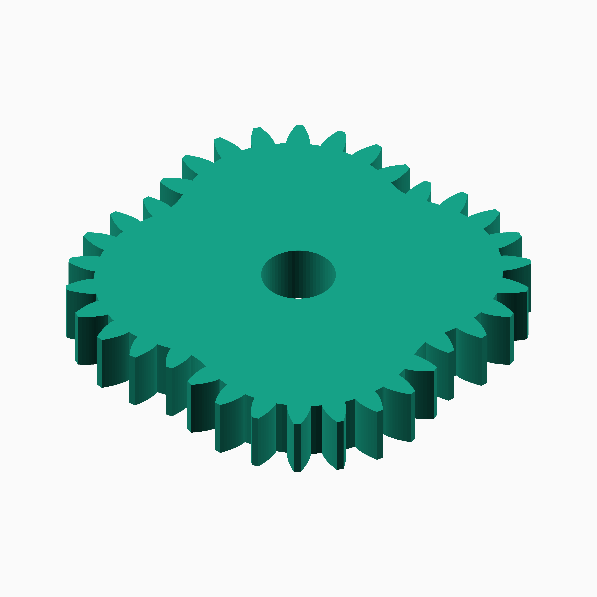](../images/functions/epitrochoid/curve_gear_epitrochoid.png) | [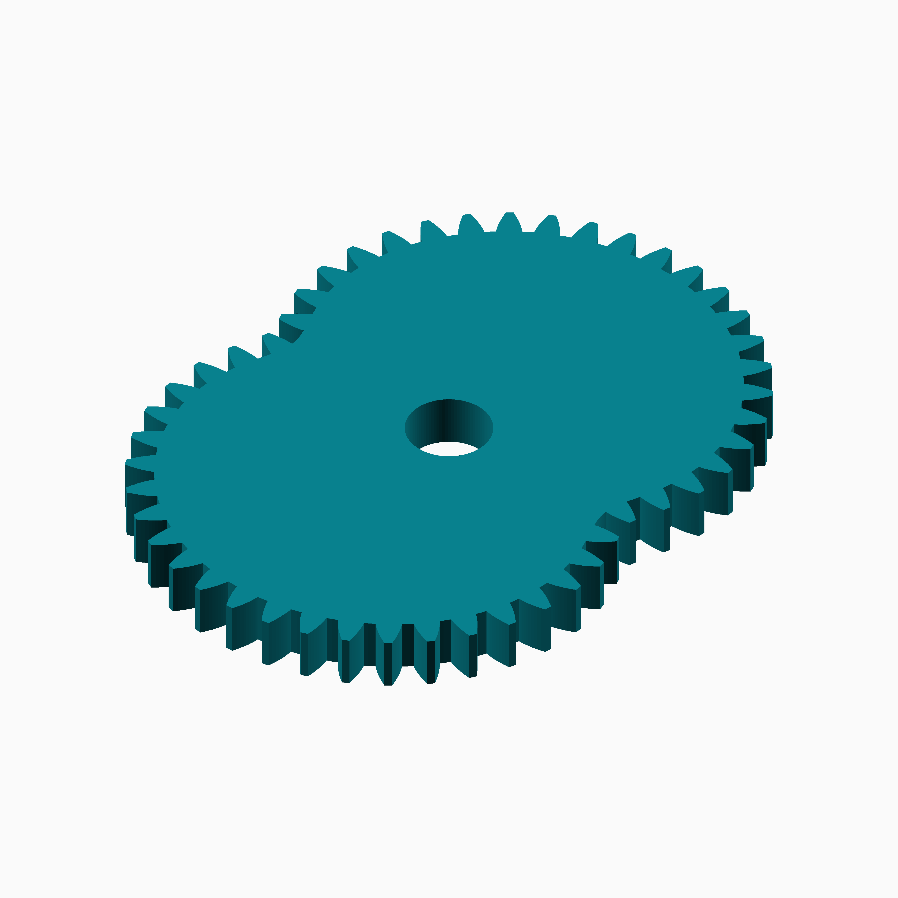](../images/functions/epitrochoid/curve_gear_epitrochoid_alternative.png) |

Public single-gear construction for the epitrochoid family.
A rolling ratio of 2:1 produces broad two-fold shaping instead of the canonical four-fold scallops. Offset 0.65 strengthens the excursions of the generating point.
The gear is centred on X=0,Y=0 with its lower face at Z=0.
[`curve_gear_epitrochoid_body`](#f-curve_gear_epitrochoid_body)

**Parameters:**

- `modul`: {number > 0} Tooth module in mm.
- `tooth_number`: {integer >= 3} Number of teeth.
- `width`: {number > 0} Extrusion width in mm.
- `bore`: {number >= 0} Centre bore diameter in mm.
- `major_ratio`: {number > rolling_ratio, default 3} Fixed-to-rolling circle ratio.
- `rolling_ratio`: {number > 0, default 1} Rolling-circle ratio.
- `offset_ratio`: {0 < offset < rolling_ratio, default 0.35} Pen offset ratio; cusp and loop cases are rejected.
- `pressure_angle`: {0 < angle < 90, default 20} Involute pressure angle in degrees.
- `tooth_phase`: {angle, default 0} Tooth placement phase in degrees.
- `backlash`: {undef or >= 0} Tangential tooth-thickness reduction in mm.
- `clearance`: {undef or >= 0} Additional radial root clearance in mm.
- `samples`: {integer >= 120, default 720} Curve sampling density.
- `orientation`: {angle, default 0} Single-gear display rotation in degrees.

**Returns:**

No return

### Example:

~~~c
curve_gear_epitrochoid(1, 24, 4, 8);
~~~

Back to [module description](#module-epitrochoid).

### Function `curve_gear_epitrochoid_2d`

| Epitrochoid 2D gear 1 | Epitrochoid 2D gear 2 |
| --- | --- |
| [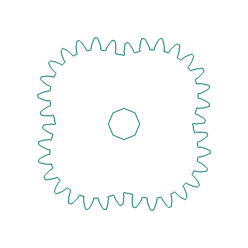](../images/functions/epitrochoid/curve_gear_epitrochoid_2d.png) | [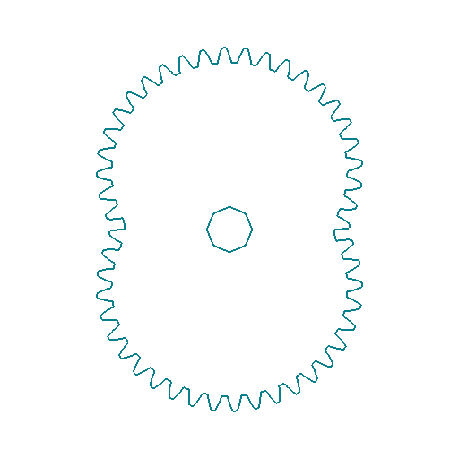](../images/functions/epitrochoid/curve_gear_epitrochoid_alternative_2d.png) |

Emit the complete epitrochoid gear profile as 2D geometry.

**Parameters:**

- `modul`: {value} Tooth module in mm.
- `tooth_number`: {value} Number of teeth.
- `bore`: {value} Centre bore diameter in mm.
- `major_ratio`: {value} Same family-specific parameter as curve_gear_epitrochoid.
- `rolling_ratio`: {value} Same family-specific parameter as curve_gear_epitrochoid.
- `offset_ratio`: {value} Same family-specific parameter as curve_gear_epitrochoid.
- `pressure_angle`: {value} Same family-specific parameter as curve_gear_epitrochoid.
- `tooth_phase`: {value} Same family-specific parameter as curve_gear_epitrochoid.
- `backlash`: {value} Same family-specific parameter as curve_gear_epitrochoid.
- `clearance`: {value} Same family-specific parameter as curve_gear_epitrochoid.
- `samples`: {value} Same family-specific parameter as curve_gear_epitrochoid.
- `orientation`: {value} Rotation in degrees.

**Returns:**

No return

### Example:

~~~c
curve_gear_epitrochoid_2d(0.8, 34, 4.8);
~~~

Back to [module description](#module-epitrochoid).

### Function `curve_gear_epitrochoid_body`

| Epitrochoid body 1 | Epitrochoid body 2 |
| --- | --- |
| [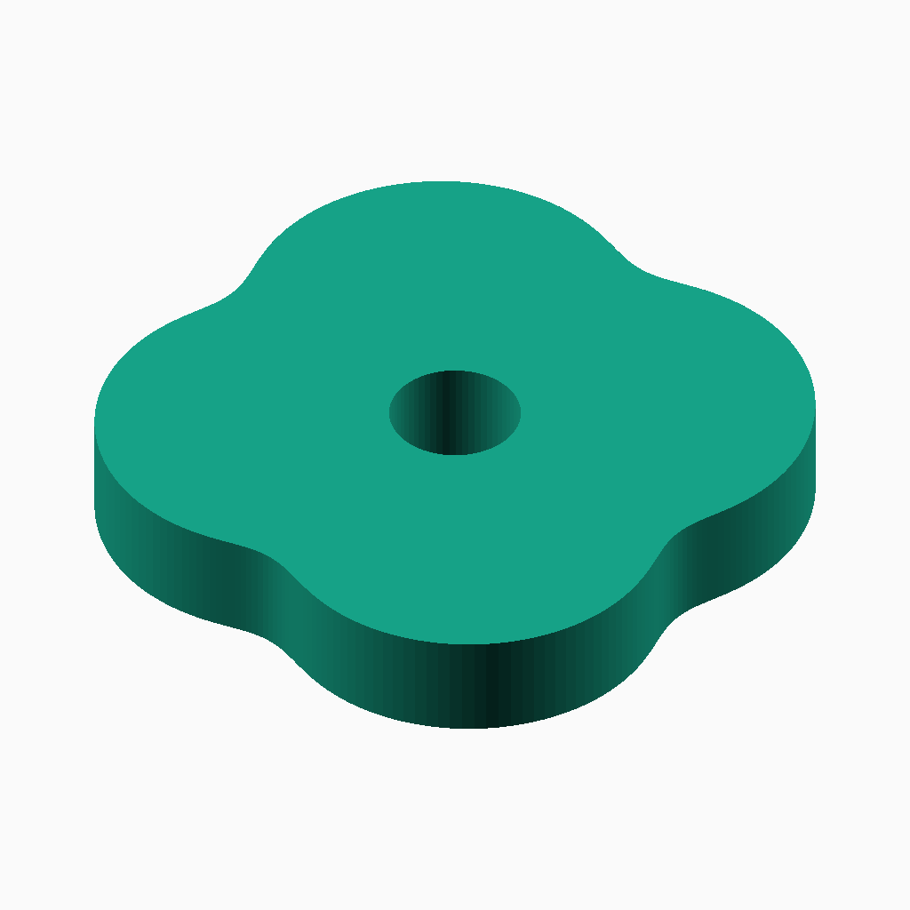](../images/functions/epitrochoid/curve_gear_epitrochoid_body.png) | [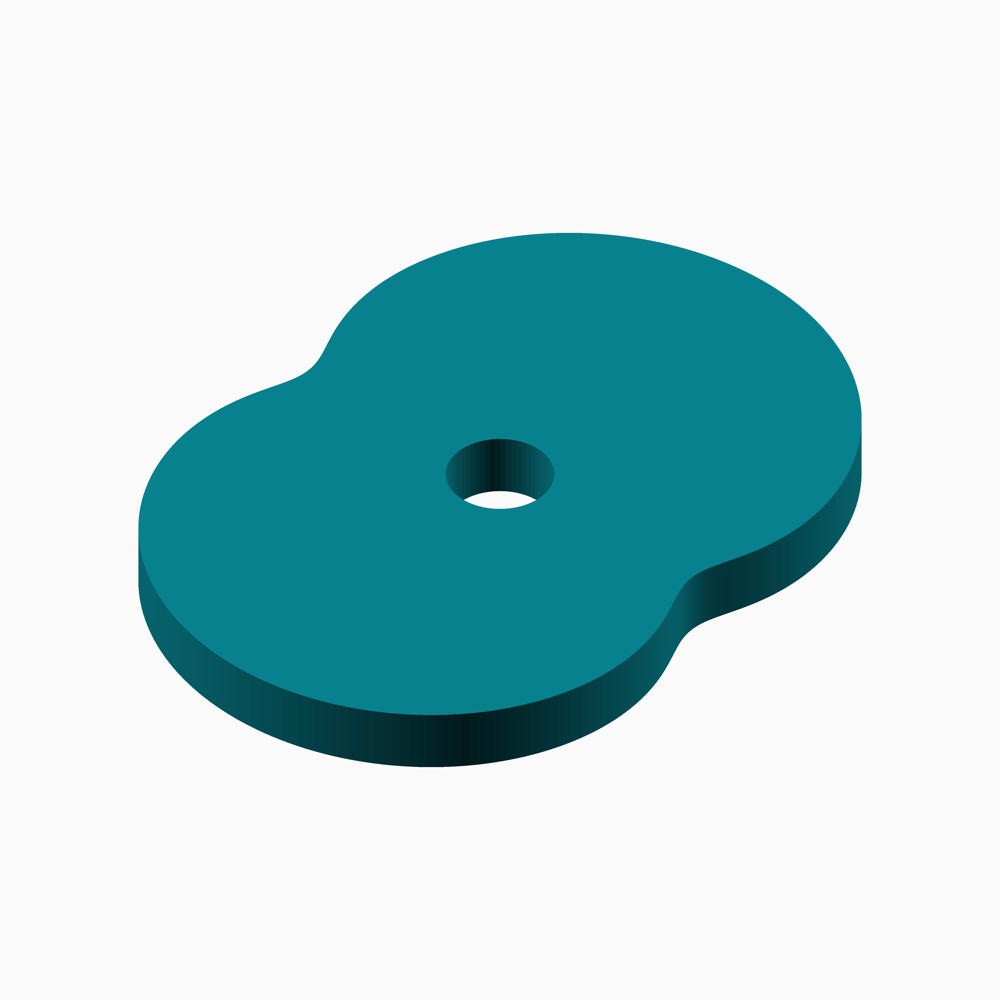](../images/functions/epitrochoid/curve_gear_epitrochoid_body_alternative.png) |

Build the epitrochoid body solid without teeth.

**Parameters:**

- `modul`: {number > 0} Tooth module in mm.
- `tooth_number`: {integer >= 3} Number of teeth.
- `width`: {number > 0} Extrusion width in mm.
- `bore`: {number >= 0} Centre bore diameter in mm.
- `major_ratio`: {number > rolling_ratio, default 3} Fixed-to-rolling circle ratio.
- `rolling_ratio`: {number > 0, default 1} Rolling-circle ratio.
- `offset_ratio`: {0 < offset < rolling_ratio, default 0.35} Pen offset ratio.
- `pressure_angle`: {0 < angle < 90, default 20} Involute pressure angle.
- `tooth_phase`: {angle, default 0} Tooth placement phase in degrees.
- `backlash`: {undef or >= 0} Tangential tooth-thickness reduction in mm.
- `clearance`: {undef or >= 0} Additional radial root clearance in mm.
- `samples`: {integer >= 120, default 720} Curve sampling density.
- `orientation`: {angle, default 0} Single-gear display rotation in degrees.

**Returns:**

No return

### Example:

~~~c
curve_gear_epitrochoid_body(1, 24, 4, 8);
~~~

Back to [module description](#module-epitrochoid).

### Function `curve_gear_epitrochoid_body_2d`

| Epitrochoid 2D body 1 | Epitrochoid 2D body 2 |
| --- | --- |
| [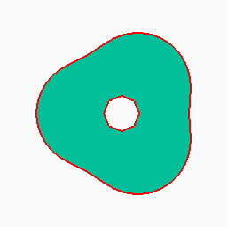](../images/functions/epitrochoid/curve_gear_epitrochoid_body_2d.png) | [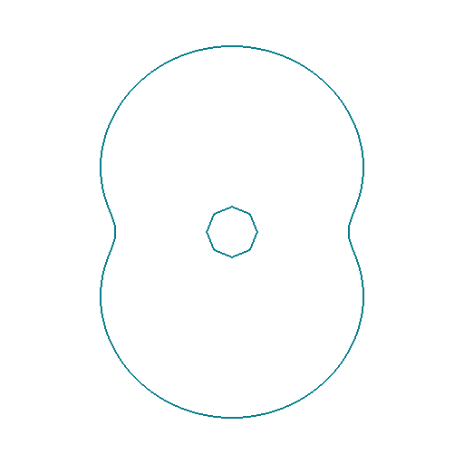](../images/functions/epitrochoid/curve_gear_epitrochoid_body_alternative_2d.png) |

Emit the epitrochoid body as 2D geometry with an optional signed outer-contour offset.

**Parameters:**

- `modul`: {value} Tooth module in mm.
- `tooth_number`: {value} Number of teeth.
- `bore`: {value} Centre bore diameter in mm.
- `major_ratio`: {value} Same family-specific parameter as curve_gear_epitrochoid_body.
- `rolling_ratio`: {value} Same family-specific parameter as curve_gear_epitrochoid_body.
- `offset_ratio`: {value} Same family-specific parameter as curve_gear_epitrochoid_body.
- `pressure_angle`: {value} Same family-specific parameter as curve_gear_epitrochoid_body.
- `tooth_phase`: {value} Same family-specific parameter as curve_gear_epitrochoid_body.
- `backlash`: {value} Same family-specific parameter as curve_gear_epitrochoid_body.
- `clearance`: {value} Same family-specific parameter as curve_gear_epitrochoid_body.
- `samples`: {value} Same family-specific parameter as curve_gear_epitrochoid_body.
- `orientation`: {value} Rotation in degrees.
- `body_offset`: {value} Signed offset in mm; negative values shrink the outer body contour while preserving the bore.

**Returns:**

No return

### Example:

~~~c
curve_gear_epitrochoid_body_2d(0.8, 34, 4.8, body_offset=-2);
~~~

Back to [module description](#module-epitrochoid).

### Function `curve_gear_epitrochoid_centre_distance`

Return the mathematical centre distance for an epitrochoid pair.

**Parameters:**

- `modul`: {number > 0} Tooth module in mm.
- `tooth_number`: {integer >= 3} Number of teeth.
- `major_ratio`: {number > rolling_ratio, default 3} Fixed-to-rolling circle ratio.
- `rolling_ratio`: {number > 0, default 1} Rolling-circle ratio.
- `offset_ratio`: {0 < offset < rolling_ratio, default 0.35} Pen offset ratio.
- `samples`: {integer >= 120, default 720} Pitch-curve sampling density.

**Returns:**

- `{number}`: Pair centre distance in mm.

Back to [module description](#module-epitrochoid).

### Function `curve_gear_epitrochoid_mate`

| Epitrochoid mate 1 | Epitrochoid mate 2 |
| --- | --- |
| [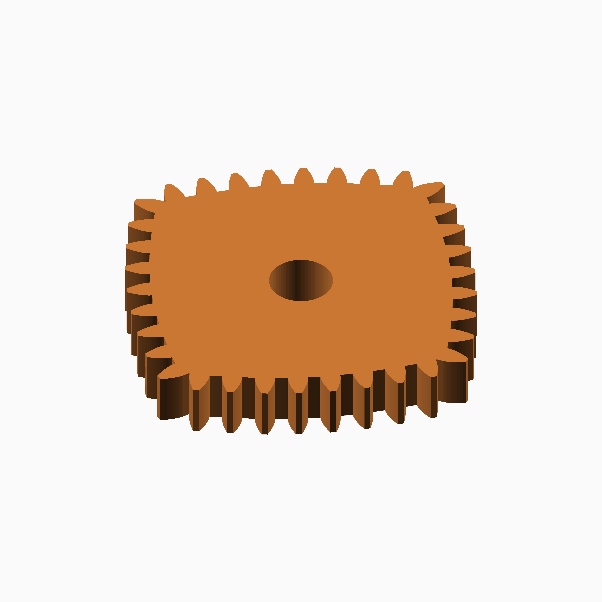](../images/functions/epitrochoid/curve_gear_epitrochoid_mate.png) | [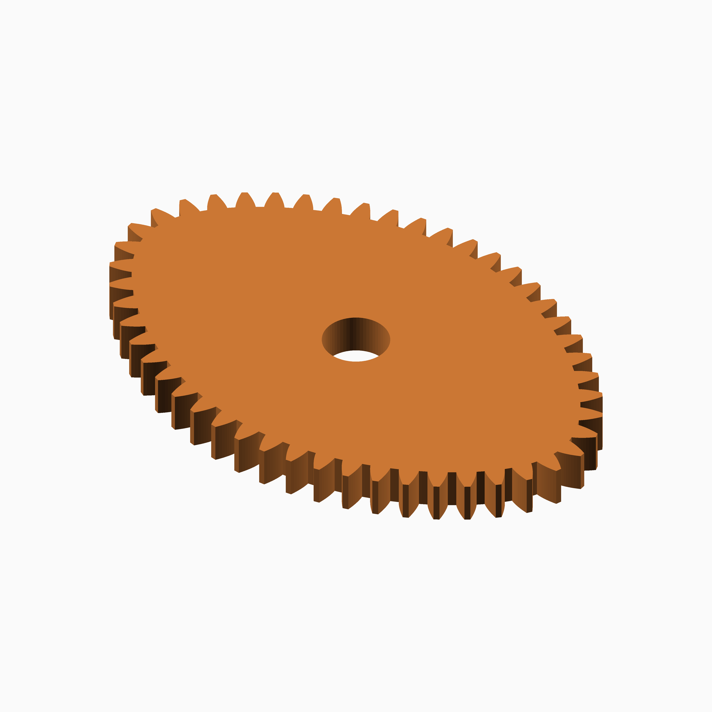](../images/functions/epitrochoid/curve_gear_epitrochoid_mate_alternative.png) |

Build the standalone epitrochoid mate boundary at the origin.

**Parameters:**

- `modul`: {number > 0} Tooth module in mm.
- `tooth_number`: {integer >= 3} Number of teeth.
- `width`: {number > 0} Extrusion width in mm.
- `bore`: {number >= 0} Centre bore diameter in mm.
- `major_ratio`: {number > rolling_ratio, default 3} Fixed-to-rolling circle ratio.
- `rolling_ratio`: {number > 0, default 1} Rolling-circle ratio.
- `offset_ratio`: {0 < offset < rolling_ratio, default 0.35} Pen offset ratio.
- `pressure_angle`: {0 < angle < 90, default 20} Involute pressure angle.
- `tooth_phase`: {angle, default 0} Tooth placement phase in degrees.
- `backlash`: {undef or >= 0} Tangential tooth-thickness reduction in mm.
- `clearance`: {undef or >= 0} Additional radial root clearance in mm.
- `samples`: {integer >= 120, default 720} Pitch-curve sampling density.

**Returns:**

No return

Back to [module description](#module-epitrochoid).

### Function `curve_gear_epitrochoid_mate_rotation`

Return the conjugate epitrochoid mate rotation for a driver phase.

**Parameters:**

- `modul`: {number > 0} Tooth module in mm.
- `tooth_number`: {integer >= 3} Number of teeth.
- `major_ratio`: {number > rolling_ratio, default 3} Fixed-to-rolling circle ratio.
- `rolling_ratio`: {number > 0, default 1} Rolling-circle ratio.
- `offset_ratio`: {0 < offset < rolling_ratio, default 0.35} Pen offset ratio.
- `samples`: {integer >= 120, default 720} Motion-table sampling density.
- `phase`: {angle, default 0} Driver motion phase in degrees.

**Returns:**

- `{angle}`: Mate rotation in degrees.

Back to [module description](#module-epitrochoid).

### Function `curve_gear_epitrochoid_pair`

| Epitrochoid pair 1 | Epitrochoid pair 2 |
| --- | --- |
| [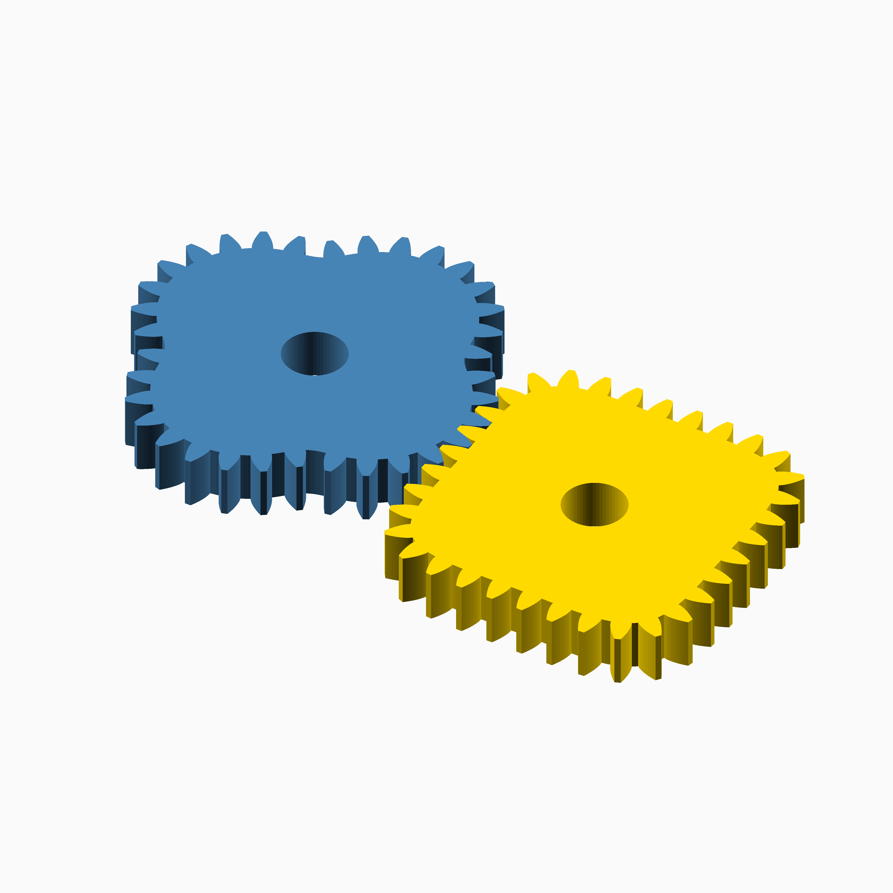](../images/functions/epitrochoid/curve_gear_epitrochoid_pair.png) | [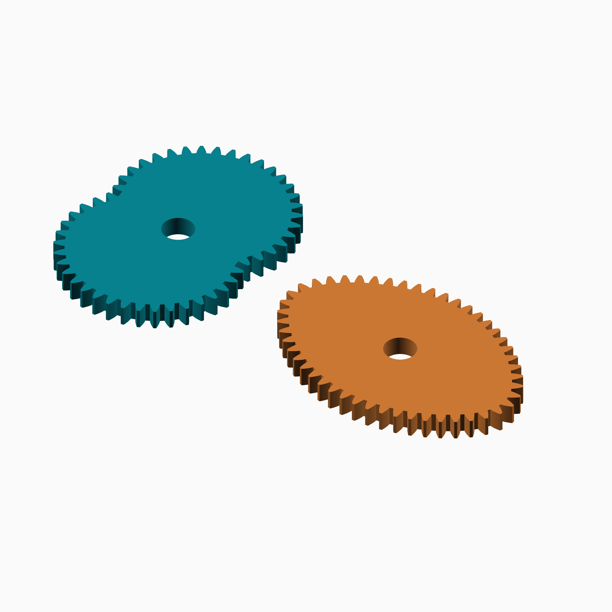](../images/functions/epitrochoid/curve_gear_epitrochoid_pair_alternative.png) |

Pair geometry uses the single-gear parameters documented in gear.scad.
[`curve_gear_epitrochoid`](#f-curve_gear_epitrochoid)

**Parameters:**

- `modul`: {number > 0, default .8} Tooth module in mm.
- `tooth_number`: {integer >= 3, default 34} Number of teeth.
- `width`: {number > 0, default 4} Extrusion width in mm.
- `bore`: {number >= 0, default 4.8} Centre bore diameter in mm.
- `major_ratio`: {number > rolling_ratio, default 3} Fixed-to-rolling circle ratio.
- `rolling_ratio`: {number > 0, default 1} Rolling-circle ratio.
- `offset_ratio`: {0 < offset < rolling_ratio, default 0.35} Pen offset ratio.
- `pressure_angle`: {0 < angle < 90, default 20} Involute pressure angle.
- `samples`: {integer >= 120, default 720} Pitch-curve sampling density.
- `phase`: {angle, default 0} Pair motion phase in degrees.
- `tooth_phase`: {angle, default 0} Tooth placement phase in degrees.
- `backlash`: {undef or >= 0, default undef} Tangential tooth-thickness reduction in mm.
- `clearance`: {undef or >= 0, default undef} Additional radial root clearance in mm.
- `together_built`: {boolean, default true} Place the pair meshed when true, separated when false.
- `driver_color`: {OpenSCAD colour, default SteelBlue} Driver display colour.
- `mate_color`: {OpenSCAD colour, default Gold} Mate display colour.

**Returns:**

No return

### Example:

~~~c
curve_gear_epitrochoid_pair(1, 24, 4, 8);
~~~

Back to [module description](#module-epitrochoid).

### Function `_cg_epitrochoid_build`

Internal epitrochoid construction dispatcher.

**Parameters:**

- `modul`: {number} Tooth module in mm.
- `tooth_number`: {integer} Number of teeth.
- `width`: {number} Extrusion width in mm.
- `bore`: {number} Centre bore diameter in mm.
- `major_ratio`: {number, default 3} Internal construction parameter.
- `rolling_ratio`: {number, default 1} Internal construction parameter.
- `offset_ratio`: {number, default .35} Internal construction parameter.
- `pressure_angle`: {number, default 20} Involute pressure angle in degrees.
- `tooth_phase`: {number, default 0} Tooth placement phase in degrees.
- `backlash`: {number, default undef} Tangential tooth-thickness reduction in mm.
- `clearance`: {number, default undef} Additional radial root clearance in mm.
- `samples`: {integer, default 720} Pitch-curve or motion-table sampling density.
- `orientation`: {number, default 0} Single-gear display rotation in degrees.
- `body_only`: {boolean, default false} Emit the body without teeth.

**Returns:**

- `{geometry}`: Constructed family geometry.

Back to [module description](#module-epitrochoid).

### Function `_cg_epitrochoid_centre_distance`

Solve the epitrochoid conjugate centre distance.

**Parameters:**

- `scale`: {number > 0} Overall curve scale.
- `R`: {number > 0} Fixed-circle radius ratio.
- `r`: {number > 0} Rolling-circle radius ratio.
- `d`: {number > 0} Pen offset ratio.
- `n`: {integer >= 1, default 240} Number of motion intervals.

**Returns:**

- `{number}`: Conjugate centre distance.

Back to [module description](#module-epitrochoid).

### Function `_cg_epitrochoid_curve_radius`

Evaluate a scaled epitrochoid radius.

**Parameters:**

- `scale`: {number > 0} Curve scale in mm.
- `R`: {number > 0} Fixed-circle ratio.
- `r`: {number > 0} Rolling-circle ratio.
- `d`: {number >= 0} Pen offset ratio.
- `theta`: {angle} Curve parameter in degrees.

**Returns:**

- `{number}`: Radius in mm.

Back to [module description](#module-epitrochoid).

### Function `_cg_epitrochoid_driver_radii`

Sample the driver polygon at physical polar phase boundaries.

**Parameters:**

- `scale`: {number > 0} Overall curve scale in millimetres.
- `R`: {number > 0} Fixed-circle radius ratio.
- `r`: {number > 0} Rolling-circle radius ratio.
- `d`: {number > 0} Pen offset ratio.
- `n`: {integer >= 3, default 240} Number of boundary intervals.

**Returns:**

- `{array of number}`: Driver radii in angular order.

Back to [module description](#module-epitrochoid).

### Function `_cg_epitrochoid_mate_points`

Build epitrochoid mate pitch points and their shared motion table.

**Parameters:**

- `scale`: {number > 0} Overall curve scale.
- `R`: {number > 0} Fixed-circle radius ratio.
- `r`: {number > 0} Rolling-circle radius ratio.
- `d`: {number > 0} Pen offset ratio.
- `D`: {number > 0} Driver-to-mate centre distance.
- `n`: {integer >= 1, default 360} Number of output points.

**Returns:**

- `{array of points}`: Cartesian mate pitch points.

Back to [module description](#module-epitrochoid).

### Function `_cg_epitrochoid_mate_points_from_driver`

Build epitrochoid mate pitch points by advancing driver angle directly.

**Parameters:**

- `scale`: {number > 0} Overall curve scale.
- `R`: {number > 0} Fixed-circle radius ratio.
- `r`: {number > 0} Rolling-circle radius ratio.
- `d`: {number > 0} Pen offset ratio.
- `D`: {number > 0} Driver-to-mate centre distance.
- `n`: {integer >= 1, default 360} Number of output points.

**Returns:**

- `{array of points}`: Cartesian mate pitch points.

Back to [module description](#module-epitrochoid).

### Function `_cg_epitrochoid_motion_radii`

Sample the driver polygon at physical polar integration midpoints.

**Parameters:**

- `scale`: {number > 0} Overall curve scale.
- `R`: {number > 0} Fixed-circle radius ratio.
- `r`: {number > 0} Rolling-circle radius ratio.
- `d`: {number > 0} Pen offset ratio.
- `n`: {integer >= 3, default 240} Number of midpoint samples.

**Returns:**

- `{array of number}`: Sampled radii in angular order.

Back to [module description](#module-epitrochoid).

### Function `_cg_epitrochoid_motion_table`

Build the shared epitrochoid phase-motion table.

**Parameters:**

- `scale`: {number > 0} Overall curve scale.
- `R`: {number > 0} Fixed-circle radius ratio.
- `r`: {number > 0} Rolling-circle radius ratio.
- `d`: {number > 0} Pen offset ratio.
- `D`: {number > 0} Driver-to-mate centre distance.
- `n`: {integer >= 1, default 360} Number of midpoint samples.

**Returns:**

- `{array}`: Monotonic driver-to-mate phase-motion table.

Back to [module description](#module-epitrochoid).

### Function `_cg_epitrochoid_point`

Evaluate one point on the unit rolling-circle epitrochoid.

**Parameters:**

- `R`: {number > 0} Fixed-circle ratio.
- `r`: {number > 0} Rolling-circle ratio.
- `d`: {number >= 0} Pen offset ratio.
- `theta`: {angle} Curve parameter in degrees.

**Returns:**

- `{array}`: Cartesian point `[x, y]` in unit-curve coordinates.

Back to [module description](#module-epitrochoid).

### Function `_cg_epitrochoid_points`

Sample one complete unit epitrochoid curve.

**Parameters:**

- `R`: {number > 0} Fixed-circle ratio.
- `r`: {number > 0} Rolling-circle ratio.
- `d`: {number >= 0} Pen offset ratio.
- `n`: {integer >= 1, default 720} Number of samples.

**Returns:**

- `{array}`: Closed list of sampled Cartesian points.

Back to [module description](#module-epitrochoid).

### Function `_cg_epitrochoid_points_scaled`

Sample a scaled epitrochoid curve.

**Parameters:**

- `scale`: {number > 0} Curve scale in mm.
- `R`: {number > 0} Fixed-circle ratio.
- `r`: {number > 0} Rolling-circle ratio.
- `d`: {number >= 0} Pen offset ratio.
- `n`: {integer >= 1, default 720} Number of samples.

**Returns:**

- `{array}`: Closed list of sampled Cartesian points in mm.

Back to [module description](#module-epitrochoid).

### Function `_cg_epitrochoid_radius`

Evaluate the radial distance of the unit epitrochoid.

**Parameters:**

- `R`: {number > 0} Fixed-circle ratio.
- `r`: {number > 0} Rolling-circle ratio.
- `d`: {number >= 0} Pen offset ratio.
- `theta`: {angle} Curve parameter in degrees.

**Returns:**

- `{number}`: Unit-curve radius.

Back to [module description](#module-epitrochoid).

### Function `_cg_epitrochoid_scale`

Scale an epitrochoid to the requested tooth pitch.

**Parameters:**

- `modul`: {number > 0} Tooth module in mm.
- `tooth_number`: {integer >= 3} Number of teeth.
- `R`: {number > 0, default 3} Fixed-circle ratio.
- `r`: {number > 0, default 1} Rolling-circle ratio.
- `d`: {number >= 0, default 2} Pen offset ratio in the unit model.
- `n`: {integer >= 1, default 720} Number of samples used for arc length.
- `unit_points`: {array of points, default undef} Optional pre-sampled unit curve.

**Returns:**

- `{number}`: Curve scale in mm.

Back to [module description](#module-epitrochoid).

Back to [top](#).

## Module `Trochoid common`

This file is an implementation detail. Public family APIs live in
`epitrochoid/` and `hypotrochoid/`; the rolling equations remain in those
family modules. This layer contains only the shared curve post-processing.

### Brief content:

**Functions**:

> [`_cg_trochoid_curve_radius_from_point`](#function-_cg_trochoid_curve_radius_from_point): Evaluate the radial distance of a scaled curve point.

> [`_cg_trochoid_points_scaled_from_points`](#function-_cg_trochoid_points_scaled_from_points): Scale sampled unit-curve points.

> [`_cg_trochoid_polar_radii`](#function-_cg_trochoid_polar_radii): Sample the emitted driver polygon at uniformly spaced physical polar angles.

> [`_cg_trochoid_polar_table`](#function-_cg_trochoid_polar_table): Index a finite star-shaped driver polygon by monotonically increasing physical polar angle.

> [`_cg_trochoid_radius_at_polar_angle`](#function-_cg_trochoid_radius_at_polar_angle): Intersect a physical polar ray with the indexed polygon segment, without interpolating curve parameters.

> [`_cg_trochoid_radius_from_point`](#function-_cg_trochoid_radius_from_point): Evaluate the radial distance of a unit-curve point.

> [`_cg_trochoid_scale_from_points`](#function-_cg_trochoid_scale_from_points): Scale a sampled unit curve to the requested tooth pitch.

> [`_cg_trochoid_shape`](#function-_cg_trochoid_shape): Bind a sampled trochoid polygon to the shared physical-angle shape contract.

## Functions

The module `Trochoid common` defines the following functions.

### Function `_cg_trochoid_curve_radius_from_point`

Evaluate the radial distance of a scaled curve point.

**Parameters:**

No parameters

**Returns:**

No return

Back to [module description](#module-trochoid-common).

### Function `_cg_trochoid_points_scaled_from_points`

Scale sampled unit-curve points.

**Parameters:**

No parameters

**Returns:**

No return

Back to [module description](#module-trochoid-common).

### Function `_cg_trochoid_polar_radii`

Sample the emitted driver polygon at uniformly spaced physical polar angles.

**Parameters:**

- `points`: {array of 2D points} Closed star-shaped driver polygon.
- `n`: {integer >= 3} Number of motion intervals.
- `midpoint`: {boolean, default false} Use integration midpoints instead of phase boundaries.

**Returns:**

- `{array of number}`: Physical pitch radii in increasing angular order.

Back to [module description](#module-trochoid-common).

### Function `_cg_trochoid_polar_table`

Index a finite star-shaped driver polygon by monotonically increasing physical polar angle.

**Parameters:**

- `points`: {array of 2D points} Closed polygon starting on the positive X ray.

**Returns:**

- `{array}`: Angle/point rows with an explicit closing row at 360 degrees.

Back to [module description](#module-trochoid-common).

### Function `_cg_trochoid_radius_at_polar_angle`

Intersect a physical polar ray with the indexed polygon segment, without interpolating curve parameters.

**Parameters:**

- `table`: {array} Validated angle/point table.
- `theta`: {angle} Physical polar angle in degrees.

**Returns:**

- `{number}`: Radius of the exact sampled driver polygon at that angle.

Back to [module description](#module-trochoid-common).

### Function `_cg_trochoid_radius_from_point`

Evaluate the radial distance of a unit-curve point.

**Parameters:**

No parameters

**Returns:**

No return

Back to [module description](#module-trochoid-common).

### Function `_cg_trochoid_scale_from_points`

Scale a sampled unit curve to the requested tooth pitch.

**Parameters:**

No parameters

**Returns:**

No return

Back to [module description](#module-trochoid-common).

### Function `_cg_trochoid_shape`

Bind a sampled trochoid polygon to the shared physical-angle shape contract.

**Parameters:**

- `unit_points`: {array of 2D points} Unit-scale driver polygon.
- `scale`: {number > 0} Perimeter-derived physical scale.
- `lower`: {number} Solver lower bound.
- `upper`: {number} Solver upper bound.
- `radial_root`: {boolean, default false} Use radial-root tooth placement.

**Returns:**

- `{array}`: `[driver points, physical radius function, lower, upper, radial_root]`.

Back to [module description](#module-trochoid-common).

Back to [top](#).

---

[Back to the CurveGears README](../README.md)

*Generated by Doxydown from repository source comments; do not edit this page directly.*
