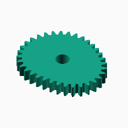
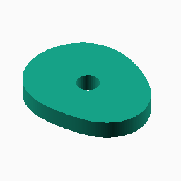
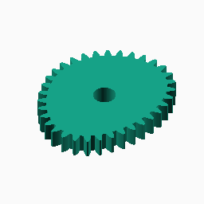
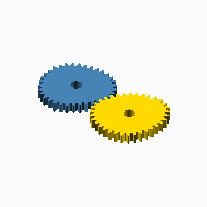

# Fourier

## Documentation navigation

- [README](../README.md)
- Families
  - [Bézier](bezier.md) · [Cassini](cassini.md) · [Circle](circle.md) · [Ellipse](ellipse.md) · [Epitrochoid](epitrochoid.md) · [Fourier](fourier.md)
  - [Hypotrochoid](hypotrochoid.md) · [Lobed](lobed.md) · [Logarithmic spiral](logarithmic_spiral.md) · [Pascal](pascal.md) · [Superformula](superformula.md)
- Shared
  - [Examples catalogue](../examples/README.md) · [Test layout](../tests/README.md)
  - [Tooth construction](tooth-construction.md) · [Tooth placement](tooth-placement.md) · [Mate motion](mate-motion.md) · [Mate generation](mate-generation.md) · [Pair assembly](pair-assembly.md)

## Module `Fourier`

Each coefficient is [harmonic, amplitude, phase]. Harmonics are positive
integers, amplitudes are fractions of the mean pitch radius, and phases are
degrees. The radius is R(1 + sum(amplitude*cos(harmonic*theta+phase))).
This is the exact analytic model; the implementation samples it into a
polyline because OpenSCAD polygon/extrusion inputs are discrete. Increase
samples for high harmonics or large amplitudes; the positive-radius bound
is a validation limit, not a physical guarantee. Reference:
https://mathworld.wolfram.com/FourierSeries.html.

### Brief content:

**Functions**:

> [`_cg_fourier_radius`](#function-_cg_fourier_radius): Evaluate a Fourier polar radius at an angle.

> [`_cg_fourier_point`](#function-_cg_fourier_point): Evaluate a Fourier pitch point in Cartesian coordinates.

> [`_cg_fourier_points`](#function-_cg_fourier_points): Sample a complete Fourier pitch curve.

> [`_cg_fourier_coefficients_valid`](#function-_cg_fourier_coefficients_valid): Validate integer harmonics and bounded positive-radius amplitudes.

> [`_cg_fourier_build(modul,tooth_number,width,bore,coefficients=[[2,.10,0]],pressure_angle=20,tooth_phase=0,backlash=undef,clearance=undef,samples=720,orientation=0,body_only=false)`](#function-_cg_fourier_buildmodultooth_numberwidthborecoefficients2100pressure_angle20tooth_phase0backlashundefclearanceundefsamples720orientation0body_onlyfalse): Internal fourier construction dispatcher.

> [`curve_gear_fourier(modul, tooth_number, width, bore, ...)`](#function-curve_gear_fouriermodul-tooth_number-width-bore-): Build a coefficient-driven Fourier gear.

> [`curve_gear_fourier_body(modul, tooth_number, width, bore, ...)`](#function-curve_gear_fourier_bodymodul-tooth_number-width-bore-): Build the Fourier body without teeth.

> [`_cg_fourier_motion_radii`](#function-_cg_fourier_motion_radii): Evaluate Fourier radii at integration midpoints.

> [`_cg_fourier_driver_radii`](#function-_cg_fourier_driver_radii): Evaluate Fourier radii at direct mate-construction angles.

> [`_cg_fourier_max_radius`](#function-_cg_fourier_max_radius): Estimate the maximum Fourier radius for the centre-distance bracket.

> [`_cg_fourier_centre_distance`](#function-_cg_fourier_centre_distance): Solve the Fourier conjugate centre distance.

> [`_cg_fourier_motion_table`](#function-_cg_fourier_motion_table): Build the shared Fourier phase-motion table.

> [`_cg_fourier_mate_points_from_driver`](#function-_cg_fourier_mate_points_from_driver): Build Fourier mate pitch points by advancing driver angle directly.

> [`_cg_fourier_mate_points`](#function-_cg_fourier_mate_points): Build Fourier mate pitch points and their shared motion table.

> [`curve_gear_fourier_mate(modul, tooth_number, width, bore, ...)`](#function-curve_gear_fourier_matemodul-tooth_number-width-bore-): Build the standalone dynamically conjugate Fourier mate.

> [`curve_gear_fourier_centre_distance(modul, tooth_number, coefficients)`](#function-curve_gear_fourier_centre_distancemodul-tooth_number-coefficients): Return the Fourier conjugate pair centre distance.

> [`curve_gear_fourier_mate_rotation(modul, tooth_number, coefficients, samples, phase)`](#function-curve_gear_fourier_mate_rotationmodul-tooth_number-coefficients-samples-phase): Return Fourier mate rotation for a driver phase.

> [`curve_gear_fourier_pair(modul, tooth_number, width, bore, ...)`](#function-curve_gear_fourier_pairmodul-tooth_number-width-bore-): Build a meshed or separated Fourier pair using one shared motion table.

## Functions

The module `Fourier` defines the following functions.

### Function `_cg_fourier_radius`

Evaluate a Fourier polar radius at an angle.

**Parameters:**

- `base`: {number > 0} Base polar radius.
- `coefficients`: {array of [integer, number, angle]} Polar harmonics.
- `theta`: {angle} Polar angle in degrees.

**Returns:**

- `{number}`: Polar radius.

Back to [module description](#module-fourier).

### Function `_cg_fourier_point`

Evaluate a Fourier pitch point in Cartesian coordinates.

**Parameters:**

- `base`: {number > 0} Base polar radius.
- `coefficients`: {array of [integer, number, angle]} Polar harmonics.
- `theta`: {angle} Polar angle in degrees.

**Returns:**

- `{point}`: Cartesian pitch point.

Back to [module description](#module-fourier).

### Function `_cg_fourier_points`

Sample a complete Fourier pitch curve.

**Parameters:**

- `base`: {number > 0} Base polar radius.
- `coefficients`: {array of [integer, number, angle]} Polar harmonics.
- `samples`: {integer >= 1} Number of output samples.

**Returns:**

- `{array of points}`: Sampled Cartesian pitch curve.

Back to [module description](#module-fourier).

### Function `_cg_fourier_coefficients_valid`

Validate integer harmonics and bounded positive-radius amplitudes.

**Parameters:**

- `coefficients`: {array of [integer, number, angle]} Polar harmonics.

**Returns:**

- `{boolean}`: True when the coefficient list is valid.

Back to [module description](#module-fourier).

### Function `_cg_fourier_build(modul,tooth_number,width,bore,coefficients=[[2,.10,0]],pressure_angle=20,tooth_phase=0,backlash=undef,clearance=undef,samples=720,orientation=0,body_only=false)`

Internal fourier construction dispatcher.

**Parameters:**

- `modul`: {number} Tooth module in mm.
- `tooth_number`: {integer} Number of teeth.
- `width`: {number} Extrusion width in mm.
- `bore`: {number} Centre bore diameter in mm.
- `coefficients`: {value, default [[2,.10,0]]} Internal construction parameter.
- `pressure_angle`: {number, default 20} Involute pressure angle in degrees.
- `tooth_phase`: {number, default 0} Tooth placement phase in degrees.
- `backlash`: {number, default undef} Tangential tooth-thickness reduction in mm.
- `clearance`: {number, default undef} Additional radial root clearance in mm.
- `samples`: {integer, default 720} Pitch-curve or motion-table sampling density.
- `orientation`: {number, default 0} Single-gear display rotation in degrees.
- `body_only`: {boolean, default false} Emit the body without teeth.

**Returns:**

- `{geometry}`: Constructed family geometry.

Back to [module description](#module-fourier).

### Function `curve_gear_fourier(modul, tooth_number, width, bore, ...)`

Build a coefficient-driven Fourier gear.

**Parameters:**

- `modul`: {number > 0} Tooth module in mm.
- `tooth_number`: {integer >= 3} Number of teeth.
- `width`: {number > 0} Extrusion width in mm.
- `bore`: {number >= 0} Centre bore diameter in mm.
- `coefficients`: {array of [harmonic, amplitude, phase]} Polar harmonics relative to the mean pitch radius.
- `pressure_angle`: {0 < angle < 90, default 20} Involute pressure angle in degrees.
- `tooth_phase`: {angle, default 0} Tooth placement phase in degrees.
- `backlash`: {undef or >= 0} Tangential tooth-thickness reduction in mm.
- `clearance`: {undef or >= 0} Additional radial root clearance in mm.
- `samples`: {integer >= 120, default 720} Pitch-curve sampling density.
- `orientation`: {angle, default 0} Single-gear display rotation in degrees.

**Returns:**

No return

### Example:

~~~c
curve_gear_fourier(1, 24, 4, 8, [[2, .10, 0], [3, .04, 30]]);
~~~

Back to [module description](#module-fourier).

### Function `curve_gear_fourier_body(modul, tooth_number, width, bore, ...)`

Build the Fourier body without teeth.

**Parameters:**

- `modul`: {number > 0} Tooth module in mm.
- `tooth_number`: {integer >= 3} Number of teeth.
- `width`: {number > 0} Extrusion width in mm.
- `bore`: {number >= 0} Centre bore diameter in mm.
- `coefficients`: {array of [harmonic, amplitude, phase]} Polar harmonics relative to the mean pitch radius.
- `pressure_angle`: {0 < angle < 90, default 20} Involute pressure angle in degrees.
- `tooth_phase`: {angle, default 0} Tooth placement phase in degrees.
- `backlash`: {undef or >= 0} Tangential tooth-thickness reduction in mm.
- `clearance`: {undef or >= 0} Additional radial root clearance in mm.
- `samples`: {integer >= 120, default 720} Pitch-curve sampling density.
- `orientation`: {angle, default 0} Single-gear display rotation in degrees.

**Returns:**

No return

Back to [module description](#module-fourier).

### Function `_cg_fourier_motion_radii`

Evaluate Fourier radii at integration midpoints.

**Parameters:**

- `base`: {number > 0} Base polar radius.
- `coefficients`: {array of [integer, number, angle]} Polar harmonics.
- `n`: {integer >= 1, default 360} Number of midpoint samples.

**Returns:**

- `{array of number}`: Sampled radii in angular order.

Back to [module description](#module-fourier).

### Function `_cg_fourier_driver_radii`

Evaluate Fourier radii at direct mate-construction angles.

**Parameters:**

No parameters

**Returns:**

No return

Back to [module description](#module-fourier).

### Function `_cg_fourier_max_radius`

Estimate the maximum Fourier radius for the centre-distance bracket.

**Parameters:**

- `base`: {number > 0} Base polar radius.
- `coefficients`: {array of [integer, number, angle]} Polar harmonics.
- `n`: {integer >= 1, default 720} Number of samples.

**Returns:**

- `{number}`: Maximum sampled polar radius.

Back to [module description](#module-fourier).

### Function `_cg_fourier_centre_distance`

Solve the Fourier conjugate centre distance.

**Parameters:**

- `base`: {number > 0} Base polar radius.
- `coefficients`: {array of [integer, number, angle]} Polar harmonics.

**Returns:**

- `{number}`: Conjugate centre distance.

Back to [module description](#module-fourier).

### Function `_cg_fourier_motion_table`

Build the shared Fourier phase-motion table.

**Parameters:**

- `base`: {number > 0} Base polar radius.
- `coefficients`: {array of [integer, number, angle]} Polar harmonics.
- `D`: {number > 0} Driver-to-mate centre distance.
- `n`: {integer >= 1, default 360} Number of midpoint samples.

**Returns:**

- `{array}`: Monotonic driver-to-mate phase-motion table.

Back to [module description](#module-fourier).

### Function `_cg_fourier_mate_points_from_driver`

Build Fourier mate pitch points by advancing driver angle directly.

**Parameters:**

- `base`: {number > 0} Base polar radius.
- `coefficients`: {array of [integer, number, angle]} Polar harmonics.
- `D`: {number > 0} Driver-to-mate centre distance.
- `motion`: {array} Shared driver-to-mate phase-motion table.
- `n`: {integer >= 1, default 360} Number of output points.

**Returns:**

- `{array of points}`: Cartesian mate pitch points.

Back to [module description](#module-fourier).

### Function `_cg_fourier_mate_points`

Build Fourier mate pitch points and their shared motion table.

**Parameters:**

- `base`: {number > 0} Base polar radius.
- `coefficients`: {array of [integer, number, angle]} Polar harmonics.
- `D`: {number > 0} Driver-to-mate centre distance.
- `n`: {integer >= 1, default 360} Number of output points.

**Returns:**

- `{array of points}`: Cartesian mate pitch points.

Back to [module description](#module-fourier).

### Function `curve_gear_fourier_mate(modul, tooth_number, width, bore, ...)`

Build the standalone dynamically conjugate Fourier mate.

**Parameters:**

- `modul`: {number > 0} Tooth module in mm.
- `tooth_number`: {integer >= 3} Number of teeth.
- `width`: {number > 0} Extrusion width in mm.
- `bore`: {number >= 0} Centre bore diameter in mm.
- `coefficients`: {array of [harmonic, amplitude, phase]} Same polar coefficients as the driver.
- `pressure_angle`: {0 < angle < 90, default 20} Involute pressure angle in degrees.
- `tooth_phase`: {angle, default 0} Tooth placement phase in degrees.
- `backlash`: {undef or >= 0} Tangential tooth-thickness reduction in mm.
- `clearance`: {undef or >= 0} Additional radial root clearance in mm.
- `samples`: {integer >= 120, default 360} Pitch-curve sampling density.

**Returns:**

No return

Back to [module description](#module-fourier).

### Function `curve_gear_fourier_centre_distance(modul, tooth_number, coefficients)`

Return the Fourier conjugate pair centre distance.

**Parameters:**

- `modul`: {number > 0} Tooth module in mm.
- `tooth_number`: {integer >= 3} Number of teeth.
- `coefficients`: {array of [harmonic, amplitude, phase]} Same coefficients as the driver.
- `samples`: {integer >= 120, default 360} Motion-table sampling density.

**Returns:**

- `{number}`: Pair centre distance in mm.

Back to [module description](#module-fourier).

### Function `curve_gear_fourier_mate_rotation(modul, tooth_number, coefficients, samples, phase)`

Return Fourier mate rotation for a driver phase.

**Parameters:**

- `modul`: {number > 0} Tooth module in mm.
- `tooth_number`: {integer >= 3} Number of teeth.
- `coefficients`: {array of [harmonic, amplitude, phase]} Same coefficients as the driver.
- `samples`: {integer >= 120, default 360} Motion-table sampling density.
- `phase`: {angle, default 0} Driver phase in degrees; negative and full-turn phases remain unwrapped.

**Returns:**

- `{angle}`: Mate rotation in degrees.

Back to [module description](#module-fourier).

### Function `curve_gear_fourier_pair(modul, tooth_number, width, bore, ...)`

Build a meshed or separated Fourier pair using one shared motion table.

**Parameters:**

- `modul`: {number > 0} Tooth module in mm.
- `tooth_number`: {integer >= 3} Number of teeth.
- `width`: {number > 0} Extrusion width in mm.
- `bore`: {number >= 0} Centre bore diameter in mm.
- `coefficients`: {array of [harmonic, amplitude, phase]} Same polar coefficients as the driver.
- `pressure_angle`: {0 < angle < 90, default 20} Involute pressure angle in degrees.
- `samples`: {integer >= 120, default 360} Pitch-curve sampling density.
- `phase`: {angle, default 0} Driver motion phase in degrees.
- `together_built`: {boolean, default true} Place the pair meshed when true.
- `backlash`: {undef or >= 0} Tangential tooth-thickness reduction in mm.
- `clearance`: {undef or >= 0} Additional radial root clearance in mm.
- `tooth_phase`: {angle, default 0} Tooth placement phase in degrees.
- `driver_color`: {OpenSCAD colour, default SteelBlue} Driver display colour.
- `mate_color`: {OpenSCAD colour, default Gold} Mate display colour.

**Returns:**

No return

### Example:

~~~c
curve_gear_fourier_pair(1, 24, 4, 8, [[2, .10, 0], [3, .04, 30]]);
~~~

Back to [module description](#module-fourier).

Back to [top](#).

---

[Back to the CurveGears README](../README.md)

*Generated by Doxydown from repository source comments; do not edit this page directly.*
