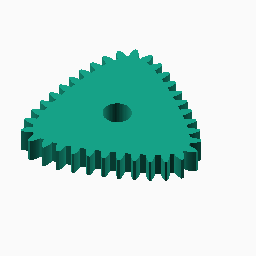
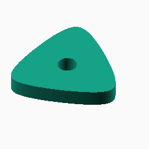
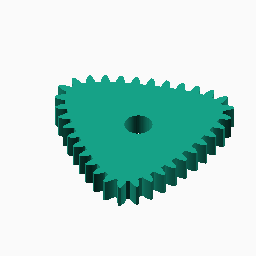
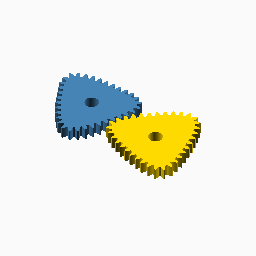
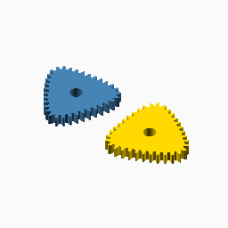

# Hypotrochoid

## Documentation navigation

- [README](../README.md)
- Families
  - [Bézier](bezier.md) · [Cassini](cassini.md) · [Circle](circle.md) · [Ellipse](ellipse.md) · [Epitrochoid](epitrochoid.md) · [Fourier](fourier.md)
  - [Hypotrochoid](hypotrochoid.md) · [Lobed](lobed.md) · [Logarithmic spiral](logarithmic_spiral.md) · [Pascal](pascal.md) · [Superformula](superformula.md)
- Shared
  - [Examples catalogue](../examples/README.md) · [Test layout](../tests/README.md)
  - [Tooth construction](tooth-construction.md) · [Tooth placement](tooth-placement.md) · [Mate motion](mate-motion.md) · [Mate generation](mate-generation.md) · [Pair assembly](pair-assembly.md)

## Module `Hypotrochoid`

The curve is generated by a point on a circle rolling inside a fixed
circle. The documented ratio constraints reject cusp and loop cases.

### Brief content:

**Functions**:

> [`curve_gear_hypotrochoid(modul, tooth_number, width, bore, ...)`](#function-curve_gear_hypotrochoidmodul-tooth_number-width-bore-): Build a hypotrochoid non-circular gear.

> [`curve_gear_hypotrochoid_body`](#function-curve_gear_hypotrochoid_body): Build the hypotrochoid body solid without teeth.

> [`curve_gear_hypotrochoid_mate`](#function-curve_gear_hypotrochoid_mate): Build the standalone conjugate mate for a hypotrochoid driver.

> [`curve_gear_hypotrochoid_centre_distance`](#function-curve_gear_hypotrochoid_centre_distance): Return the mathematical centre distance for a hypotrochoid pair.

> [`curve_gear_hypotrochoid_mate_rotation`](#function-curve_gear_hypotrochoid_mate_rotation): Return the conjugate hypotrochoid mate rotation for a driver phase.

> [`curve_gear_hypotrochoid_pair`](#function-curve_gear_hypotrochoid_pair): Build a meshed or separated hypotrochoid driver/mate pair.

## Functions

The module `Hypotrochoid` defines the following functions.

### Function `curve_gear_hypotrochoid(modul, tooth_number, width, bore, ...)`

Build a hypotrochoid non-circular gear.

**Parameters:**

- `modul`: {number > 0} Tooth module in mm.
- `tooth_number`: {integer >= 3} Number of teeth.
- `width`: {number > 0} Extrusion width in mm.
- `bore`: {number >= 0} Centre bore diameter in mm.
- `major_ratio`: {number > rolling_ratio, default 3} Fixed-to-rolling circle ratio.
- `rolling_ratio`: {number > 0, default 1} Rolling-circle ratio.
- `offset_ratio`: {0 < offset < rolling_ratio, default 0.35} Pen offset ratio.
- `pressure_angle`: {0 < angle < 90, default 20} Involute pressure angle.
- `tooth_phase`: {angle, default 0} Tooth placement phase.
- `backlash`: {undef or >= 0} Tangential tooth-thickness reduction in mm.
- `clearance`: {undef or >= 0} Additional radial root clearance in mm.
- `samples`: {integer >= 120, default 720} Curve sampling density.
- `orientation`: {angle, default 0} Single-gear display rotation.

**Returns:**

No return

### Example:

~~~c
curve_gear_hypotrochoid(1, 24, 4, 8);
~~~

Back to [module description](#module-hypotrochoid).

### Function `curve_gear_hypotrochoid_body`

Build the hypotrochoid body solid without teeth.

**Parameters:**

- `modul`: {number > 0} Tooth module in mm.
- `tooth_number`: {integer >= 3} Number of teeth.
- `width`: {number > 0} Extrusion width in mm.
- `bore`: {number >= 0} Centre bore diameter in mm.
- `major_ratio`: {number > rolling_ratio, default 3} Fixed-to-rolling circle ratio.
- `rolling_ratio`: {number > 0, default 1} Rolling-circle ratio.
- `offset_ratio`: {0 < offset < rolling_ratio, default 0.35} Pen offset ratio.
- `pressure_angle`: {0 < angle < 90, default 20} Involute pressure angle.
- `tooth_phase`: {angle, default 0} Tooth placement phase.
- `backlash`: {undef or >= 0} Tangential tooth-thickness reduction in mm.
- `clearance`: {undef or >= 0} Additional radial root clearance in mm.
- `samples`: {integer >= 120, default 720} Curve sampling density.
- `orientation`: {angle, default 0} Single-gear display rotation.

**Returns:**

No return

Back to [module description](#module-hypotrochoid).

### Function `curve_gear_hypotrochoid_mate`

Build the standalone conjugate mate for a hypotrochoid driver.

**Parameters:**

- `modul`: {number > 0} Tooth module in mm.
- `tooth_number`: {integer >= 3} Number of teeth.
- `width`: {number > 0} Extrusion width in mm.
- `bore`: {number >= 0} Centre bore diameter in mm.
- `major_ratio`: {number > rolling_ratio, default 3} Fixed-to-rolling circle ratio.
- `rolling_ratio`: {number > 0, default 1} Rolling-circle ratio.
- `offset_ratio`: {0 < offset < rolling_ratio, default 0.35} Pen offset ratio.
- `pressure_angle`: {0 < angle < 90, default 20} Involute pressure angle.
- `tooth_phase`: {angle, default 0} Tooth placement phase.
- `backlash`: {undef or >= 0} Tangential tooth-thickness reduction in mm.
- `clearance`: {undef or >= 0} Additional radial root clearance in mm.
- `samples`: {integer >= 120, default 720} Pitch-curve sampling density.

**Returns:**

No return

Back to [module description](#module-hypotrochoid).

### Function `curve_gear_hypotrochoid_centre_distance`

Return the mathematical centre distance for a hypotrochoid pair.

**Parameters:**

- `modul`: {number > 0} Tooth module in mm.
- `tooth_number`: {integer >= 3} Number of teeth.
- `major_ratio`: {number > rolling_ratio, default 3} Fixed-to-rolling circle ratio.
- `rolling_ratio`: {number > 0, default 1} Rolling-circle ratio.
- `offset_ratio`: {0 < offset < rolling_ratio, default 0.35} Pen offset ratio.
- `samples`: {integer >= 120, default 720} Motion sampling density.

**Returns:**

- `{number}`: Pair centre distance in mm.

Back to [module description](#module-hypotrochoid).

### Function `curve_gear_hypotrochoid_mate_rotation`

Return the conjugate hypotrochoid mate rotation for a driver phase.

**Parameters:**

- `modul`: {number > 0} Tooth module in mm.
- `tooth_number`: {integer >= 3} Number of teeth.
- `major_ratio`: {number > rolling_ratio, default 3} Fixed-to-rolling circle ratio.
- `rolling_ratio`: {number > 0, default 1} Rolling-circle ratio.
- `offset_ratio`: {0 < offset < rolling_ratio, default 0.35} Pen offset ratio.
- `samples`: {integer >= 120, default 720} Motion sampling density.
- `phase`: {angle, default 0} Driver motion phase in degrees.

**Returns:**

- `{angle}`: Mate rotation in degrees.

Back to [module description](#module-hypotrochoid).

### Function `curve_gear_hypotrochoid_pair`

The separated display alternative uses `together_built=false`; its curated
scenario example lives beside the public pair example.

**Parameters:**

- `modul`: {number > 0} Tooth module in mm.
- `tooth_number`: {integer >= 3} Number of teeth.
- `width`: {number > 0} Extrusion width in mm.
- `bore`: {number >= 0} Centre bore diameter in mm.
- `major_ratio`: {number > rolling_ratio, default 3} Fixed-to-rolling circle ratio.
- `rolling_ratio`: {number > 0, default 1} Rolling-circle ratio.
- `offset_ratio`: {0 < offset < rolling_ratio, default 0.35} Pen offset ratio.
- `pressure_angle`: {0 < angle < 90, default 20} Involute pressure angle.
- `samples`: {integer >= 120, default 720} Pitch-curve sampling density.
- `phase`: {angle, default 0} Driver motion phase in degrees.
- `together_built`: {boolean, default true} Place the pair meshed when true, separated when false.
- `backlash`: {undef or >= 0} Tangential tooth-thickness reduction in mm.
- `clearance`: {undef or >= 0} Additional radial root clearance in mm.
- `tooth_phase`: {angle, default 0} Tooth placement phase in degrees.
- `driver_color`: {OpenSCAD colour, default SteelBlue} Driver display colour.
- `mate_color`: {OpenSCAD colour, default Gold} Mate display colour.

**Returns:**

No return

Back to [module description](#module-hypotrochoid).

Back to [top](#).

---

[Back to the CurveGears README](../README.md)

*Generated by Doxydown from repository source comments; do not edit this page directly.*
