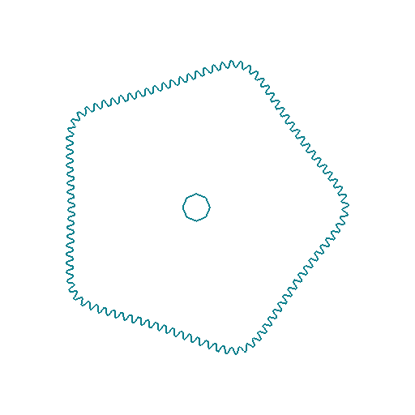
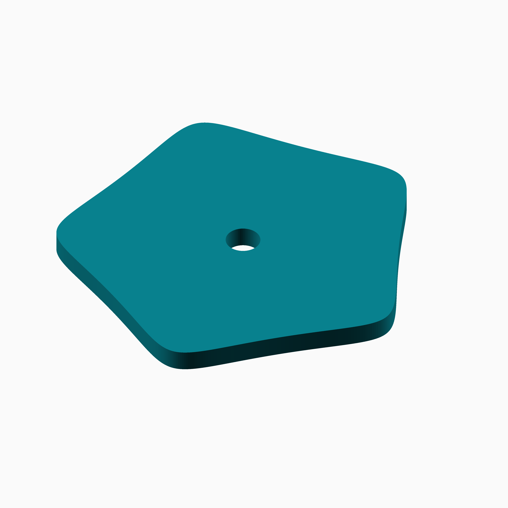
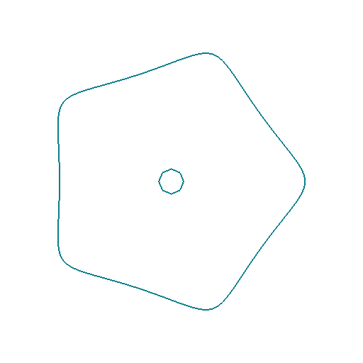
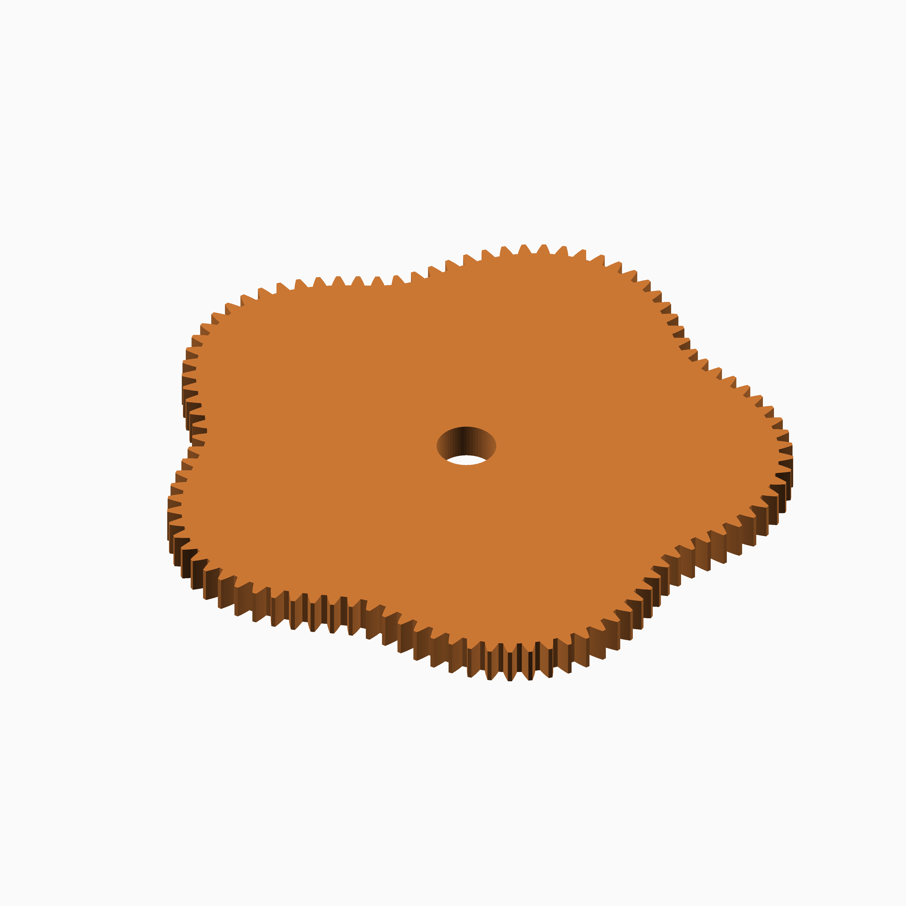

# Hypotrochoid

## Documentation navigation

- [README](../README.md)
- Families
  - [Bézier](bezier.md) · [Cassini](cassini.md) · [Circle](circle.md) · [Cosine Quintic](cosine_quintic.md) · [Cusp](cusp.md) · [Ellipse](ellipse.md) · [Epitrochoid](epitrochoid.md)
  - [Fourier](fourier.md) · [Hypotrochoid](hypotrochoid.md) · [Lobed](lobed.md) · [Logarithmic spiral](logarithmic_spiral.md) · [Logistic Dwell](logistic_dwell.md) · [Pascal](pascal.md) · [Superformula](superformula.md) · [Tanh Triad](tanh_triad.md) · [Temple Fay](temple_fay.md)
- Shared
  - [Examples catalogue](../examples/README.md) · [Test layout](../tests/README.md)
  - [Tooth construction](tooth-construction.md) · [Tooth placement](tooth-placement.md) · [Mate motion](mate-motion.md) · [Mate generation](mate-generation.md) · [Pair assembly](pair-assembly.md)

## Module `Hypotrochoid`

The curve is generated by a point on a circle rolling inside a fixed
circle. The documented ratio constraints reject cusp and loop cases.

### Brief content:

**Functions**:

> [`curve_gear_hypotrochoid`](#function-curve_gear_hypotrochoid): Build a hypotrochoid non-circular gear.

> [`curve_gear_hypotrochoid_2d`](#function-curve_gear_hypotrochoid_2d): Emit the complete hypotrochoid gear profile as 2D geometry.

> [`curve_gear_hypotrochoid_body`](#function-curve_gear_hypotrochoid_body): Build the hypotrochoid body solid without teeth.

> [`curve_gear_hypotrochoid_body_2d`](#function-curve_gear_hypotrochoid_body_2d): Emit the hypotrochoid body as 2D geometry with an optional signed outer-contour offset.

> [`curve_gear_hypotrochoid_centre_distance`](#function-curve_gear_hypotrochoid_centre_distance): Return the mathematical centre distance for a hypotrochoid pair.

> [`curve_gear_hypotrochoid_mate`](#function-curve_gear_hypotrochoid_mate): Build the standalone conjugate mate for a hypotrochoid driver.

> [`curve_gear_hypotrochoid_mate_rotation`](#function-curve_gear_hypotrochoid_mate_rotation): Return the conjugate hypotrochoid mate rotation for a driver phase.

> [`curve_gear_hypotrochoid_pair`](#function-curve_gear_hypotrochoid_pair): Build a meshed or separated hypotrochoid driver/mate pair.

> [`_cg_hypotrochoid_build`](#function-_cg_hypotrochoid_build): Construct a validated hypotrochoid body, gear, or mate boundary.

> [`_cg_hypotrochoid_centre_distance`](#function-_cg_hypotrochoid_centre_distance): Solve the fixed centre distance for a hypotrochoid mate.

> [`_cg_hypotrochoid_curve_radius`](#function-_cg_hypotrochoid_curve_radius): Evaluate the scaled hypotrochoid radius at a polar angle.

> [`_cg_hypotrochoid_driver_radii`](#function-_cg_hypotrochoid_driver_radii): Sample the driver polygon at physical polar phase boundaries.

> [`_cg_hypotrochoid_mate_points`](#function-_cg_hypotrochoid_mate_points): Return the conjugate mate pitch points for a hypotrochoid.

> [`_cg_hypotrochoid_mate_points_from_driver`](#function-_cg_hypotrochoid_mate_points_from_driver): Generate mate pitch points from driver phase samples.

> [`_cg_hypotrochoid_motion_radii`](#function-_cg_hypotrochoid_motion_radii): Sample the driver polygon at physical polar integration midpoints.

> [`_cg_hypotrochoid_motion_table`](#function-_cg_hypotrochoid_motion_table): Integrate hypotrochoid driver-to-mate phase motion.

> [`_cg_hypotrochoid_point`](#function-_cg_hypotrochoid_point): Evaluate one point on the inner-rolling hypotrochoid.

> [`_cg_hypotrochoid_points`](#function-_cg_hypotrochoid_points): Sample a complete hypotrochoid curve.

> [`_cg_hypotrochoid_points_scaled`](#function-_cg_hypotrochoid_points_scaled): Sample a hypotrochoid at the requested physical scale.

> [`_cg_hypotrochoid_radius`](#function-_cg_hypotrochoid_radius): Evaluate the unit-scale hypotrochoid radius at an angle.

> [`_cg_hypotrochoid_scale`](#function-_cg_hypotrochoid_scale): Scale the hypotrochoid to the requested module and tooth count.

## Functions

The module `Hypotrochoid` defines the following functions.

### Function `curve_gear_hypotrochoid`

| Hypotrochoid gear 1 | Hypotrochoid gear 2 |
| --- | --- |
|  |  |

A 5:1 rolling ratio and offset 0.35 produce five-fold shaping rather than the canonical three-fold outline. The alternative changes the curve itself, not merely the pair spacing.

**Parameters:**

- `modul`: {number > 0} Tooth module in mm.
- `tooth_number`: {integer >= 3} Number of teeth.
- `width`: {number > 0} Extrusion width in mm.
- `bore`: {number >= 0} Centre bore diameter in mm.
- `major_ratio`: {number > rolling_ratio, default 3} Fixed-to-rolling circle ratio.
- `rolling_ratio`: {number > 0, default 1} Rolling-circle ratio.
- `offset_ratio`: {0 < offset < rolling_ratio, default 0.35} Pen offset ratio.
- `pressure_angle`: {0 < angle < 90, default 20} Involute pressure angle.
- `tooth_phase`: {angle, default 0} Tooth placement phase.
- `backlash`: {undef or >= 0} Tangential tooth-thickness reduction in mm.
- `clearance`: {undef or >= 0} Additional radial root clearance in mm.
- `samples`: {integer >= 120, default 720} Curve sampling density.
- `orientation`: {angle, default 0} Single-gear display rotation.

**Returns:**

No return

### Example:

~~~c
curve_gear_hypotrochoid(1, 24, 4, 8);
~~~

Back to [module description](#module-hypotrochoid).

### Function `curve_gear_hypotrochoid_2d`

| Hypotrochoid 2D gear 1 | Hypotrochoid 2D gear 2 |
| --- | --- |
|  |  |

Alternative 2 uses the contrasting controls described in the gear example.

**Parameters:**

- `modul`: {value} Tooth module in mm.
- `tooth_number`: {value} Number of teeth.
- `bore`: {value} Centre bore diameter in mm.
- `major_ratio`: {value} Same family-specific parameter as curve_gear_hypotrochoid.
- `rolling_ratio`: {value} Same family-specific parameter as curve_gear_hypotrochoid.
- `offset_ratio`: {value} Same family-specific parameter as curve_gear_hypotrochoid.
- `pressure_angle`: {value} Same family-specific parameter as curve_gear_hypotrochoid.
- `tooth_phase`: {value} Same family-specific parameter as curve_gear_hypotrochoid.
- `backlash`: {value} Same family-specific parameter as curve_gear_hypotrochoid.
- `clearance`: {value} Same family-specific parameter as curve_gear_hypotrochoid.
- `samples`: {value} Same family-specific parameter as curve_gear_hypotrochoid.
- `orientation`: {value} Rotation in degrees.

**Returns:**

No return

### Example:

~~~c
curve_gear_hypotrochoid_2d(0.8, 34, 4.8);
~~~

Back to [module description](#module-hypotrochoid).

### Function `curve_gear_hypotrochoid_body`

| Hypotrochoid body 1 | Hypotrochoid body 2 |
| --- | --- |
|  |  |

Alternative 2 uses the contrasting controls described in the gear example.

**Parameters:**

- `modul`: {number > 0} Tooth module in mm.
- `tooth_number`: {integer >= 3} Number of teeth.
- `width`: {number > 0} Extrusion width in mm.
- `bore`: {number >= 0} Centre bore diameter in mm.
- `major_ratio`: {number > rolling_ratio, default 3} Fixed-to-rolling circle ratio.
- `rolling_ratio`: {number > 0, default 1} Rolling-circle ratio.
- `offset_ratio`: {0 < offset < rolling_ratio, default 0.35} Pen offset ratio.
- `pressure_angle`: {0 < angle < 90, default 20} Involute pressure angle.
- `tooth_phase`: {angle, default 0} Tooth placement phase.
- `backlash`: {undef or >= 0} Tangential tooth-thickness reduction in mm.
- `clearance`: {undef or >= 0} Additional radial root clearance in mm.
- `samples`: {integer >= 120, default 720} Curve sampling density.
- `orientation`: {angle, default 0} Single-gear display rotation.

**Returns:**

No return

Back to [module description](#module-hypotrochoid).

### Function `curve_gear_hypotrochoid_body_2d`

| Hypotrochoid 2D body 1 | Hypotrochoid 2D body 2 |
| --- | --- |
|  |  |

Alternative 2 uses the contrasting controls described in the gear example.

**Parameters:**

- `modul`: {value} Tooth module in mm.
- `tooth_number`: {value} Number of teeth.
- `bore`: {value} Centre bore diameter in mm.
- `major_ratio`: {value} Same family-specific parameter as curve_gear_hypotrochoid_body.
- `rolling_ratio`: {value} Same family-specific parameter as curve_gear_hypotrochoid_body.
- `offset_ratio`: {value} Same family-specific parameter as curve_gear_hypotrochoid_body.
- `pressure_angle`: {value} Same family-specific parameter as curve_gear_hypotrochoid_body.
- `tooth_phase`: {value} Same family-specific parameter as curve_gear_hypotrochoid_body.
- `backlash`: {value} Same family-specific parameter as curve_gear_hypotrochoid_body.
- `clearance`: {value} Same family-specific parameter as curve_gear_hypotrochoid_body.
- `samples`: {value} Same family-specific parameter as curve_gear_hypotrochoid_body.
- `orientation`: {value} Rotation in degrees.
- `body_offset`: {value} Signed offset in mm; negative values shrink the outer body contour while preserving the bore.

**Returns:**

No return

### Example:

~~~c
curve_gear_hypotrochoid_body_2d(0.8, 34, 4.8, body_offset=-2);
~~~

Back to [module description](#module-hypotrochoid).

### Function `curve_gear_hypotrochoid_centre_distance`

Return the mathematical centre distance for a hypotrochoid pair.

**Parameters:**

- `modul`: {number > 0} Tooth module in mm.
- `tooth_number`: {integer >= 3} Number of teeth.
- `major_ratio`: {number > rolling_ratio, default 3} Fixed-to-rolling circle ratio.
- `rolling_ratio`: {number > 0, default 1} Rolling-circle ratio.
- `offset_ratio`: {0 < offset < rolling_ratio, default 0.35} Pen offset ratio.
- `samples`: {integer >= 120, default 720} Motion sampling density.

**Returns:**

- `{number}`: Pair centre distance in mm.

Back to [module description](#module-hypotrochoid).

### Function `curve_gear_hypotrochoid_mate`

| Hypotrochoid mate 1 | Hypotrochoid mate 2 |
| --- | --- |
|  |  |

Alternative 2 uses the contrasting controls described in the gear example.

**Parameters:**

- `modul`: {number > 0} Tooth module in mm.
- `tooth_number`: {integer >= 3} Number of teeth.
- `width`: {number > 0} Extrusion width in mm.
- `bore`: {number >= 0} Centre bore diameter in mm.
- `major_ratio`: {number > rolling_ratio, default 3} Fixed-to-rolling circle ratio.
- `rolling_ratio`: {number > 0, default 1} Rolling-circle ratio.
- `offset_ratio`: {0 < offset < rolling_ratio, default 0.35} Pen offset ratio.
- `pressure_angle`: {0 < angle < 90, default 20} Involute pressure angle.
- `tooth_phase`: {angle, default 0} Tooth placement phase.
- `backlash`: {undef or >= 0} Tangential tooth-thickness reduction in mm.
- `clearance`: {undef or >= 0} Additional radial root clearance in mm.
- `samples`: {integer >= 120, default 720} Pitch-curve sampling density.

**Returns:**

No return

Back to [module description](#module-hypotrochoid).

### Function `curve_gear_hypotrochoid_mate_rotation`

Return the conjugate hypotrochoid mate rotation for a driver phase.

**Parameters:**

- `modul`: {number > 0} Tooth module in mm.
- `tooth_number`: {integer >= 3} Number of teeth.
- `major_ratio`: {number > rolling_ratio, default 3} Fixed-to-rolling circle ratio.
- `rolling_ratio`: {number > 0, default 1} Rolling-circle ratio.
- `offset_ratio`: {0 < offset < rolling_ratio, default 0.35} Pen offset ratio.
- `samples`: {integer >= 120, default 720} Motion sampling density.
- `phase`: {angle, default 0} Driver motion phase in degrees.

**Returns:**

- `{angle}`: Mate rotation in degrees.

Back to [module description](#module-hypotrochoid).

### Function `curve_gear_hypotrochoid_pair`

| Hypotrochoid pair 1 | Hypotrochoid pair 2 |
| --- | --- |
|  |  |

The separated display alternative uses `together_built=false`; its curated
scenario example lives beside the public pair example.
Alternative 2 separates the driver and mate and uses the contrasting gear controls described above.

**Parameters:**

- `modul`: {number > 0, default .8} Tooth module in mm.
- `tooth_number`: {integer >= 3, default 34} Number of teeth.
- `width`: {number > 0, default 4} Extrusion width in mm.
- `bore`: {number >= 0, default 4.8} Centre bore diameter in mm.
- `major_ratio`: {number > rolling_ratio, default 3} Fixed-to-rolling circle ratio.
- `rolling_ratio`: {number > 0, default 1} Rolling-circle ratio.
- `offset_ratio`: {0 < offset < rolling_ratio, default 0.35} Pen offset ratio.
- `pressure_angle`: {0 < angle < 90, default 20} Involute pressure angle.
- `samples`: {integer >= 120, default 720} Pitch-curve sampling density.
- `phase`: {angle, default 0} Driver motion phase in degrees.
- `together_built`: {boolean, default true} Place the pair meshed when true, separated when false.
- `backlash`: {undef or >= 0, default undef} Tangential tooth-thickness reduction in mm.
- `clearance`: {undef or >= 0, default undef} Additional radial root clearance in mm.
- `tooth_phase`: {angle, default 0} Tooth placement phase in degrees.
- `driver_color`: {OpenSCAD colour, default SteelBlue} Driver display colour.
- `mate_color`: {OpenSCAD colour, default Gold} Mate display colour.

**Returns:**

No return

Back to [module description](#module-hypotrochoid).

### Function `_cg_hypotrochoid_build`

Construct a validated hypotrochoid body, gear, or mate boundary.

**Parameters:**

- `modul`: {number > 0} Tooth module in millimetres.
- `tooth_number`: {integer >= 3} Number of teeth.
- `width`: {number > 0} Extrusion width in millimetres.
- `bore`: {number >= 0} Centre bore diameter in millimetres.
- `major_ratio`: {number > rolling_ratio, default 3} Fixed-circle radius ratio.
- `rolling_ratio`: {number > 0, default 1} Rolling-circle radius ratio.
- `offset_ratio`: {0 < offset < rolling_ratio, default 0.35} Pen offset ratio.
- `pressure_angle`: {0 < angle < 90, default 20} Involute pressure angle.
- `tooth_phase`: {angle, default 0} Tooth placement phase in degrees.
- `backlash`: {undef or >= 0} Tangential tooth-thickness reduction.
- `clearance`: {undef or >= 0} Additional radial root clearance.
- `samples`: {integer >= 120, default 720} Pitch-curve sample count.
- `orientation`: {angle, default 0} Display rotation in degrees.
- `body_only`: {boolean, default false} Emit the body without teeth.

**Returns:**

No return

Back to [module description](#module-hypotrochoid).

### Function `_cg_hypotrochoid_centre_distance`

Solve the fixed centre distance for a hypotrochoid mate.

**Parameters:**

- `scale`: {number > 0} Curve scale in millimetres.
- `R`: {number > 0} Fixed-circle radius ratio.
- `r`: {number > 0} Rolling-circle radius ratio.
- `d`: {number >= 0} Pen offset ratio.
- `n`: {integer >= 1, default 720} Number of motion intervals.

**Returns:**

- `{number}`: Solved centre distance in millimetres.

Back to [module description](#module-hypotrochoid).

### Function `_cg_hypotrochoid_curve_radius`

Evaluate the scaled hypotrochoid radius at a polar angle.

**Parameters:**

- `scale`: {number > 0} Curve scale in millimetres.
- `R`: {number > 0} Fixed-circle radius ratio.
- `r`: {number > 0} Rolling-circle radius ratio.
- `d`: {number >= 0} Pen offset ratio.
- `theta`: {angle} Polar angle in degrees.

**Returns:**

- `{number}`: Scaled pitch radius in millimetres.

Back to [module description](#module-hypotrochoid).

### Function `_cg_hypotrochoid_driver_radii`

Sample the driver polygon at physical polar phase boundaries.

**Parameters:**

- `scale`: {number > 0} Curve scale in millimetres.
- `R`: {number > 0} Fixed-circle radius ratio.
- `r`: {number > 0} Rolling-circle radius ratio.
- `d`: {number >= 0} Pen offset ratio.
- `n`: {integer >= 3, default 720} Number of phase intervals.

**Returns:**

- `{array of number}`: Driver pitch radii.

Back to [module description](#module-hypotrochoid).

### Function `_cg_hypotrochoid_mate_points`

Return the conjugate mate pitch points for a hypotrochoid.

**Parameters:**

- `scale`: {number > 0} Curve scale in millimetres.
- `R`: {number > 0} Fixed-circle radius ratio.
- `r`: {number > 0} Rolling-circle radius ratio.
- `d`: {number >= 0} Pen offset ratio.
- `D`: {number > 0} Fixed centre distance in millimetres.
- `n`: {integer >= 1, default 720} Number of phase intervals.

**Returns:**

- `{array of points}`: Conjugate mate pitch points.

Back to [module description](#module-hypotrochoid).

### Function `_cg_hypotrochoid_mate_points_from_driver`

Generate mate pitch points from driver phase samples.

**Parameters:**

- `scale`: {number > 0} Curve scale in millimetres.
- `R`: {number > 0} Fixed-circle radius ratio.
- `r`: {number > 0} Rolling-circle radius ratio.
- `d`: {number >= 0} Pen offset ratio.
- `D`: {number > 0} Fixed centre distance in millimetres.
- `n`: {integer >= 1, default 720} Number of phase intervals.

**Returns:**

- `{array of points}`: Conjugate mate pitch points.

Back to [module description](#module-hypotrochoid).

### Function `_cg_hypotrochoid_motion_radii`

Sample the driver polygon at physical polar integration midpoints.

**Parameters:**

- `scale`: {number > 0} Curve scale in millimetres.
- `R`: {number > 0} Fixed-circle radius ratio.
- `r`: {number > 0} Rolling-circle radius ratio.
- `d`: {number >= 0} Pen offset ratio.
- `n`: {integer >= 3, default 720} Number of motion intervals.

**Returns:**

- `{array of number}`: Midpoint pitch radii.

Back to [module description](#module-hypotrochoid).

### Function `_cg_hypotrochoid_motion_table`

Integrate hypotrochoid driver-to-mate phase motion.

**Parameters:**

- `scale`: {number > 0} Curve scale in millimetres.
- `R`: {number > 0} Fixed-circle radius ratio.
- `r`: {number > 0} Rolling-circle radius ratio.
- `d`: {number >= 0} Pen offset ratio.
- `D`: {number > 0} Fixed centre distance in millimetres.
- `n`: {integer >= 1, default 720} Number of motion intervals.

**Returns:**

- `{array}`: Integrated driver and mate phase table.

Back to [module description](#module-hypotrochoid).

### Function `_cg_hypotrochoid_point`

Evaluate one point on the inner-rolling hypotrochoid.

**Parameters:**

- `R`: {number > 0} Fixed-circle radius ratio.
- `r`: {number > 0} Rolling-circle radius ratio.
- `d`: {number >= 0} Pen offset ratio.
- `theta`: {angle} Rolling parameter in degrees.

**Returns:**

- `{array}`: Cartesian point in the curve's unit scale.

Back to [module description](#module-hypotrochoid).

### Function `_cg_hypotrochoid_points`

Sample a complete hypotrochoid curve.

**Parameters:**

- `R`: {number > 0} Fixed-circle radius ratio.
- `r`: {number > 0} Rolling-circle radius ratio.
- `d`: {number >= 0} Pen offset ratio.
- `n`: {integer >= 1, default 720} Number of curve samples.

**Returns:**

- `{array of points}`: Sampled unit-scale hypotrochoid.

Back to [module description](#module-hypotrochoid).

### Function `_cg_hypotrochoid_points_scaled`

Sample a hypotrochoid at the requested physical scale.

**Parameters:**

- `scale`: {number > 0} Curve scale in millimetres.
- `R`: {number > 0} Fixed-circle radius ratio.
- `r`: {number > 0} Rolling-circle radius ratio.
- `d`: {number >= 0} Pen offset ratio.
- `n`: {integer >= 1, default 720} Number of samples.

**Returns:**

- `{array of points}`: Scaled hypotrochoid in millimetres.

Back to [module description](#module-hypotrochoid).

### Function `_cg_hypotrochoid_radius`

Evaluate the unit-scale hypotrochoid radius at an angle.

**Parameters:**

- `R`: {number > 0} Fixed-circle radius ratio.
- `r`: {number > 0} Rolling-circle radius ratio.
- `d`: {number >= 0} Pen offset ratio.
- `theta`: {angle} Polar angle in degrees.

**Returns:**

- `{number}`: Unit-scale radius.

Back to [module description](#module-hypotrochoid).

### Function `_cg_hypotrochoid_scale`

Scale the hypotrochoid to the requested module and tooth count.

**Parameters:**

- `modul`: {number > 0} Tooth module in millimetres.
- `tooth_number`: {integer >= 3} Number of teeth.
- `R`: {number > r, default 3} Fixed-circle radius ratio.
- `r`: {number > 0, default 1} Rolling-circle radius ratio.
- `d`: {0 < d < r, default 0.35} Pen offset ratio.
- `n`: {integer >= 1, default 720} Number of scale samples.
- `unit_points`: {array of points, default undef} Optional pre-sampled unit curve.

**Returns:**

- `{number}`: Curve scale in millimetres.

Back to [module description](#module-hypotrochoid).

Back to [top](#).

## Module `Trochoid common`

This file is an implementation detail. Public family APIs live in
`epitrochoid/` and `hypotrochoid/`; the rolling equations remain in those
family modules. This layer contains only the shared curve post-processing.

### Brief content:

**Functions**:

> [`_cg_trochoid_curve_radius_from_point`](#function-_cg_trochoid_curve_radius_from_point): Evaluate the radial distance of a scaled curve point.

> [`_cg_trochoid_points_scaled_from_points`](#function-_cg_trochoid_points_scaled_from_points): Scale sampled unit-curve points.

> [`_cg_trochoid_polar_radii`](#function-_cg_trochoid_polar_radii): Sample the emitted driver polygon at uniformly spaced physical polar angles.

> [`_cg_trochoid_polar_table`](#function-_cg_trochoid_polar_table): Index a finite star-shaped driver polygon by monotonically increasing physical polar angle.

> [`_cg_trochoid_radius_at_polar_angle`](#function-_cg_trochoid_radius_at_polar_angle): Intersect a physical polar ray with the indexed polygon segment, without interpolating curve parameters.

> [`_cg_trochoid_radius_from_point`](#function-_cg_trochoid_radius_from_point): Evaluate the radial distance of a unit-curve point.

> [`_cg_trochoid_scale_from_points`](#function-_cg_trochoid_scale_from_points): Scale a sampled unit curve to the requested tooth pitch.

> [`_cg_trochoid_shape`](#function-_cg_trochoid_shape): Bind a sampled trochoid polygon to the shared physical-angle shape contract.

## Functions

The module `Trochoid common` defines the following functions.

### Function `_cg_trochoid_curve_radius_from_point`

Evaluate the radial distance of a scaled curve point.

**Parameters:**

No parameters

**Returns:**

No return

Back to [module description](#module-trochoid-common).

### Function `_cg_trochoid_points_scaled_from_points`

Scale sampled unit-curve points.

**Parameters:**

No parameters

**Returns:**

No return

Back to [module description](#module-trochoid-common).

### Function `_cg_trochoid_polar_radii`

Sample the emitted driver polygon at uniformly spaced physical polar angles.

**Parameters:**

- `points`: {array of 2D points} Closed star-shaped driver polygon.
- `n`: {integer >= 3} Number of motion intervals.
- `midpoint`: {boolean, default false} Use integration midpoints instead of phase boundaries.

**Returns:**

- `{array of number}`: Physical pitch radii in increasing angular order.

Back to [module description](#module-trochoid-common).

### Function `_cg_trochoid_polar_table`

Index a finite star-shaped driver polygon by monotonically increasing physical polar angle.

**Parameters:**

- `points`: {array of 2D points} Closed polygon starting on the positive X ray.

**Returns:**

- `{array}`: Angle/point rows with an explicit closing row at 360 degrees.

Back to [module description](#module-trochoid-common).

### Function `_cg_trochoid_radius_at_polar_angle`

Intersect a physical polar ray with the indexed polygon segment, without interpolating curve parameters.

**Parameters:**

- `table`: {array} Validated angle/point table.
- `theta`: {angle} Physical polar angle in degrees.

**Returns:**

- `{number}`: Radius of the exact sampled driver polygon at that angle.

Back to [module description](#module-trochoid-common).

### Function `_cg_trochoid_radius_from_point`

Evaluate the radial distance of a unit-curve point.

**Parameters:**

No parameters

**Returns:**

No return

Back to [module description](#module-trochoid-common).

### Function `_cg_trochoid_scale_from_points`

Scale a sampled unit curve to the requested tooth pitch.

**Parameters:**

No parameters

**Returns:**

No return

Back to [module description](#module-trochoid-common).

### Function `_cg_trochoid_shape`

Bind a sampled trochoid polygon to the shared physical-angle shape contract.

**Parameters:**

- `unit_points`: {array of 2D points} Unit-scale driver polygon.
- `scale`: {number > 0} Perimeter-derived physical scale.
- `lower`: {number} Solver lower bound.
- `upper`: {number} Solver upper bound.
- `radial_root`: {boolean, default false} Use radial-root tooth placement.

**Returns:**

- `{array}`: `[driver points, physical radius function, lower, upper, radial_root]`.

Back to [module description](#module-trochoid-common).

Back to [top](#).

---

[Back to the CurveGears README](../README.md)

*Generated by Doxydown from repository source comments; do not edit this page directly.*
