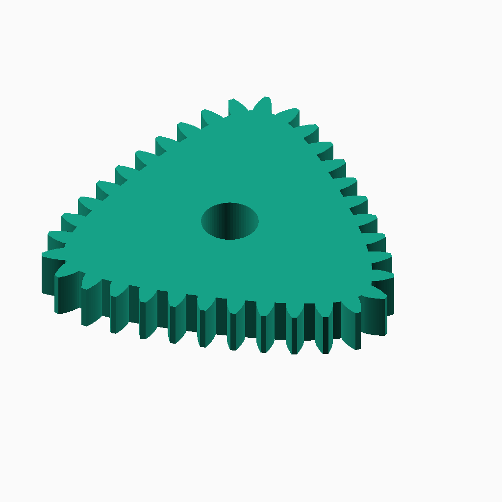
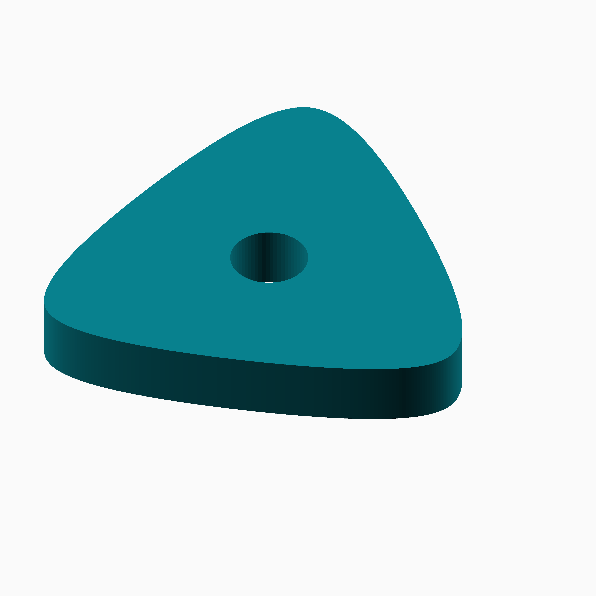
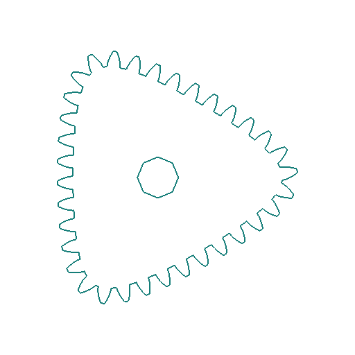
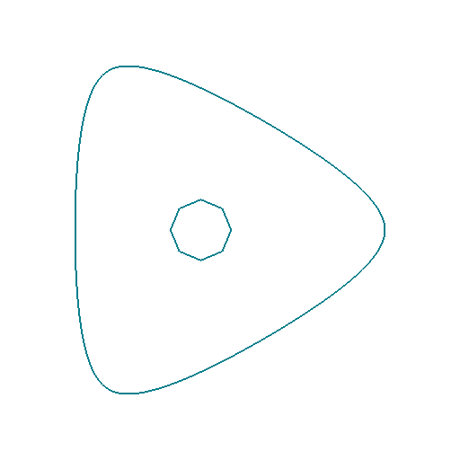
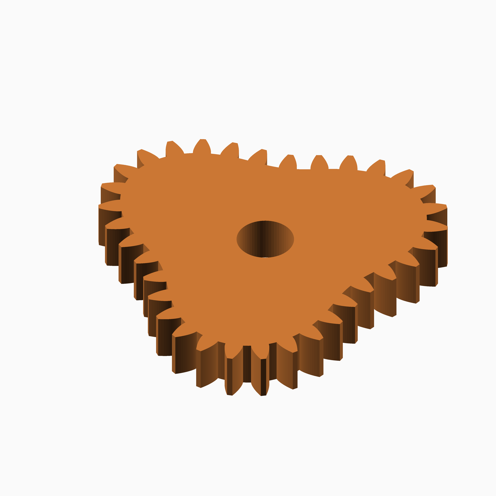
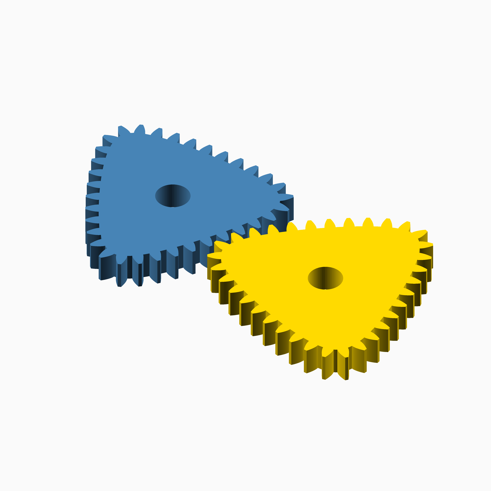
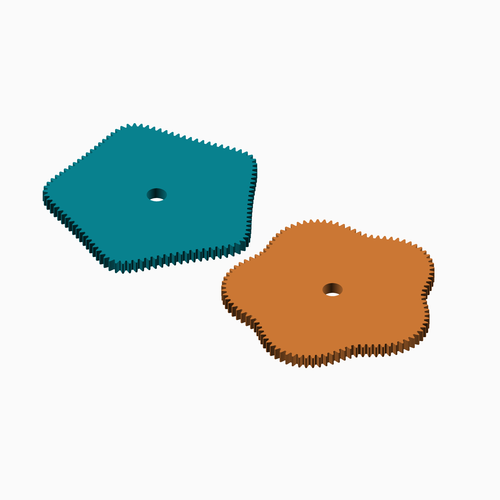

# Hypotrochoid

## Documentation navigation

- [README](../README.md)
- Families
  - [Bézier](bezier.md) · [Cassini](cassini.md) · [Circle](circle.md) · [Cusp](cusp.md) · [Ellipse](ellipse.md) · [Epitrochoid](epitrochoid.md)
  - [Fourier](fourier.md) · [Hypotrochoid](hypotrochoid.md) · [Lobed](lobed.md) · [Logarithmic spiral](logarithmic_spiral.md) · [Pascal](pascal.md) · [Superformula](superformula.md)
- Shared
  - [Examples catalogue](../examples/README.md) · [Test layout](../tests/README.md)
  - [Tooth construction](tooth-construction.md) · [Tooth placement](tooth-placement.md) · [Mate motion](mate-motion.md) · [Mate generation](mate-generation.md) · [Pair assembly](pair-assembly.md)

## Module `Hypotrochoid`

The curve is generated by a point on a circle rolling inside a fixed
circle. The documented ratio constraints reject cusp and loop cases.

### Brief content:

**Functions**:

> [`curve_gear_hypotrochoid(modul, tooth_number, width, bore, ...)`](#function-curve_gear_hypotrochoidmodul-tooth_number-width-bore-): Build a hypotrochoid non-circular gear.

> [`curve_gear_hypotrochoid_body`](#function-curve_gear_hypotrochoid_body): Build the hypotrochoid body solid without teeth.

> [`curve_gear_hypotrochoid_2d`](#function-curve_gear_hypotrochoid_2d): Emit the complete hypotrochoid gear profile as 2D geometry.

> [`curve_gear_hypotrochoid_body_2d`](#function-curve_gear_hypotrochoid_body_2d): Emit the hypotrochoid body as 2D geometry with an optional signed outer-contour offset.

> [`curve_gear_hypotrochoid_mate`](#function-curve_gear_hypotrochoid_mate): Build the standalone conjugate mate for a hypotrochoid driver.

> [`curve_gear_hypotrochoid_centre_distance`](#function-curve_gear_hypotrochoid_centre_distance): Return the mathematical centre distance for a hypotrochoid pair.

> [`curve_gear_hypotrochoid_mate_rotation`](#function-curve_gear_hypotrochoid_mate_rotation): Return the conjugate hypotrochoid mate rotation for a driver phase.

> [`curve_gear_hypotrochoid_pair`](#function-curve_gear_hypotrochoid_pair): Build a meshed or separated hypotrochoid driver/mate pair.

> [`_cg_hypotrochoid_point(R, r, d, theta)`](#function-_cg_hypotrochoid_pointr-r-d-theta): Evaluate one point on the inner-rolling hypotrochoid.

> [`_cg_hypotrochoid_points(R, r, d, n=720)`](#function-_cg_hypotrochoid_pointsr-r-d-n720): Sample a complete hypotrochoid curve.

> [`_cg_hypotrochoid_scale(modul, tooth_number, R=3, r=1, d=0.35, n=720, unit_points=undef)`](#function-_cg_hypotrochoid_scalemodul-tooth_number-r3-r1-d035-n720-unit_pointsundef): Scale the hypotrochoid to the requested module and tooth count.

> [`_cg_hypotrochoid_radius(R, r, d, theta)`](#function-_cg_hypotrochoid_radiusr-r-d-theta): Evaluate the unit-scale hypotrochoid radius at an angle.

> [`_cg_hypotrochoid_curve_radius(scale, R, r, d, theta)`](#function-_cg_hypotrochoid_curve_radiusscale-r-r-d-theta): Evaluate the scaled hypotrochoid radius at a polar angle.

> [`_cg_hypotrochoid_points_scaled(scale, R, r, d, n=720)`](#function-_cg_hypotrochoid_points_scaledscale-r-r-d-n720): Sample a hypotrochoid at the requested physical scale.

> [`_cg_hypotrochoid_build(modul, tooth_number, width, bore, major_ratio=3, rolling_ratio=1, offset_ratio=0.35, pressure_angle=20, tooth_phase=0, backlash=undef, clearance=undef, samples=720, orientation=0, body_only=false)`](#function-_cg_hypotrochoid_buildmodul-tooth_number-width-bore-major_ratio3-rolling_ratio1-offset_ratio035-pressure_angle20-tooth_phase0-backlashundef-clearanceundef-samples720-orientation0-body_onlyfalse): Construct a validated hypotrochoid body, gear, or mate boundary.

> [`_cg_hypotrochoid_motion_radii(scale, R, r, d, n=720)`](#function-_cg_hypotrochoid_motion_radiiscale-r-r-d-n720): Sample hypotrochoid radii at motion-integration midpoints.

> [`_cg_hypotrochoid_driver_radii(scale, R, r, d, n=720)`](#function-_cg_hypotrochoid_driver_radiiscale-r-r-d-n720): Sample hypotrochoid radii at driver-phase boundaries.

> [`_cg_hypotrochoid_centre_distance(scale, R, r, d, n=720)`](#function-_cg_hypotrochoid_centre_distancescale-r-r-d-n720): Solve the fixed centre distance for a hypotrochoid mate.

> [`_cg_hypotrochoid_motion_table(scale, R, r, d, D, n=720)`](#function-_cg_hypotrochoid_motion_tablescale-r-r-d-d-n720): Integrate hypotrochoid driver-to-mate phase motion.

> [`_cg_hypotrochoid_mate_points_from_driver(scale, R, r, d, D, n=720)`](#function-_cg_hypotrochoid_mate_points_from_driverscale-r-r-d-d-n720): Generate mate pitch points from driver phase samples.

> [`_cg_hypotrochoid_mate_points(scale, R, r, d, D, n=720)`](#function-_cg_hypotrochoid_mate_pointsscale-r-r-d-d-n720): Return the conjugate mate pitch points for a hypotrochoid.

## Functions

The module `Hypotrochoid` defines the following functions.

### Function `_cg_hypotrochoid_point(R, r, d, theta)`

Evaluate one point on the inner-rolling hypotrochoid.

**Parameters:**

- `R`: {number > 0} Fixed-circle radius ratio.
- `r`: {number > 0} Rolling-circle radius ratio.
- `d`: {number >= 0} Pen offset ratio.
- `theta`: {angle} Rolling parameter in degrees.

**Returns:**

- `{array}`: Cartesian point in the curve's unit scale.

Back to [module description](#module-hypotrochoid).

### Function `_cg_hypotrochoid_points(R, r, d, n=720)`

Sample a complete hypotrochoid curve.

**Parameters:**

- `R`: {number > 0} Fixed-circle radius ratio.
- `r`: {number > 0} Rolling-circle radius ratio.
- `d`: {number >= 0} Pen offset ratio.
- `n`: {integer >= 1, default 720} Number of curve samples.

**Returns:**

- `{array of points}`: Sampled unit-scale hypotrochoid.

Back to [module description](#module-hypotrochoid).

### Function `_cg_hypotrochoid_scale(modul, tooth_number, R=3, r=1, d=0.35, n=720, unit_points=undef)`

Scale the hypotrochoid to the requested module and tooth count.

**Parameters:**

- `modul`: {number > 0} Tooth module in millimetres.
- `tooth_number`: {integer >= 3} Number of teeth.
- `R`: {number > r, default 3} Fixed-circle radius ratio.
- `r`: {number > 0, default 1} Rolling-circle radius ratio.
- `d`: {0 < d < r, default 0.35} Pen offset ratio.
- `n`: {integer >= 1, default 720} Number of scale samples.
- `unit_points`: {array of points, default undef} Optional pre-sampled unit curve.

**Returns:**

- `{number}`: Curve scale in millimetres.

Back to [module description](#module-hypotrochoid).

### Function `_cg_hypotrochoid_radius(R, r, d, theta)`

Evaluate the unit-scale hypotrochoid radius at an angle.

**Parameters:**

- `R`: {number > 0} Fixed-circle radius ratio.
- `r`: {number > 0} Rolling-circle radius ratio.
- `d`: {number >= 0} Pen offset ratio.
- `theta`: {angle} Polar angle in degrees.

**Returns:**

- `{number}`: Unit-scale radius.

Back to [module description](#module-hypotrochoid).

### Function `_cg_hypotrochoid_curve_radius(scale, R, r, d, theta)`

Evaluate the scaled hypotrochoid radius at a polar angle.

**Parameters:**

- `scale`: {number > 0} Curve scale in millimetres.
- `R`: {number > 0} Fixed-circle radius ratio.
- `r`: {number > 0} Rolling-circle radius ratio.
- `d`: {number >= 0} Pen offset ratio.
- `theta`: {angle} Polar angle in degrees.

**Returns:**

- `{number}`: Scaled pitch radius in millimetres.

Back to [module description](#module-hypotrochoid).

### Function `_cg_hypotrochoid_points_scaled(scale, R, r, d, n=720)`

Sample a hypotrochoid at the requested physical scale.

**Parameters:**

- `scale`: {number > 0} Curve scale in millimetres.
- `R`: {number > 0} Fixed-circle radius ratio.
- `r`: {number > 0} Rolling-circle radius ratio.
- `d`: {number >= 0} Pen offset ratio.
- `n`: {integer >= 1, default 720} Number of samples.

**Returns:**

- `{array of points}`: Scaled hypotrochoid in millimetres.

Back to [module description](#module-hypotrochoid).

### Function `curve_gear_hypotrochoid(modul, tooth_number, width, bore, ...)`

| Hypotrochoid gear preview | Full size |
| --- | --- |
|  | [Open full-size image](../images/functions/hypotrochoid/curve_gear_hypotrochoid.png)  |

Build a hypotrochoid non-circular gear.

**Parameters:**

- `modul`: {number > 0} Tooth module in mm.
- `tooth_number`: {integer >= 3} Number of teeth.
- `width`: {number > 0} Extrusion width in mm.
- `bore`: {number >= 0} Centre bore diameter in mm.
- `major_ratio`: {number > rolling_ratio, default 3} Fixed-to-rolling circle ratio.
- `rolling_ratio`: {number > 0, default 1} Rolling-circle ratio.
- `offset_ratio`: {0 < offset < rolling_ratio, default 0.35} Pen offset ratio.
- `pressure_angle`: {0 < angle < 90, default 20} Involute pressure angle.
- `tooth_phase`: {angle, default 0} Tooth placement phase.
- `backlash`: {undef or >= 0} Tangential tooth-thickness reduction in mm.
- `clearance`: {undef or >= 0} Additional radial root clearance in mm.
- `samples`: {integer >= 120, default 720} Curve sampling density.
- `orientation`: {angle, default 0} Single-gear display rotation.

**Returns:**

No return

### Example:

~~~c
curve_gear_hypotrochoid(1, 24, 4, 8);
~~~

Back to [module description](#module-hypotrochoid).

### Function `_cg_hypotrochoid_build(modul, tooth_number, width, bore, major_ratio=3, rolling_ratio=1, offset_ratio=0.35, pressure_angle=20, tooth_phase=0, backlash=undef, clearance=undef, samples=720, orientation=0, body_only=false)`

Construct a validated hypotrochoid body, gear, or mate boundary.

**Parameters:**

- `modul`: {number > 0} Tooth module in millimetres.
- `tooth_number`: {integer >= 3} Number of teeth.
- `width`: {number > 0} Extrusion width in millimetres.
- `bore`: {number >= 0} Centre bore diameter in millimetres.
- `major_ratio`: {number > rolling_ratio, default 3} Fixed-circle radius ratio.
- `rolling_ratio`: {number > 0, default 1} Rolling-circle radius ratio.
- `offset_ratio`: {0 < offset < rolling_ratio, default 0.35} Pen offset ratio.
- `pressure_angle`: {0 < angle < 90, default 20} Involute pressure angle.
- `tooth_phase`: {angle, default 0} Tooth placement phase in degrees.
- `backlash`: {undef or >= 0} Tangential tooth-thickness reduction.
- `clearance`: {undef or >= 0} Additional radial root clearance.
- `samples`: {integer >= 120, default 720} Pitch-curve sample count.
- `orientation`: {angle, default 0} Display rotation in degrees.
- `body_only`: {boolean, default false} Emit the body without teeth.

**Returns:**

No return

Back to [module description](#module-hypotrochoid).

### Function `curve_gear_hypotrochoid_body`

| Hypotrochoid body preview | Full size |
| --- | --- |
|  | [Open full-size image](../images/functions/hypotrochoid/curve_gear_hypotrochoid_body.png)  |

Build the hypotrochoid body solid without teeth.

**Parameters:**

- `modul`: {number > 0} Tooth module in mm.
- `tooth_number`: {integer >= 3} Number of teeth.
- `width`: {number > 0} Extrusion width in mm.
- `bore`: {number >= 0} Centre bore diameter in mm.
- `major_ratio`: {number > rolling_ratio, default 3} Fixed-to-rolling circle ratio.
- `rolling_ratio`: {number > 0, default 1} Rolling-circle ratio.
- `offset_ratio`: {0 < offset < rolling_ratio, default 0.35} Pen offset ratio.
- `pressure_angle`: {0 < angle < 90, default 20} Involute pressure angle.
- `tooth_phase`: {angle, default 0} Tooth placement phase.
- `backlash`: {undef or >= 0} Tangential tooth-thickness reduction in mm.
- `clearance`: {undef or >= 0} Additional radial root clearance in mm.
- `samples`: {integer >= 120, default 720} Curve sampling density.
- `orientation`: {angle, default 0} Single-gear display rotation.

**Returns:**

No return

Back to [module description](#module-hypotrochoid).

### Function `curve_gear_hypotrochoid_2d`

| hypotrochoid 2D gear and body preview | Full size |
| --- | --- |
|  | [Open full-size image](../images/functions/hypotrochoid/curve_gear_hypotrochoid_2d.png)  |

Emit the complete hypotrochoid gear profile as 2D geometry.

**Parameters:**

- `modul`: {value} Tooth module in mm.
- `tooth_number`: {value} Number of teeth.
- `bore`: {value} Centre bore diameter in mm.
- `major_ratio`: {value} Same family-specific parameter as curve_gear_hypotrochoid.
- `rolling_ratio`: {value} Same family-specific parameter as curve_gear_hypotrochoid.
- `offset_ratio`: {value} Same family-specific parameter as curve_gear_hypotrochoid.
- `pressure_angle`: {value} Same family-specific parameter as curve_gear_hypotrochoid.
- `tooth_phase`: {value} Same family-specific parameter as curve_gear_hypotrochoid.
- `backlash`: {value} Same family-specific parameter as curve_gear_hypotrochoid.
- `clearance`: {value} Same family-specific parameter as curve_gear_hypotrochoid.
- `samples`: {value} Same family-specific parameter as curve_gear_hypotrochoid.
- `orientation`: {value} Rotation in degrees.

**Returns:**

No return

### Example:

~~~c
curve_gear_hypotrochoid_2d(0.8, 34, 4.8);
~~~

Back to [module description](#module-hypotrochoid).

### Function `curve_gear_hypotrochoid_body_2d`

| hypotrochoid 2D body preview | Full size |
| --- | --- |
|  | [Open full-size image](../images/functions/hypotrochoid/curve_gear_hypotrochoid_body_2d.png)  |

Emit the hypotrochoid body as 2D geometry with an optional signed outer-contour offset.

**Parameters:**

- `modul`: {value} Tooth module in mm.
- `tooth_number`: {value} Number of teeth.
- `bore`: {value} Centre bore diameter in mm.
- `major_ratio`: {value} Same family-specific parameter as curve_gear_hypotrochoid_body.
- `rolling_ratio`: {value} Same family-specific parameter as curve_gear_hypotrochoid_body.
- `offset_ratio`: {value} Same family-specific parameter as curve_gear_hypotrochoid_body.
- `pressure_angle`: {value} Same family-specific parameter as curve_gear_hypotrochoid_body.
- `tooth_phase`: {value} Same family-specific parameter as curve_gear_hypotrochoid_body.
- `backlash`: {value} Same family-specific parameter as curve_gear_hypotrochoid_body.
- `clearance`: {value} Same family-specific parameter as curve_gear_hypotrochoid_body.
- `samples`: {value} Same family-specific parameter as curve_gear_hypotrochoid_body.
- `orientation`: {value} Rotation in degrees.
- `body_offset`: {value} Signed offset in mm; negative values shrink the outer body contour while preserving the bore.

**Returns:**

No return

### Example:

~~~c
curve_gear_hypotrochoid_body_2d(0.8, 34, 4.8, body_offset=-2);
~~~

Back to [module description](#module-hypotrochoid).

### Function `_cg_hypotrochoid_motion_radii(scale, R, r, d, n=720)`

Sample hypotrochoid radii at motion-integration midpoints.

**Parameters:**

- `scale`: {number > 0} Curve scale in millimetres.
- `R`: {number > 0} Fixed-circle radius ratio.
- `r`: {number > 0} Rolling-circle radius ratio.
- `d`: {number >= 0} Pen offset ratio.
- `n`: {integer >= 1, default 720} Number of motion intervals.

**Returns:**

- `{array of number}`: Midpoint pitch radii.

Back to [module description](#module-hypotrochoid).

### Function `_cg_hypotrochoid_driver_radii(scale, R, r, d, n=720)`

Sample hypotrochoid radii at driver-phase boundaries.

**Parameters:**

- `scale`: {number > 0} Curve scale in millimetres.
- `R`: {number > 0} Fixed-circle radius ratio.
- `r`: {number > 0} Rolling-circle radius ratio.
- `d`: {number >= 0} Pen offset ratio.
- `n`: {integer >= 1, default 720} Number of phase intervals.

**Returns:**

- `{array of number}`: Driver pitch radii.

Back to [module description](#module-hypotrochoid).

### Function `_cg_hypotrochoid_centre_distance(scale, R, r, d, n=720)`

Solve the fixed centre distance for a hypotrochoid mate.

**Parameters:**

- `scale`: {number > 0} Curve scale in millimetres.
- `R`: {number > 0} Fixed-circle radius ratio.
- `r`: {number > 0} Rolling-circle radius ratio.
- `d`: {number >= 0} Pen offset ratio.
- `n`: {integer >= 1, default 720} Number of motion intervals.

**Returns:**

- `{number}`: Solved centre distance in millimetres.

Back to [module description](#module-hypotrochoid).

### Function `_cg_hypotrochoid_motion_table(scale, R, r, d, D, n=720)`

Integrate hypotrochoid driver-to-mate phase motion.

**Parameters:**

- `scale`: {number > 0} Curve scale in millimetres.
- `R`: {number > 0} Fixed-circle radius ratio.
- `r`: {number > 0} Rolling-circle radius ratio.
- `d`: {number >= 0} Pen offset ratio.
- `D`: {number > 0} Fixed centre distance in millimetres.
- `n`: {integer >= 1, default 720} Number of motion intervals.

**Returns:**

- `{array}`: Integrated driver and mate phase table.

Back to [module description](#module-hypotrochoid).

### Function `_cg_hypotrochoid_mate_points_from_driver(scale, R, r, d, D, n=720)`

Generate mate pitch points from driver phase samples.

**Parameters:**

- `scale`: {number > 0} Curve scale in millimetres.
- `R`: {number > 0} Fixed-circle radius ratio.
- `r`: {number > 0} Rolling-circle radius ratio.
- `d`: {number >= 0} Pen offset ratio.
- `D`: {number > 0} Fixed centre distance in millimetres.
- `n`: {integer >= 1, default 720} Number of phase intervals.

**Returns:**

- `{array of points}`: Conjugate mate pitch points.

Back to [module description](#module-hypotrochoid).

### Function `_cg_hypotrochoid_mate_points(scale, R, r, d, D, n=720)`

Return the conjugate mate pitch points for a hypotrochoid.

**Parameters:**

- `scale`: {number > 0} Curve scale in millimetres.
- `R`: {number > 0} Fixed-circle radius ratio.
- `r`: {number > 0} Rolling-circle radius ratio.
- `d`: {number >= 0} Pen offset ratio.
- `D`: {number > 0} Fixed centre distance in millimetres.
- `n`: {integer >= 1, default 720} Number of phase intervals.

**Returns:**

- `{array of points}`: Conjugate mate pitch points.

Back to [module description](#module-hypotrochoid).

### Function `curve_gear_hypotrochoid_mate`

| Hypotrochoid mate preview | Full size |
| --- | --- |
|  | [Open full-size image](../images/functions/hypotrochoid/curve_gear_hypotrochoid_mate.png)  |

Build the standalone conjugate mate for a hypotrochoid driver.

**Parameters:**

- `modul`: {number > 0} Tooth module in mm.
- `tooth_number`: {integer >= 3} Number of teeth.
- `width`: {number > 0} Extrusion width in mm.
- `bore`: {number >= 0} Centre bore diameter in mm.
- `major_ratio`: {number > rolling_ratio, default 3} Fixed-to-rolling circle ratio.
- `rolling_ratio`: {number > 0, default 1} Rolling-circle ratio.
- `offset_ratio`: {0 < offset < rolling_ratio, default 0.35} Pen offset ratio.
- `pressure_angle`: {0 < angle < 90, default 20} Involute pressure angle.
- `tooth_phase`: {angle, default 0} Tooth placement phase.
- `backlash`: {undef or >= 0} Tangential tooth-thickness reduction in mm.
- `clearance`: {undef or >= 0} Additional radial root clearance in mm.
- `samples`: {integer >= 120, default 720} Pitch-curve sampling density.

**Returns:**

No return

Back to [module description](#module-hypotrochoid).

### Function `curve_gear_hypotrochoid_centre_distance`

Return the mathematical centre distance for a hypotrochoid pair.

**Parameters:**

- `modul`: {number > 0} Tooth module in mm.
- `tooth_number`: {integer >= 3} Number of teeth.
- `major_ratio`: {number > rolling_ratio, default 3} Fixed-to-rolling circle ratio.
- `rolling_ratio`: {number > 0, default 1} Rolling-circle ratio.
- `offset_ratio`: {0 < offset < rolling_ratio, default 0.35} Pen offset ratio.
- `samples`: {integer >= 120, default 720} Motion sampling density.

**Returns:**

- `{number}`: Pair centre distance in mm.

Back to [module description](#module-hypotrochoid).

### Function `curve_gear_hypotrochoid_mate_rotation`

Return the conjugate hypotrochoid mate rotation for a driver phase.

**Parameters:**

- `modul`: {number > 0} Tooth module in mm.
- `tooth_number`: {integer >= 3} Number of teeth.
- `major_ratio`: {number > rolling_ratio, default 3} Fixed-to-rolling circle ratio.
- `rolling_ratio`: {number > 0, default 1} Rolling-circle ratio.
- `offset_ratio`: {0 < offset < rolling_ratio, default 0.35} Pen offset ratio.
- `samples`: {integer >= 120, default 720} Motion sampling density.
- `phase`: {angle, default 0} Driver motion phase in degrees.

**Returns:**

- `{angle}`: Mate rotation in degrees.

Back to [module description](#module-hypotrochoid).

### Function `curve_gear_hypotrochoid_pair`

| Hypotrochoid pair preview | Hypotrochoid separated-pair alternative |
| --- | --- |
|  |  |

The separated display alternative uses `together_built=false`; its curated
scenario example lives beside the public pair example.

**Parameters:**

- `modul`: {number > 0} Tooth module in mm.
- `tooth_number`: {integer >= 3} Number of teeth.
- `width`: {number > 0} Extrusion width in mm.
- `bore`: {number >= 0} Centre bore diameter in mm.
- `major_ratio`: {number > rolling_ratio, default 3} Fixed-to-rolling circle ratio.
- `rolling_ratio`: {number > 0, default 1} Rolling-circle ratio.
- `offset_ratio`: {0 < offset < rolling_ratio, default 0.35} Pen offset ratio.
- `pressure_angle`: {0 < angle < 90, default 20} Involute pressure angle.
- `samples`: {integer >= 120, default 720} Pitch-curve sampling density.
- `phase`: {angle, default 0} Driver motion phase in degrees.
- `together_built`: {boolean, default true} Place the pair meshed when true, separated when false.
- `backlash`: {undef or >= 0} Tangential tooth-thickness reduction in mm.
- `clearance`: {undef or >= 0} Additional radial root clearance in mm.
- `tooth_phase`: {angle, default 0} Tooth placement phase in degrees.
- `driver_color`: {OpenSCAD colour, default SteelBlue} Driver display colour.
- `mate_color`: {OpenSCAD colour, default Gold} Mate display colour.

**Returns:**

No return

Back to [module description](#module-hypotrochoid).

Back to [top](#).

---

[Back to the CurveGears README](../README.md)

*Generated by Doxydown from repository source comments; do not edit this page directly.*
