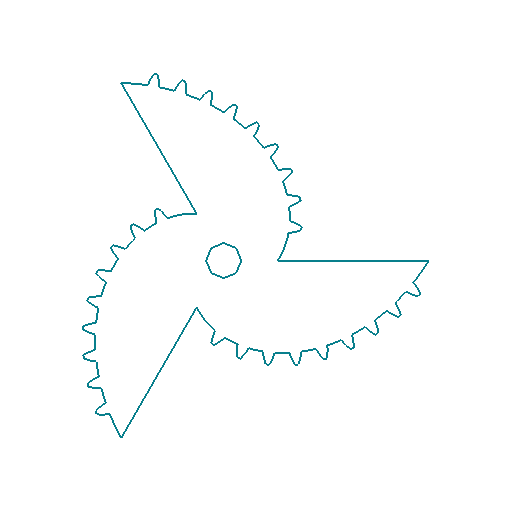
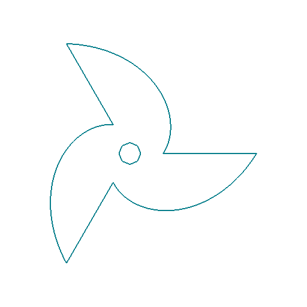
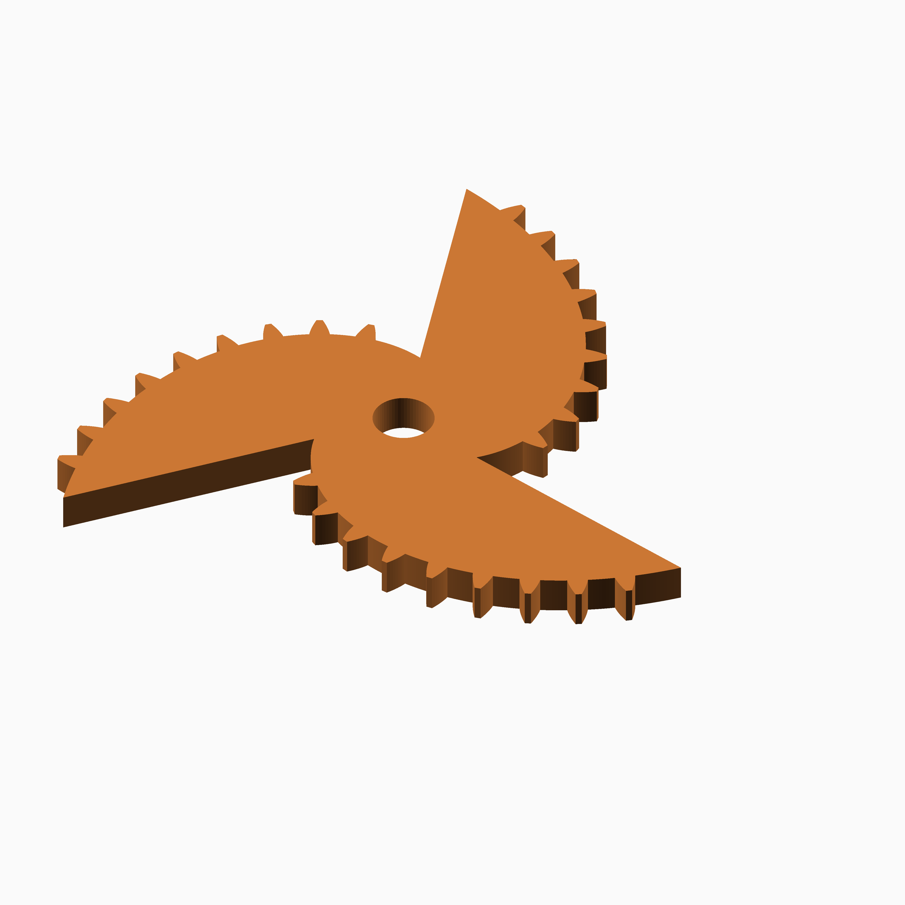

# Logarithmic Spiral

## Documentation navigation

- [README](../README.md)
- Families
  - [Bézier](bezier.md) · [Cassini](cassini.md) · [Circle](circle.md) · [Cosine Quintic](cosine_quintic.md) · [Cusp](cusp.md) · [Ellipse](ellipse.md) · [Epitrochoid](epitrochoid.md)
  - [Fourier](fourier.md) · [Hypotrochoid](hypotrochoid.md) · [Lobed](lobed.md) · [Logarithmic spiral](logarithmic_spiral.md) · [Logistic Dwell](logistic_dwell.md) · [Pascal](pascal.md) · [Superformula](superformula.md) · [Tanh Triad](tanh_triad.md) · [Temple Fay](temple_fay.md)
- Shared
  - [Examples catalogue](../examples/README.md) · [Test layout](../tests/README.md)
  - [Tooth construction](tooth-construction.md) · [Tooth placement](tooth-placement.md) · [Mate motion](mate-motion.md) · [Mate generation](mate-generation.md) · [Pair assembly](pair-assembly.md)

## Module `Logarithmic Spiral`

The implemented sector form is `r=rmin*g^(2*pi*t)` with a radial return
between sectors. In local polar form this is `r(phi)=rmin exp(k phi)` with
`k=ln(growth_rate)`. Tooth count must be divisible by the sector count.
Reference: https://mathshistory.st-andrews.ac.uk/Curves/Equiangular/.

### Brief content:

**Functions**:

> [`curve_gear_logarithmic_spiral`](#function-curve_gear_logarithmic_spiral): Build a logarithmic-spiral non-circular gear.

> [`curve_gear_logarithmic_spiral_2d`](#function-curve_gear_logarithmic_spiral_2d): Emit the complete logarithmic_spiral gear profile as 2D geometry.

> [`curve_gear_logarithmic_spiral_body`](#function-curve_gear_logarithmic_spiral_body): Build the logarithmic-spiral body solid without teeth.

> [`curve_gear_logarithmic_spiral_body_2d`](#function-curve_gear_logarithmic_spiral_body_2d): Emit the logarithmic_spiral body as 2D geometry with an optional signed outer-contour offset.

> [`curve_gear_logarithmic_spiral_mate`](#function-curve_gear_logarithmic_spiral_mate): Build the standalone static reference mate boundary at the origin.

> [`curve_gear_logarithmic_spiral_pair`](#function-curve_gear_logarithmic_spiral_pair): Build a meshed or separated logarithmic-spiral pair.

> [`curve_gear_logarithmic_spiral_reference_separation`](#function-curve_gear_logarithmic_spiral_reference_separation): Return the explicit static reference separation for a spiral pair.

> [`_cg_logarithmic_spiral_build`](#function-_cg_logarithmic_spiral_build): Dispatch logarithmic-spiral construction, building its spiral and radial returns as one canonical 2D boundary; long return segments form inaccessible tooth corridors, so ordinary teeth are omitted there.

> [`_cg_logarithmic_spiral_pair_build`](#function-_cg_logarithmic_spiral_pair_build): Internal logarithmic spiral pair construction dispatcher.

> [`_cg_logspiral_angle`](#function-_cg_logspiral_angle): Convert a spiral sector parameter to a polar angle.

> [`_cg_logspiral_pitch_points`](#function-_cg_logspiral_pitch_points): Build the closed pitch polyline, retaining each radial sector return.

> [`_cg_logspiral_point`](#function-_cg_logspiral_point): Evaluate one Cartesian logarithmic-spiral point.

> [`_cg_logspiral_radius`](#function-_cg_logspiral_radius): Evaluate the logarithmic-spiral radius r=rmin*g^(2*pi*t) at a sector parameter; radial returns are broad transitions, not ordinary teeth.

> [`_cg_logspiral_rmax`](#function-_cg_logspiral_rmax): Calculate the maximum radius for the requested tooth pitch.

> [`_cg_logspiral_rmin`](#function-_cg_logspiral_rmin): Calculate the minimum radius for the requested tooth pitch.

> [`_cg_logspiral_sector_length_for_rmin`](#function-_cg_logspiral_sector_length_for_rmin): Calculate the sampled length of one spiral sector.

> [`_cg_logspiral_sector_points`](#function-_cg_logspiral_sector_points): Sample one logarithmic-spiral sector.

> [`_cg_logspiral_tangent`](#function-_cg_logspiral_tangent): Evaluate the tangent vector of the logarithmic spiral.

## Functions

The module `Logarithmic Spiral` defines the following functions.

### Function `curve_gear_logarithmic_spiral`

| Logarithmic Spiral gear 1 | Logarithmic Spiral gear 2 |
| --- | --- |
|  |  |

Public single-gear construction for the logarithmic spiral family.
Three spiral sectors replace the canonical single return. Growth 1.22 increases the radial sweep. Returns are broad transitions without ordinary teeth, and the pair is a static reference rather than a validated conjugate transmission.
The gear is centred on X=0,Y=0 with its lower face at Z=0.
[`curve_gear_logarithmic_spiral_body`](#f-curve_gear_logarithmic_spiral_body)

**Parameters:**

- `modul`: {number > 0} Tooth module in mm.
- `tooth_number`: {integer >= 3 and divisible by sectors} Number of teeth.
- `width`: {number > 0} Extrusion width in mm.
- `bore`: {number >= 0} Centre bore diameter in mm.
- `sectors`: {integer >= 1, default 1} Number of repeated spiral sectors.
- `growth_rate`: {number > 1, default 1.17} Exponential growth base in the sector formula.
- `pressure_angle`: {0 < angle < 90, default 20} Involute pressure angle in degrees.
- `tooth_phase`: {angle, default 0} Tooth placement phase in degrees.
- `backlash`: {undef or >= 0} Tangential tooth-thickness reduction in mm.
- `clearance`: {undef or >= 0} Additional radial root clearance in mm.
- `samples`: {integer >= 120, default 360} Spiral sampling density.
- `orientation`: {angle, default 0} Single-gear display rotation in degrees.

**Returns:**

No return

### Example:

~~~c
curve_gear_logarithmic_spiral(1, 24, 4, 8);
~~~

Back to [module description](#module-logarithmic-spiral).

### Function `curve_gear_logarithmic_spiral_2d`

| Logarithmic Spiral 2D gear 1 | Logarithmic Spiral 2D gear 2 |
| --- | --- |
|  |  |

Emit the complete logarithmic_spiral gear profile as 2D geometry.

**Parameters:**

- `modul`: {value} Tooth module in mm.
- `tooth_number`: {value} Number of teeth.
- `bore`: {value} Centre bore diameter in mm.
- `sectors`: {value} Same family-specific parameter as curve_gear_logarithmic_spiral.
- `growth_rate`: {value} Same family-specific parameter as curve_gear_logarithmic_spiral.
- `pressure_angle`: {value} Same family-specific parameter as curve_gear_logarithmic_spiral.
- `tooth_phase`: {value} Same family-specific parameter as curve_gear_logarithmic_spiral.
- `backlash`: {value} Same family-specific parameter as curve_gear_logarithmic_spiral.
- `clearance`: {value} Same family-specific parameter as curve_gear_logarithmic_spiral.
- `samples`: {value} Same family-specific parameter as curve_gear_logarithmic_spiral.
- `orientation`: {value} Rotation in degrees.

**Returns:**

No return

### Example:

~~~c
curve_gear_logarithmic_spiral_2d(0.8, 34, 4.8);
~~~

Back to [module description](#module-logarithmic-spiral).

### Function `curve_gear_logarithmic_spiral_body`

| Logarithmic Spiral body 1 | Logarithmic Spiral body 2 |
| --- | --- |
|  |  |

Build the logarithmic-spiral body solid without teeth.

**Parameters:**

- `modul`: {number > 0} Tooth module in mm.
- `tooth_number`: {integer >= 3} Number of teeth.
- `width`: {number > 0} Extrusion width in mm.
- `bore`: {number >= 0} Centre bore diameter in mm.
- `sectors`: {integer >= 1, default 1} Number of repeated spiral sectors.
- `growth_rate`: {number > 1, default 1.17} Exponential growth base in the sector formula.
- `pressure_angle`: {0 < angle < 90, default 20} Involute pressure angle.
- `tooth_phase`: {angle, default 0} Tooth placement phase in degrees.
- `backlash`: {undef or >= 0} Tangential tooth-thickness reduction in mm.
- `clearance`: {undef or >= 0} Additional radial root clearance in mm.
- `samples`: {integer >= 120, default 360} Spiral sampling density.
- `orientation`: {angle, default 0} Single-gear display rotation in degrees.

**Returns:**

No return

### Example:

~~~c
curve_gear_logarithmic_spiral_body(1, 24, 4, 8);
~~~

Back to [module description](#module-logarithmic-spiral).

### Function `curve_gear_logarithmic_spiral_body_2d`

| Logarithmic Spiral 2D body 1 | Logarithmic Spiral 2D body 2 |
| --- | --- |
|  |  |

Emit the logarithmic_spiral body as 2D geometry with an optional signed outer-contour offset.

**Parameters:**

- `modul`: {value} Tooth module in mm.
- `tooth_number`: {value} Number of teeth.
- `bore`: {value} Centre bore diameter in mm.
- `sectors`: {value} Same family-specific parameter as curve_gear_logarithmic_spiral_body.
- `growth_rate`: {value} Same family-specific parameter as curve_gear_logarithmic_spiral_body.
- `pressure_angle`: {value} Same family-specific parameter as curve_gear_logarithmic_spiral_body.
- `tooth_phase`: {value} Same family-specific parameter as curve_gear_logarithmic_spiral_body.
- `backlash`: {value} Same family-specific parameter as curve_gear_logarithmic_spiral_body.
- `clearance`: {value} Same family-specific parameter as curve_gear_logarithmic_spiral_body.
- `samples`: {value} Same family-specific parameter as curve_gear_logarithmic_spiral_body.
- `orientation`: {value} Rotation in degrees.
- `body_offset`: {value} Signed offset in mm; negative values shrink the outer body contour while preserving the bore.

**Returns:**

No return

### Example:

~~~c
curve_gear_logarithmic_spiral_body_2d(0.8, 34, 4.8, body_offset=-2);
~~~

Back to [module description](#module-logarithmic-spiral).

### Function `curve_gear_logarithmic_spiral_mate`

| Logarithmic Spiral mate 1 | Logarithmic Spiral mate 2 |
| --- | --- |
|  |  |

A fixed 180-degree placement is applied by the static pair assembly; this
module does not claim dynamic conjugacy.

**Parameters:**

- `modul`: {number > 0} Tooth module in mm.
- `tooth_number`: {integer >= 3 and divisible by sectors} Number of teeth.
- `width`: {number > 0} Extrusion width in mm.
- `bore`: {number >= 0} Centre bore diameter in mm.
- `sectors`: {integer >= 1, default 1} Number of repeated spiral sectors.
- `growth_rate`: {number > 1, default 1.17} Exponential growth base in the sector formula.
- `pressure_angle`: {0 < angle < 90, default 20} Involute pressure angle.
- `tooth_phase`: {angle, default 0} Tooth placement phase in degrees.
- `backlash`: {undef or >= 0} Tangential tooth-thickness reduction in mm.
- `clearance`: {undef or >= 0} Additional radial root clearance in mm.
- `samples`: {integer >= 120, default 360} Spiral sampling density.

**Returns:**

No return

Back to [module description](#module-logarithmic-spiral).

### Function `curve_gear_logarithmic_spiral_pair`

| Logarithmic Spiral pair 1 | Logarithmic Spiral pair 2 |
| --- | --- |
|  |  |

Pair geometry uses the single-gear parameters documented in gear.scad.
[`curve_gear_logarithmic_spiral`](#f-curve_gear_logarithmic_spiral)

**Parameters:**

- `modul`: {number > 0, default .8} Tooth module in mm.
- `tooth_number`: {integer >= 3, default 34} Number of teeth.
- `width`: {number > 0, default 4} Extrusion width in mm.
- `bore`: {number >= 0, default 4.8} Centre bore diameter in mm.
- `sectors`: {integer >= 1, default 1} Number of spiral sectors.
- `growth_rate`: {number > 1, default 1.17} Radius growth per sector.
- `pressure_angle`: {0 < angle < 90, default 20} Involute pressure angle.
- `assembly_clearance`: {number >= 0, default 0} Explicit reference separation beyond the radial extents in mm.
- `backlash`: {undef or >= 0, default undef} Tangential tooth-thickness reduction in mm.
- `clearance`: {undef or >= 0, default undef} Additional radial root clearance in mm.
- `tooth_phase`: {angle, default 0} Tooth placement phase in degrees.
- `samples`: {integer >= 120, default 360} Spiral sampling density.
- `together_built`: {boolean, default true} Place the pair meshed when true, separated when false.
- `driver_color`: {OpenSCAD colour, default SteelBlue} Driver display colour.
- `mate_color`: {OpenSCAD colour, default Gold} Mate display colour.

**Returns:**

No return

### Example:

~~~c
curve_gear_logarithmic_spiral_pair(1, 24, 4, 8);
~~~

Back to [module description](#module-logarithmic-spiral).

### Function `curve_gear_logarithmic_spiral_reference_separation`

Return the explicit static reference separation for a spiral pair.

**Parameters:**

- `modul`: {number > 0} Tooth module in mm.
- `tooth_number`: {integer >= 3 and divisible by sectors} Number of teeth.
- `sectors`: {integer >= 1, default 1} Number of repeated spiral sectors.
- `growth_rate`: {number > 1, default 1.17} Exponential growth base in the sector formula.
- `assembly_clearance`: {number >= 0, default 0} Additional separation in mm.

**Returns:**

- `{number}`: Static reference separation in mm.

Back to [module description](#module-logarithmic-spiral).

### Function `_cg_logarithmic_spiral_build`

Dispatch logarithmic-spiral construction, building its spiral and radial returns as one canonical 2D boundary; long return segments form inaccessible tooth corridors, so ordinary teeth are omitted there.

**Parameters:**

- `modul`: {number} Tooth module in mm.
- `tooth_number`: {integer} Number of teeth.
- `width`: {number} Extrusion width in mm.
- `bore`: {number} Centre bore diameter in mm.
- `sectors`: {integer, default 1} Internal construction parameter.
- `growth_rate`: {number, default 1.17} Internal construction parameter.
- `pressure_angle`: {number, default 20} Involute pressure angle in degrees.
- `tooth_phase`: {number, default 0} Tooth placement phase in degrees.
- `backlash`: {number, default undef} Tangential tooth-thickness reduction in mm.
- `clearance`: {number, default undef} Additional radial root clearance in mm.
- `samples`: {integer, default 360} Pitch-curve or motion-table sampling density.
- `orientation`: {number, default 0} Single-gear display rotation in degrees.
- `body_only`: {boolean, default false} Emit the body without teeth.

**Returns:**

- `{geometry}`: Constructed family geometry.

Back to [module description](#module-logarithmic-spiral).

### Function `_cg_logarithmic_spiral_pair_build`

Internal logarithmic spiral pair construction dispatcher.

**Parameters:**

- `modul`: {number} Tooth module in mm.
- `tooth_number`: {integer} Number of teeth.
- `width`: {number} Extrusion width in mm.
- `bore`: {number} Centre bore diameter in mm.
- `sectors`: {integer, default 1} Internal construction parameter.
- `growth_rate`: {number, default 1.17} Internal construction parameter.
- `pressure_angle`: {number, default 20} Involute pressure angle in degrees.
- `samples`: {integer, default 360} Pitch-curve or motion-table sampling density.
- `together_built`: {boolean, default true} Use meshed placement when true, display placement otherwise.
- `assembly_clearance`: {number, default 0} Internal construction parameter.
- `backlash`: {number, default undef} Tangential tooth-thickness reduction in mm.
- `clearance`: {number, default undef} Additional radial root clearance in mm.
- `tooth_phase`: {number, default 0} Tooth placement phase in degrees.
- `driver_color`: {string, default "SteelBlue"} Driver display colour.
- `mate_color`: {string, default "Gold"} Mate display colour.

**Returns:**

- `{geometry}`: Constructed family geometry.

Back to [module description](#module-logarithmic-spiral).

### Function `_cg_logspiral_angle`

Convert a spiral sector parameter to a polar angle.

**Parameters:**

- `sectors`: {integer >= 1} Number of repeated sectors.
- `sector`: {integer >= 0} Sector index.
- `t`: {number} Normalised sector parameter.

**Returns:**

- `{angle}`: Polar angle in degrees.

Back to [module description](#module-logarithmic-spiral).

### Function `_cg_logspiral_pitch_points`

Build the closed pitch polyline, retaining each radial sector return.

**Parameters:**

- `rmin`: {number > 0} Minimum radius in mm.
- `growth_rate`: {number > 1} Exponential growth base in the sector formula.
- `sectors`: {integer >= 1} Number of repeated sectors.
- `samples`: {integer >= 1, default 360} Samples per sector.

**Returns:**

- `{array of points}`: Closed logarithmic-spiral pitch polyline.

Back to [module description](#module-logarithmic-spiral).

### Function `_cg_logspiral_point`

Evaluate one Cartesian logarithmic-spiral point.

**Parameters:**

- `rmin`: {number > 0} Minimum radius in mm.
- `growth_rate`: {number > 1} Exponential growth base in the sector formula.
- `sectors`: {integer >= 1} Number of repeated sectors.
- `sector`: {integer >= 0} Sector index.
- `t`: {number} Normalised sector parameter.

**Returns:**

- `{array}`: Cartesian point `[x, y]` in mm.

Back to [module description](#module-logarithmic-spiral).

### Function `_cg_logspiral_radius`

Evaluate the logarithmic-spiral radius r=rmin*g^(2*pi*t) at a sector parameter; radial returns are broad transitions, not ordinary teeth.

**Parameters:**

- `rmin`: {number > 0} Minimum radius in mm.
- `growth_rate`: {number > 1} Exponential growth base in the sector formula.
- `t`: {number} Normalised sector parameter.

**Returns:**

- `{number}`: Radius in mm.

Back to [module description](#module-logarithmic-spiral).

### Function `_cg_logspiral_rmax`

Calculate the maximum radius for the requested tooth pitch.

**Parameters:**

- `modul`: {number > 0} Tooth module in mm.
- `tooth_number`: {integer >= 3} Number of teeth.
- `sectors`: {integer >= 1, default 1} Number of repeated sectors.
- `growth_rate`: {number > 1, default 1.17} Exponential growth base in the sector formula.

**Returns:**

- `{number}`: Maximum radius in mm.

Back to [module description](#module-logarithmic-spiral).

### Function `_cg_logspiral_rmin`

Calculate the minimum radius for the requested tooth pitch.

**Parameters:**

- `modul`: {number > 0} Tooth module in mm.
- `tooth_number`: {integer >= 3} Number of teeth.
- `sectors`: {integer >= 1, default 1} Number of repeated sectors.
- `growth_rate`: {number > 1, default 1.17} Exponential growth base in the sector formula.

**Returns:**

- `{number}`: Minimum radius in mm.

Back to [module description](#module-logarithmic-spiral).

### Function `_cg_logspiral_sector_length_for_rmin`

Calculate the sampled length of one spiral sector.

**Parameters:**

- `rmin`: {number > 0} Minimum radius in mm.
- `growth_rate`: {number > 1, default 1.17} Exponential growth base in the sector formula.
- `sectors`: {integer >= 1, default 1} Number of repeated sectors.
- `samples`: {integer >= 1, default 360} Number of samples.

**Returns:**

- `{number}`: Sector length in mm.

Back to [module description](#module-logarithmic-spiral).

### Function `_cg_logspiral_sector_points`

Sample one logarithmic-spiral sector.

**Parameters:**

- `rmin`: {number > 0} Minimum radius in mm.
- `growth_rate`: {number > 1} Exponential growth base in the sector formula.
- `sectors`: {integer >= 1} Number of repeated sectors.
- `sector`: {integer >= 0} Sector index.
- `samples`: {integer >= 1, default 360} Number of samples.

**Returns:**

- `{array}`: Sector points in Cartesian coordinates.

Back to [module description](#module-logarithmic-spiral).

### Function `_cg_logspiral_tangent`

Evaluate the tangent vector of the logarithmic spiral.

**Parameters:**

- `rmin`: {number > 0} Minimum radius in mm.
- `growth_rate`: {number > 1} Exponential growth base in the sector formula.
- `sectors`: {integer >= 1} Number of repeated sectors.
- `sector`: {integer >= 0} Sector index.
- `t`: {number} Normalised sector parameter.

**Returns:**

- `{array}`: Cartesian tangent vector.

Back to [module description](#module-logarithmic-spiral).

Back to [top](#).

---

[Back to the CurveGears README](../README.md)

*Generated by Doxydown from repository source comments; do not edit this page directly.*
