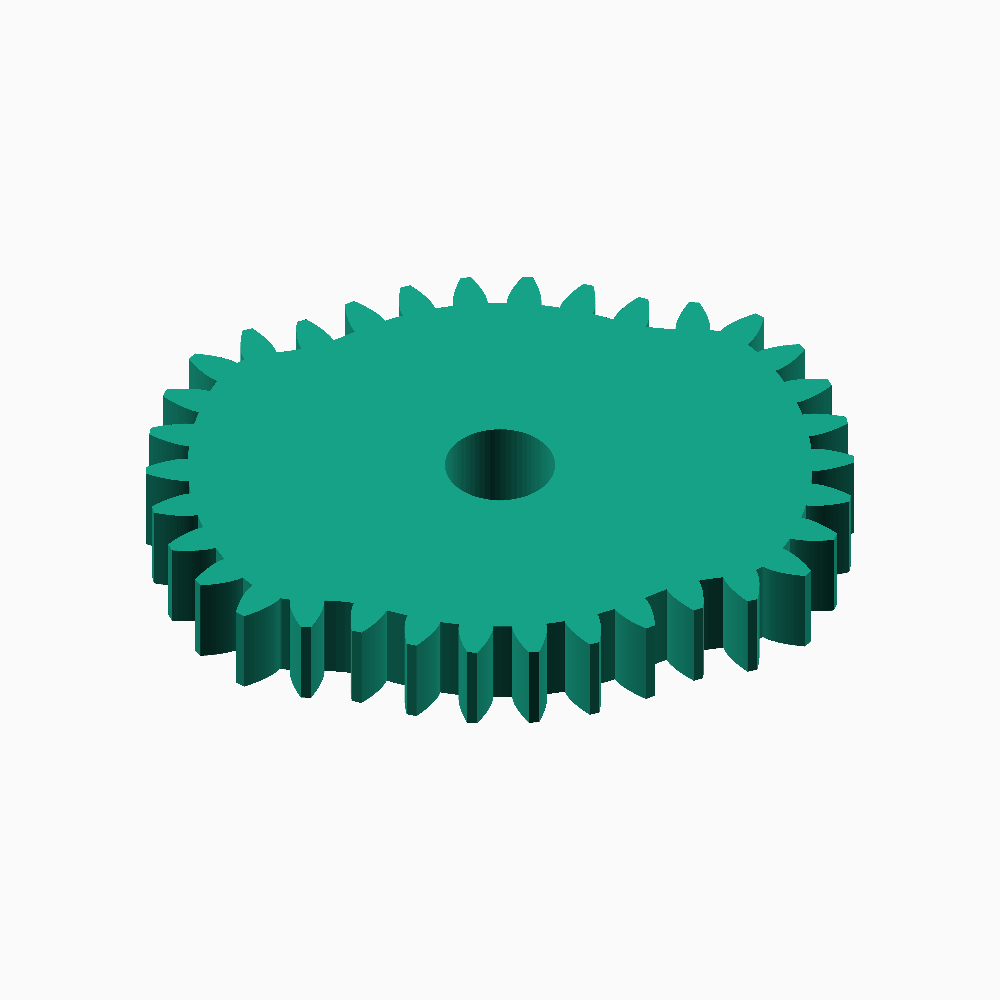
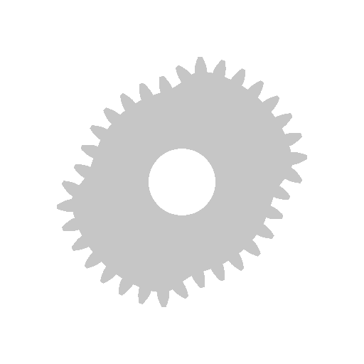
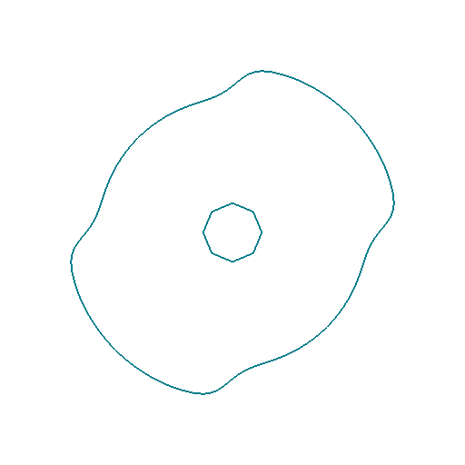
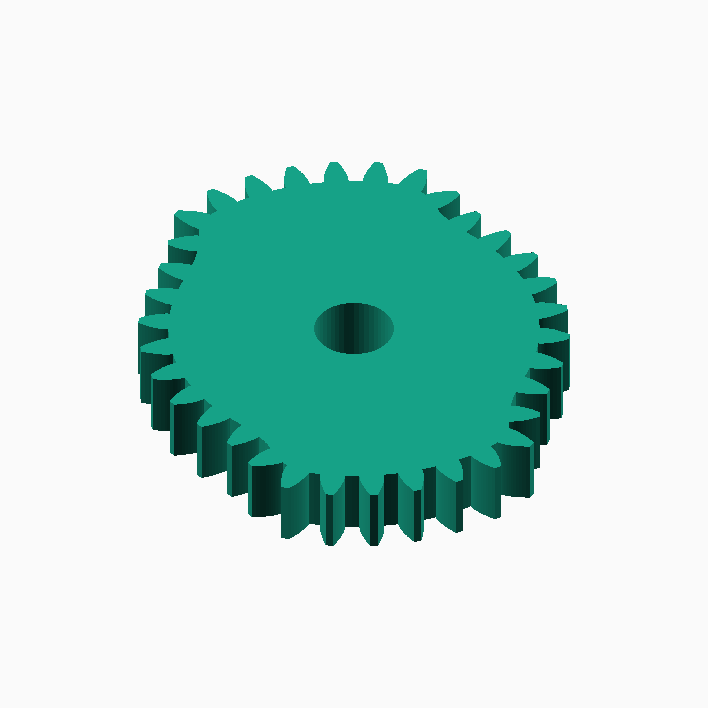
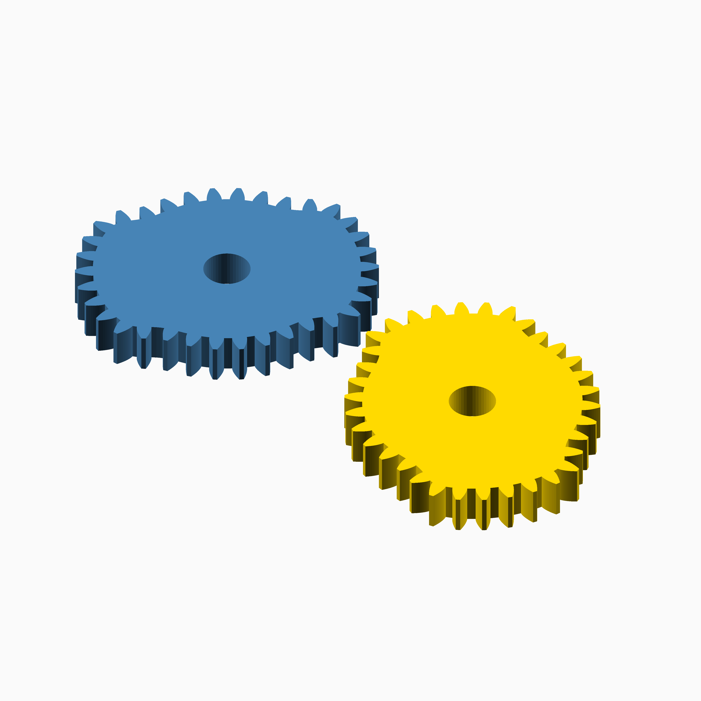

# Logistic Dwell

## Documentation navigation

- [README](../README.md)
- Families
  - [Bézier](bezier.md) · [Cassini](cassini.md) · [Circle](circle.md) · [Cosine Quintic](cosine_quintic.md) · [Cusp](cusp.md) · [Ellipse](ellipse.md) · [Epitrochoid](epitrochoid.md)
  - [Fourier](fourier.md) · [Hypotrochoid](hypotrochoid.md) · [Lobed](lobed.md) · [Logarithmic spiral](logarithmic_spiral.md) · [Logistic Dwell](logistic_dwell.md) · [Pascal](pascal.md) · [Superformula](superformula.md) · [Tanh Triad](tanh_triad.md) · [Temple Fay](temple_fay.md)
- Shared
  - [Examples catalogue](../examples/README.md) · [Test layout](../tests/README.md)
  - [Tooth construction](tooth-construction.md) · [Tooth placement](tooth-placement.md) · [Mate motion](mate-motion.md) · [Mate generation](mate-generation.md) · [Pair assembly](pair-assembly.md)

## Module `Logistic Dwell`

The unit law is `r(theta)=1+0.2/(1+exp(-8*sin(2 theta)))-0.1`.
The logistic gate creates a controlled dwell and rapid-return interval.
Reference: https://en.wikipedia.org/wiki/Logistic_function.

### Brief content:

**Functions**:

> [`curve_gear_logistic_dwell`](#function-curve_gear_logistic_dwell): Build a logistic-gated second-harmonic dwell gear.

> [`curve_gear_logistic_dwell_2d`](#function-curve_gear_logistic_dwell_2d): Build the Logistic Dwell 2D outline.

> [`curve_gear_logistic_dwell_body`](#function-curve_gear_logistic_dwell_body): Build the Logistic Dwell body.

> [`curve_gear_logistic_dwell_body_2d`](#function-curve_gear_logistic_dwell_body_2d): Build the Logistic Dwell 2D body outline.

> [`curve_gear_logistic_dwell_centre_distance`](#function-curve_gear_logistic_dwell_centre_distance): Return the Logistic Dwell centre distance.

> [`curve_gear_logistic_dwell_mate`](#function-curve_gear_logistic_dwell_mate): Build a Logistic Dwell mating gear.

> [`curve_gear_logistic_dwell_mate_rotation`](#function-curve_gear_logistic_dwell_mate_rotation): Return the Logistic Dwell mate rotation for a driver phase.

> [`curve_gear_logistic_dwell_pair`](#function-curve_gear_logistic_dwell_pair): Build a Logistic Dwell gear pair.

## Functions

The module `Logistic Dwell` defines the following functions.

### Function `curve_gear_logistic_dwell`

| Logistic Dwell gear preview | ⠀ |
| --- | --- |
|  |  |

**Parameters:**

- `modul`: {number > 0} Tooth module in mm.
- `tooth_number`: {integer >= 3} Number of teeth.
- `width`: {number > 0} Extrusion width in mm.
- `bore`: {number >= 0} Centre bore diameter in mm.
- `gain`: {number > 0, default 8} Logistic transition gain.
- `depth`: {0 < number < 0.5, default 0.2} Radial dwell depth.
- `pressure_angle`: {angle, default 20} Pressure angle.
- `tooth_phase`: {angle, default 0} Tooth phase.
- `backlash`: {undef or >= 0} Backlash.
- `clearance`: {undef or >= 0} Clearance.
- `samples`: {integer >= 120, default 720} Samples.
- `orientation`: {angle, default 0} Orientation.

**Returns:**

No return

Back to [module description](#module-logistic-dwell).

### Function `curve_gear_logistic_dwell_2d`

| Logistic Dwell 2D outline | ⠀ |
| --- | --- |
|  |  |

**Parameters:**

- `modul`: {number} Tooth module.
- `tooth_number`: {integer} Tooth count.
- `bore`: {number} Bore.
- `gain`: {number} Logistic gain.
- `depth`: {number} Dwell depth.
- `pressure_angle`: {number} Pressure angle.
- `tooth_phase`: {number} Tooth phase.
- `backlash`: {number} Backlash.
- `clearance`: {number} Clearance.
- `samples`: {integer} Samples.
- `orientation`: {number} Orientation.

**Returns:**

No return

Back to [module description](#module-logistic-dwell).

### Function `curve_gear_logistic_dwell_body`

| Logistic Dwell body preview | ⠀ |
| --- | --- |
|  |  |

**Parameters:**

- `modul`: {number} Tooth module.
- `tooth_number`: {integer} Tooth count.
- `width`: {number} Width.
- `bore`: {number} Bore.
- `gain`: {number} Logistic gain.
- `depth`: {number} Dwell depth.
- `pressure_angle`: {number} Pressure angle.
- `tooth_phase`: {number} Tooth phase.
- `backlash`: {number} Backlash.
- `clearance`: {number} Clearance.
- `samples`: {integer} Samples.
- `orientation`: {number} Orientation.

**Returns:**

No return

Back to [module description](#module-logistic-dwell).

### Function `curve_gear_logistic_dwell_body_2d`

| Logistic Dwell 2D body outline | ⠀ |
| --- | --- |
|  |  |

**Parameters:**

- `modul`: {number} Tooth module.
- `tooth_number`: {integer} Tooth count.
- `bore`: {number} Bore.
- `gain`: {number} Logistic gain.
- `depth`: {number} Dwell depth.
- `pressure_angle`: {number} Pressure angle.
- `tooth_phase`: {number} Tooth phase.
- `backlash`: {number} Backlash.
- `clearance`: {number} Clearance.
- `samples`: {integer} Samples.
- `orientation`: {number} Orientation.
- `body_offset`: {number} Body offset.

**Returns:**

No return

Back to [module description](#module-logistic-dwell).

### Function `curve_gear_logistic_dwell_centre_distance`

**Parameters:**

- `modul`: {number} Tooth module.
- `tooth_number`: {integer} Tooth count.
- `gain`: {number} Logistic gain.
- `depth`: {number} Dwell depth.
- `samples`: {integer} Samples.

**Returns:**

No return

Back to [module description](#module-logistic-dwell).

### Function `curve_gear_logistic_dwell_mate`

| Logistic Dwell mate preview | ⠀ |
| --- | --- |
|  |  |

**Parameters:**

- `modul`: {number} Tooth module.
- `tooth_number`: {integer} Tooth count.
- `width`: {number} Width.
- `bore`: {number} Bore.
- `gain`: {number} Logistic gain.
- `depth`: {number} Dwell depth.
- `pressure_angle`: {number} Pressure angle.
- `tooth_phase`: {number} Tooth phase.
- `backlash`: {number} Backlash.
- `clearance`: {number} Clearance.
- `samples`: {integer} Samples.

**Returns:**

No return

Back to [module description](#module-logistic-dwell).

### Function `curve_gear_logistic_dwell_mate_rotation`

**Parameters:**

- `modul`: {number} Tooth module.
- `tooth_number`: {integer} Tooth count.
- `gain`: {number} Logistic gain.
- `depth`: {number} Dwell depth.
- `samples`: {integer} Samples.
- `phase`: {number} Driver phase.

**Returns:**

No return

Back to [module description](#module-logistic-dwell).

### Function `curve_gear_logistic_dwell_pair`

| Logistic Dwell pair preview | ⠀ |
| --- | --- |
|  |  |

**Parameters:**

- `modul`: {number} Tooth module.
- `tooth_number`: {integer} Tooth count.
- `width`: {number} Width.
- `bore`: {number} Bore.
- `gain`: {number} Logistic gain.
- `depth`: {number} Dwell depth.
- `pressure_angle`: {number} Pressure angle.
- `samples`: {integer} Samples.
- `phase`: {number} Pair phase.
- `together_built`: {boolean} Mesh pair.
- `backlash`: {number} Backlash.
- `clearance`: {number} Clearance.
- `tooth_phase`: {number} Tooth phase.
- `driver_color`: {string} Driver colour.
- `mate_color`: {string} Mate colour.

**Returns:**

No return

Back to [module description](#module-logistic-dwell).

Back to [top](#).

---

[Back to the CurveGears README](../README.md)

*Generated by Doxydown from repository source comments; do not edit this page directly.*
