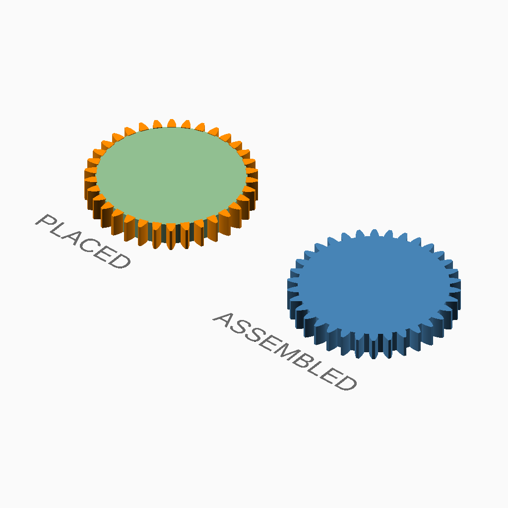

# Mate generation

## Documentation navigation

- [README](../README.md)
- Families
  - [Bézier](bezier.md) · [Cassini](cassini.md) · [Circle](circle.md) · [Ellipse](ellipse.md) · [Epitrochoid](epitrochoid.md) · [Fourier](fourier.md)
  - [Hypotrochoid](hypotrochoid.md) · [Lobed](lobed.md) · [Logarithmic spiral](logarithmic_spiral.md) · [Pascal](pascal.md) · [Superformula](superformula.md)
- Shared
  - [Examples catalogue](../examples/README.md) · [Test layout](../tests/README.md)
  - [Tooth construction](tooth-construction.md) · [Tooth placement](tooth-placement.md) · [Mate motion](mate-motion.md) · [Mate generation](mate-generation.md) · [Pair assembly](pair-assembly.md)

## Module `Mate generation`

mate boundary.

Family mate files own the mate point mathematics. This layer only routes
the sampled boundary through the canonical CurveGears tooth/placement
builder, keeping mate construction separate from ordinary gear imports.
It requires curve_gears_math.scad to have been loaded first.

### Brief content:

**Functions**:

> [`_cg_mate_pitch_diagnostics`](#function-_cg_mate_pitch_diagnostics): Return the required numerical and geometric mate diagnostics.

> [`_cg_mate_boundary_from_pitch_points(mate_points, modul, tooth_number, width, bore, ...)`](#function-_cg_mate_boundary_from_pitch_pointsmate_points-modul-tooth_number-width-bore-): Build one mate from its canonical sampled pitch boundary.

## Functions

The module `Mate generation` defines the following functions.

### Function `_cg_mate_pitch_diagnostics`

Return the required numerical and geometric mate diagnostics.

**Parameters:**

- `driver_radii`: {array of number} Driver radii at output angles.
- `mid_radii`: {array of number} Driver radii at integration midpoints.
- `D`: {number > 0} Solved centre distance in mm.
- `mate_points`: {array of points} Directly constructed mate pitch points.

**Returns:**

- `{array}`: Named diagnostic records suitable for echo or test output.

Back to [module description](#module-mate-generation).

### Function `_cg_mate_boundary_from_pitch_points(mate_points, modul, tooth_number, width, bore, ...)`

Build one mate from its canonical sampled pitch boundary.

**Parameters:**

- `mate_points`: {array} Sampled mate pitch boundary points.
- `modul`: {number > 0} Tooth module in mm.
- `tooth_number`: {integer >= 3} Number of teeth.
- `width`: {number > 0} Extrusion width in mm.
- `bore`: {number >= 0} Centre bore diameter in mm.
- `pressure_angle`: {angle} Involute pressure angle in degrees.
- `tooth_phase`: {angle, default 0} Tooth placement phase in degrees.
- `radial_root`: {boolean, default false} Use radial-root tooth construction.
- `backlash`: {undef or >= 0} Tangential tooth-thickness reduction in mm.
- `clearance`: {undef or >= 0} Additional radial root clearance in mm.

**Returns:**

- `{geometry}`: Extruded mate boundary.

Back to [module description](#module-mate-generation).

Back to [top](#).

---

[Back to the CurveGears README](../README.md)

*Generated by Doxydown from repository source comments; do not edit this page directly.*
