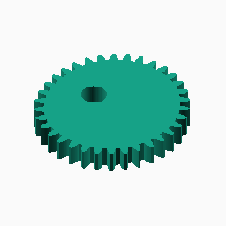
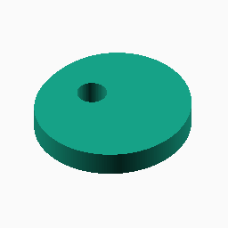
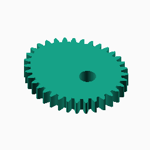
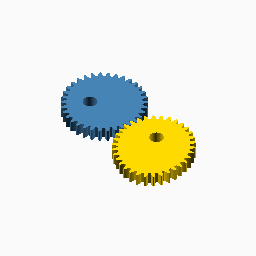

# Pascal

## Documentation navigation

- [README](../README.md)
- Families
  - [Bézier](bezier.md) · [Cassini](cassini.md) · [Circle](circle.md) · [Ellipse](ellipse.md) · [Epitrochoid](epitrochoid.md) · [Fourier](fourier.md)
  - [Hypotrochoid](hypotrochoid.md) · [Lobed](lobed.md) · [Logarithmic spiral](logarithmic_spiral.md) · [Pascal](pascal.md) · [Superformula](superformula.md)
- Shared
  - [Examples catalogue](../examples/README.md) · [Test layout](../tests/README.md)
  - [Tooth construction](tooth-construction.md) · [Tooth placement](tooth-placement.md) · [Mate motion](mate-motion.md) · [Mate generation](mate-generation.md) · [Pair assembly](pair-assembly.md)

## Module `Pascal`

The pitch curve is `r(theta)=s(1+e cos(theta))`. Eccentricity at or above
roughly 0.5 is non-convex and is intended for deliberate experimental use;
the bore must remain below the minimum pitch radius. Reference:
https://mathshistory.st-andrews.ac.uk/Curves/Limacon/.

### Brief content:

**Functions**:

> [`_cg_pascal_unit_radius(eccentricity, phi)`](#function-_cg_pascal_unit_radiuseccentricity-phi): Evaluate the unit radial form of the Pascal limaçon.

> [`_cg_pascal_point(scale, eccentricity, phi)`](#function-_cg_pascal_pointscale-eccentricity-phi): Evaluate one Cartesian point on a scaled Pascal curve.

> [`_cg_pascal_points(scale, eccentricity, n)`](#function-_cg_pascal_pointsscale-eccentricity-n): Sample one complete Pascal pitch curve.

> [`_cg_pascal_scale(modul, tooth_number, eccentricity, n)`](#function-_cg_pascal_scalemodul-tooth_number-eccentricity-n): Scale a Pascal curve to the requested tooth pitch.

> [`_cg_pascal_radius(scale, eccentricity, phi)`](#function-_cg_pascal_radiusscale-eccentricity-phi): Evaluate a scaled Pascal pitch-curve radius.

> [`_cg_pascal_min_radius(scale, eccentricity)`](#function-_cg_pascal_min_radiusscale-eccentricity): Calculate the minimum Pascal pitch-curve radius.

> [`_cg_pascal_max_radius(scale, eccentricity)`](#function-_cg_pascal_max_radiusscale-eccentricity): Calculate the maximum Pascal pitch-curve radius.

> [`_cg_pascal_centre_distance(scale, eccentricity)`](#function-_cg_pascal_centre_distancescale-eccentricity): Calculate the mathematical Pascal pair centre distance.

> [`_cg_pascal_requires_radial_root(eccentricity)`](#function-_cg_pascal_requires_radial_rooteccentricity): Determine whether the Pascal curve requires radial-root tooth construction.

> [`curve_gear_pascal(modul, tooth_number, width, bore, ...)`](#function-curve_gear_pascalmodul-tooth_number-width-bore-): Build a Pascal-curve non-circular gear.

> [`_cg_pascal_build(modul,tooth_number,width,bore,eccentricity=0.25,pressure_angle=20,tooth_phase=0,backlash=undef,clearance=undef,samples=720,orientation=0,body_only=false)`](#function-_cg_pascal_buildmodultooth_numberwidthboreeccentricity025pressure_angle20tooth_phase0backlashundefclearanceundefsamples720orientation0body_onlyfalse): Internal pascal construction dispatcher.

> [`curve_gear_pascal_body(modul, tooth_number, width, bore, ...)`](#function-curve_gear_pascal_bodymodul-tooth_number-width-bore-): Build the Pascal body solid without teeth.

> [`_cg_pascal_motion_radii`](#function-_cg_pascal_motion_radii): Evaluate Pascal radii at integration midpoints.

> [`_cg_pascal_driver_radii`](#function-_cg_pascal_driver_radii): Evaluate Pascal radii at direct mate-construction angles.

> [`_cg_pascal_motion_table`](#function-_cg_pascal_motion_table): Build the shared Pascal phase-motion table.

> [`_cg_pascal_mate_points_from_driver`](#function-_cg_pascal_mate_points_from_driver): Build Pascal mate pitch points by advancing driver angle directly.

> [`_cg_pascal_mate_points`](#function-_cg_pascal_mate_points): Build Pascal mate pitch points and their shared motion table.

> [`curve_gear_pascal_mate(modul, tooth_number, width, bore, ...)`](#function-curve_gear_pascal_matemodul-tooth_number-width-bore-): Build the standalone Pascal mate boundary at the origin.

> [`curve_gear_pascal_centre_distance(modul, tooth_number, eccentricity, ...)`](#function-curve_gear_pascal_centre_distancemodul-tooth_number-eccentricity-): Return the mathematical centre distance for a Pascal pair.

> [`curve_gear_pascal_mate_rotation(modul, tooth_number, eccentricity, ...)`](#function-curve_gear_pascal_mate_rotationmodul-tooth_number-eccentricity-): Return the conjugate Pascal mate rotation for a driver phase.

> [`curve_gear_pascal_pair(modul, tooth_number, width, bore, ...)`](#function-curve_gear_pascal_pairmodul-tooth_number-width-bore-): Build a meshed or separated Pascal pair.

> [`_cg_pascal_pair_build(modul,tooth_number,width,bore,eccentricity=0.25,pressure_angle=20,samples=360,phase=0,together_built=true,experimental_nonconvex=false,backlash=undef,clearance=undef,tooth_phase=0,driver_color="SteelBlue",mate_color="Gold")`](#function-_cg_pascal_pair_buildmodultooth_numberwidthboreeccentricity025pressure_angle20samples360phase0together_builttrueexperimental_nonconvexfalsebacklashundefclearanceundeftooth_phase0driver_colorsteelbluemate_colorgold): Internal pascal pair construction dispatcher.

## Functions

The module `Pascal` defines the following functions.

### Function `_cg_pascal_unit_radius(eccentricity, phi)`

Evaluate the unit radial form of the Pascal limaçon.

**Parameters:**

- `eccentricity`: {0 <= e < 1} Pascal curve eccentricity.
- `phi`: {angle} Polar angle in degrees.

**Returns:**

- `{number}`: Unit radius at the requested angle.

Back to [module description](#module-pascal).

### Function `_cg_pascal_point(scale, eccentricity, phi)`

Evaluate one Cartesian point on a scaled Pascal curve.

**Parameters:**

- `scale`: {number > 0} Mean pitch-radius scale in mm.
- `eccentricity`: {0 <= e < 1} Pascal curve eccentricity.
- `phi`: {angle} Polar angle in degrees.

**Returns:**

- `{array}`: Cartesian point `[x, y]` in mm.

Back to [module description](#module-pascal).

### Function `_cg_pascal_points(scale, eccentricity, n)`

Sample one complete Pascal pitch curve.

**Parameters:**

- `scale`: {number > 0} Mean pitch-radius scale in mm.
- `eccentricity`: {0 <= e < 1} Pascal curve eccentricity.
- `n`: {integer >= 1, default 720} Number of samples.

**Returns:**

- `{array}`: Closed list of sampled Cartesian points.

Back to [module description](#module-pascal).

### Function `_cg_pascal_scale(modul, tooth_number, eccentricity, n)`

Scale a Pascal curve to the requested tooth pitch.

**Parameters:**

- `modul`: {number > 0} Tooth module in mm.
- `tooth_number`: {integer >= 3} Number of teeth.
- `eccentricity`: {0 <= e < 1} Pascal curve eccentricity.
- `n`: {integer >= 1, default 720} Number of samples used for arc length.

**Returns:**

- `{number}`: Mean pitch-radius scale in mm.

Back to [module description](#module-pascal).

### Function `_cg_pascal_radius(scale, eccentricity, phi)`

Evaluate a scaled Pascal pitch-curve radius.

**Parameters:**

- `scale`: {number > 0} Mean pitch-radius scale in mm.
- `eccentricity`: {0 <= e < 1} Pascal curve eccentricity.
- `phi`: {angle} Polar angle in degrees.

**Returns:**

- `{number}`: Radius in mm.

Back to [module description](#module-pascal).

### Function `_cg_pascal_min_radius(scale, eccentricity)`

Calculate the minimum Pascal pitch-curve radius.

**Parameters:**

- `scale`: {number > 0} Mean pitch-radius scale in mm.
- `eccentricity`: {0 <= e < 1} Pascal curve eccentricity.

**Returns:**

- `{number}`: Minimum radius in mm.

Back to [module description](#module-pascal).

### Function `_cg_pascal_max_radius(scale, eccentricity)`

Calculate the maximum Pascal pitch-curve radius.

**Parameters:**

- `scale`: {number > 0} Mean pitch-radius scale in mm.
- `eccentricity`: {0 <= e < 1} Pascal curve eccentricity.

**Returns:**

- `{number}`: Maximum radius in mm.

Back to [module description](#module-pascal).

### Function `_cg_pascal_centre_distance(scale, eccentricity)`

Calculate the mathematical Pascal pair centre distance.

**Parameters:**

- `scale`: {number > 0} Mean pitch-radius scale in mm.
- `eccentricity`: {0 <= e < 1} Pascal curve eccentricity.

**Returns:**

- `{number}`: Pair centre distance in mm.

Back to [module description](#module-pascal).

### Function `_cg_pascal_requires_radial_root(eccentricity)`

Determine whether the Pascal curve requires radial-root tooth construction.

**Parameters:**

- `eccentricity`: {0 <= e < 1} Pascal curve eccentricity.

**Returns:**

- `{boolean}`: True when the non-convex threshold is reached.

Back to [module description](#module-pascal).

### Function `curve_gear_pascal(modul, tooth_number, width, bore, ...)`

Public single-gear construction for the pascal family.
The gear is centred on X=0,Y=0 with its lower face at Z=0.
[`curve_gear_pascal_body`](#f-curve_gear_pascal_body)

**Parameters:**

- `modul`: {number > 0} Tooth module in mm.
- `tooth_number`: {integer >= 3} Number of teeth.
- `width`: {number > 0} Extrusion width in mm.
- `bore`: {number >= 0} Centre bore diameter in mm.
- `eccentricity`: {0 <= e < 1, default 0.25} Pascal curve eccentricity; e >= 0.5 is non-convex.
- `pressure_angle`: {0 < angle < 90, default 20} Involute pressure angle in degrees.
- `tooth_phase`: {angle, default 0} Tooth placement phase in degrees.
- `backlash`: {undef or >= 0} Tangential tooth-thickness reduction in mm.
- `clearance`: {undef or >= 0} Additional radial root clearance in mm.
- `samples`: {integer >= 120, default 720} Curve sampling density.
- `orientation`: {angle, default 0} Single-gear display rotation in degrees.

**Returns:**

No return

### Example:

~~~c
curve_gear_pascal(1, 24, 4, 8);
~~~

Back to [module description](#module-pascal).

### Function `_cg_pascal_build(modul,tooth_number,width,bore,eccentricity=0.25,pressure_angle=20,tooth_phase=0,backlash=undef,clearance=undef,samples=720,orientation=0,body_only=false)`

Internal pascal construction dispatcher.

**Parameters:**

- `modul`: {number} Tooth module in mm.
- `tooth_number`: {integer} Number of teeth.
- `width`: {number} Extrusion width in mm.
- `bore`: {number} Centre bore diameter in mm.
- `eccentricity`: {number, default 0.25} Internal construction parameter.
- `pressure_angle`: {number, default 20} Involute pressure angle in degrees.
- `tooth_phase`: {number, default 0} Tooth placement phase in degrees.
- `backlash`: {number, default undef} Tangential tooth-thickness reduction in mm.
- `clearance`: {number, default undef} Additional radial root clearance in mm.
- `samples`: {integer, default 720} Pitch-curve or motion-table sampling density.
- `orientation`: {number, default 0} Single-gear display rotation in degrees.
- `body_only`: {boolean, default false} Emit the body without teeth.

**Returns:**

- `{geometry}`: Constructed family geometry.

Back to [module description](#module-pascal).

### Function `curve_gear_pascal_body(modul, tooth_number, width, bore, ...)`

Build the Pascal body solid without teeth.

**Parameters:**

- `modul`: {number > 0} Tooth module in mm.
- `tooth_number`: {integer >= 3} Number of teeth.
- `width`: {number > 0} Extrusion width in mm.
- `bore`: {number >= 0} Centre bore diameter in mm.
- `eccentricity`: {0 <= e < 1, default 0.25} Pascal curve eccentricity.
- `pressure_angle`: {0 < angle < 90, default 20} Involute pressure angle.
- `tooth_phase`: {angle, default 0} Tooth placement phase in degrees.
- `backlash`: {undef or >= 0} Tangential tooth-thickness reduction in mm.
- `clearance`: {undef or >= 0} Additional radial root clearance in mm.
- `samples`: {integer >= 120, default 720} Curve sampling density.
- `orientation`: {angle, default 0} Single-gear display rotation in degrees.

**Returns:**

No return

### Example:

~~~c
curve_gear_pascal_body(1, 24, 4, 8);
~~~

Back to [module description](#module-pascal).

### Function `_cg_pascal_motion_radii`

Evaluate Pascal radii at integration midpoints.

**Parameters:**

- `scale`: {number > 0} Base radial scale.
- `eccentricity`: {number} Pascal curve eccentricity.
- `n`: {integer >= 1, default 360} Number of midpoint samples.

**Returns:**

- `{array of number}`: Sampled radii in angular order.

Back to [module description](#module-pascal).

### Function `_cg_pascal_driver_radii`

Evaluate Pascal radii at direct mate-construction angles.

**Parameters:**

No parameters

**Returns:**

No return

Back to [module description](#module-pascal).

### Function `_cg_pascal_motion_table`

Build the shared Pascal phase-motion table.

**Parameters:**

- `scale`: {number > 0} Base radial scale.
- `eccentricity`: {number} Pascal curve eccentricity.
- `D`: {number > 0} Driver-to-mate centre distance.
- `n`: {integer >= 1, default 360} Number of midpoint samples.

**Returns:**

- `{array}`: Monotonic driver-to-mate phase-motion table.

Back to [module description](#module-pascal).

### Function `_cg_pascal_mate_points_from_driver`

Build Pascal mate pitch points by advancing driver angle directly.

**Parameters:**

- `scale`: {number > 0} Base radial scale.
- `eccentricity`: {number} Pascal curve eccentricity.
- `D`: {number > 0} Driver-to-mate centre distance.
- `motion`: {array} Shared driver-to-mate phase-motion table.
- `n`: {integer >= 1, default 360} Number of output points.

**Returns:**

- `{array of points}`: Cartesian mate pitch points.

Back to [module description](#module-pascal).

### Function `_cg_pascal_mate_points`

Build Pascal mate pitch points and their shared motion table.

**Parameters:**

- `scale`: {number > 0} Base radial scale.
- `eccentricity`: {number} Pascal curve eccentricity.
- `D`: {number > 0} Driver-to-mate centre distance.
- `n`: {integer >= 1, default 360} Number of output points.

**Returns:**

- `{array of points}`: Cartesian mate pitch points.

Back to [module description](#module-pascal).

### Function `curve_gear_pascal_mate(modul, tooth_number, width, bore, ...)`

Build the standalone Pascal mate boundary at the origin.

**Parameters:**

- `modul`: {number > 0} Tooth module in mm.
- `tooth_number`: {integer >= 3} Number of teeth.
- `width`: {number > 0} Extrusion width in mm.
- `bore`: {number >= 0} Centre bore diameter in mm.
- `eccentricity`: {0 <= e < 1, default 0.25} Pascal curve eccentricity.
- `pressure_angle`: {0 < angle < 90, default 20} Involute pressure angle.
- `tooth_phase`: {angle, default 0} Tooth placement phase in degrees.
- `backlash`: {undef or >= 0} Tangential tooth-thickness reduction in mm.
- `clearance`: {undef or >= 0} Additional radial root clearance in mm.
- `samples`: {integer >= 120, default 360} Pitch-curve sampling density.

**Returns:**

No return

Back to [module description](#module-pascal).

### Function `curve_gear_pascal_centre_distance(modul, tooth_number, eccentricity, ...)`

Return the mathematical centre distance for a Pascal pair.

**Parameters:**

- `modul`: {number > 0} Tooth module in mm.
- `tooth_number`: {integer >= 3} Number of teeth.
- `eccentricity`: {0 <= e < 1, default 0.25} Pascal curve eccentricity.
- `samples`: {integer >= 120, default 360} Pitch-curve sampling density.

**Returns:**

- `{number}`: Pair centre distance in mm.

Back to [module description](#module-pascal).

### Function `curve_gear_pascal_mate_rotation(modul, tooth_number, eccentricity, ...)`

Return the conjugate Pascal mate rotation for a driver phase.

**Parameters:**

- `modul`: {number > 0} Tooth module in mm.
- `tooth_number`: {integer >= 3} Number of teeth.
- `eccentricity`: {0 <= e < 1, default 0.25} Pascal curve eccentricity.
- `samples`: {integer >= 120, default 360} Motion-table sampling density.
- `phase`: {angle, default 0} Driver motion phase in degrees.

**Returns:**

- `{angle}`: Mate rotation in degrees.

Back to [module description](#module-pascal).

### Function `curve_gear_pascal_pair(modul, tooth_number, width, bore, ...)`

Pair geometry uses the single-gear parameters documented in gear.scad.
[`curve_gear_pascal`](#f-curve_gear_pascal)

**Parameters:**

- `modul`: {number > 0} Tooth module in mm.
- `tooth_number`: {integer >= 3} Number of teeth.
- `width`: {number > 0} Extrusion width in mm.
- `bore`: {number >= 0} Centre bore diameter in mm.
- `eccentricity`: {0 <= e < 1, default 0.25} Pascal eccentricity.
- `pressure_angle`: {0 < angle < 90, default 20} Involute pressure angle.
- `samples`: {integer >= 120, default 360} Pitch-curve sampling density.
- `phase`: {angle, default 0} Pair motion phase in degrees.
- `tooth_phase`: {angle, default 0} Tooth placement phase in degrees.
- `backlash`: {undef or >= 0} Tangential tooth-thickness reduction in mm.
- `clearance`: {undef or >= 0} Additional radial root clearance in mm.
- `experimental_nonconvex`: {boolean, default false} Permit e >= 0.5 and use the direct calculated mate boundary.
- `together_built`: {boolean, default true} Place the pair meshed when true, separated when false.
- `driver_color`: {OpenSCAD colour, default SteelBlue} Driver display colour.
- `mate_color`: {OpenSCAD colour, default Gold} Mate display colour.

**Returns:**

No return

### Example:

~~~c
curve_gear_pascal_pair(1, 24, 4, 8);
~~~

Back to [module description](#module-pascal).

### Function `_cg_pascal_pair_build(modul,tooth_number,width,bore,eccentricity=0.25,pressure_angle=20,samples=360,phase=0,together_built=true,experimental_nonconvex=false,backlash=undef,clearance=undef,tooth_phase=0,driver_color="SteelBlue",mate_color="Gold")`

Internal pascal pair construction dispatcher.

**Parameters:**

- `modul`: {number} Tooth module in mm.
- `tooth_number`: {integer} Number of teeth.
- `width`: {number} Extrusion width in mm.
- `bore`: {number} Centre bore diameter in mm.
- `eccentricity`: {number, default 0.25} Internal construction parameter.
- `pressure_angle`: {number, default 20} Involute pressure angle in degrees.
- `samples`: {integer, default 360} Pitch-curve or motion-table sampling density.
- `phase`: {number, default 0} Driver motion phase in degrees.
- `together_built`: {boolean, default true} Use meshed placement when true, display placement otherwise.
- `experimental_nonconvex`: {boolean, default false} Internal construction parameter.
- `backlash`: {number, default undef} Tangential tooth-thickness reduction in mm.
- `clearance`: {number, default undef} Additional radial root clearance in mm.
- `tooth_phase`: {number, default 0} Tooth placement phase in degrees.
- `driver_color`: {string, default "SteelBlue"} Driver display colour.
- `mate_color`: {string, default "Gold"} Mate display colour.

**Returns:**

- `{geometry}`: Constructed family geometry.

Back to [module description](#module-pascal).

Back to [top](#).

---

[Back to the CurveGears README](../README.md)

*Generated by Doxydown from repository source comments; do not edit this page directly.*
