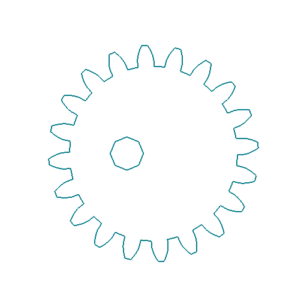
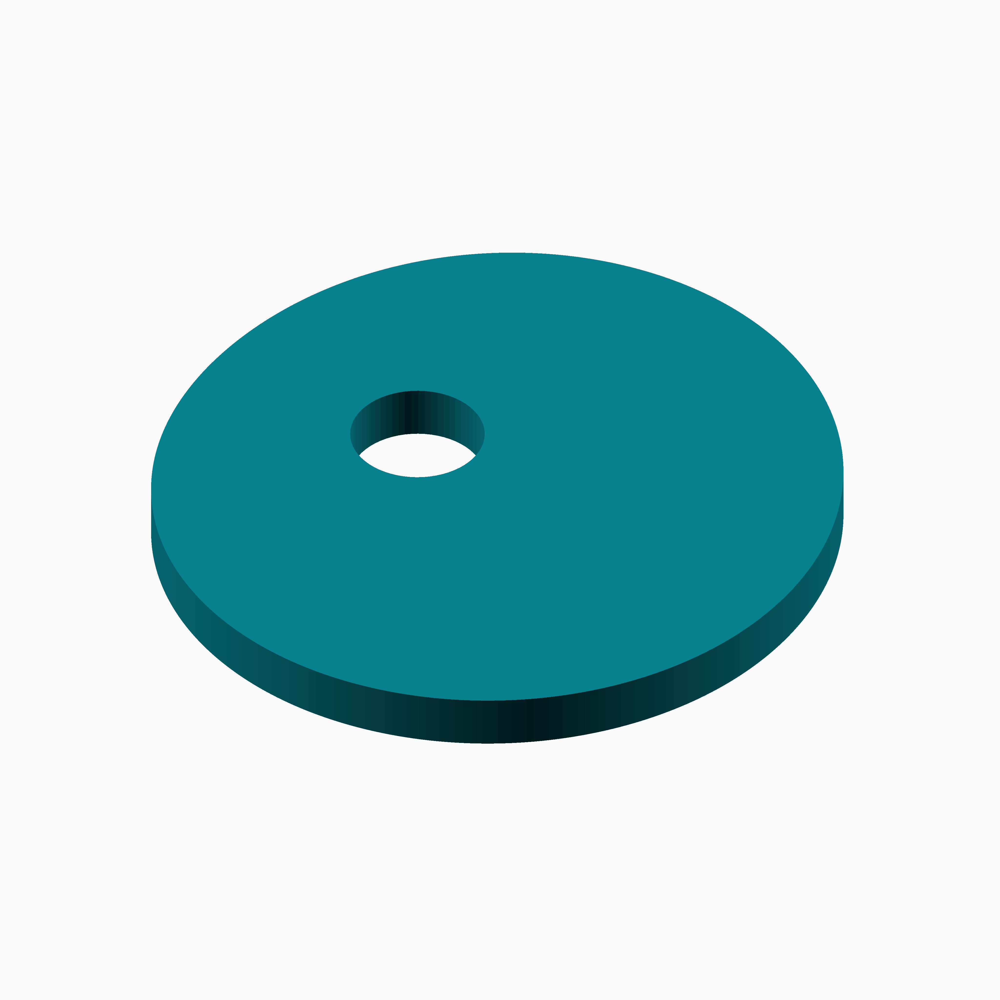
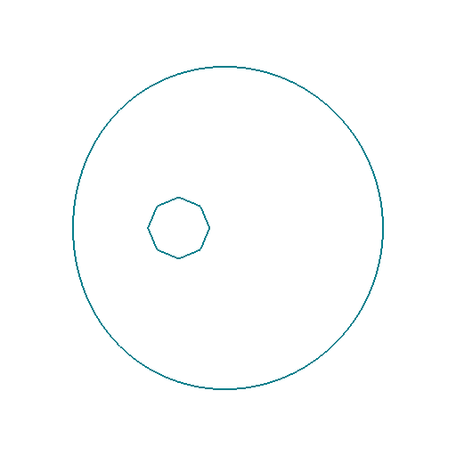
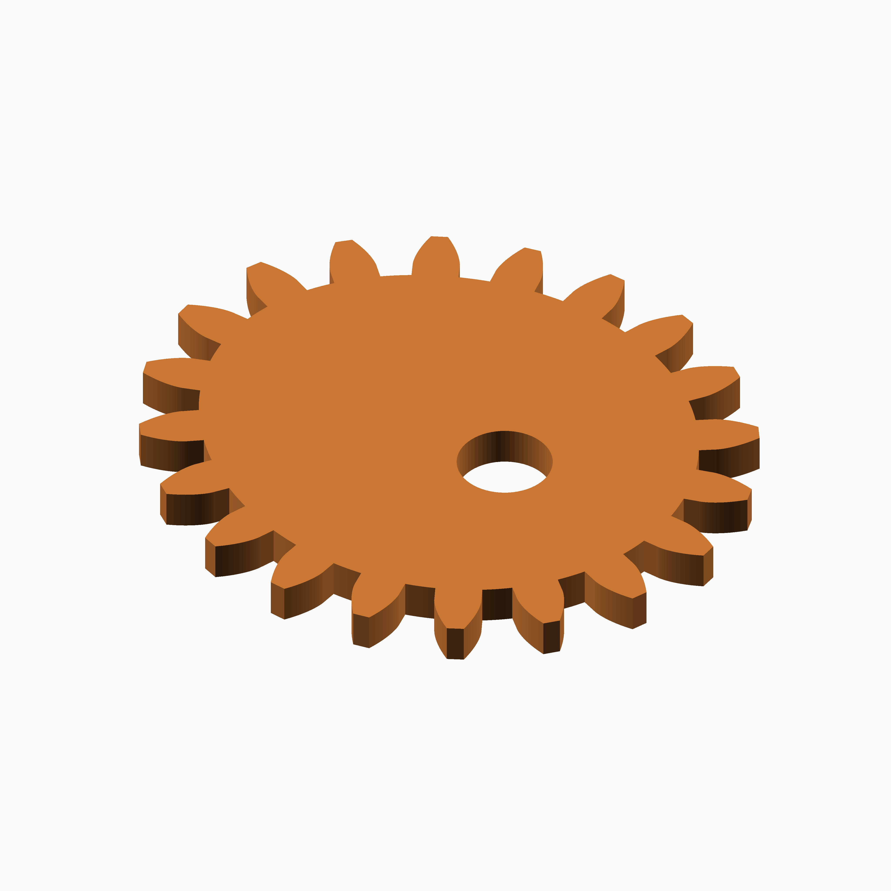

# Pascal

## Documentation navigation

- [README](../README.md)
- Families
  - [Bézier](bezier.md) · [Cassini](cassini.md) · [Circle](circle.md) · [Cosine Quintic](cosine_quintic.md) · [Cusp](cusp.md) · [Ellipse](ellipse.md) · [Epitrochoid](epitrochoid.md)
  - [Fourier](fourier.md) · [Hypotrochoid](hypotrochoid.md) · [Lobed](lobed.md) · [Logarithmic spiral](logarithmic_spiral.md) · [Logistic Dwell](logistic_dwell.md) · [Pascal](pascal.md) · [Superformula](superformula.md) · [Tanh Triad](tanh_triad.md) · [Temple Fay](temple_fay.md)
- Shared
  - [Examples catalogue](../examples/README.md) · [Test layout](../tests/README.md)
  - [Tooth construction](tooth-construction.md) · [Tooth placement](tooth-placement.md) · [Mate motion](mate-motion.md) · [Mate generation](mate-generation.md) · [Pair assembly](pair-assembly.md)

## Module `Pascal`

The pitch curve is `r(theta)=s(1+e cos(theta))`. Eccentricity at or above
roughly 0.5 is non-convex and is intended for deliberate experimental use;
the bore must remain below the minimum pitch radius. Reference:
https://mathshistory.st-andrews.ac.uk/Curves/Limacon/.

### Brief content:

**Functions**:

> [`curve_gear_pascal`](#function-curve_gear_pascal): Build a Pascal-curve non-circular gear.

> [`curve_gear_pascal_2d`](#function-curve_gear_pascal_2d): Emit the complete pascal gear profile as 2D geometry.

> [`curve_gear_pascal_body`](#function-curve_gear_pascal_body): Build the Pascal body solid without teeth.

> [`curve_gear_pascal_body_2d`](#function-curve_gear_pascal_body_2d): Emit the pascal body as 2D geometry with an optional signed outer-contour offset.

> [`curve_gear_pascal_centre_distance`](#function-curve_gear_pascal_centre_distance): Return the mathematical centre distance for a Pascal pair.

> [`curve_gear_pascal_mate`](#function-curve_gear_pascal_mate): Build the standalone Pascal mate boundary at the origin.

> [`curve_gear_pascal_mate_rotation`](#function-curve_gear_pascal_mate_rotation): Return the conjugate Pascal mate rotation for a driver phase.

> [`curve_gear_pascal_pair`](#function-curve_gear_pascal_pair): Build a meshed or separated Pascal pair.

> [`_cg_pascal_build`](#function-_cg_pascal_build): Internal pascal construction dispatcher.

> [`_cg_pascal_max_radius`](#function-_cg_pascal_max_radius): Calculate the maximum Pascal pitch-curve radius.

> [`_cg_pascal_min_radius`](#function-_cg_pascal_min_radius): Calculate the minimum Pascal pitch-curve radius.

> [`_cg_pascal_pair_build`](#function-_cg_pascal_pair_build): Internal pascal pair construction dispatcher.

> [`_cg_pascal_requires_radial_root`](#function-_cg_pascal_requires_radial_root): Determine whether the Pascal curve requires radial-root tooth construction.

> [`_cg_pascal_unit_radius`](#function-_cg_pascal_unit_radius): Evaluate the unit radial form r=s(1+e cos(phi)) of the Pascal limaçon; non-convex cases remain experimental.

## Functions

The module `Pascal` defines the following functions.

### Function `curve_gear_pascal`

| Pascal gear 1 | Pascal gear 2 |
| --- | --- |
|  |  |

Public single-gear construction for the pascal family.
Eccentricity 0.28 gives a convex egg-like outline instead of the canonical non-convex 0.60 limacon. Twenty coarse teeth emphasise the body contour. This contrasts the regular conjugate domain with the experimental dimpled case.
The gear is centred on X=0,Y=0 with its lower face at Z=0.
[`curve_gear_pascal_body`](#f-curve_gear_pascal_body)

**Parameters:**

- `modul`: {number > 0} Tooth module in mm.
- `tooth_number`: {integer >= 3} Number of teeth.
- `width`: {number > 0} Extrusion width in mm.
- `bore`: {number >= 0} Centre bore diameter in mm.
- `eccentricity`: {0 <= e < 1, default 0.25} Pascal curve eccentricity; e >= 0.5 is non-convex.
- `pressure_angle`: {0 < angle < 90, default 20} Involute pressure angle in degrees.
- `tooth_phase`: {angle, default 0} Tooth placement phase in degrees.
- `backlash`: {undef or >= 0} Tangential tooth-thickness reduction in mm.
- `clearance`: {undef or >= 0} Additional radial root clearance in mm.
- `samples`: {integer >= 120, default 720} Curve sampling density.
- `orientation`: {angle, default 0} Single-gear display rotation in degrees.

**Returns:**

No return

### Example:

~~~c
curve_gear_pascal(1, 24, 4, 8);
~~~

Back to [module description](#module-pascal).

### Function `curve_gear_pascal_2d`

| Pascal 2D gear 1 | Pascal 2D gear 2 |
| --- | --- |
|  |  |

Alternative 2 uses the contrasting controls described in the gear example.

**Parameters:**

- `modul`: {value} Tooth module in mm.
- `tooth_number`: {value} Number of teeth.
- `bore`: {value} Centre bore diameter in mm.
- `eccentricity`: {value} Same family-specific parameter as curve_gear_pascal.
- `pressure_angle`: {value} Same family-specific parameter as curve_gear_pascal.
- `tooth_phase`: {value} Same family-specific parameter as curve_gear_pascal.
- `backlash`: {value} Same family-specific parameter as curve_gear_pascal.
- `clearance`: {value} Same family-specific parameter as curve_gear_pascal.
- `samples`: {value} Same family-specific parameter as curve_gear_pascal.
- `orientation`: {value} Rotation in degrees.

**Returns:**

No return

### Example:

~~~c
curve_gear_pascal_2d(0.8, 34, 4.8);
~~~

Back to [module description](#module-pascal).

### Function `curve_gear_pascal_body`

| Pascal body 1 | Pascal body 2 |
| --- | --- |
|  |  |

Alternative 2 uses the contrasting controls described in the gear example.

**Parameters:**

- `modul`: {number > 0} Tooth module in mm.
- `tooth_number`: {integer >= 3} Number of teeth.
- `width`: {number > 0} Extrusion width in mm.
- `bore`: {number >= 0} Centre bore diameter in mm.
- `eccentricity`: {0 <= e < 1, default 0.25} Pascal curve eccentricity.
- `pressure_angle`: {0 < angle < 90, default 20} Involute pressure angle.
- `tooth_phase`: {angle, default 0} Tooth placement phase in degrees.
- `backlash`: {undef or >= 0} Tangential tooth-thickness reduction in mm.
- `clearance`: {undef or >= 0} Additional radial root clearance in mm.
- `samples`: {integer >= 120, default 720} Curve sampling density.
- `orientation`: {angle, default 0} Single-gear display rotation in degrees.

**Returns:**

No return

### Example:

~~~c
curve_gear_pascal_body(1, 24, 4, 8);
~~~

Back to [module description](#module-pascal).

### Function `curve_gear_pascal_body_2d`

| Pascal 2D body 1 | Pascal 2D body 2 |
| --- | --- |
|  |  |

Alternative 2 uses the contrasting controls described in the gear example.

**Parameters:**

- `modul`: {value} Tooth module in mm.
- `tooth_number`: {value} Number of teeth.
- `bore`: {value} Centre bore diameter in mm.
- `eccentricity`: {value} Same family-specific parameter as curve_gear_pascal_body.
- `pressure_angle`: {value} Same family-specific parameter as curve_gear_pascal_body.
- `tooth_phase`: {value} Same family-specific parameter as curve_gear_pascal_body.
- `backlash`: {value} Same family-specific parameter as curve_gear_pascal_body.
- `clearance`: {value} Same family-specific parameter as curve_gear_pascal_body.
- `samples`: {value} Same family-specific parameter as curve_gear_pascal_body.
- `orientation`: {value} Rotation in degrees.
- `body_offset`: {value} Signed offset in mm; negative values shrink the outer body contour while preserving the bore.

**Returns:**

No return

### Example:

~~~c
curve_gear_pascal_body_2d(0.8, 34, 4.8, body_offset=-2);
~~~

Back to [module description](#module-pascal).

### Function `curve_gear_pascal_centre_distance`

Return the mathematical centre distance for a Pascal pair.

**Parameters:**

- `modul`: {number > 0} Tooth module in mm.
- `tooth_number`: {integer >= 3} Number of teeth.
- `eccentricity`: {0 <= e < 1, default 0.25} Pascal curve eccentricity.
- `samples`: {integer >= 120, default 360} Pitch-curve sampling density.

**Returns:**

- `{number}`: Pair centre distance in mm.

Back to [module description](#module-pascal).

### Function `curve_gear_pascal_mate`

| Pascal mate 1 | Pascal mate 2 |
| --- | --- |
|  |  |

Alternative 2 uses the contrasting controls described in the gear example.

**Parameters:**

- `modul`: {number > 0} Tooth module in mm.
- `tooth_number`: {integer >= 3} Number of teeth.
- `width`: {number > 0} Extrusion width in mm.
- `bore`: {number >= 0} Centre bore diameter in mm.
- `eccentricity`: {0 <= e < 1, default 0.25} Pascal curve eccentricity.
- `pressure_angle`: {0 < angle < 90, default 20} Involute pressure angle.
- `tooth_phase`: {angle, default 0} Tooth placement phase in degrees.
- `backlash`: {undef or >= 0} Tangential tooth-thickness reduction in mm.
- `clearance`: {undef or >= 0} Additional radial root clearance in mm.
- `samples`: {integer >= 120, default 360} Pitch-curve sampling density.

**Returns:**

No return

Back to [module description](#module-pascal).

### Function `curve_gear_pascal_mate_rotation`

Return the conjugate Pascal mate rotation for a driver phase.

**Parameters:**

- `modul`: {number > 0} Tooth module in mm.
- `tooth_number`: {integer >= 3} Number of teeth.
- `eccentricity`: {0 <= e < 1, default 0.25} Pascal curve eccentricity.
- `samples`: {integer >= 120, default 360} Motion-table sampling density.
- `phase`: {angle, default 0} Driver motion phase in degrees.

**Returns:**

- `{angle}`: Mate rotation in degrees.

Back to [module description](#module-pascal).

### Function `curve_gear_pascal_pair`

| Pascal pair 1 | Pascal pair 2 |
| --- | --- |
|  |  |

Alternative 2 separates the driver and mate and uses the contrasting gear controls described above.
Pair geometry uses the single-gear parameters documented in gear.scad.
[`curve_gear_pascal`](#f-curve_gear_pascal)

**Parameters:**

- `modul`: {number > 0, default .8} Tooth module in mm.
- `tooth_number`: {integer >= 3, default 34} Number of teeth.
- `width`: {number > 0, default 4} Extrusion width in mm.
- `bore`: {number >= 0, default 4.8} Centre bore diameter in mm.
- `eccentricity`: {0 <= e < 1, default 0.25} Pascal eccentricity.
- `pressure_angle`: {0 < angle < 90, default 20} Involute pressure angle.
- `samples`: {integer >= 120, default 360} Pitch-curve sampling density.
- `phase`: {angle, default 0} Pair motion phase in degrees.
- `tooth_phase`: {angle, default 0} Tooth placement phase in degrees.
- `backlash`: {undef or >= 0, default undef} Tangential tooth-thickness reduction in mm.
- `clearance`: {undef or >= 0, default undef} Additional radial root clearance in mm.
- `experimental_nonconvex`: {boolean, default false} Permit e >= 0.5 and use the direct calculated mate boundary.
- `together_built`: {boolean, default true} Place the pair meshed when true, separated when false.
- `driver_color`: {OpenSCAD colour, default SteelBlue} Driver display colour.
- `mate_color`: {OpenSCAD colour, default Gold} Mate display colour.

**Returns:**

No return

### Example:

~~~c
curve_gear_pascal_pair(1, 24, 4, 8);
~~~

Back to [module description](#module-pascal).

### Function `_cg_pascal_build`

Internal pascal construction dispatcher.

**Parameters:**

- `modul`: {number} Tooth module in mm.
- `tooth_number`: {integer} Number of teeth.
- `width`: {number} Extrusion width in mm.
- `bore`: {number} Centre bore diameter in mm.
- `eccentricity`: {number, default 0.25} Internal construction parameter.
- `pressure_angle`: {number, default 20} Involute pressure angle in degrees.
- `tooth_phase`: {number, default 0} Tooth placement phase in degrees.
- `backlash`: {number, default undef} Tangential tooth-thickness reduction in mm.
- `clearance`: {number, default undef} Additional radial root clearance in mm.
- `samples`: {integer, default 720} Pitch-curve or motion-table sampling density.
- `orientation`: {number, default 0} Single-gear display rotation in degrees.
- `body_only`: {boolean, default false} Emit the body without teeth.

**Returns:**

- `{geometry}`: Constructed family geometry.

Back to [module description](#module-pascal).

### Function `_cg_pascal_max_radius`

Calculate the maximum Pascal pitch-curve radius.

**Parameters:**

- `scale`: {number > 0} Mean pitch-radius scale in mm.
- `eccentricity`: {0 <= e < 1} Pascal curve eccentricity.

**Returns:**

- `{number}`: Maximum radius in mm.

Back to [module description](#module-pascal).

### Function `_cg_pascal_min_radius`

Calculate the minimum Pascal pitch-curve radius.

**Parameters:**

- `scale`: {number > 0} Mean pitch-radius scale in mm.
- `eccentricity`: {0 <= e < 1} Pascal curve eccentricity.

**Returns:**

- `{number}`: Minimum radius in mm.

Back to [module description](#module-pascal).

### Function `_cg_pascal_pair_build`

Internal pascal pair construction dispatcher.

**Parameters:**

- `modul`: {number} Tooth module in mm.
- `tooth_number`: {integer} Number of teeth.
- `width`: {number} Extrusion width in mm.
- `bore`: {number} Centre bore diameter in mm.
- `eccentricity`: {number, default 0.25} Internal construction parameter.
- `pressure_angle`: {number, default 20} Involute pressure angle in degrees.
- `samples`: {integer, default 360} Pitch-curve or motion-table sampling density.
- `phase`: {number, default 0} Driver motion phase in degrees.
- `together_built`: {boolean, default true} Use meshed placement when true, display placement otherwise.
- `experimental_nonconvex`: {boolean, default false} Internal construction parameter.
- `backlash`: {number, default undef} Tangential tooth-thickness reduction in mm.
- `clearance`: {number, default undef} Additional radial root clearance in mm.
- `tooth_phase`: {number, default 0} Tooth placement phase in degrees.
- `driver_color`: {string, default "SteelBlue"} Driver display colour.
- `mate_color`: {string, default "Gold"} Mate display colour.

**Returns:**

- `{geometry}`: Constructed family geometry.

Back to [module description](#module-pascal).

### Function `_cg_pascal_requires_radial_root`

Determine whether the Pascal curve requires radial-root tooth construction.

**Parameters:**

- `eccentricity`: {0 <= e < 1} Pascal curve eccentricity.

**Returns:**

- `{boolean}`: True when the non-convex threshold is reached.

Back to [module description](#module-pascal).

### Function `_cg_pascal_unit_radius`

Evaluate the unit radial form r=s(1+e cos(phi)) of the Pascal limaçon; non-convex cases remain experimental.

**Parameters:**

- `eccentricity`: {0 <= e < 1} Pascal curve eccentricity.
- `phi`: {angle} Polar angle in degrees.

**Returns:**

- `{number}`: Unit radius at the requested angle.

Back to [module description](#module-pascal).

Back to [top](#).

## Module `Harmonic common`

Coefficients are [harmonic, amplitude, phase in degrees]. Family adapters
own admissibility, pitch scaling and sampling; this evaluator does not
inherit the public Fourier family's coefficient-domain restrictions.

### Brief content:

**Functions**:

> [`_cg_harmonic_unit_radius`](#function-_cg_harmonic_unit_radius): Evaluate a finite cosine series around unit mean radius.

## Functions

The module `Harmonic common` defines the following functions.

### Function `_cg_harmonic_unit_radius`

Evaluate a finite cosine series around unit mean radius.

**Parameters:**

- `coefficients`: {array} Harmonic, amplitude and phase rows.
- `theta`: {angle} Physical polar angle in degrees.

**Returns:**

- `{number}`: Unit radius before family-specific scaling.

Back to [module description](#module-harmonic-common).

Back to [top](#).

---

[Back to the CurveGears README](../README.md)

*Generated by Doxydown from repository source comments; do not edit this page directly.*
