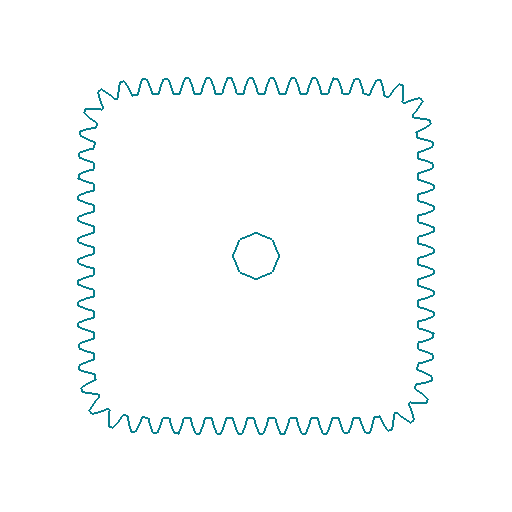
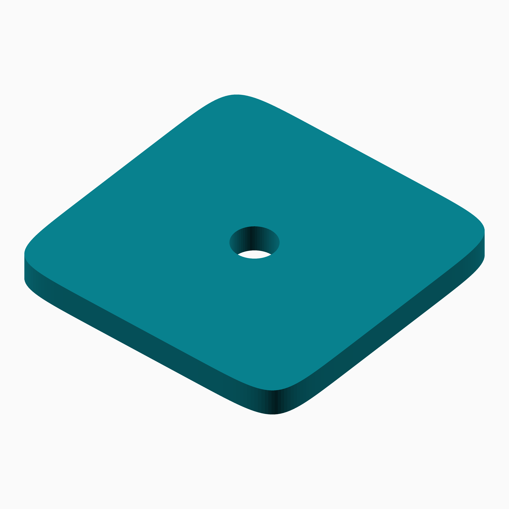
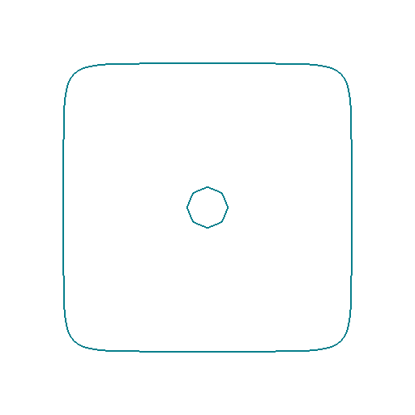
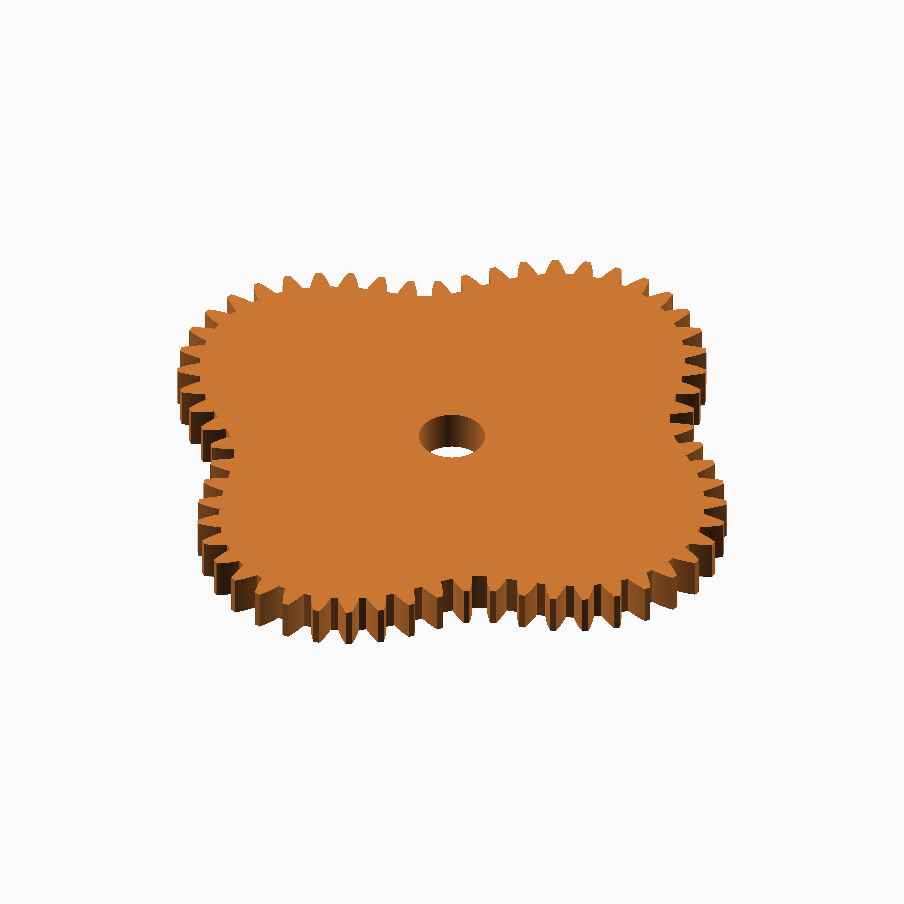

# Superformula

## Documentation navigation

- [README](../README.md)
- Families
  - [Bézier](bezier.md) · [Cassini](cassini.md) · [Circle](circle.md) · [Cosine Quintic](cosine_quintic.md) · [Cusp](cusp.md) · [Ellipse](ellipse.md) · [Epitrochoid](epitrochoid.md)
  - [Fourier](fourier.md) · [Hypotrochoid](hypotrochoid.md) · [Lobed](lobed.md) · [Logarithmic spiral](logarithmic_spiral.md) · [Logistic Dwell](logistic_dwell.md) · [Pascal](pascal.md) · [Superformula](superformula.md) · [Tanh Triad](tanh_triad.md) · [Temple Fay](temple_fay.md)
- Shared
  - [Examples catalogue](../examples/README.md) · [Test layout](../tests/README.md)
  - [Tooth construction](tooth-construction.md) · [Tooth placement](tooth-placement.md) · [Mate motion](mate-motion.md) · [Mate generation](mate-generation.md) · [Pair assembly](pair-assembly.md)

## Module `Superformula`

The basic radial curve is `r=(|cos(m theta/4)/a|^n2 +
|sin(m theta/4)/b|^n3)^(-1/n1)`. Odd symmetry requires `a=b` and `n2=n3`
for full-turn continuity; sharp or concave profiles require sufficient
sampling and clearance. Reference: https://pubmed.ncbi.nlm.nih.gov/21659124/.
Introduced by Johan Gielis, “A generic geometric transformation that
unifies a wide range of natural and abstract shapes,” American Journal of
Botany 90 (2003), 333–338.

### Brief content:

**Functions**:

> [`curve_gear_superformula(modul, tooth_number, width, bore, ...)`](#function-curve_gear_superformulamodul-tooth_number-width-bore-): Build a superformula non-circular gear.

> [`curve_gear_superformula_2d`](#function-curve_gear_superformula_2d): Emit the complete superformula gear profile as 2D geometry.

> [`curve_gear_superformula_body(modul, tooth_number, width, bore, ...)`](#function-curve_gear_superformula_bodymodul-tooth_number-width-bore-): Build the superformula body solid without teeth.

> [`curve_gear_superformula_body_2d`](#function-curve_gear_superformula_body_2d): Emit the superformula body as 2D geometry with an optional signed outer-contour offset.

> [`curve_gear_superformula_centre_distance(modul, tooth_number, symmetry, a, b, n1, n2, n3, ...)`](#function-curve_gear_superformula_centre_distancemodul-tooth_number-symmetry-a-b-n1-n2-n3-): Return the mathematical centre distance for a superformula pair.

> [`curve_gear_superformula_mate(modul, tooth_number, width, bore, ...)`](#function-curve_gear_superformula_matemodul-tooth_number-width-bore-): Build the standalone superformula mate boundary at the origin.

> [`curve_gear_superformula_mate_rotation(modul, tooth_number, symmetry, a, b, n1, n2, n3, ...)`](#function-curve_gear_superformula_mate_rotationmodul-tooth_number-symmetry-a-b-n1-n2-n3-): Return the conjugate superformula mate rotation for a driver phase.

> [`curve_gear_superformula_pair(modul, tooth_number, width, bore, ...)`](#function-curve_gear_superformula_pairmodul-tooth_number-width-bore-): Build a meshed or separated superformula pair from validated 2D boundaries.

> [`_cg_superformula_build(modul,tooth_number,width,bore,symmetry=4,a=1,b=1,n1=2.4,n2=2.4,n3=2.4,pressure_angle=20,tooth_phase=0,backlash=undef,clearance=undef,samples=720,orientation=0,body_only=false)`](#function-_cg_superformula_buildmodultooth_numberwidthboresymmetry4a1b1n124n224n324pressure_angle20tooth_phase0backlashundefclearanceundefsamples720orientation0body_onlyfalse): Internal superformula construction dispatcher.

> [`_cg_superformula_max_radius(scale, symmetry, a, b, n1, n2, n3, n)`](#function-_cg_superformula_max_radiusscale-symmetry-a-b-n1-n2-n3-n): Find the maximum sampled radius of a superformula curve.

> [`_cg_superformula_odd_valid(symmetry, a, b, n2, n3, tol)`](#function-_cg_superformula_odd_validsymmetry-a-b-n2-n3-tol): Check the continuity constraints for odd superformula symmetry.

> [`_cg_superformula_pair_build(modul,tooth_number,width,bore,symmetry=4,a=1,b=1,n1=2.4,n2=2.4,n3=2.4,pressure_angle=20,samples=360,phase=0,together_built=true,backlash=undef,clearance=undef,tooth_phase=0,driver_color="SteelBlue",mate_color="Gold")`](#function-_cg_superformula_pair_buildmodultooth_numberwidthboresymmetry4a1b1n124n224n324pressure_angle20samples360phase0together_builttruebacklashundefclearanceundeftooth_phase0driver_colorsteelbluemate_colorgold): Internal superformula pair construction dispatcher.

> [`_cg_superformula_point(scale, symmetry, a, b, n1, n2, n3, theta)`](#function-_cg_superformula_pointscale-symmetry-a-b-n1-n2-n3-theta): Evaluate one Cartesian point on a scaled superformula curve.

> [`_cg_superformula_points(scale, symmetry, a, b, n1, n2, n3, n)`](#function-_cg_superformula_pointsscale-symmetry-a-b-n1-n2-n3-n): Sample a complete scaled superformula pitch curve.

> [`_cg_superformula_radius(scale, symmetry, a, b, n1, n2, n3, theta)`](#function-_cg_superformula_radiusscale-symmetry-a-b-n1-n2-n3-theta): Evaluate a scaled superformula radius.

> [`_cg_superformula_scale(modul, tooth_number, symmetry, a, b, n1, n2, n3, n, unit_points=undef)`](#function-_cg_superformula_scalemodul-tooth_number-symmetry-a-b-n1-n2-n3-n-unit_pointsundef): Scale a superformula curve to the requested tooth pitch.

> [`_cg_superformula_shape`](#function-_cg_superformula_shape): Bind the sampled superformula polygon and its physical radius law.

> [`_cg_superformula_unit_radius(symmetry, a, b, n1, n2, n3, theta)`](#function-_cg_superformula_unit_radiussymmetry-a-b-n1-n2-n3-theta): Evaluate the unit Gielis superformula radius.

## Functions

The module `Superformula` defines the following functions.

### Function `curve_gear_superformula(modul, tooth_number, width, bore, ...)`

| Superformula gear 1 | Superformula gear 2 |
| --- | --- |
|  |  |

Public single-gear construction for the superformula family.
A rounded square with symmetry 4 and exponents 8 replaces the canonical five-pointed star. This demonstrates the superformula's ability to change its shape class through exponents and symmetry.
Odd symmetry requires a=b and n2=n3 for full-turn continuity.
The gear is centred on X=0,Y=0 with its lower face at Z=0.
[`curve_gear_superformula_body`](#f-curve_gear_superformula_body)

**Parameters:**

- `modul`: {number > 0} Tooth module in mm.
- `tooth_number`: {integer >= 3} Number of teeth.
- `width`: {number > 0} Extrusion width in mm.
- `bore`: {number >= 0} Centre bore diameter in mm.
- `symmetry`: {integer >= 2, default 4} Number of repeated sectors.
- `a`: {number > 0, default 1} Superformula radial scale factor.
- `b`: {number > 0, default 1} Superformula radial scale factor.
- `n1`: {number > 0, default 2.4} Superformula shape exponent.
- `n2`: {number > 0, default 2.4} Superformula shape exponent.
- `n3`: {number > 0, default 2.4} Superformula shape exponent.
- `pressure_angle`: {0 < angle < 90, default 20} Involute pressure angle in degrees.
- `tooth_phase`: {angle, default 0} Tooth placement phase in degrees.
- `backlash`: {undef or >= 0} Tangential tooth-thickness reduction in mm.
- `clearance`: {undef or >= 0} Additional radial root clearance in mm.
- `samples`: {integer >= 120, default 720} Curve sampling density.
- `orientation`: {angle, default 0} Single-gear display rotation in degrees.

**Returns:**

No return

### Example:

~~~c
curve_gear_superformula(1, 24, 4, 8);
~~~

Back to [module description](#module-superformula).

### Function `curve_gear_superformula_2d`

| Superformula 2D gear 1 | Superformula 2D gear 2 |
| --- | --- |
|  |  |

Alternative 2 uses the contrasting controls described in the gear example.

**Parameters:**

- `modul`: {value} Tooth module in mm.
- `tooth_number`: {value} Number of teeth.
- `bore`: {value} Centre bore diameter in mm.
- `symmetry`: {value} Same family-specific parameter as curve_gear_superformula.
- `a`: {value} Same family-specific parameter as curve_gear_superformula.
- `b`: {value} Same family-specific parameter as curve_gear_superformula.
- `n1`: {value} Same family-specific parameter as curve_gear_superformula.
- `n2`: {value} Same family-specific parameter as curve_gear_superformula.
- `n3`: {value} Same family-specific parameter as curve_gear_superformula.
- `pressure_angle`: {value} Same family-specific parameter as curve_gear_superformula.
- `tooth_phase`: {value} Same family-specific parameter as curve_gear_superformula.
- `backlash`: {value} Same family-specific parameter as curve_gear_superformula.
- `clearance`: {value} Same family-specific parameter as curve_gear_superformula.
- `samples`: {value} Same family-specific parameter as curve_gear_superformula.
- `orientation`: {value} Rotation in degrees.

**Returns:**

No return

### Example:

~~~c
curve_gear_superformula_2d(0.8, 34, 4.8);
~~~

Back to [module description](#module-superformula).

### Function `curve_gear_superformula_body(modul, tooth_number, width, bore, ...)`

| Superformula body 1 | Superformula body 2 |
| --- | --- |
|  |  |

Alternative 2 uses the contrasting controls described in the gear example.

**Parameters:**

- `modul`: {number > 0} Tooth module in mm.
- `tooth_number`: {integer >= 3} Number of teeth.
- `width`: {number > 0} Extrusion width in mm.
- `bore`: {number >= 0} Centre bore diameter in mm.
- `symmetry`: {integer >= 2, default 4} Number of repeated sectors.
- `a`: {number > 0, default 1} Superformula radial scale factor.
- `b`: {number > 0, default 1} Superformula radial scale factor.
- `n1`: {number > 0, default 2.4} Superformula shape exponent.
- `n2`: {number > 0, default 2.4} Superformula shape exponent.
- `n3`: {number > 0, default 2.4} Superformula shape exponent.
- `pressure_angle`: {0 < angle < 90, default 20} Involute pressure angle.
- `tooth_phase`: {angle, default 0} Tooth placement phase in degrees.
- `backlash`: {undef or >= 0} Tangential tooth-thickness reduction in mm.
- `clearance`: {undef or >= 0} Additional radial root clearance in mm.
- `samples`: {integer >= 120, default 720} Curve sampling density.
- `orientation`: {angle, default 0} Single-gear display rotation in degrees.

**Returns:**

No return

### Example:

~~~c
curve_gear_superformula_body(1, 24, 4, 8);
~~~

Back to [module description](#module-superformula).

### Function `curve_gear_superformula_body_2d`

| Superformula 2D body 1 | Superformula 2D body 2 |
| --- | --- |
|  |  |

Alternative 2 uses the contrasting controls described in the gear example.

**Parameters:**

- `modul`: {value} Tooth module in mm.
- `tooth_number`: {value} Number of teeth.
- `bore`: {value} Centre bore diameter in mm.
- `symmetry`: {value} Same family-specific parameter as curve_gear_superformula_body.
- `a`: {value} Same family-specific parameter as curve_gear_superformula_body.
- `b`: {value} Same family-specific parameter as curve_gear_superformula_body.
- `n1`: {value} Same family-specific parameter as curve_gear_superformula_body.
- `n2`: {value} Same family-specific parameter as curve_gear_superformula_body.
- `n3`: {value} Same family-specific parameter as curve_gear_superformula_body.
- `pressure_angle`: {value} Same family-specific parameter as curve_gear_superformula_body.
- `tooth_phase`: {value} Same family-specific parameter as curve_gear_superformula_body.
- `backlash`: {value} Same family-specific parameter as curve_gear_superformula_body.
- `clearance`: {value} Same family-specific parameter as curve_gear_superformula_body.
- `samples`: {value} Same family-specific parameter as curve_gear_superformula_body.
- `orientation`: {value} Rotation in degrees.
- `body_offset`: {value} Signed offset in mm; negative values shrink the outer body contour while preserving the bore.

**Returns:**

No return

### Example:

~~~c
curve_gear_superformula_body_2d(0.8, 34, 4.8, body_offset=-2);
~~~

Back to [module description](#module-superformula).

### Function `curve_gear_superformula_centre_distance(modul, tooth_number, symmetry, a, b, n1, n2, n3, ...)`

Return the mathematical centre distance for a superformula pair.

**Parameters:**

- `modul`: {number > 0} Tooth module in mm.
- `tooth_number`: {integer >= 3} Number of teeth.
- `symmetry`: {integer >= 2, default 4} Number of repeated sectors.
- `a`: {number > 0, default 1} Superformula radial scale factor.
- `b`: {number > 0, default 1} Superformula radial scale factor.
- `n1`: {number > 0, default 2.4} Superformula shape exponent.
- `n2`: {number > 0, default 2.4} Superformula shape exponent.
- `n3`: {number > 0, default 2.4} Superformula shape exponent.
- `samples`: {integer >= 120, default 360} Pitch-curve sampling density.

**Returns:**

- `{number}`: Pair centre distance in mm.

Back to [module description](#module-superformula).

### Function `curve_gear_superformula_mate(modul, tooth_number, width, bore, ...)`

| Superformula mate 1 | Superformula mate 2 |
| --- | --- |
|  |  |

Alternative 2 uses the contrasting controls described in the gear example.

**Parameters:**

- `modul`: {number > 0} Tooth module in mm.
- `tooth_number`: {integer >= 3} Number of teeth.
- `width`: {number > 0} Extrusion width in mm.
- `bore`: {number >= 0} Centre bore diameter in mm.
- `symmetry`: {integer >= 2, default 4} Number of repeated sectors.
- `a`: {number > 0, default 1} Superformula radial scale factor.
- `b`: {number > 0, default 1} Superformula radial scale factor.
- `n1`: {number > 0, default 2.4} Superformula shape exponent.
- `n2`: {number > 0, default 2.4} Superformula shape exponent.
- `n3`: {number > 0, default 2.4} Superformula shape exponent.
- `pressure_angle`: {0 < angle < 90, default 20} Involute pressure angle.
- `tooth_phase`: {angle, default 0} Tooth placement phase in degrees.
- `backlash`: {undef or >= 0} Tangential tooth-thickness reduction in mm.
- `clearance`: {undef or >= 0} Additional radial root clearance in mm.
- `samples`: {integer >= 120, default 360} Pitch-curve sampling density.

**Returns:**

No return

Back to [module description](#module-superformula).

### Function `curve_gear_superformula_mate_rotation(modul, tooth_number, symmetry, a, b, n1, n2, n3, ...)`

Return the conjugate superformula mate rotation for a driver phase.

**Parameters:**

- `modul`: {number > 0} Tooth module in mm.
- `tooth_number`: {integer >= 3} Number of teeth.
- `symmetry`: {integer >= 2, default 4} Number of repeated sectors.
- `a`: {number > 0, default 1} Superformula radial scale factor.
- `b`: {number > 0, default 1} Superformula radial scale factor.
- `n1`: {number > 0, default 2.4} Superformula shape exponent.
- `n2`: {number > 0, default 2.4} Superformula shape exponent.
- `n3`: {number > 0, default 2.4} Superformula shape exponent.
- `samples`: {integer >= 120, default 360} Motion-table sampling density.
- `phase`: {angle, default 0} Driver motion phase in degrees.

**Returns:**

- `{angle}`: Mate rotation in degrees.

Back to [module description](#module-superformula).

### Function `curve_gear_superformula_pair(modul, tooth_number, width, bore, ...)`

| Superformula pair 1 | Superformula pair 2 |
| --- | --- |
|  |  |

Alternative 2 separates the driver and mate and uses the contrasting gear controls described above.
Pair geometry uses the single-gear parameters documented in gear.scad.
[`curve_gear_superformula`](#f-curve_gear_superformula)

**Parameters:**

- `modul`: {number > 0} Tooth module in mm.
- `tooth_number`: {integer >= 3} Number of teeth.
- `width`: {number > 0} Extrusion width in mm.
- `bore`: {number >= 0} Centre bore diameter in mm.
- `symmetry`: {integer >= 2, default 4} Number of repeated sectors.
- `a`: {number > 0, default 1} Superformula horizontal scale.
- `b`: {number > 0, default 1} Superformula vertical scale.
- `n1`: {number > 0, default 2.4} Superformula exponent n1.
- `n2`: {number > 0, default 2.4} Superformula exponent n2.
- `n3`: {number > 0, default 2.4} Superformula exponent n3.
- `pressure_angle`: {0 < angle < 90, default 20} Involute pressure angle.
- `samples`: {integer >= 120, default 360} Pitch-curve sampling density.
- `phase`: {angle, default 0} Pair motion phase in degrees.
- `tooth_phase`: {angle, default 0} Tooth placement phase in degrees.
- `backlash`: {undef or >= 0} Tangential tooth-thickness reduction in mm.
- `clearance`: {undef or >= 0} Additional radial root clearance in mm.
- `together_built`: {boolean, default true} Place the pair meshed when true, separated when false.
- `driver_color`: {OpenSCAD colour, default SteelBlue} Driver display colour.
- `mate_color`: {OpenSCAD colour, default Gold} Mate display colour.

**Returns:**

No return

### Example:

~~~c
curve_gear_superformula_pair(1, 24, 4, 8);
~~~

Back to [module description](#module-superformula).

### Function `_cg_superformula_build(modul,tooth_number,width,bore,symmetry=4,a=1,b=1,n1=2.4,n2=2.4,n3=2.4,pressure_angle=20,tooth_phase=0,backlash=undef,clearance=undef,samples=720,orientation=0,body_only=false)`

Internal superformula construction dispatcher.

**Parameters:**

- `modul`: {number} Tooth module in mm.
- `tooth_number`: {integer} Number of teeth.
- `width`: {number} Extrusion width in mm.
- `bore`: {number} Centre bore diameter in mm.
- `symmetry`: {integer, default 4} Internal construction parameter.
- `a`: {value, default 1} Internal construction parameter.
- `b`: {value, default 1} Internal construction parameter.
- `n1`: {value, default 2.4} Internal construction parameter.
- `n2`: {value, default 2.4} Internal construction parameter.
- `n3`: {value, default 2.4} Internal construction parameter.
- `pressure_angle`: {number, default 20} Involute pressure angle in degrees.
- `tooth_phase`: {number, default 0} Tooth placement phase in degrees.
- `backlash`: {number, default undef} Tangential tooth-thickness reduction in mm.
- `clearance`: {number, default undef} Additional radial root clearance in mm.
- `samples`: {integer, default 720} Pitch-curve or motion-table sampling density.
- `orientation`: {number, default 0} Single-gear display rotation in degrees.
- `body_only`: {boolean, default false} Emit the body without teeth.

**Returns:**

- `{geometry}`: Constructed family geometry.

Back to [module description](#module-superformula).

### Function `_cg_superformula_max_radius(scale, symmetry, a, b, n1, n2, n3, n)`

Find the maximum sampled radius of a superformula curve.

**Parameters:**

- `scale`: {number > 0} Mean pitch-radius scale in mm.
- `symmetry`: {integer >= 2} Number of repeated sectors.
- `a`: {number > 0} Superformula radial scale factor.
- `b`: {number > 0} Superformula radial scale factor.
- `n1`: {number > 0} Superformula exponent.
- `n2`: {number > 0} Superformula exponent.
- `n3`: {number > 0} Superformula exponent.
- `n`: {integer >= 1, default 360} Number of samples.

**Returns:**

- `{number}`: Maximum sampled radius in mm.

Back to [module description](#module-superformula).

### Function `_cg_superformula_odd_valid(symmetry, a, b, n2, n3, tol)`

Check the continuity constraints for odd superformula symmetry.

**Parameters:**

- `symmetry`: {integer >= 2} Number of repeated sectors.
- `a`: {number > 0} Superformula radial scale factor.
- `b`: {number > 0} Superformula radial scale factor.
- `n2`: {number > 0} Superformula exponent.
- `n3`: {number > 0} Superformula exponent.
- `tol`: {number > 0, default 1e-9} Comparison tolerance.

**Returns:**

- `{boolean}`: True when the odd-symmetry continuity condition holds.

Back to [module description](#module-superformula).

### Function `_cg_superformula_pair_build(modul,tooth_number,width,bore,symmetry=4,a=1,b=1,n1=2.4,n2=2.4,n3=2.4,pressure_angle=20,samples=360,phase=0,together_built=true,backlash=undef,clearance=undef,tooth_phase=0,driver_color="SteelBlue",mate_color="Gold")`

Internal superformula pair construction dispatcher.

**Parameters:**

- `modul`: {number} Tooth module in mm.
- `tooth_number`: {integer} Number of teeth.
- `width`: {number} Extrusion width in mm.
- `bore`: {number} Centre bore diameter in mm.
- `symmetry`: {integer, default 4} Internal construction parameter.
- `a`: {value, default 1} Internal construction parameter.
- `b`: {value, default 1} Internal construction parameter.
- `n1`: {value, default 2.4} Internal construction parameter.
- `n2`: {value, default 2.4} Internal construction parameter.
- `n3`: {value, default 2.4} Internal construction parameter.
- `pressure_angle`: {number, default 20} Involute pressure angle in degrees.
- `samples`: {integer, default 360} Pitch-curve or motion-table sampling density.
- `phase`: {number, default 0} Driver motion phase in degrees.
- `together_built`: {boolean, default true} Use meshed placement when true, display placement otherwise.
- `backlash`: {number, default undef} Tangential tooth-thickness reduction in mm.
- `clearance`: {number, default undef} Additional radial root clearance in mm.
- `tooth_phase`: {number, default 0} Tooth placement phase in degrees.
- `driver_color`: {string, default "SteelBlue"} Driver display colour.
- `mate_color`: {string, default "Gold"} Mate display colour.

**Returns:**

- `{geometry}`: Constructed family geometry.

Back to [module description](#module-superformula).

### Function `_cg_superformula_point(scale, symmetry, a, b, n1, n2, n3, theta)`

Evaluate one Cartesian point on a scaled superformula curve.

**Parameters:**

- `scale`: {number > 0} Mean pitch-radius scale in mm.
- `symmetry`: {integer >= 2} Number of repeated sectors.
- `a`: {number > 0} Superformula radial scale factor.
- `b`: {number > 0} Superformula radial scale factor.
- `n1`: {number > 0} Superformula exponent.
- `n2`: {number > 0} Superformula exponent.
- `n3`: {number > 0} Superformula exponent.
- `theta`: {angle} Polar angle in degrees.

**Returns:**

- `{array}`: Cartesian point `[x, y]` in mm.

Back to [module description](#module-superformula).

### Function `_cg_superformula_points(scale, symmetry, a, b, n1, n2, n3, n)`

Sample a complete scaled superformula pitch curve.

**Parameters:**

- `scale`: {number > 0} Mean pitch-radius scale in mm.
- `symmetry`: {integer >= 2} Number of repeated sectors.
- `a`: {number > 0} Superformula radial scale factor.
- `b`: {number > 0} Superformula radial scale factor.
- `n1`: {number > 0} Superformula exponent.
- `n2`: {number > 0} Superformula exponent.
- `n3`: {number > 0} Superformula exponent.
- `n`: {integer >= 1, default 360} Number of samples.

**Returns:**

- `{array}`: Closed list of sampled Cartesian points.

Back to [module description](#module-superformula).

### Function `_cg_superformula_radius(scale, symmetry, a, b, n1, n2, n3, theta)`

Evaluate a scaled superformula radius.

**Parameters:**

- `scale`: {number > 0} Mean pitch-radius scale in mm.
- `symmetry`: {integer >= 2} Number of repeated sectors.
- `a`: {number > 0} Superformula radial scale factor.
- `b`: {number > 0} Superformula radial scale factor.
- `n1`: {number > 0} Superformula exponent.
- `n2`: {number > 0} Superformula exponent.
- `n3`: {number > 0} Superformula exponent.
- `theta`: {angle} Polar angle in degrees.

**Returns:**

- `{number}`: Radius in mm.

Back to [module description](#module-superformula).

### Function `_cg_superformula_scale(modul, tooth_number, symmetry, a, b, n1, n2, n3, n, unit_points=undef)`

Scale a superformula curve to the requested tooth pitch.

**Parameters:**

- `modul`: {number > 0} Tooth module in mm.
- `tooth_number`: {integer >= 3} Number of teeth.
- `symmetry`: {integer >= 2} Number of repeated sectors.
- `a`: {number > 0} Superformula radial scale factor.
- `b`: {number > 0} Superformula radial scale factor.
- `n1`: {number > 0} Superformula exponent.
- `n2`: {number > 0} Superformula exponent.
- `n3`: {number > 0} Superformula exponent.
- `n`: {integer >= 1, default 360} Number of samples used for arc length.
- `unit_points`: {array of points, default undef} Optional pre-sampled unit curve.

**Returns:**

- `{number}`: Mean pitch-radius scale in mm.

Back to [module description](#module-superformula).

### Function `_cg_superformula_shape`

Bind the sampled superformula polygon and its physical radius law.

**Parameters:**

No parameters

**Returns:**

No return

Back to [module description](#module-superformula).

### Function `_cg_superformula_unit_radius(symmetry, a, b, n1, n2, n3, theta)`

Evaluate the unit Gielis superformula radius.

**Parameters:**

- `symmetry`: {integer >= 2} Number of repeated sectors.
- `a`: {number > 0} Superformula radial scale factor.
- `b`: {number > 0} Superformula radial scale factor.
- `n1`: {number > 0} Superformula exponent.
- `n2`: {number > 0} Superformula exponent.
- `n3`: {number > 0} Superformula exponent.
- `theta`: {angle} Polar angle in degrees.

**Returns:**

- `{number}`: Unit radius.

Back to [module description](#module-superformula).

Back to [top](#).

---

[Back to the CurveGears README](../README.md)

*Generated by Doxydown from repository source comments; do not edit this page directly.*
