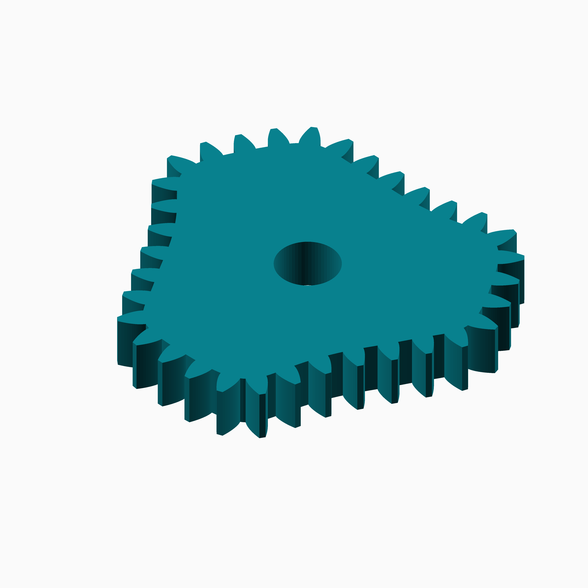
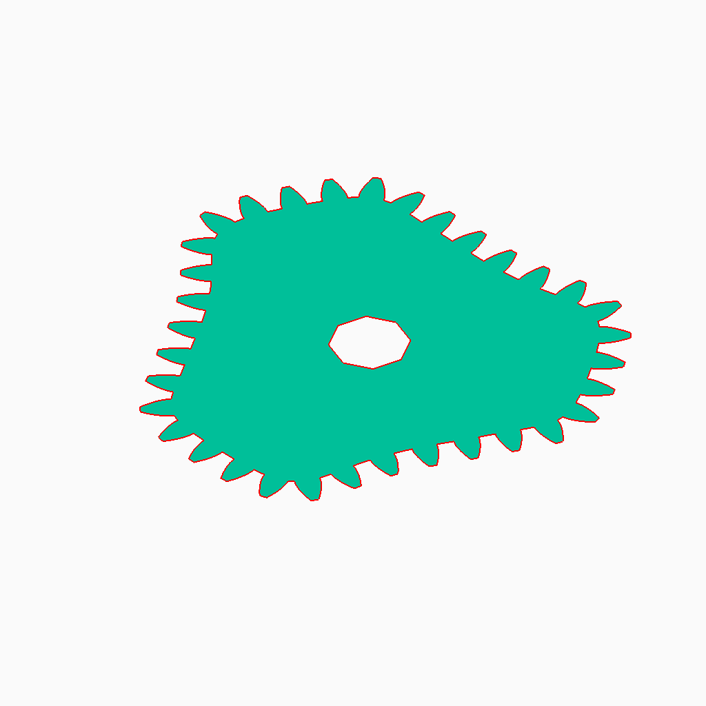
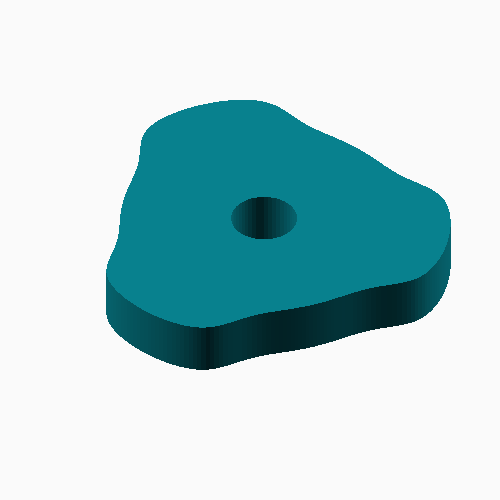
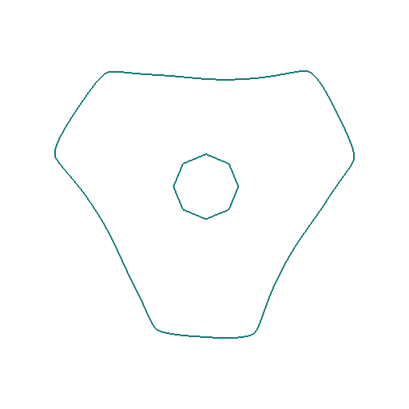
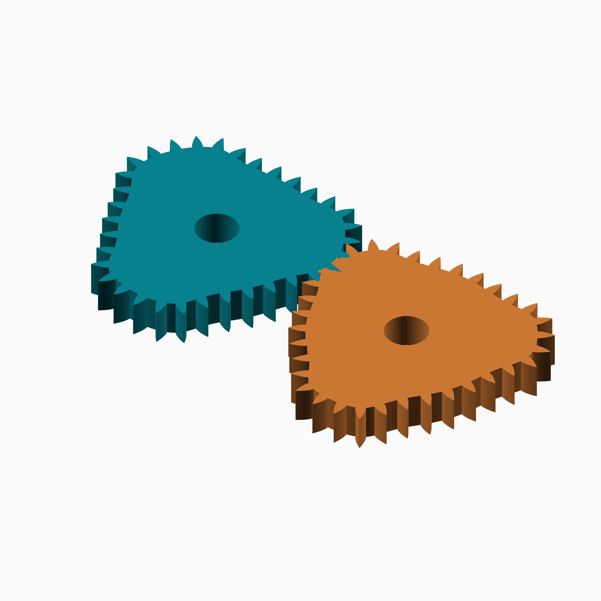
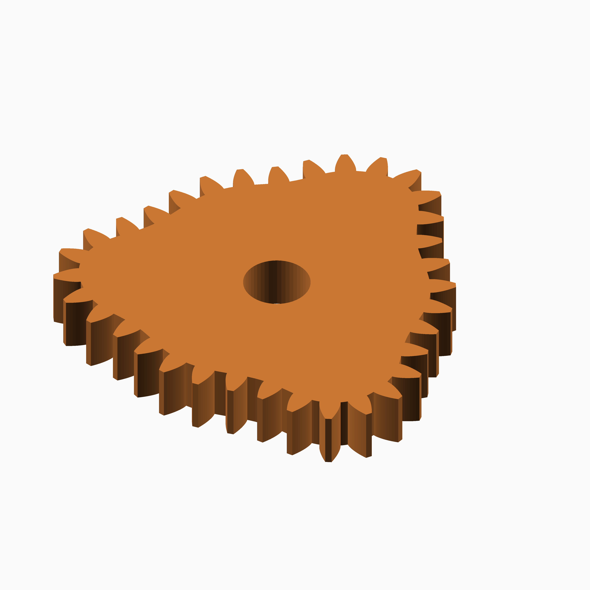

# Tanh Triad

## Documentation navigation

- [README](../README.md)
- Families
  - [Bézier](bezier.md) · [Cassini](cassini.md) · [Circle](circle.md) · [Cusp](cusp.md) · [Ellipse](ellipse.md) · [Epitrochoid](epitrochoid.md)
  - [Fourier](fourier.md) · [Hypotrochoid](hypotrochoid.md) · [Lobed](lobed.md) · [Logarithmic spiral](logarithmic_spiral.md) · [Logistic Dwell](logistic_dwell.md) · [Pascal](pascal.md) · [Superformula](superformula.md) · [Tanh Triad](tanh_triad.md)
- Shared
  - [Examples catalogue](../examples/README.md) · [Test layout](../tests/README.md)
  - [Tooth construction](tooth-construction.md) · [Tooth placement](tooth-placement.md) · [Mate motion](mate-motion.md) · [Mate generation](mate-generation.md) · [Pair assembly](pair-assembly.md)

## Module `Tanh Triad`

Bounded tanh-modulated third-harmonic polar pitch curves.

### Brief content:

**Functions**:

> [`curve_gear_tanh_triad`](#function-curve_gear_tanh_triad): Build a bounded tanh-modulated three-cycle gear.

> [`curve_gear_tanh_triad_2d`](#function-curve_gear_tanh_triad_2d): Build the tanh-modulated 2D gear outline.

> [`curve_gear_tanh_triad_body`](#function-curve_gear_tanh_triad_body): Build the tanh-modulated gear body.

> [`curve_gear_tanh_triad_body_2d`](#function-curve_gear_tanh_triad_body_2d): Build the tanh-modulated 2D body outline.

> [`curve_gear_tanh_triad_centre_distance`](#function-curve_gear_tanh_triad_centre_distance): Build a Tanh Triad gear pair.

> [`curve_gear_tanh_triad_mate`](#function-curve_gear_tanh_triad_mate): Build a Tanh Triad mating gear.

## Functions

The module `Tanh Triad` defines the following functions.

### Function `curve_gear_tanh_triad`

| Tanh Triad gear preview | ⠀ |
| --- | --- |
|  |  |

Build a bounded tanh-modulated three-cycle gear.

**Parameters:**

- `modul`: {number > 0} Tooth module in mm.
- `tooth_number`: {integer >= 3} Number of teeth.
- `width`: {number > 0} Extrusion width in mm.
- `bore`: {number >= 0} Centre bore diameter in mm.
- `transition`: {number > 0, default 1.8} Transition steepness.
- `crest`: {0 < number < 0.5, default 0.13} Main radial modulation.
- `correction`: {0 <= number < 0.2, default 0.03} Sixth-harmonic correction.
- `pressure_angle`: {angle, default 20} Pressure angle. @param tooth_phase {angle, default 0} Tooth phase. @param backlash {undef or >= 0} Backlash. @param clearance {undef or >= 0} Clearance. @param samples {integer >= 120, default 720} Samples. @param orientation {angle, default 0} Orientation.

**Returns:**

No return

Back to [module description](#module-tanh-triad).

### Function `curve_gear_tanh_triad_2d`

| Tanh Triad 2D outline | Full size |
| --- | --- |
|  | [Open full-size image](../images/functions/tanh_triad/curve_gear_tanh_triad_2d.png)  |

Build the tanh-modulated 2D gear outline.

**Parameters:**

- `modul`: {number} Tooth module.
- `tooth_number`: {integer} Tooth count.
- `bore`: {number} Bore.
- `transition`: {number} Transition.
- `crest`: {number} Crest.
- `correction`: {number} Correction.
- `pressure_angle`: {number} Pressure angle.
- `tooth_phase`: {number} Tooth phase.
- `backlash`: {number} Backlash.
- `clearance`: {number} Clearance.
- `samples`: {integer} Samples.
- `orientation`: {number} Orientation.

**Returns:**

No return

Back to [module description](#module-tanh-triad).

### Function `curve_gear_tanh_triad_body`

| Tanh Triad body preview | Full size |
| --- | --- |
|  | [Open full-size image](../images/functions/tanh_triad/curve_gear_tanh_triad_body.png)  |

Build the tanh-modulated gear body.

**Parameters:**

- `modul`: {number} Tooth module.
- `tooth_number`: {integer} Tooth count.
- `width`: {number} Width.
- `bore`: {number} Bore.
- `transition`: {number} Transition.
- `crest`: {number} Crest.
- `correction`: {number} Correction.
- `pressure_angle`: {number} Pressure angle.
- `tooth_phase`: {number} Tooth phase.
- `backlash`: {number} Backlash.
- `clearance`: {number} Clearance.
- `samples`: {integer} Samples.
- `orientation`: {number} Orientation.

**Returns:**

No return

Back to [module description](#module-tanh-triad).

### Function `curve_gear_tanh_triad_body_2d`

| Tanh Triad 2D body outline | Full size |
| --- | --- |
|  | [Open full-size image](../images/functions/tanh_triad/curve_gear_tanh_triad_body_2d.png)  |

Build the tanh-modulated 2D body outline.

**Parameters:**

- `modul`: {number} Tooth module.
- `tooth_number`: {integer} Tooth count.
- `bore`: {number} Bore.
- `transition`: {number} Transition.
- `crest`: {number} Crest.
- `correction`: {number} Correction.
- `pressure_angle`: {number} Pressure angle.
- `tooth_phase`: {number} Tooth phase.
- `backlash`: {number} Backlash.
- `clearance`: {number} Clearance.
- `samples`: {integer} Samples.
- `orientation`: {number} Orientation.
- `body_offset`: {number} Body offset.

**Returns:**

No return

Back to [module description](#module-tanh-triad).

### Function `curve_gear_tanh_triad_centre_distance`

| Tanh Triad pair preview | Full size |
| --- | --- |
|  | [Open full-size image](../images/functions/tanh_triad/curve_gear_tanh_triad_pair.png)  |

function curve_gear_tanh_triad_centre_distance(modul,tooth_number,transition=1.8,crest=.13,correction=.03,samples=720) = let(scale=_cg_tanh_triad_scale(modul,tooth_number,samples,transition,crest,correction)) _cg_tanh_triad_centre_distance(scale,transition,crest,correction,samples);
/** @function curve_gear_tanh_triad_mate_rotation
function curve_gear_tanh_triad_mate_rotation(modul,tooth_number,transition=1.8,crest=.13,correction=.03,samples=720,phase=0) = let(scale=_cg_tanh_triad_scale(modul,tooth_number,samples,transition,crest,correction),D=_cg_tanh_triad_centre_distance(scale,transition,crest,correction,samples),motion=_cg_tanh_triad_motion_table(scale,transition,crest,correction,D,samples)) 180-_cg_motion_y_unwrapped(motion,phase);
include <mate.scad>
include <../common/pair/assembly.scad>

/***
@function curve_gear_tanh_triad_pair

**Parameters:**

- `modul`: {number} Tooth module. @param tooth_number {integer} Tooth count. @param transition {number} Transition. @param crest {number} Crest. @param correction {number} Correction. @param samples {integer} Samples. */
- `modul`: {number} Tooth module. @param tooth_number {integer} Tooth count. @param transition {number} Transition. @param crest {number} Crest. @param correction {number} Correction. @param samples {integer} Samples. @param phase {number} Driver phase. */
- `modul`: {number} Tooth module.
- `tooth_number`: {integer} Tooth count.
- `width`: {number} Width.
- `bore`: {number} Bore.
- `transition`: {number} Transition.
- `crest`: {number} Crest.
- `correction`: {number} Correction.
- `pressure_angle`: {number} Pressure angle.
- `samples`: {integer} Samples.
- `phase`: {number} Pair phase.
- `together_built`: {boolean} Mesh pair.
- `backlash`: {number} Backlash.
- `clearance`: {number} Clearance.
- `tooth_phase`: {number} Tooth phase.
- `driver_color`: {string} Driver colour.
- `mate_color`: {string} Mate colour.

**Returns:**

No return

Back to [module description](#module-tanh-triad).

### Function `curve_gear_tanh_triad_mate`

| Tanh Triad mate preview | Full size |
| --- | --- |
|  | [Open full-size image](../images/functions/tanh_triad/curve_gear_tanh_triad_mate.png)  |

Build a Tanh Triad mating gear.

**Parameters:**

- `modul`: {number} Tooth module.
- `tooth_number`: {integer} Tooth count.
- `width`: {number} Width.
- `bore`: {number} Bore.
- `transition`: {number} Transition.
- `crest`: {number} Crest.
- `correction`: {number} Correction.
- `pressure_angle`: {number} Pressure angle.
- `tooth_phase`: {number} Tooth phase.
- `backlash`: {number} Backlash.
- `clearance`: {number} Clearance.
- `samples`: {integer} Samples.

**Returns:**

No return

Back to [module description](#module-tanh-triad).

Back to [top](#).

---

[Back to the CurveGears README](../README.md)

*Generated by Doxydown from repository source comments; do not edit this page directly.*
