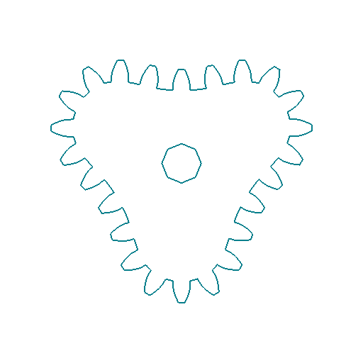
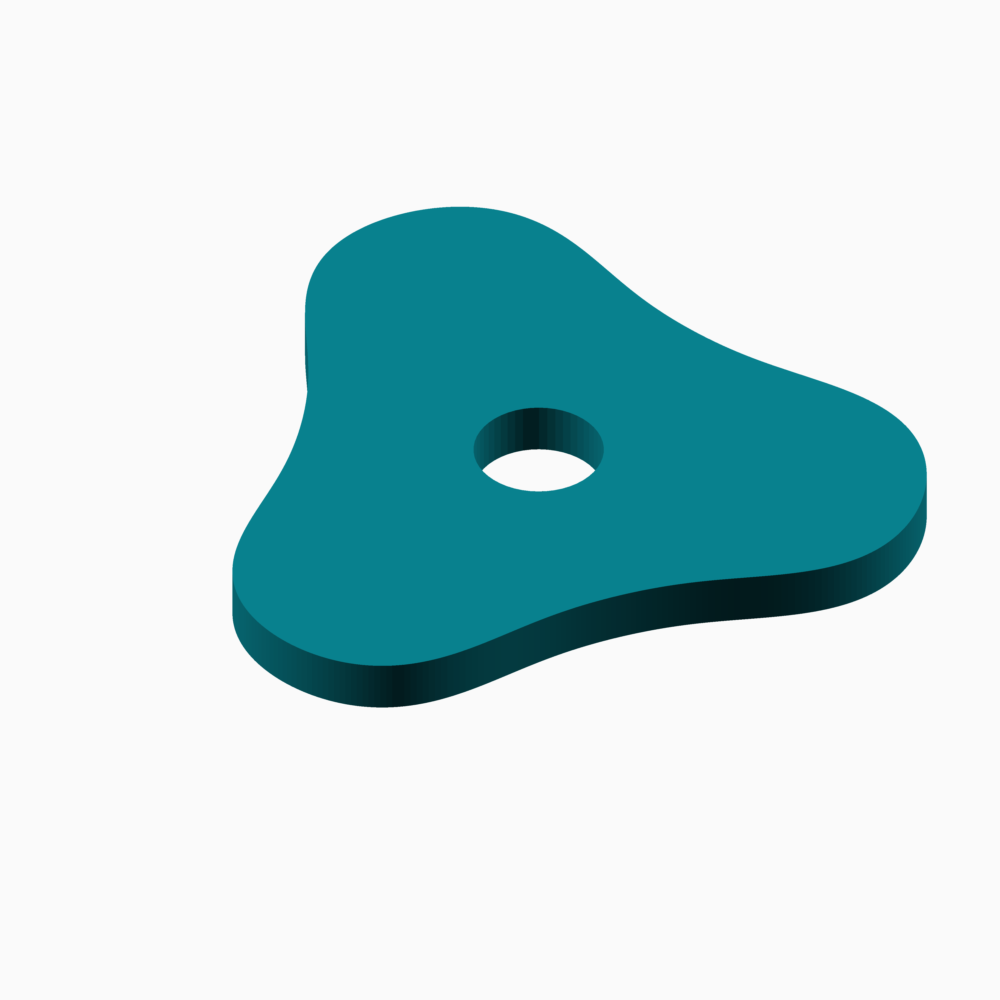
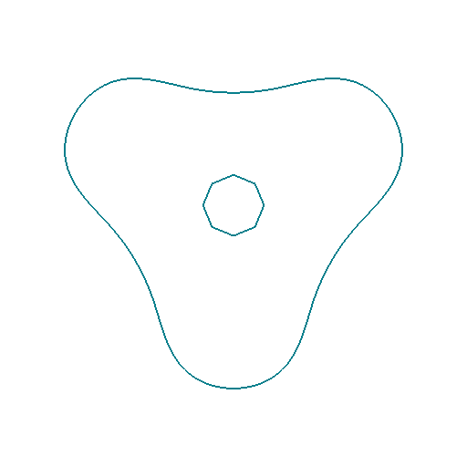
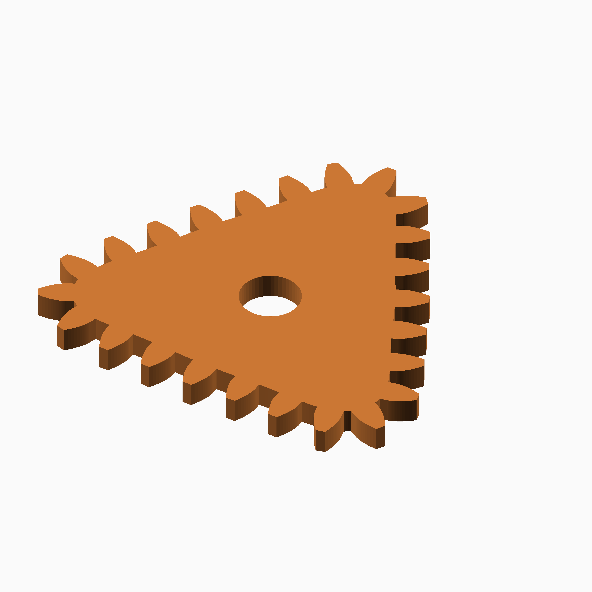

# Tanh Triad

## Documentation navigation

- [README](../README.md)
- Families
  - [Bézier](bezier.md) · [Cassini](cassini.md) · [Circle](circle.md) · [Cosine Quintic](cosine_quintic.md) · [Cusp](cusp.md) · [Ellipse](ellipse.md) · [Epitrochoid](epitrochoid.md)
  - [Fourier](fourier.md) · [Hypotrochoid](hypotrochoid.md) · [Lobed](lobed.md) · [Logarithmic spiral](logarithmic_spiral.md) · [Logistic Dwell](logistic_dwell.md) · [Pascal](pascal.md) · [Superformula](superformula.md) · [Tanh Triad](tanh_triad.md) · [Temple Fay](temple_fay.md)
- Shared
  - [Examples catalogue](../examples/README.md) · [Test layout](../tests/README.md)
  - [Tooth construction](tooth-construction.md) · [Tooth placement](tooth-placement.md) · [Mate motion](mate-motion.md) · [Mate generation](mate-generation.md) · [Pair assembly](pair-assembly.md)

## Module `Tanh Triad`

The unit law is `r(theta)=1+0.13*tanh(1.8*sin(3 theta))+0.03*cos(6 theta+20 degrees)`;
the shared arc-length pitch scaler supplies the requested mean module.
Reference: https://en.wikipedia.org/wiki/Hyperbolic_function.

### Brief content:

**Functions**:

> [`curve_gear_tanh_triad`](#function-curve_gear_tanh_triad): Build a bounded tanh-modulated three-cycle gear.

> [`curve_gear_tanh_triad_2d`](#function-curve_gear_tanh_triad_2d): Build the tanh-modulated 2D gear outline.

> [`curve_gear_tanh_triad_body`](#function-curve_gear_tanh_triad_body): Build the tanh-modulated gear body.

> [`curve_gear_tanh_triad_body_2d`](#function-curve_gear_tanh_triad_body_2d): Build the tanh-modulated 2D body outline.

> [`curve_gear_tanh_triad_centre_distance`](#function-curve_gear_tanh_triad_centre_distance): Return the solved centre distance for a Tanh Triad pair.

> [`curve_gear_tanh_triad_mate`](#function-curve_gear_tanh_triad_mate): Build a Tanh Triad mating gear.

> [`curve_gear_tanh_triad_mate_rotation`](#function-curve_gear_tanh_triad_mate_rotation): Return the mate rotation at a requested Tanh Triad driver phase.

> [`curve_gear_tanh_triad_pair`](#function-curve_gear_tanh_triad_pair): Build a Tanh Triad gear pair.

## Functions

The module `Tanh Triad` defines the following functions.

### Function `curve_gear_tanh_triad`

| Tanh Triad gear 1 | Tanh Triad gear 2 |
| --- | --- |
|  |  |

A broad smooth triad with transition 0.8 and crest 0.32 replaces the canonical sharper, corrected triad. Removing the sixth-harmonic correction isolates the three-lobed tanh law; coarse teeth expose its boundary.

**Parameters:**

- `modul`: {number > 0} Tooth module in mm.
- `tooth_number`: {integer >= 3} Number of teeth.
- `width`: {number > 0} Extrusion width in mm.
- `bore`: {number >= 0} Centre bore diameter in mm.
- `transition`: {number > 0, default 1.8} Transition steepness.
- `crest`: {0 < number < 0.5, default 0.13} Main radial modulation.
- `correction`: {0 <= number < 0.2, default 0.03} Sixth-harmonic correction.
- `pressure_angle`: {angle, default 20} Pressure angle.
- `tooth_phase`: {angle, default 0} Tooth phase.
- `backlash`: {undef or >= 0} Backlash.
- `clearance`: {undef or >= 0} Clearance.
- `samples`: {integer >= 120, default 720} Samples.
- `orientation`: {angle, default 0} Orientation.

**Returns:**

No return

Back to [module description](#module-tanh-triad).

### Function `curve_gear_tanh_triad_2d`

| Tanh Triad 2D gear 1 | Tanh Triad 2D gear 2 |
| --- | --- |
|  |  |

Alternative 2 uses the contrasting controls described in the gear example.

**Parameters:**

- `modul`: {number} Tooth module.
- `tooth_number`: {integer} Tooth count.
- `bore`: {number} Bore.
- `transition`: {number} Transition.
- `crest`: {number} Crest.
- `correction`: {number} Correction.
- `pressure_angle`: {number} Pressure angle.
- `tooth_phase`: {number} Tooth phase.
- `backlash`: {number} Backlash.
- `clearance`: {number} Clearance.
- `samples`: {integer} Samples.
- `orientation`: {number} Orientation.

**Returns:**

No return

Back to [module description](#module-tanh-triad).

### Function `curve_gear_tanh_triad_body`

| Tanh Triad body 1 | Tanh Triad body 2 |
| --- | --- |
|  |  |

Alternative 2 uses the contrasting controls described in the gear example.

**Parameters:**

- `modul`: {number} Tooth module.
- `tooth_number`: {integer} Tooth count.
- `width`: {number} Width.
- `bore`: {number} Bore.
- `transition`: {number} Transition.
- `crest`: {number} Crest.
- `correction`: {number} Correction.
- `pressure_angle`: {number} Pressure angle.
- `tooth_phase`: {number} Tooth phase.
- `backlash`: {number} Backlash.
- `clearance`: {number} Clearance.
- `samples`: {integer} Samples.
- `orientation`: {number} Orientation.

**Returns:**

No return

Back to [module description](#module-tanh-triad).

### Function `curve_gear_tanh_triad_body_2d`

| Tanh Triad 2D body 1 | Tanh Triad 2D body 2 |
| --- | --- |
|  |  |

Alternative 2 uses the contrasting controls described in the gear example.

**Parameters:**

- `modul`: {number} Tooth module.
- `tooth_number`: {integer} Tooth count.
- `bore`: {number} Bore.
- `transition`: {number} Transition.
- `crest`: {number} Crest.
- `correction`: {number} Correction.
- `pressure_angle`: {number} Pressure angle.
- `tooth_phase`: {number} Tooth phase.
- `backlash`: {number} Backlash.
- `clearance`: {number} Clearance.
- `samples`: {integer} Samples.
- `orientation`: {number} Orientation.
- `body_offset`: {number} Body offset.

**Returns:**

No return

Back to [module description](#module-tanh-triad).

### Function `curve_gear_tanh_triad_centre_distance`

Return the solved centre distance for a Tanh Triad pair.

**Parameters:**

- `modul`: {number} Tooth module.
- `tooth_number`: {integer} Tooth count.
- `transition`: {number} Transition.
- `crest`: {number} Crest.
- `correction`: {number} Correction.
- `samples`: {integer} Samples.

**Returns:**

- `{number}`: Fixed centre distance in millimetres.

Back to [module description](#module-tanh-triad).

### Function `curve_gear_tanh_triad_mate`

| Tanh Triad mate 1 | Tanh Triad mate 2 |
| --- | --- |
|  |  |

Alternative 2 uses the contrasting controls described in the gear example.

**Parameters:**

- `modul`: {number} Tooth module.
- `tooth_number`: {integer} Tooth count.
- `width`: {number} Width.
- `bore`: {number} Bore.
- `transition`: {number} Transition.
- `crest`: {number} Crest.
- `correction`: {number} Correction.
- `pressure_angle`: {number} Pressure angle.
- `tooth_phase`: {number} Tooth phase.
- `backlash`: {number} Backlash.
- `clearance`: {number} Clearance.
- `samples`: {integer} Samples.

**Returns:**

No return

Back to [module description](#module-tanh-triad).

### Function `curve_gear_tanh_triad_mate_rotation`

Return the mate rotation at a requested Tanh Triad driver phase.

**Parameters:**

- `modul`: {number} Tooth module.
- `tooth_number`: {integer} Tooth count.
- `transition`: {number} Transition.
- `crest`: {number} Crest.
- `correction`: {number} Correction.
- `samples`: {integer} Samples.
- `phase`: {number} Driver phase.

**Returns:**

- `{angle}`: Mate display rotation in degrees.

Back to [module description](#module-tanh-triad).

### Function `curve_gear_tanh_triad_pair`

| Tanh Triad pair 1 | Tanh Triad pair 2 |
| --- | --- |
|  |  |

Alternative 2 separates the driver and mate and uses the contrasting gear controls described above.

**Parameters:**

- `modul`: {number} Tooth module.
- `tooth_number`: {integer} Tooth count.
- `width`: {number} Width.
- `bore`: {number} Bore.
- `transition`: {number} Transition.
- `crest`: {number} Crest.
- `correction`: {number} Correction.
- `pressure_angle`: {number} Pressure angle.
- `samples`: {integer} Samples.
- `phase`: {number} Pair phase.
- `together_built`: {boolean} Mesh pair.
- `backlash`: {number} Backlash.
- `clearance`: {number} Clearance.
- `tooth_phase`: {number} Tooth phase.
- `driver_color`: {string} Driver colour.
- `mate_color`: {string} Mate colour.

**Returns:**

No return

Back to [module description](#module-tanh-triad).

Back to [top](#).

---

[Back to the CurveGears README](../README.md)

*Generated by Doxydown from repository source comments; do not edit this page directly.*
