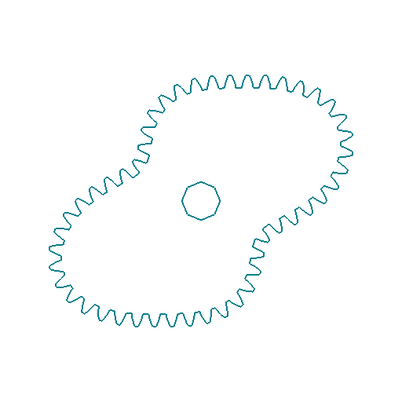
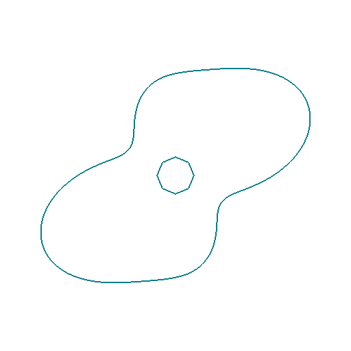
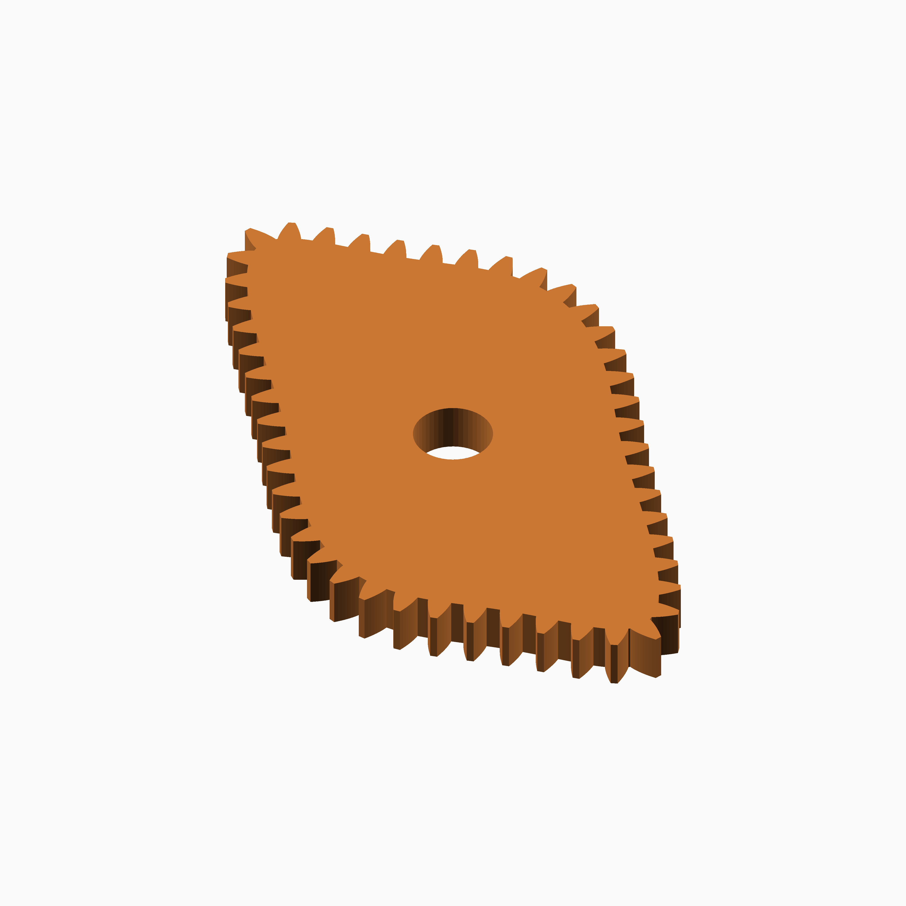

# Temple Fay

## Documentation navigation

- [README](../README.md)
- Families
  - [Bézier](bezier.md) · [Cassini](cassini.md) · [Circle](circle.md) · [Cosine Quintic](cosine_quintic.md) · [Cusp](cusp.md) · [Ellipse](ellipse.md) · [Epitrochoid](epitrochoid.md)
  - [Fourier](fourier.md) · [Hypotrochoid](hypotrochoid.md) · [Lobed](lobed.md) · [Logarithmic spiral](logarithmic_spiral.md) · [Logistic Dwell](logistic_dwell.md) · [Pascal](pascal.md) · [Superformula](superformula.md) · [Tanh Triad](tanh_triad.md) · [Temple Fay](temple_fay.md)
- Shared
  - [Examples catalogue](../examples/README.md) · [Test layout](../tests/README.md)
  - [Tooth construction](tooth-construction.md) · [Tooth placement](tooth-placement.md) · [Mate motion](mate-motion.md) · [Mate generation](mate-generation.md) · [Pair assembly](pair-assembly.md)

## Module `Temple Fay`

The project law is `r(theta)=1+0.18*sin(2 theta)+0.05*sin(4 theta)`.
It is a bounded two-harmonic Fourier polar curve inspired by the Butterfly
Curve associated with Temple H. Fay; this project name is intentional and
does not claim that the implementation is the historical curve itself.
Reference: https://mathworld.wolfram.com/ButterflyCurve.html and
https://en.wikipedia.org/wiki/Fourier_series.

### Brief content:

**Functions**:

> [`curve_gear_temple_fay`](#function-curve_gear_temple_fay): Build a Temple Fay butterfly-inspired gear.

> [`curve_gear_temple_fay_2d`](#function-curve_gear_temple_fay_2d): Build the Temple Fay 2D outline.

> [`curve_gear_temple_fay_body`](#function-curve_gear_temple_fay_body): Build the Temple Fay body.

> [`curve_gear_temple_fay_body_2d`](#function-curve_gear_temple_fay_body_2d): Build the Temple Fay 2D body outline.

> [`curve_gear_temple_fay_centre_distance`](#function-curve_gear_temple_fay_centre_distance): Solve the Temple Fay conjugate centre distance from rolling closure.

> [`curve_gear_temple_fay_mate`](#function-curve_gear_temple_fay_mate): Build the dynamically solved Temple Fay conjugate mate.

> [`curve_gear_temple_fay_mate_rotation`](#function-curve_gear_temple_fay_mate_rotation): Return the integrated Temple Fay conjugate mate rotation.

> [`curve_gear_temple_fay_pair`](#function-curve_gear_temple_fay_pair): Build a Temple Fay driver and dynamically solved conjugate mate, separated by default.

## Functions

The module `Temple Fay` defines the following functions.

### Function `curve_gear_temple_fay`

| Temple Fay gear 1 | Temple Fay gear 2 |
| --- | --- |
|  |  |

Wing 0.05 and fold 0.01 provide a distinct but collision-free alternative to the canonical 0.18/0.05 form. The two Fourier harmonics are varied within the named family, without implying a literal butterfly curve.

**Parameters:**

- `modul`: {number} Tooth module.
- `tooth_number`: {integer} Tooth count.
- `width`: {number} Width.
- `bore`: {number} Bore.
- `wing`: {number} Wing amplitude.
- `fold`: {number} Fold harmonic.
- `pressure_angle`: {number} Pressure angle.
- `tooth_phase`: {number} Tooth phase.
- `backlash`: {number} Backlash.
- `clearance`: {number} Clearance.
- `samples`: {integer} Samples.
- `orientation`: {number} Orientation.

**Returns:**

No return

Back to [module description](#module-temple-fay).

### Function `curve_gear_temple_fay_2d`

| Temple Fay 2D gear 1 | Temple Fay 2D gear 2 |
| --- | --- |
|  |  |

**Parameters:**

- `modul`: {number} Tooth module.
- `tooth_number`: {integer} Tooth count.
- `bore`: {number} Bore.
- `wing`: {number} Wing amplitude.
- `fold`: {number} Fold harmonic.
- `pressure_angle`: {number} Pressure angle.
- `tooth_phase`: {number} Tooth phase.
- `backlash`: {number} Backlash.
- `clearance`: {number} Clearance.
- `samples`: {integer} Samples.
- `orientation`: {number} Orientation.

**Returns:**

No return

Back to [module description](#module-temple-fay).

### Function `curve_gear_temple_fay_body`

| Temple Fay body 1 | Temple Fay body 2 |
| --- | --- |
|  |  |

**Parameters:**

- `modul`: {number} Tooth module.
- `tooth_number`: {integer} Tooth count.
- `width`: {number} Width.
- `bore`: {number} Bore.
- `wing`: {number} Wing amplitude.
- `fold`: {number} Fold harmonic.
- `pressure_angle`: {number} Pressure angle.
- `tooth_phase`: {number} Tooth phase.
- `backlash`: {number} Backlash.
- `clearance`: {number} Clearance.
- `samples`: {integer} Samples.
- `orientation`: {number} Orientation.

**Returns:**

No return

Back to [module description](#module-temple-fay).

### Function `curve_gear_temple_fay_body_2d`

| Temple Fay 2D body 1 | Temple Fay 2D body 2 |
| --- | --- |
|  |  |

**Parameters:**

- `modul`: {number} Tooth module.
- `tooth_number`: {integer} Tooth count.
- `bore`: {number} Bore.
- `wing`: {number} Wing amplitude.
- `fold`: {number} Fold harmonic.
- `pressure_angle`: {number} Pressure angle.
- `tooth_phase`: {number} Tooth phase.
- `backlash`: {number} Backlash.
- `clearance`: {number} Clearance.
- `samples`: {integer} Samples.
- `orientation`: {number} Orientation.
- `body_offset`: {number} Body offset.

**Returns:**

No return

Back to [module description](#module-temple-fay).

### Function `curve_gear_temple_fay_centre_distance`

**Parameters:**

- `modul`: {number} Tooth module.
- `tooth_number`: {integer} Tooth count.
- `wing`: {number} Wing amplitude.
- `fold`: {number} Fold harmonic.
- `samples`: {integer} Samples.

**Returns:**

No return

Back to [module description](#module-temple-fay).

### Function `curve_gear_temple_fay_mate`

| Temple Fay mate 1 | Temple Fay mate 2 |
| --- | --- |
|  |  |

**Parameters:**

- `modul`: {number} Tooth module.
- `tooth_number`: {integer} Tooth count.
- `width`: {number} Width.
- `bore`: {number} Bore.
- `wing`: {number} Wing amplitude.
- `fold`: {number} Fold harmonic.
- `pressure_angle`: {number} Pressure angle.
- `tooth_phase`: {number} Tooth phase.
- `backlash`: {number} Backlash.
- `clearance`: {number} Clearance.
- `samples`: {integer} Samples.

**Returns:**

No return

Back to [module description](#module-temple-fay).

### Function `curve_gear_temple_fay_mate_rotation`

**Parameters:**

- `modul`: {number} Tooth module.
- `tooth_number`: {integer} Tooth count.
- `wing`: {number} Wing amplitude.
- `fold`: {number} Fold harmonic.
- `samples`: {integer} Samples.
- `phase`: {number} Driver phase.

**Returns:**

No return

Back to [module description](#module-temple-fay).

### Function `curve_gear_temple_fay_pair`

| Temple Fay pair 1 | Temple Fay pair 2 |
| --- | --- |
|  |  |

**Parameters:**

- `modul`: {number, default .8} Tooth module.
- `tooth_number`: {integer, default 34} Tooth count.
- `width`: {number, default 4} Width.
- `bore`: {number, default 4.8} Bore.
- `wing`: {number, default .18} Wing amplitude.
- `fold`: {number, default .05} Fold harmonic.
- `pressure_angle`: {number, default 20} Pressure angle.
- `samples`: {integer, default 720} Samples.
- `phase`: {number, default 0} Pair phase.
- `together_built`: {boolean, default false} Use meshed placement when true, separated display placement otherwise.
- `backlash`: {number, default undef} Backlash.
- `clearance`: {number, default undef} Clearance.
- `tooth_phase`: {number, default 0} Tooth phase.
- `driver_color`: {string, default "SteelBlue"} Driver colour.
- `mate_color`: {string, default "Gold"} Mate colour.

**Returns:**

No return

Back to [module description](#module-temple-fay).

Back to [top](#).

## Module `Harmonic common`

Coefficients are [harmonic, amplitude, phase in degrees]. Family adapters
own admissibility, pitch scaling and sampling; this evaluator does not
inherit the public Fourier family's coefficient-domain restrictions.

### Brief content:

**Functions**:

> [`_cg_harmonic_unit_radius`](#function-_cg_harmonic_unit_radius): Evaluate a finite cosine series around unit mean radius.

## Functions

The module `Harmonic common` defines the following functions.

### Function `_cg_harmonic_unit_radius`

Evaluate a finite cosine series around unit mean radius.

**Parameters:**

- `coefficients`: {array} Harmonic, amplitude and phase rows.
- `theta`: {angle} Physical polar angle in degrees.

**Returns:**

- `{number}`: Unit radius before family-specific scaling.

Back to [module description](#module-harmonic-common).

Back to [top](#).

---

[Back to the CurveGears README](../README.md)

*Generated by Doxydown from repository source comments; do not edit this page directly.*
