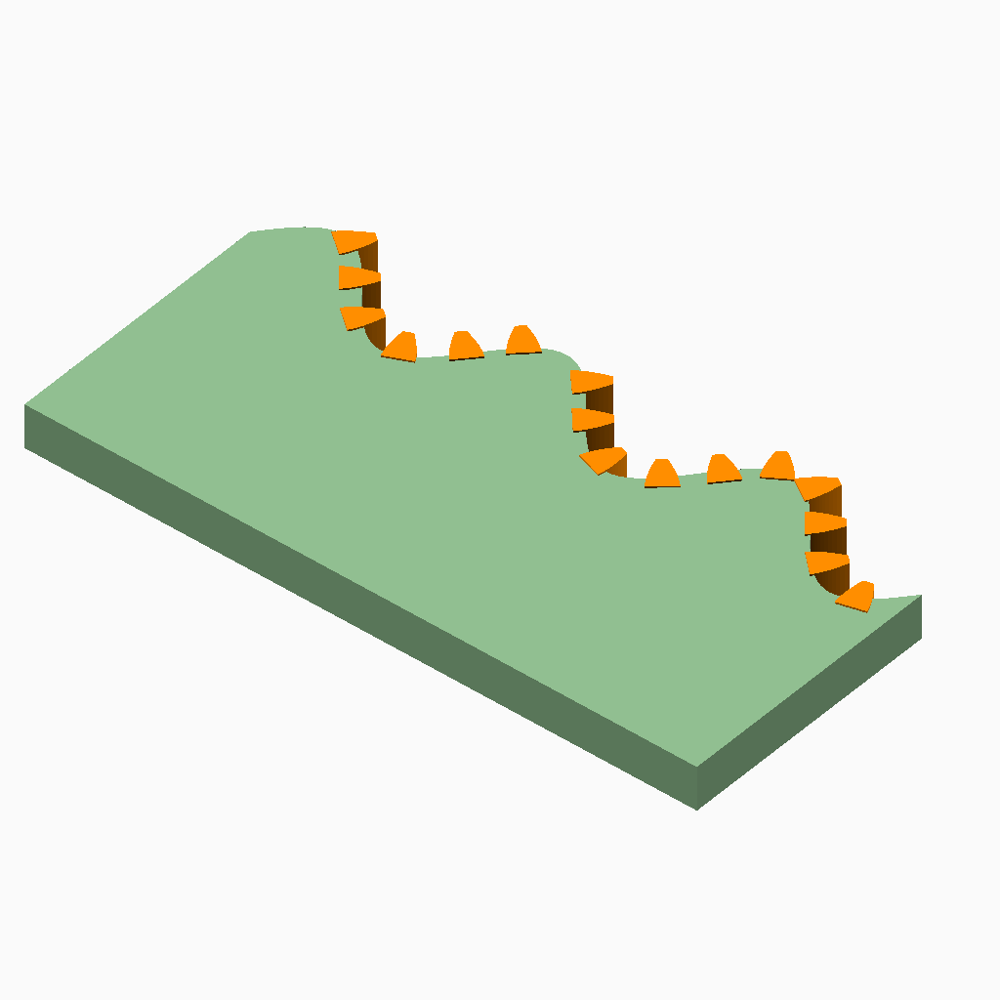

# Tooth placement

## Documentation navigation

- [README](../README.md)
- Families
  - [Bézier](bezier.md) · [Cassini](cassini.md) · [Circle](circle.md) · [Ellipse](ellipse.md) · [Epitrochoid](epitrochoid.md) · [Fourier](fourier.md)
  - [Hypotrochoid](hypotrochoid.md) · [Lobed](lobed.md) · [Logarithmic spiral](logarithmic_spiral.md) · [Pascal](pascal.md) · [Superformula](superformula.md)
- Shared
  - [Examples catalogue](../examples/README.md) · [Test layout](../tests/README.md)
  - [Tooth construction](tooth-construction.md) · [Tooth placement](tooth-placement.md) · [Mate motion](mate-motion.md) · [Mate generation](mate-generation.md) · [Pair assembly](pair-assembly.md)

## Module `Tooth Placement`

This layer owns arc-length frames, winding-aware normals, accessibility, body
intersections, splice intervals and nearby tooth collision checks. It returns
placed, omitted_inaccessible or invalid states; it never silently repairs invalid geometry.
Cheap frame and candidate checks precede corridor and body scans. A source-point
broad phase limits exact collision checks to plausible tooth pairs; adjacent
pairs are checked as well, with only their explicitly shared boundary contact
permitted.

### Brief content:

**Functions**:

> [`_cg_outward_normal`](#function-_cg_outward_normal): Return the contour-winding outward normal.

> [`_cg_curve_tangent(points, i)`](#function-_cg_curve_tangentpoints-i): Estimate a centred tangent vector at a closed-curve point index.

> [`_cg_polyline_arc_table(points)`](#function-_cg_polyline_arc_tablepoints): Build a cumulative arc-length table for a closed polyline.

> [`_cg_open_arc_table(points)`](#function-_cg_open_arc_tablepoints): Build a cumulative arc-length table for an open polyline.

> [`_cg_point_for_closed_arc(points, arc, target)`](#function-_cg_point_for_closed_arcpoints-arc-target): Interpolate a Cartesian point at a wrapped closed-curve arc position.

> [`_cg_tangent_for_closed_arc(points, arc, target)`](#function-_cg_tangent_for_closed_arcpoints-arc-target): Interpolate a centred tangent at a wrapped closed-curve arc position.

> [`_cg_local_frame_for_closed_arc`](#function-_cg_local_frame_for_closed_arc): Return point, tangent, outward normal and winding at an arc position.

> [`_cg_frame_failure_code`](#function-_cg_frame_failure_code): Validate frame finiteness, scale, orthogonality and winding.

> [`_cg_frame_valid(frame)`](#function-_cg_frame_validframe): Check whether a local curve frame passes all frame invariants.

> [`_cg_profile_point_at_frame`](#function-_cg_profile_point_at_frame): Map local normal/tangent coordinates into a gear frame.

> [`_cg_canonical_body_point_at_arc`](#function-_cg_canonical_body_point_at_arc): Return a body point inward from the pitch contour.

> [`_cg_canonical_body_polyline`](#function-_cg_canonical_body_polyline): Build the closed canonical body before teeth merge.

> [`_cg_arc_mean_segment_length(arc)`](#function-_cg_arc_mean_segment_lengtharc): Calculate the mean segment length represented by an arc table.

> [`_cg_arc_segment_is_discrete_return`](#function-_cg_arc_segment_is_discrete_return): Detect long discrete return segments in an arc table.

> [`_cg_arc_segment_index(arc, perimeter, target)`](#function-_cg_arc_segment_indexarc-perimeter-target): Find the segment containing a wrapped arc target.

> [`_cg_frame_continuity_failure_code`](#function-_cg_frame_continuity_failure_code): Check neighbouring frames except at source discontinuities.

> [`_cg_point_in_polygon(point, polygon_points)`](#function-_cg_point_in_polygonpoint-polygon_points): Test point inclusion using an even-odd polygon crossing rule.

> [`_cg_segment_hits_polygon(a, b, polygon_points)`](#function-_cg_segment_hits_polygona-b-polygon_points): Test whether a segment enters or intersects a polygon.

> [`_cg_accessibility_result`](#function-_cg_accessibility_result): Test the outward engagement corridor against remote body segments.

> [`_cg_body_arc_for_intersection(hit, arc)`](#function-_cg_body_arc_for_intersectionhit-arc): Convert a body intersection record to its arc position.

> [`_cg_local_body_hits(hits, arc, perimeter, target, tooth_pitch)`](#function-_cg_local_body_hitshits-arc-perimeter-target-tooth_pitch): Retain body intersections within the local tooth interval.

> [`_cg_hit_seen_before(hits, index)`](#function-_cg_hit_seen_beforehits-index): Check whether an intersection point has already occurred.

> [`_cg_unique_hits(hits)`](#function-_cg_unique_hitshits): Remove coincident intersection records while preserving order.

> [`_cg_arc_near_target(s, target, perimeter)`](#function-_cg_arc_near_targets-target-perimeter): Wrap an arc position to the turn nearest a target position.

> [`_cg_splice_interval`](#function-_cg_splice_interval): Return one placed tooth's body replacement interval.

> [`_cg_splice_relation`](#function-_cg_splice_relation): Classify two canonical body intervals.

> [`_cg_splice_failures`](#function-_cg_splice_failures): Validate every accepted replacement interval.

> [`_cg_tooth_body_intersections(tooth_boundary, body)`](#function-_cg_tooth_body_intersectionstooth_boundary-body): Find intersections between a placed tooth boundary and the body.

> [`_cg_placement_invalid(index, target, frame, candidate, code)`](#function-_cg_placement_invalidindex-target-frame-candidate-code): Construct the canonical invalid placement record.

> [`_cg_placement_after_preflight(points, arc, perimeter, body, modul, tooth_number, tooth_index, candidate, pressure_angle, tooth_phase, radial_root, backlash, clearance, frame, tooth_pitch, target)`](#function-_cg_placement_after_preflightpoints-arc-perimeter-body-modul-tooth_number-tooth_index-candidate-pressure_angle-tooth_phase-radial_root-backlash-clearance-frame-tooth_pitch-target): Evaluate accessibility and body intersections after cheap placement checks.

> [`_cg_placement_result(points, arc, perimeter, body, modul, tooth_number, tooth_index, candidate, ...)`](#function-_cg_placement_resultpoints-arc-perimeter-body-modul-tooth_number-tooth_index-candidate-): Classify one candidate as placed, omitted or invalid.

> [`_cg_tooth_pair_collisions(a, b)`](#function-_cg_tooth_pair_collisionsa-b): Find all segment intersections between two tooth boundaries.

> [`_cg_point_on_segment(point, a, b)`](#function-_cg_point_on_segmentpoint-a-b): Test whether a point lies on a segment within the geometry tolerance.

> [`_cg_point_in_polygon_strict(point, polygon_points)`](#function-_cg_point_in_polygon_strictpoint-polygon_points): Test strict containment, excluding points on the polygon boundary.

> [`_cg_tooth_containment_collisions(a, b)`](#function-_cg_tooth_containment_collisionsa-b): Detect one tooth boundary contained inside the other.

> [`_cg_tooth_contact_is_permitted(a, b, hit)`](#function-_cg_tooth_contact_is_permitteda-b-hit): Permit only a shared endpoint contact between tooth boundaries.

> [`_cg_tooth_top_collisions(a, b)`](#function-_cg_tooth_top_collisionsa-b): Find collisions between the top edges of two tooth boundaries.

> [`_cg_tooth_order_failures(placements)`](#function-_cg_tooth_order_failuresplacements): Detect non-monotone indices among accepted placements.

> [`_cg_tooth_non_top_collisions(a, b)`](#function-_cg_tooth_non_top_collisionsa-b): Filter top-edge contacts from complete tooth-pair collisions.

> [`_cg_adjacent_contact_region`](#function-_cg_adjacent_contact_region): Return whether adjacent-tooth witnesses form one compact shared contact.

> [`_cg_final_boundary_collisions`](#function-_cg_final_boundary_collisions): Run broad-phase and exact checks for every nearby placed-tooth pair.

## Functions

The module `Tooth Placement` defines the following functions.

### Function `_cg_outward_normal`

Return the contour-winding outward normal.

**Parameters:**

- `points`: {array of points} Closed contour.
- `tangent`: {vector} Local tangent vector.

**Returns:**

- `{vector}`: Winding-aware outward normal.

Back to [module description](#module-tooth-placement).

### Function `_cg_curve_tangent(points, i)`

Estimate a centred tangent vector at a closed-curve point index.

**Parameters:**

- `points`: {array} Closed curve points.
- `i`: {integer} Point index.

**Returns:**

- `{array}`: Unnormalised tangent vector.

Back to [module description](#module-tooth-placement).

### Function `_cg_polyline_arc_table(points)`

Build a cumulative arc-length table for a closed polyline.

**Parameters:**

- `points`: {array} Closed curve points.

**Returns:**

- `{array}`: Table of `[point index, cumulative length]` rows.

Back to [module description](#module-tooth-placement).

### Function `_cg_open_arc_table(points)`

Build a cumulative arc-length table for an open polyline.

**Parameters:**

- `points`: {array} Open curve points.

**Returns:**

- `{array}`: Table of `[point index, cumulative length]` rows.

Back to [module description](#module-tooth-placement).

### Function `_cg_point_for_closed_arc(points, arc, target)`

Interpolate a Cartesian point at a wrapped closed-curve arc position.

**Parameters:**

- `points`: {array} Closed curve points.
- `arc`: {array} Closed-curve arc-length table.
- `target`: {number} Target arc length in mm.

**Returns:**

- `{array}`: Interpolated Cartesian point.

Back to [module description](#module-tooth-placement).

### Function `_cg_tangent_for_closed_arc(points, arc, target)`

Interpolate a centred tangent at a wrapped closed-curve arc position.

**Parameters:**

- `points`: {array} Closed curve points.
- `arc`: {array} Closed-curve arc-length table.
- `target`: {number} Target arc length in mm.

**Returns:**

- `{array}`: Unnormalised tangent vector.

Back to [module description](#module-tooth-placement).

### Function `_cg_local_frame_for_closed_arc`

Return point, tangent, outward normal and winding at an arc position.

**Parameters:**

- `points`: {array of points} Closed pitch contour.
- `arc`: {array} Cumulative arc-length table.
- `perimeter`: {number > 0} Total contour perimeter.
- `target`: {number} Target arc length.

**Returns:**

- `{array}`: Local point, tangent, normal and winding.

Back to [module description](#module-tooth-placement).

### Function `_cg_frame_failure_code`

Validate frame finiteness, scale, orthogonality and winding.

**Parameters:**

- `frame`: {array} Point, tangent, normal and winding frame.

**Returns:**

- `{string}`: Validation failure code or `PASS`.

Back to [module description](#module-tooth-placement).

### Function `_cg_frame_valid(frame)`

Check whether a local curve frame passes all frame invariants.

**Parameters:**

- `frame`: {array} Point, tangent, normal and winding frame.

**Returns:**

- `{boolean}`: True when the frame is valid.

Back to [module description](#module-tooth-placement).

### Function `_cg_profile_point_at_frame`

Map local normal/tangent coordinates into a gear frame.

**Parameters:**

- `local_point`: {point} Local tooth-profile point.
- `pitch_point`: {point} Pitch-contour point.
- `normal`: {vector} Outward frame normal.
- `tangent`: {vector} Frame tangent.
- `pitch_radius`: {number} Local pitch radius.

**Returns:**

- `{point}`: Transformed Cartesian point.

Back to [module description](#module-tooth-placement).

### Function `_cg_canonical_body_point_at_arc`

Return a body point inward from the pitch contour.

**Parameters:**

- `points`: {array of points} Closed pitch contour.
- `arc`: {array} Cumulative arc-length table.
- `perimeter`: {number > 0} Total contour perimeter.
- `target`: {number} Target arc length.
- `dedendum`: {number >= 0} Radial inward offset.
- `radial_root`: {boolean, default false} Use radial rather than normal offset.

**Returns:**

- `{point}`: Inward body point.

Back to [module description](#module-tooth-placement).

### Function `_cg_canonical_body_polyline`

Build the closed canonical body before teeth merge.

**Parameters:**

- `points`: {array of points} Closed pitch contour.
- `arc`: {array} Cumulative arc-length table.
- `perimeter`: {number > 0} Total contour perimeter.
- `dedendum`: {number >= 0} Radial inward offset.
- `radial_root`: {boolean, default false} Use radial rather than normal offset.

**Returns:**

- `{array of points}`: Closed canonical body polyline.

Back to [module description](#module-tooth-placement).

### Function `_cg_arc_mean_segment_length(arc)`

Calculate the mean segment length represented by an arc table.

**Parameters:**

- `arc`: {array} Arc-length table.

**Returns:**

- `{number}`: Mean segment length in mm.

Back to [module description](#module-tooth-placement).

### Function `_cg_arc_segment_is_discrete_return`

Detect long discrete return segments in an arc table.

**Parameters:**

- `arc`: {array} Cumulative arc-length table.
- `perimeter`: {number > 0} Total contour perimeter.
- `target`: {number} Target arc length.

**Returns:**

- `{boolean}`: True when the target falls on a discrete return.

Back to [module description](#module-tooth-placement).

### Function `_cg_arc_segment_index(arc, perimeter, target)`

Find the segment containing a wrapped arc target.

**Parameters:**

- `arc`: {array} Arc-length table.
- `perimeter`: {number > 0} Closed-curve perimeter in mm.
- `target`: {number} Target arc length in mm.

**Returns:**

- `{integer}`: Containing segment index.

Back to [module description](#module-tooth-placement).

### Function `_cg_frame_continuity_failure_code`

Check neighbouring frames except at source discontinuities.

**Parameters:**

- `points`: {array of points} Closed pitch contour.
- `arc`: {array} Cumulative arc-length table.
- `perimeter`: {number > 0} Total contour perimeter.
- `target`: {number} Target arc length.
- `tooth_pitch`: {number > 0} Tooth pitch distance.

**Returns:**

- `{string}`: Validation failure code or `PASS`.

Back to [module description](#module-tooth-placement).

### Function `_cg_point_in_polygon(point, polygon_points)`

Test point inclusion using an even-odd polygon crossing rule.

**Parameters:**

- `point`: {array} Cartesian point.
- `polygon_points`: {array} Polygon vertices.

**Returns:**

- `{boolean}`: True when the point lies inside the polygon.

Back to [module description](#module-tooth-placement).

### Function `_cg_segment_hits_polygon(a, b, polygon_points)`

Test whether a segment enters or intersects a polygon.

**Parameters:**

- `a`: {array} Segment start point.
- `b`: {array} Segment end point.
- `polygon_points`: {array} Polygon vertices.

**Returns:**

- `{boolean}`: True when the segment hits or lies inside the polygon.

Back to [module description](#module-tooth-placement).

### Function `_cg_accessibility_result`

Test the outward engagement corridor against remote body segments.

**Parameters:**

- `points`: {array of points} Closed pitch contour.
- `arc`: {array} Cumulative arc-length table.
- `perimeter`: {number > 0} Total contour perimeter.
- `body`: {array of points} Canonical body polyline.
- `target`: {number} Target arc length.
- `tooth_pitch`: {number > 0} Tooth pitch distance.
- `modul`: {number > 0} Tooth module.
- `candidate`: {array} Local tooth candidate.
- `radial_root`: {boolean, default false} Use radial root geometry.
- `clearance`: {number, default undef} Additional corridor clearance.

**Returns:**

- `{array}`: Accessibility result and diagnostic data.

Back to [module description](#module-tooth-placement).

### Function `_cg_body_arc_for_intersection(hit, arc)`

Convert a body intersection record to its arc position.

**Parameters:**

- `hit`: {array} Body intersection record.
- `arc`: {array} Body arc-length table.

**Returns:**

- `{number}`: Intersection arc position in mm.

Back to [module description](#module-tooth-placement).

### Function `_cg_local_body_hits(hits, arc, perimeter, target, tooth_pitch)`

Retain body intersections within the local tooth interval.

**Parameters:**

- `hits`: {array} Body intersection records.
- `arc`: {array} Body arc-length table.
- `perimeter`: {number > 0} Body perimeter in mm.
- `target`: {number} Tooth target arc position in mm.
- `tooth_pitch`: {number > 0} Arc distance between teeth in mm.

**Returns:**

- `{array}`: Local intersection records with arc positions appended.

Back to [module description](#module-tooth-placement).

### Function `_cg_hit_seen_before(hits, index)`

Check whether an intersection point has already occurred.

**Parameters:**

- `hits`: {array} Intersection records.
- `index`: {integer} Record index to test.

**Returns:**

- `{boolean}`: True when an earlier record is coincident.

Back to [module description](#module-tooth-placement).

### Function `_cg_unique_hits(hits)`

Remove coincident intersection records while preserving order.

**Parameters:**

- `hits`: {array} Intersection records.

**Returns:**

- `{array}`: Unique intersection records.

Back to [module description](#module-tooth-placement).

### Function `_cg_arc_near_target(s, target, perimeter)`

Wrap an arc position to the turn nearest a target position.

**Parameters:**

- `s`: {number} Arc position in mm.
- `target`: {number} Target arc position in mm.
- `perimeter`: {number > 0} Closed-curve perimeter in mm.

**Returns:**

- `{number}`: Nearest equivalent arc position in mm.

Back to [module description](#module-tooth-placement).

### Function `_cg_splice_interval`

Return one placed tooth's body replacement interval.

**Parameters:**

- `placement`: {array} Canonical placement record.
- `perimeter`: {number > 0} Body perimeter in mm.
- `tooth_pitch`: {number, default undef} Arc-length tooth pitch for cell clipping.

**Returns:**

- `{array}`: Ordered body replacement interval.

Back to [module description](#module-tooth-placement).

### Function `_cg_splice_relation`

Classify two canonical body intervals.

**Parameters:**

- `first`: {array} First replacement interval.
- `second`: {array} Second replacement interval.

**Returns:**

- `{string}`: Interval relation or `PASS`.

Back to [module description](#module-tooth-placement).

### Function `_cg_splice_failures`

Validate every accepted replacement interval.

**Parameters:**

- `intervals`: {array} Accepted replacement intervals.

**Returns:**

- `{array}`: Splice validation failures.

Back to [module description](#module-tooth-placement).

### Function `_cg_tooth_body_intersections(tooth_boundary, body)`

Find intersections between a placed tooth boundary and the body.

**Parameters:**

- `tooth_boundary`: {array} Tooth boundary points.
- `body`: {array} Body boundary points.

**Returns:**

- `{array}`: Intersection records with segment indices and fractions.

Back to [module description](#module-tooth-placement).

### Function `_cg_placement_invalid(index, target, frame, candidate, code)`

Construct the canonical invalid placement record.

**Parameters:**

- `index`: {integer} Tooth index.
- `target`: {number} Target arc position in mm.
- `frame`: {array} Local placement frame.
- `candidate`: {array} Cached tooth candidate record.
- `code`: {string} Failure code.

**Returns:**

- `{array}`: Invalid placement record.

Back to [module description](#module-tooth-placement).

### Function `_cg_placement_after_preflight(points, arc, perimeter, body, modul, tooth_number, tooth_index, candidate, pressure_angle, tooth_phase, radial_root, backlash, clearance, frame, tooth_pitch, target)`

Evaluate accessibility and body intersections after cheap placement checks.

**Parameters:**

- `points`: {array} Sampled pitch-curve points.
- `arc`: {array} Pitch-curve arc-length table.
- `perimeter`: {number > 0} Pitch-curve perimeter in mm.
- `body`: {array} Canonical body boundary.
- `modul`: {number > 0} Tooth module in mm.
- `tooth_number`: {integer >= 3} Number of teeth.
- `tooth_index`: {integer} Tooth index.
- `candidate`: {array} Cached tooth candidate record.
- `pressure_angle`: {angle} Involute pressure angle in degrees.
- `tooth_phase`: {angle} Tooth placement phase in degrees.
- `radial_root`: {boolean} Use radial-root construction.
- `backlash`: {undef or >= 0} Tangential tooth-thickness reduction in mm.
- `clearance`: {undef or >= 0} Additional radial root clearance in mm.
- `frame`: {array} Local placement frame.
- `tooth_pitch`: {number > 0} Arc distance between teeth in mm.
- `target`: {number} Target arc position in mm.

**Returns:**

- `{array}`: Placed, omitted or invalid placement record.

Back to [module description](#module-tooth-placement).

### Function `_cg_placement_result(points, arc, perimeter, body, modul, tooth_number, tooth_index, candidate, ...)`

Classify one candidate as placed, omitted or invalid.

**Parameters:**

- `points`: {array of points} Sampled closed pitch contour.
- `arc`: {array} Cumulative closed-contour arc-length table.
- `perimeter`: {number > 0} Total contour perimeter in mm.
- `body`: {array of points} Canonical body boundary.
- `modul`: {number > 0} Tooth module in mm.
- `tooth_number`: {integer >= 3} Number of teeth.
- `tooth_index`: {integer} Zero-based tooth index.
- `candidate`: {array} Cached validated local tooth candidate.
- `pressure_angle`: {angle, default 20} Involute pressure angle in degrees.
- `tooth_phase`: {angle, default 0} Tooth placement phase in degrees.
- `radial_root`: {boolean, default false} Use radial-root construction.
- `backlash`: {undef or >= 0} Tangential tooth-thickness reduction in mm.
- `clearance`: {undef or >= 0} Additional radial root clearance in mm.

**Returns:**

- `{array}`: Canonical placement result record.

Back to [module description](#module-tooth-placement).

### Function `_cg_tooth_pair_collisions(a, b)`

Find all segment intersections between two tooth boundaries.

**Parameters:**

- `a`: {array} First tooth boundary.
- `b`: {array} Second tooth boundary.

**Returns:**

- `{array}`: Segment intersection records.

Back to [module description](#module-tooth-placement).

### Function `_cg_point_on_segment(point, a, b)`

Test whether a point lies on a segment within the geometry tolerance.

**Parameters:**

- `point`: {point} Candidate point.
- `a`: {point} Segment start.
- `b`: {point} Segment end.

**Returns:**

- `{boolean}`: True when the point lies on the segment.

Back to [module description](#module-tooth-placement).

### Function `_cg_point_in_polygon_strict(point, polygon_points)`

Test strict containment, excluding points on the polygon boundary.

**Parameters:**

- `point`: {point} Candidate point.
- `polygon_points`: {array} Closed polygon.

**Returns:**

- `{boolean}`: True when the point is strictly inside the polygon.

Back to [module description](#module-tooth-placement).

### Function `_cg_tooth_containment_collisions(a, b)`

Detect one tooth boundary contained inside the other.

**Parameters:**

- `a`: {array of points} First tooth boundary.
- `b`: {array of points} Second tooth boundary.

**Returns:**

- `{array}`: Containment witnesses.

Back to [module description](#module-tooth-placement).

### Function `_cg_tooth_contact_is_permitted(a, b, hit)`

Permit only a shared endpoint contact between tooth boundaries.

**Parameters:**

- `a`: {array of points} First tooth boundary.
- `b`: {array of points} Second tooth boundary.
- `hit`: {array} Segment collision record.

**Returns:**

- `{boolean}`: True only for an endpoint-only shared boundary contact.

Back to [module description](#module-tooth-placement).

### Function `_cg_tooth_top_collisions(a, b)`

Find collisions between the top edges of two tooth boundaries.

**Parameters:**

- `a`: {array} First tooth boundary.
- `b`: {array} Second tooth boundary.

**Returns:**

- `{array}`: Top-edge collision records.

Back to [module description](#module-tooth-placement).

### Function `_cg_tooth_order_failures(placements)`

Detect non-monotone indices among accepted placements.

**Parameters:**

- `placements`: {array} Placement records.

**Returns:**

- `{array}`: Placement-order failure records.

Back to [module description](#module-tooth-placement).

### Function `_cg_tooth_non_top_collisions(a, b)`

Filter top-edge contacts from complete tooth-pair collisions.

**Parameters:**

- `a`: {array} First tooth boundary.
- `b`: {array} Second tooth boundary.

**Returns:**

- `{array}`: Non-top collision records.

Back to [module description](#module-tooth-placement).

### Function `_cg_adjacent_contact_region`

Return whether adjacent-tooth witnesses form one compact shared contact.

**Parameters:**

- `hits`: {array} Non-top collision witnesses.
- `modul`: {number > 0} Tooth module in mm.

**Returns:**

- `{boolean}`: True only for one local contact region.

Back to [module description](#module-tooth-placement).

### Function `_cg_final_boundary_collisions`

Run broad-phase and exact checks for every nearby placed-tooth pair.

**Parameters:**

- `boundaries`: {array} Placed tooth boundaries.
- `points`: {array of points} Sampled pitch contour.
- `arc`: {array} Pitch-curve arc-length table.
- `perimeter`: {number > 0} Pitch-curve perimeter.
- `tooth_pitch`: {number > 0} Arc distance between teeth.

**Returns:**

- `{array}`: Boundary collision records.

Back to [module description](#module-tooth-placement).

Back to [top](#).

---

[Back to the CurveGears README](../README.md)

*Generated by Doxydown from repository source comments; do not edit this page directly.*
