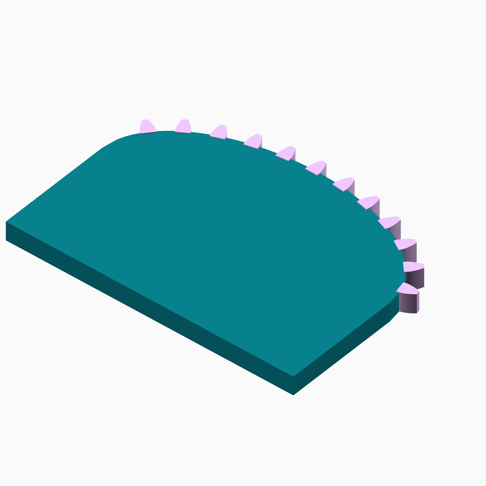

# Tooth placement

## Documentation navigation

- [README](../README.md)
- Families
  - [Bézier](bezier.md) · [Cassini](cassini.md) · [Circle](circle.md) · [Cosine Quintic](cosine_quintic.md) · [Cusp](cusp.md) · [Ellipse](ellipse.md) · [Epitrochoid](epitrochoid.md)
  - [Fourier](fourier.md) · [Hypotrochoid](hypotrochoid.md) · [Lobed](lobed.md) · [Logarithmic spiral](logarithmic_spiral.md) · [Logistic Dwell](logistic_dwell.md) · [Pascal](pascal.md) · [Superformula](superformula.md) · [Tanh Triad](tanh_triad.md) · [Temple Fay](temple_fay.md)
- Shared
  - [Examples catalogue](../examples/README.md) · [Test layout](../tests/README.md)
  - [Tooth construction](tooth-construction.md) · [Tooth placement](tooth-placement.md) · [Mate motion](mate-motion.md) · [Mate generation](mate-generation.md) · [Pair assembly](pair-assembly.md)

## Module `Tooth Placement`

This layer owns arc-length frames, winding-aware normals, accessibility, body
intersections, splice intervals and nearby tooth collision checks. It returns
placed, omitted_inaccessible or invalid states; it never silently repairs invalid geometry.
Cheap frame and candidate checks precede corridor and body scans. A source-point
broad phase limits exact collision checks to plausible tooth pairs; adjacent
pairs are checked as well, with only their explicitly shared boundary contact
permitted.

### Brief content:

**Functions**:

> [`_cg_accessibility_result`](#function-_cg_accessibility_result): Test the outward engagement corridor against remote body segments.

> [`_cg_adjacent_contact_region`](#function-_cg_adjacent_contact_region): Return whether adjacent-tooth witnesses form one compact shared contact.

> [`_cg_arc_mean_segment_length`](#function-_cg_arc_mean_segment_length): Calculate the mean segment length represented by an arc table.

> [`_cg_arc_near_target`](#function-_cg_arc_near_target): Wrap an arc position to the turn nearest a target position.

> [`_cg_arc_segment_index`](#function-_cg_arc_segment_index): Find the segment containing a wrapped arc target.

> [`_cg_arc_segment_is_discrete_return`](#function-_cg_arc_segment_is_discrete_return): Detect long discrete return segments in an arc table.

> [`_cg_body_arc_for_intersection`](#function-_cg_body_arc_for_intersection): Convert a body intersection record to its arc position.

> [`_cg_canonical_body_polyline`](#function-_cg_canonical_body_polyline): Build the closed canonical body before teeth merge.

> [`_cg_closed_arc_sample`](#function-_cg_closed_arc_sample): Resolve one wrapped closed-curve arc position into point and tangent.

> [`_cg_curve_tangent`](#function-_cg_curve_tangent): Estimate a centred tangent vector at a closed-curve point index.

> [`_cg_final_boundary_collisions`](#function-_cg_final_boundary_collisions): Run broad-phase and exact checks for every nearby placed-tooth pair.

> [`_cg_frame_continuity_failure_code`](#function-_cg_frame_continuity_failure_code): Check neighbouring frames except at source discontinuities.

> [`_cg_frame_failure_code`](#function-_cg_frame_failure_code): Validate frame finiteness, scale, orthogonality and winding.

> [`_cg_frame_valid`](#function-_cg_frame_valid): Check whether a local curve frame passes all frame invariants.

> [`_cg_hit_seen_before`](#function-_cg_hit_seen_before): Check whether an intersection point has already occurred.

> [`_cg_join_adjacent_root_boundaries`](#function-_cg_join_adjacent_root_boundaries): Find a unique right-flank/left-flank crossing for the exposed union of overlapping adjacent roots.

> [`_cg_local_body_hits`](#function-_cg_local_body_hits): Retain body intersections within the local tooth interval.

> [`_cg_local_frame_for_closed_arc`](#function-_cg_local_frame_for_closed_arc): Return point, tangent, outward normal and winding at an arc position.

> [`_cg_open_arc_table`](#function-_cg_open_arc_table): Build a cumulative arc-length table for an open polyline.

> [`_cg_outward_normal_from_winding`](#function-_cg_outward_normal_from_winding): Return the outward normal for a tangent and known contour winding.

> [`_cg_pair_gap_failures_from_states`](#function-_cg_pair_gap_failures_from_states): Check opposing placed teeth while reusing common collision tests.

> [`_cg_pair_transform_point`](#function-_cg_pair_transform_point): Transform a local point into a pair placement.

> [`_cg_placement_after_preflight`](#function-_cg_placement_after_preflight): Evaluate accessibility and body intersections after cheap placement checks.

> [`_cg_placement_invalid`](#function-_cg_placement_invalid): Construct the canonical invalid placement record.

> [`_cg_placement_result`](#function-_cg_placement_result): Classify one candidate as placed, omitted or invalid, rejecting a failed local frame or tooth candidate before accessibility and body-intersection scans.

> [`_cg_point_for_closed_arc`](#function-_cg_point_for_closed_arc): Interpolate a Cartesian point at a wrapped closed-curve arc position.

> [`_cg_point_in_polygon`](#function-_cg_point_in_polygon): Test point inclusion using an even-odd polygon crossing rule.

> [`_cg_point_in_polygon_strict`](#function-_cg_point_in_polygon_strict): Test strict containment, excluding points on the polygon boundary.

> [`_cg_point_on_segment`](#function-_cg_point_on_segment): Test whether a point lies on a segment within the geometry tolerance.

> [`_cg_polygon_segment_bounds`](#function-_cg_polygon_segment_bounds): Return bounds and longest edge used by segment-polygon broad-phase checks.

> [`_cg_polyline_arc_table`](#function-_cg_polyline_arc_table): Build a cumulative arc-length table for a closed polyline.

> [`_cg_profile_point_at_frame`](#function-_cg_profile_point_at_frame): Map local normal/tangent coordinates into a gear frame.

> [`_cg_segment_hits_polygon`](#function-_cg_segment_hits_polygon): Test whether a segment enters or intersects a polygon.

> [`_cg_splice_failures`](#function-_cg_splice_failures): Validate replacement intervals, allowing only proved exposed unions of neighbouring roots.

> [`_cg_splice_interval`](#function-_cg_splice_interval): Return one placed tooth's body replacement interval.

> [`_cg_splice_relation`](#function-_cg_splice_relation): Classify two canonical body intervals.

> [`_cg_tooth_body_intersections`](#function-_cg_tooth_body_intersections): Find all exact tooth/body crossings after hierarchical bounds rejection.

> [`_cg_tooth_body_intersections_direct`](#function-_cg_tooth_body_intersections_direct): Find intersections between a placed tooth boundary and the body.

> [`_cg_tooth_contact_is_permitted`](#function-_cg_tooth_contact_is_permitted): Permit only a shared endpoint contact between tooth boundaries.

> [`_cg_tooth_containment_collisions`](#function-_cg_tooth_containment_collisions): Detect one tooth boundary contained inside the other.

> [`_cg_tooth_geometry_state`](#function-_cg_tooth_geometry_state): Build the reusable pitch, body, candidate, and placement state.

> [`_cg_tooth_geometry_state_valid`](#function-_cg_tooth_geometry_state_valid): Validate a prepared tooth state using the common body, placement and outline rules.

> [`_cg_tooth_non_top_collisions`](#function-_cg_tooth_non_top_collisions): Filter top-edge contacts from complete tooth-pair collisions.

> [`_cg_tooth_order_failures`](#function-_cg_tooth_order_failures): Detect non-monotone indices among accepted placements.

> [`_cg_tooth_pair_collisions`](#function-_cg_tooth_pair_collisions): Find all segment intersections between two tooth boundaries.

> [`_cg_tooth_placement_state`](#function-_cg_tooth_placement_state): Build the shared tooth candidate and placement records for prepared geometry.

> [`_cg_tooth_top_collisions`](#function-_cg_tooth_top_collisions): Find collisions between the top edges of two tooth boundaries.

> [`_cg_trim_tooth_boundary`](#function-_cg_trim_tooth_boundary): Trim a placed tooth boundary to its selected body intersections.

> [`_cg_trimmed_tooth_boundaries`](#function-_cg_trimmed_tooth_boundaries): Build the trimmed boundaries for all placed teeth once per validation pass.

> [`_cg_unique_hits`](#function-_cg_unique_hits): Remove coincident intersection records while preserving order.

## Functions

The module `Tooth Placement` defines the following functions.

### Function `_cg_accessibility_result`

Test the outward engagement corridor against remote body segments.

**Parameters:**

- `points`: {array of points} Closed pitch contour.
- `arc`: {array} Cumulative arc-length table.
- `perimeter`: {number > 0} Total contour perimeter.
- `body`: {array of points} Canonical body polyline.
- `target`: {number} Target arc length.
- `tooth_pitch`: {number > 0} Tooth pitch distance.
- `modul`: {number > 0} Tooth module.
- `candidate`: {array} Local tooth candidate.
- `radial_root`: {boolean, default false} Use radial root geometry.
- `clearance`: {number, default undef} Additional corridor clearance.
- `prepared_frame`: {array or undef} Reuse a frame already resolved for this target.

**Returns:**

- `{array}`: Accessibility result and diagnostic data.

Back to [module description](#module-tooth-placement).

### Function `_cg_adjacent_contact_region`

Return whether adjacent-tooth witnesses form one compact shared contact.

**Parameters:**

- `hits`: {array} Non-top collision witnesses.
- `modul`: {number > 0} Tooth module in mm.

**Returns:**

- `{boolean}`: True only for one local contact region.

Back to [module description](#module-tooth-placement).

### Function `_cg_arc_mean_segment_length`

Calculate the mean segment length represented by an arc table.

**Parameters:**

- `arc`: {array} Arc-length table.

**Returns:**

- `{number}`: Mean segment length in mm.

Back to [module description](#module-tooth-placement).

### Function `_cg_arc_near_target`

Wrap an arc position to the turn nearest a target position.

**Parameters:**

- `s`: {number} Arc position in mm.
- `target`: {number} Target arc position in mm.
- `perimeter`: {number > 0} Closed-curve perimeter in mm.

**Returns:**

- `{number}`: Nearest equivalent arc position in mm.

Back to [module description](#module-tooth-placement).

### Function `_cg_arc_segment_index`

Find the segment containing a wrapped arc target.

**Parameters:**

- `arc`: {array} Arc-length table.
- `perimeter`: {number > 0} Closed-curve perimeter in mm.
- `target`: {number} Target arc length in mm.

**Returns:**

- `{integer}`: Containing segment index.

Back to [module description](#module-tooth-placement).

### Function `_cg_arc_segment_is_discrete_return`

Detect long discrete return segments in an arc table.

**Parameters:**

- `arc`: {array} Cumulative arc-length table.
- `perimeter`: {number > 0} Total contour perimeter.
- `target`: {number} Target arc length.

**Returns:**

- `{boolean}`: True when the target falls on a discrete return.

Back to [module description](#module-tooth-placement).

### Function `_cg_body_arc_for_intersection`

Convert a body intersection record to its arc position.

**Parameters:**

- `hit`: {array} Body intersection record.
- `arc`: {array} Body arc-length table.

**Returns:**

- `{number}`: Intersection arc position in mm.

Back to [module description](#module-tooth-placement).

### Function `_cg_canonical_body_polyline`

Build the closed canonical body before teeth merge.

**Parameters:**

- `points`: {array of points} Closed pitch contour.
- `dedendum`: {number >= 0} Radial inward offset.
- `radial_root`: {boolean, default false} Use radial rather than normal offset.

**Returns:**

- `{array of points}`: Closed canonical body polyline.

Back to [module description](#module-tooth-placement).

### Function `_cg_closed_arc_sample`

Resolve one wrapped closed-curve arc position into point and tangent.

**Parameters:**

- `points`: {array} Closed curve points.
- `arc`: {array} Closed-curve arc-length table.
- `target`: {number} Target arc length in mm.

**Returns:**

- `{array}`: `[point, unnormalised tangent]` at the target.

Back to [module description](#module-tooth-placement).

### Function `_cg_curve_tangent`

Estimate a centred tangent vector at a closed-curve point index.

**Parameters:**

- `points`: {array} Closed curve points.
- `i`: {integer} Point index.

**Returns:**

- `{array}`: Unnormalised tangent vector.

Back to [module description](#module-tooth-placement).

### Function `_cg_final_boundary_collisions`

Run broad-phase and exact checks for every nearby placed-tooth pair.

**Parameters:**

- `placements`: {array} Placement records.
- `modul`: {number > 0} Tooth module.
- `clearance`: {undef or >= 0} Additional radial root clearance.
- `prepared_boundaries`: {array or undef} Reusable placed-tooth boundaries.

**Returns:**

- `{array}`: Boundary collision records.

Back to [module description](#module-tooth-placement).

### Function `_cg_frame_continuity_failure_code`

Check neighbouring frames except at source discontinuities.

**Parameters:**

- `points`: {array of points} Closed pitch contour.
- `arc`: {array} Cumulative arc-length table.
- `perimeter`: {number > 0} Total contour perimeter.
- `target`: {number} Target arc length.
- `tooth_pitch`: {number > 0} Tooth pitch distance.

**Returns:**

- `{string}`: Validation failure code or `PASS`.

Back to [module description](#module-tooth-placement).

### Function `_cg_frame_failure_code`

Validate frame finiteness, scale, orthogonality and winding.

**Parameters:**

- `frame`: {array} Point, tangent, normal and winding frame.

**Returns:**

- `{string}`: Validation failure code or `PASS`.

Back to [module description](#module-tooth-placement).

### Function `_cg_frame_valid`

Check whether a local curve frame passes all frame invariants.

**Parameters:**

- `frame`: {array} Point, tangent, normal and winding frame.

**Returns:**

- `{boolean}`: True when the frame is valid.

Back to [module description](#module-tooth-placement).

### Function `_cg_hit_seen_before`

Check whether an intersection point has already occurred.

**Parameters:**

- `hits`: {array} Intersection records.
- `index`: {integer} Record index to test.

**Returns:**

- `{boolean}`: True when an earlier record is coincident.

Back to [module description](#module-tooth-placement).

### Function `_cg_join_adjacent_root_boundaries`

Find a unique right-flank/left-flank crossing for the exposed union of overlapping adjacent roots.

**Parameters:**

- `previous`: {array of points} Previous trimmed tooth boundary.
- `current`: {array of points} Current trimmed tooth boundary.

**Returns:**

- `{array}`: One segment/segment/point record, or an empty unsupported junction.

Back to [module description](#module-tooth-placement).

### Function `_cg_local_body_hits`

Retain body intersections within the local tooth interval.

**Parameters:**

- `hits`: {array} Body intersection records.
- `arc`: {array} Body arc-length table.
- `perimeter`: {number > 0} Body perimeter in mm.
- `target`: {number} Tooth target arc position in mm.
- `tooth_pitch`: {number > 0} Arc distance between teeth in mm.

**Returns:**

- `{array}`: Local intersection records with arc positions appended.

Back to [module description](#module-tooth-placement).

### Function `_cg_local_frame_for_closed_arc`

Return point, tangent, outward normal and winding at an arc position.

**Parameters:**

- `points`: {array of points} Closed pitch contour.
- `arc`: {array} Cumulative arc-length table.
- `perimeter`: {number > 0} Total contour perimeter.
- `target`: {number} Target arc length.

**Returns:**

- `{array}`: Local point, tangent, normal and winding.

Back to [module description](#module-tooth-placement).

### Function `_cg_open_arc_table`

Build a cumulative arc-length table for an open polyline.

**Parameters:**

- `points`: {array} Open curve points.

**Returns:**

- `{array}`: Table of `[point index, cumulative length]` rows.

Back to [module description](#module-tooth-placement).

### Function `_cg_outward_normal_from_winding`

Return the outward normal for a tangent and known contour winding.

**Parameters:**

- `tangent`: {vector} Local tangent vector.
- `winding`: {-1 or 1} Signed contour winding.

**Returns:**

- `{vector}`: Winding-aware outward normal.

Back to [module description](#module-tooth-placement).

### Function `_cg_pair_gap_failures_from_states`

Intended pitch contact is permitted within a small module-scaled
neighbourhood of the opposing pitch-point midpoint. Any additional
boundary interference is a failure.

**Parameters:**

- `driver_state`: {array} Prepared driver geometry state.
- `mate_state`: {array} Prepared mate geometry state.
- `clearance`: {undef or >= 0} Additional radial root clearance.

**Returns:**

No return

Back to [module description](#module-tooth-placement).

### Function `_cg_pair_transform_point`

Transform a local point into a pair placement.

**Parameters:**

No parameters

**Returns:**

No return

Back to [module description](#module-tooth-placement).

### Function `_cg_placement_after_preflight`

Evaluate accessibility and body intersections after cheap placement checks.

**Parameters:**

- `points`: {array} Sampled pitch-curve points.
- `arc`: {array} Pitch-curve arc-length table.
- `perimeter`: {number > 0} Pitch-curve perimeter in mm.
- `body`: {array} Canonical body boundary.
- `modul`: {number > 0} Tooth module in mm.
- `tooth_number`: {integer >= 3} Number of teeth.
- `tooth_index`: {integer} Tooth index.
- `candidate`: {array} Cached tooth candidate record.
- `pressure_angle`: {angle} Involute pressure angle in degrees.
- `tooth_phase`: {angle} Tooth placement phase in degrees.
- `radial_root`: {boolean} Use radial-root construction.
- `backlash`: {undef or >= 0} Tangential tooth-thickness reduction in mm.
- `clearance`: {undef or >= 0} Additional radial root clearance in mm.
- `frame`: {array} Local placement frame.
- `tooth_pitch`: {number > 0} Arc distance between teeth in mm.
- `target`: {number} Target arc position in mm.

**Returns:**

- `{array}`: Placed, omitted or invalid placement record.

Back to [module description](#module-tooth-placement).

### Function `_cg_placement_invalid`

Construct the canonical invalid placement record.

**Parameters:**

- `index`: {integer} Tooth index.
- `target`: {number} Target arc position in mm.
- `frame`: {array} Local placement frame.
- `candidate`: {array} Cached tooth candidate record.
- `code`: {string} Failure code.

**Returns:**

- `{array}`: Invalid placement record.

Back to [module description](#module-tooth-placement).

### Function `_cg_placement_result`

| Tooth placement 1 | Tooth placement 2 |
| --- | --- |
|  |  |

Classify one candidate as placed, omitted or invalid, rejecting a failed local frame or tooth candidate before accessibility and body-intersection scans.

**Parameters:**

- `points`: {array of points} Sampled closed pitch contour.
- `arc`: {array} Cumulative closed-contour arc-length table.
- `perimeter`: {number > 0} Total contour perimeter in mm.
- `body`: {array of points} Canonical body boundary.
- `modul`: {number > 0} Tooth module in mm.
- `tooth_number`: {integer >= 3} Number of teeth.
- `tooth_index`: {integer} Zero-based tooth index.
- `candidate`: {array} Cached validated local tooth candidate.
- `pressure_angle`: {angle, default 20} Involute pressure angle in degrees.
- `tooth_phase`: {angle, default 0} Tooth placement phase in degrees.
- `radial_root`: {boolean, default false} Use radial-root construction.
- `backlash`: {undef or >= 0} Tangential tooth-thickness reduction in mm.
- `clearance`: {undef or >= 0} Additional radial root clearance in mm.

**Returns:**

- `{array}`: Canonical placement result record.

Back to [module description](#module-tooth-placement).

### Function `_cg_point_for_closed_arc`

Interpolate a Cartesian point at a wrapped closed-curve arc position.

**Parameters:**

- `points`: {array} Closed curve points.
- `arc`: {array} Closed-curve arc-length table.
- `target`: {number} Target arc length in mm.

**Returns:**

- `{array}`: Interpolated Cartesian point.

Back to [module description](#module-tooth-placement).

### Function `_cg_point_in_polygon`

Test point inclusion using an even-odd polygon crossing rule.

**Parameters:**

- `point`: {array} Cartesian point.
- `polygon_points`: {array} Polygon vertices.

**Returns:**

- `{boolean}`: True when the point lies inside the polygon.

Back to [module description](#module-tooth-placement).

### Function `_cg_point_in_polygon_strict`

Test strict containment, excluding points on the polygon boundary.

**Parameters:**

- `point`: {point} Candidate point.
- `polygon_points`: {array} Closed polygon.

**Returns:**

- `{boolean}`: True when the point is strictly inside the polygon.

Back to [module description](#module-tooth-placement).

### Function `_cg_point_on_segment`

Test whether a point lies on a segment within the geometry tolerance.

**Parameters:**

- `point`: {point} Candidate point.
- `a`: {point} Segment start.
- `b`: {point} Segment end.

**Returns:**

- `{boolean}`: True when the point lies on the segment.

Back to [module description](#module-tooth-placement).

### Function `_cg_polygon_segment_bounds`

Return bounds and longest edge used by segment-polygon broad-phase checks.

**Parameters:**

- `polygon_points`: {array} Polygon vertices.

**Returns:**

- `{array}`: Polygon minimum, maximum and longest edge length.

Back to [module description](#module-tooth-placement).

### Function `_cg_polyline_arc_table`

Build a cumulative arc-length table for a closed polyline.

**Parameters:**

- `points`: {array} Closed curve points.

**Returns:**

- `{array}`: Table of `[point index, cumulative length]` rows.

Back to [module description](#module-tooth-placement).

### Function `_cg_profile_point_at_frame`

Map local normal/tangent coordinates into a gear frame.

**Parameters:**

- `local_point`: {point} Local tooth-profile point.
- `pitch_point`: {point} Pitch-contour point.
- `normal`: {vector} Outward frame normal.
- `tangent`: {vector} Frame tangent.
- `pitch_radius`: {number} Local pitch radius.

**Returns:**

- `{point}`: Transformed Cartesian point.

Back to [module description](#module-tooth-placement).

### Function `_cg_segment_hits_polygon`

Test whether a segment enters or intersects a polygon.

**Parameters:**

- `a`: {array} Segment start point.
- `b`: {array} Segment end point.
- `polygon_points`: {array} Polygon vertices.
- `prepared_bounds`: {array or undef} Reusable bounds from _cg_polygon_segment_bounds.

**Returns:**

- `{boolean}`: True when the segment hits or lies inside the polygon.

Back to [module description](#module-tooth-placement).

### Function `_cg_splice_failures`

Validate replacement intervals, allowing only proved exposed unions of neighbouring roots.

**Parameters:**

- `placements`: {array} Canonical placement records.
- `perimeter`: {number > 0} Closed body perimeter in millimetres.
- `tooth_pitch`: {number or undef} Optional pitch-cell clipping interval.
- `prepared_boundaries`: {array or undef} Actual trimmed boundaries for proving a unique neighbouring root junction.

**Returns:**

- `{array}`: Failures in the original stable diagnostic order. Nested, non-neighbouring and unsupported overlaps remain failures.

Back to [module description](#module-tooth-placement).

### Function `_cg_splice_interval`

Return one placed tooth's body replacement interval.

**Parameters:**

- `placement`: {array} Canonical placement record.
- `perimeter`: {number > 0} Body perimeter in mm.
- `tooth_pitch`: {number, default undef} Arc-length tooth pitch for cell clipping.

**Returns:**

- `{array}`: Ordered body replacement interval.

Back to [module description](#module-tooth-placement).

### Function `_cg_splice_relation`

Classify two canonical body intervals.

**Parameters:**

- `first`: {array} First replacement interval.
- `second`: {array} Second replacement interval.

**Returns:**

- `{string}`: Interval relation or `PASS`.

Back to [module description](#module-tooth-placement).

### Function `_cg_tooth_body_intersections`

Find all exact tooth/body crossings after hierarchical bounds rejection.

**Parameters:**

- `tooth_boundary`: {array} Tooth boundary points.
- `body`: {array} Body boundary points.

**Returns:**

- `{array}`: Original intersection records in tooth/body segment order.

Back to [module description](#module-tooth-placement).

### Function `_cg_tooth_body_intersections_direct`

Find intersections between a placed tooth boundary and the body.

**Parameters:**

- `tooth_boundary`: {array} Tooth boundary points.
- `body`: {array} Body boundary points.

**Returns:**

- `{array}`: Intersection records with segment indices and fractions.

Back to [module description](#module-tooth-placement).

### Function `_cg_tooth_contact_is_permitted`

Permit only a shared endpoint contact between tooth boundaries.

**Parameters:**

- `a`: {array of points} First tooth boundary.
- `b`: {array of points} Second tooth boundary.
- `hit`: {array} Segment collision record.

**Returns:**

- `{boolean}`: True only for an endpoint-only shared boundary contact.

Back to [module description](#module-tooth-placement).

### Function `_cg_tooth_containment_collisions`

Detect one tooth boundary contained inside the other.

**Parameters:**

- `a`: {array of points} First tooth boundary.
- `b`: {array of points} Second tooth boundary.

**Returns:**

- `{array}`: Containment witnesses.

Back to [module description](#module-tooth-placement).

### Function `_cg_tooth_geometry_state`

Build the reusable pitch, body, candidate, and placement state.

**Parameters:**

- `points`: {array of points} Sampled closed pitch contour.
- `modul`: {number > 0} Tooth module in mm.
- `tooth_number`: {integer >= 3} Number of teeth.
- `pressure_angle`: {angle, default 20} Involute pressure angle.
- `tooth_phase`: {angle, default 0} Tooth placement phase.
- `radial_root`: {boolean, default false} Use radial-root construction.
- `backlash`: {undef or >= 0} Tangential tooth-thickness reduction in mm.
- `clearance`: {undef or >= 0} Additional radial root clearance in mm.
- `body_only`: {boolean, default false} Omit tooth placement records.
- `prepare_final`: {boolean, default false} Cache final boundary checks for pair rendering.
- `prepared_placement_state`: {array or undef} Reuse a family-prepared `[candidate, placements]` pair.
- `root_support`: {number >= 0, default 0.25} Inward support in modules beyond the normal body offset.

**Returns:**

- `{array}`: `[points, arc, perimeter, body, candidate, placements, ...]`.

Back to [module description](#module-tooth-placement).

### Function `_cg_tooth_geometry_state_valid`

Validate a prepared tooth state using the common body, placement and outline rules.

**Parameters:**

- `state`: {array} Prepared state returned by `_cg_tooth_geometry_state(..., prepare_final=true)`.

**Returns:**

- `{boolean}`: True when the complete common gear validation passes.

Back to [module description](#module-tooth-placement).

### Function `_cg_tooth_non_top_collisions`

Filter top-edge contacts from complete tooth-pair collisions.

**Parameters:**

- `a`: {array} First tooth boundary.
- `b`: {array} Second tooth boundary.

**Returns:**

- `{array}`: Non-top collision records.

Back to [module description](#module-tooth-placement).

### Function `_cg_tooth_order_failures`

Detect non-monotone indices among accepted placements.

**Parameters:**

- `placements`: {array} Placement records.

**Returns:**

- `{array}`: Placement-order failure records.

Back to [module description](#module-tooth-placement).

### Function `_cg_tooth_pair_collisions`

Find all segment intersections between two tooth boundaries.

**Parameters:**

- `a`: {array} First tooth boundary.
- `b`: {array} Second tooth boundary.

**Returns:**

- `{array}`: Segment intersection records.

Back to [module description](#module-tooth-placement).

### Function `_cg_tooth_placement_state`

Build the shared tooth candidate and placement records for prepared geometry.

**Parameters:**

- `points`: {array of points} Sampled closed pitch contour.
- `arc`: {array} Cumulative closed-contour arc-length table.
- `perimeter`: {number > 0} Total contour perimeter in mm.
- `body`: {array of points} Canonical body boundary.
- `modul`: {number > 0} Tooth module in mm.
- `tooth_number`: {integer >= 3} Number of teeth.
- `pressure_angle`: {angle, default 20} Involute pressure angle.
- `tooth_phase`: {angle, default 0} Tooth placement phase.
- `radial_root`: {boolean, default false} Use radial-root construction.
- `backlash`: {undef or >= 0} Tangential tooth-thickness reduction in mm.
- `clearance`: {undef or >= 0} Additional radial root clearance in mm.
- `root_support`: {number >= 0, default 0.25} Inward support in modules beyond the normal body offset.

**Returns:**

- `{array}`: `[candidate, placements]` shared placement state.

Back to [module description](#module-tooth-placement).

### Function `_cg_tooth_top_collisions`

Find collisions between the top edges of two tooth boundaries.

**Parameters:**

- `a`: {array} First tooth boundary.
- `b`: {array} Second tooth boundary.

**Returns:**

- `{array}`: Top-edge collision records.

Back to [module description](#module-tooth-placement).

### Function `_cg_trim_tooth_boundary`

Trim a placed tooth boundary to its selected body intersections.

**Parameters:**

- `boundary`: {array} Placed tooth boundary points.
- `start_hit`: {array} First body intersection record.
- `end_hit`: {array} Second body intersection record.

**Returns:**

- `{array}`: Trimmed tooth boundary.

Back to [module description](#module-tooth-placement).

### Function `_cg_trimmed_tooth_boundaries`

Build the trimmed boundaries for all placed teeth once per validation pass.

**Parameters:**

- `placements`: {array} Tooth placement records.

**Returns:**

- `{array of boundaries}`: Placed-tooth boundaries in placement order.

Back to [module description](#module-tooth-placement).

### Function `_cg_unique_hits`

Remove coincident intersection records while preserving order.

**Parameters:**

- `hits`: {array} Intersection records.

**Returns:**

- `{array}`: Unique intersection records.

Back to [module description](#module-tooth-placement).

Back to [top](#).

---

[Back to the CurveGears README](../README.md)

*Generated by Doxydown from repository source comments; do not edit this page directly.*
