# Executable API examples

## Documentation navigation

- [README](../README.md)
- Families
  - [Bézier](../docs/bezier.md) · [Cassini](../docs/cassini.md) · [Circle](../docs/circle.md) · [Ellipse](../docs/ellipse.md) · [Epitrochoid](../docs/epitrochoid.md) · [Fourier](../docs/fourier.md)
  - [Hypotrochoid](../docs/hypotrochoid.md) · [Lobed](../docs/lobed.md) · [Logarithmic spiral](../docs/logarithmic_spiral.md) · [Pascal](../docs/pascal.md) · [Superformula](../docs/superformula.md)
- Shared
  - [Examples catalogue](README.md) · [Test layout](../tests/README.md)
  - [Tooth construction](../docs/tooth-construction.md) · [Tooth placement](../docs/tooth-placement.md) · [Mate motion](../docs/mate-motion.md) · [Mate generation](../docs/mate-generation.md) · [Pair assembly](../docs/pair-assembly.md)

Each entry is catalogued as a function in one Doxydown examples module. The source link is authoritative; generated images remain beside the corresponding example.

## Module `Executable examples`

Executable examples for the public API and shared construction layers.

### Brief content:

**Functions**:

> [`bezier_curve_gear`](#function-bezier_curve_gear): Render a smooth asymmetric Bézier gear with a soft teardrop outline.

> [`bezier_curve_gear_alternative`](#function-bezier_curve_gear_alternative): Bézier asymmetric alternative: A visibly non-circular but radially admissible Bézier pitch curve.

> [`bezier_curve_gear_body`](#function-bezier_curve_gear_body): Render the Bézier body before tooth placement.

> [`bezier_curve_gear_mate`](#function-bezier_curve_gear_mate): Render the conjugate Bézier mate generated from the driver pitch curve.

> [`bezier_curve_gear_pair`](#function-bezier_curve_gear_pair): Render a complete Bézier gear pair with derived conjugate motion.

> [`bezier_curve_gear_pair_alternative`](#function-bezier_curve_gear_pair_alternative): Bézier asymmetric pair alternative: The same visibly non-circular Bézier curve and its derived mate.

> [`cassini_curve_gear`](#function-cassini_curve_gear): Render a thin-waisted peanut-shaped Cassini gear.

> [`cassini_curve_gear_body`](#function-cassini_curve_gear_body): Render the Cassini body before tooth placement.

> [`cassini_curve_gear_centre_distance`](#function-cassini_curve_gear_centre_distance): Show the Cassini centre-distance calculation used for pair placement.

> [`cassini_curve_gear_mate`](#function-cassini_curve_gear_mate): Render the conjugate Cassini mate generated from the driver pitch curve.

> [`cassini_curve_gear_mate_rotation`](#function-cassini_curve_gear_mate_rotation): Show the Cassini mate-rotation calculation used for pair assembly.

> [`cassini_curve_gear_pair`](#function-cassini_curve_gear_pair): Render a complete Cassini gear pair with derived conjugate motion.

> [`circle_curve_gear`](#function-circle_curve_gear): Render a Circle gear from the documented pitch-curve family.

> [`circle_curve_gear_body`](#function-circle_curve_gear_body): Render the Circle body before tooth placement.

> [`circle_curve_gear_mate`](#function-circle_curve_gear_mate): Render the conjugate Circle mate generated from the driver pitch curve.

> [`circle_curve_gear_pair`](#function-circle_curve_gear_pair): Render a complete Circle gear pair with derived conjugate motion.

> [`ellipse_curve_gear`](#function-ellipse_curve_gear): Render a Ellipse gear from the documented pitch-curve family.

> [`ellipse_curve_gear_body`](#function-ellipse_curve_gear_body): Render the Ellipse body before tooth placement.

> [`ellipse_curve_gear_centre_distance`](#function-ellipse_curve_gear_centre_distance): Show the Ellipse centre-distance calculation used for pair placement.

> [`ellipse_curve_gear_mate`](#function-ellipse_curve_gear_mate): Render the conjugate Ellipse mate generated from the driver pitch curve.

> [`ellipse_curve_gear_mate_rotation`](#function-ellipse_curve_gear_mate_rotation): Show the Ellipse mate-rotation calculation used for pair assembly.

> [`ellipse_curve_gear_pair`](#function-ellipse_curve_gear_pair): Render a complete Ellipse gear pair with derived conjugate motion.

> [`epitrochoid_curve_gear`](#function-epitrochoid_curve_gear): Render a scalloped Epitrochoid gear showing the rolling-pen profile.

> [`epitrochoid_curve_gear_body`](#function-epitrochoid_curve_gear_body): Render the Epitrochoid body before tooth placement.

> [`epitrochoid_curve_gear_centre_distance`](#function-epitrochoid_curve_gear_centre_distance): Show the Epitrochoid centre-distance calculation used for pair placement.

> [`epitrochoid_curve_gear_mate`](#function-epitrochoid_curve_gear_mate): Render the conjugate Epitrochoid mate generated from the driver pitch curve.

> [`epitrochoid_curve_gear_mate_rotation`](#function-epitrochoid_curve_gear_mate_rotation): Show the Epitrochoid mate-rotation calculation used for pair assembly.

> [`epitrochoid_curve_gear_pair`](#function-epitrochoid_curve_gear_pair): Render a complete Epitrochoid gear pair with derived conjugate motion.

> [`fourier_curve_gear`](#function-fourier_curve_gear): Render a two-harmonic Fourier gear with visibly modulated lobes.

> [`fourier_curve_gear_body`](#function-fourier_curve_gear_body): Render the Fourier body before tooth placement.

> [`fourier_curve_gear_centre_distance`](#function-fourier_curve_gear_centre_distance): Show the Fourier centre-distance calculation used for pair placement.

> [`fourier_curve_gear_mate`](#function-fourier_curve_gear_mate): Render the conjugate Fourier mate generated from the driver pitch curve.

> [`fourier_curve_gear_mate_rotation`](#function-fourier_curve_gear_mate_rotation): Show the Fourier mate-rotation calculation used for pair assembly.

> [`fourier_curve_gear_pair`](#function-fourier_curve_gear_pair): Render a complete Fourier gear pair with derived conjugate motion.

> [`hypotrochoid_curve_gear`](#function-hypotrochoid_curve_gear): Render a triangular inner-rolling Hypotrochoid form.

> [`hypotrochoid_curve_gear_body`](#function-hypotrochoid_curve_gear_body): Render the Hypotrochoid body before tooth placement.

> [`hypotrochoid_curve_gear_centre_distance`](#function-hypotrochoid_curve_gear_centre_distance): Show the Hypotrochoid centre-distance calculation used for pair placement.

> [`hypotrochoid_curve_gear_mate`](#function-hypotrochoid_curve_gear_mate): Render the conjugate Hypotrochoid mate generated from the driver pitch curve.

> [`hypotrochoid_curve_gear_mate_rotation`](#function-hypotrochoid_curve_gear_mate_rotation): Show the Hypotrochoid mate-rotation calculation used for pair assembly.

> [`hypotrochoid_curve_gear_pair`](#function-hypotrochoid_curve_gear_pair): Render a complete Hypotrochoid gear pair with derived conjugate motion.

> [`hypotrochoid_curve_gear_pair_alternative`](#function-hypotrochoid_curve_gear_pair_alternative): curve_gear_hypotrochoid_pair alternative: Executable example for curve gear hypotrochoid pair alternative.

> [`lobed_curve_gear`](#function-lobed_curve_gear): Render a square four-lobed gear with a clear radial rhythm.

> [`lobed_curve_gear_body`](#function-lobed_curve_gear_body): Render the Lobed body before tooth placement.

> [`lobed_curve_gear_centre_distance`](#function-lobed_curve_gear_centre_distance): Show the Lobed centre-distance calculation used for pair placement.

> [`lobed_curve_gear_mate`](#function-lobed_curve_gear_mate): Render the conjugate Lobed mate generated from the driver pitch curve.

> [`lobed_curve_gear_mate_rotation`](#function-lobed_curve_gear_mate_rotation): Show the Lobed mate-rotation calculation used for pair assembly.

> [`lobed_curve_gear_pair`](#function-lobed_curve_gear_pair): Render a complete Lobed gear pair with derived conjugate motion.

> [`logarithmic_spiral_curve_gear`](#function-logarithmic_spiral_curve_gear): Render a Logarithmic spiral gear from the documented pitch-curve family.

> [`logarithmic_spiral_curve_gear_body`](#function-logarithmic_spiral_curve_gear_body): Render the Logarithmic spiral body before tooth placement.

> [`logarithmic_spiral_curve_gear_mate`](#function-logarithmic_spiral_curve_gear_mate): Render the conjugate Logarithmic spiral mate generated from the driver pitch curve.

> [`logarithmic_spiral_curve_gear_pair`](#function-logarithmic_spiral_curve_gear_pair): Render a complete Logarithmic spiral gear pair with derived conjugate motion.

> [`logarithmic_spiral_curve_gear_reference_separation`](#function-logarithmic_spiral_curve_gear_reference_separation): Show the Logarithmic spiral reference-separation calculation.

> [`pascal_curve_gear`](#function-pascal_curve_gear): Render a heart-like Pascal gear with a pronounced non-convex waist.

> [`pascal_curve_gear_body`](#function-pascal_curve_gear_body): Render the Pascal body before tooth placement.

> [`pascal_curve_gear_centre_distance`](#function-pascal_curve_gear_centre_distance): Show the Pascal centre-distance calculation used for pair placement.

> [`pascal_curve_gear_mate`](#function-pascal_curve_gear_mate): Render the conjugate Pascal mate generated from the driver pitch curve.

> [`pascal_curve_gear_mate_rotation`](#function-pascal_curve_gear_mate_rotation): Show the Pascal mate-rotation calculation used for pair assembly.

> [`pascal_curve_gear_pair`](#function-pascal_curve_gear_pair): Render a complete Pascal gear pair with derived conjugate motion.

> [`superformula_curve_gear`](#function-superformula_curve_gear): Render a Superformula gear from the documented pitch-curve family.

> [`superformula_curve_gear_body`](#function-superformula_curve_gear_body): Render the Superformula body before tooth placement.

> [`superformula_curve_gear_centre_distance`](#function-superformula_curve_gear_centre_distance): Show the Superformula centre-distance calculation used for pair placement.

> [`superformula_curve_gear_mate`](#function-superformula_curve_gear_mate): Render the conjugate Superformula mate generated from the driver pitch curve.

> [`superformula_curve_gear_mate_rotation`](#function-superformula_curve_gear_mate_rotation): Show the Superformula mate-rotation calculation used for pair assembly.

> [`superformula_curve_gear_pair`](#function-superformula_curve_gear_pair): Render a complete Superformula gear pair with derived conjugate motion.

> [`tooth_construction`](#function-tooth_construction): Tooth construction preview: Render one validated cached local tooth candidate.

> [`tooth_placement`](#function-tooth_placement): Tooth placement preview: Render cached teeth placed along a sinusoidal edge of a body.

> [`tooth_assembly`](#function-tooth_assembly): Tooth assembly preview: Compare placed tooth boundaries with the final assembled outline.

## Functions

The module `Executable examples` defines the following functions.

### Function `bezier_curve_gear`

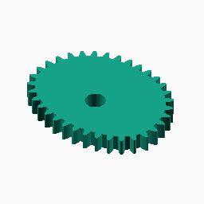

Source: [`functions/bezier/curve_gear_bezier.scad`](functions/bezier/curve_gear_bezier.scad)

**Parameters:**

No parameters

**Returns:**

No return

Back to [module description](#module-executable-examples).

### Function `bezier_curve_gear_alternative`

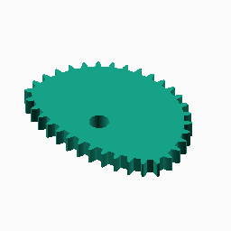

Source: [`functions/bezier/curve_gear_bezier_alternative.scad`](functions/bezier/curve_gear_bezier_alternative.scad)

**Parameters:**

No parameters

**Returns:**

No return

Back to [module description](#module-executable-examples).

### Function `bezier_curve_gear_body`

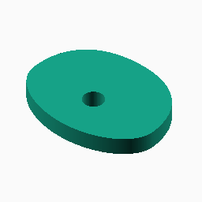

Source: [`functions/bezier/curve_gear_bezier_body.scad`](functions/bezier/curve_gear_bezier_body.scad)

**Parameters:**

No parameters

**Returns:**

No return

Back to [module description](#module-executable-examples).

### Function `bezier_curve_gear_mate`

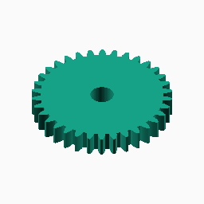

Source: [`functions/bezier/curve_gear_bezier_mate.scad`](functions/bezier/curve_gear_bezier_mate.scad)

**Parameters:**

No parameters

**Returns:**

No return

Back to [module description](#module-executable-examples).

### Function `bezier_curve_gear_pair`

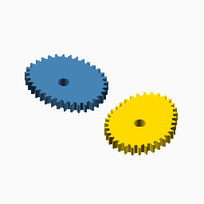

Source: [`functions/bezier/curve_gear_bezier_pair.scad`](functions/bezier/curve_gear_bezier_pair.scad)

**Parameters:**

No parameters

**Returns:**

No return

Back to [module description](#module-executable-examples).

### Function `bezier_curve_gear_pair_alternative`

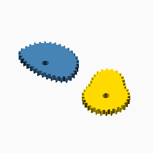

Source: [`functions/bezier/curve_gear_bezier_pair_alternative.scad`](functions/bezier/curve_gear_bezier_pair_alternative.scad)

**Parameters:**

No parameters

**Returns:**

No return

Back to [module description](#module-executable-examples).

### Function `cassini_curve_gear`

Source: [`functions/cassini/curve_gear_cassini.scad`](functions/cassini/curve_gear_cassini.scad)

**Parameters:**

No parameters

**Returns:**

No return

Back to [module description](#module-executable-examples).

### Function `cassini_curve_gear_body`

Source: [`functions/cassini/curve_gear_cassini_body.scad`](functions/cassini/curve_gear_cassini_body.scad)

**Parameters:**

No parameters

**Returns:**

No return

Back to [module description](#module-executable-examples).

### Function `cassini_curve_gear_centre_distance`

Source: [`functions/cassini/curve_gear_cassini_centre_distance.scad`](functions/cassini/curve_gear_cassini_centre_distance.scad)

**Parameters:**

No parameters

**Returns:**

No return

Back to [module description](#module-executable-examples).

### Function `cassini_curve_gear_mate`

Source: [`functions/cassini/curve_gear_cassini_mate.scad`](functions/cassini/curve_gear_cassini_mate.scad)

**Parameters:**

No parameters

**Returns:**

No return

Back to [module description](#module-executable-examples).

### Function `cassini_curve_gear_mate_rotation`

Source: [`functions/cassini/curve_gear_cassini_mate_rotation.scad`](functions/cassini/curve_gear_cassini_mate_rotation.scad)

**Parameters:**

No parameters

**Returns:**

No return

Back to [module description](#module-executable-examples).

### Function `cassini_curve_gear_pair`

Source: [`functions/cassini/curve_gear_cassini_pair.scad`](functions/cassini/curve_gear_cassini_pair.scad)

**Parameters:**

No parameters

**Returns:**

No return

Back to [module description](#module-executable-examples).

### Function `circle_curve_gear`

Source: [`functions/circle/curve_gear_circle.scad`](functions/circle/curve_gear_circle.scad)

**Parameters:**

No parameters

**Returns:**

No return

Back to [module description](#module-executable-examples).

### Function `circle_curve_gear_body`

Source: [`functions/circle/curve_gear_circle_body.scad`](functions/circle/curve_gear_circle_body.scad)

**Parameters:**

No parameters

**Returns:**

No return

Back to [module description](#module-executable-examples).

### Function `circle_curve_gear_mate`

Source: [`functions/circle/curve_gear_circle_mate.scad`](functions/circle/curve_gear_circle_mate.scad)

**Parameters:**

No parameters

**Returns:**

No return

Back to [module description](#module-executable-examples).

### Function `circle_curve_gear_pair`

Source: [`functions/circle/curve_gear_circle_pair.scad`](functions/circle/curve_gear_circle_pair.scad)

**Parameters:**

No parameters

**Returns:**

No return

Back to [module description](#module-executable-examples).

### Function `ellipse_curve_gear`

Source: [`functions/ellipse/curve_gear_ellipse.scad`](functions/ellipse/curve_gear_ellipse.scad)

**Parameters:**

No parameters

**Returns:**

No return

Back to [module description](#module-executable-examples).

### Function `ellipse_curve_gear_body`

Source: [`functions/ellipse/curve_gear_ellipse_body.scad`](functions/ellipse/curve_gear_ellipse_body.scad)

**Parameters:**

No parameters

**Returns:**

No return

Back to [module description](#module-executable-examples).

### Function `ellipse_curve_gear_centre_distance`

Source: [`functions/ellipse/curve_gear_ellipse_centre_distance.scad`](functions/ellipse/curve_gear_ellipse_centre_distance.scad)

The result is deliberately emitted as an OpenSCAD console value because
this callable returns a number rather than geometry.

**Parameters:**

No parameters

**Returns:**

No return

Back to [module description](#module-executable-examples).

### Function `ellipse_curve_gear_mate`

Source: [`functions/ellipse/curve_gear_ellipse_mate.scad`](functions/ellipse/curve_gear_ellipse_mate.scad)

**Parameters:**

No parameters

**Returns:**

No return

Back to [module description](#module-executable-examples).

### Function `ellipse_curve_gear_mate_rotation`

Source: [`functions/ellipse/curve_gear_ellipse_mate_rotation.scad`](functions/ellipse/curve_gear_ellipse_mate_rotation.scad)

The result is deliberately emitted as an OpenSCAD console value because
this callable returns a number rather than geometry.

**Parameters:**

No parameters

**Returns:**

No return

Back to [module description](#module-executable-examples).

### Function `ellipse_curve_gear_pair`

Source: [`functions/ellipse/curve_gear_ellipse_pair.scad`](functions/ellipse/curve_gear_ellipse_pair.scad)

**Parameters:**

No parameters

**Returns:**

No return

Back to [module description](#module-executable-examples).

### Function `epitrochoid_curve_gear`

Source: [`functions/epitrochoid/curve_gear_epitrochoid.scad`](functions/epitrochoid/curve_gear_epitrochoid.scad)

**Parameters:**

No parameters

**Returns:**

No return

Back to [module description](#module-executable-examples).

### Function `epitrochoid_curve_gear_body`

Source: [`functions/epitrochoid/curve_gear_epitrochoid_body.scad`](functions/epitrochoid/curve_gear_epitrochoid_body.scad)

**Parameters:**

No parameters

**Returns:**

No return

Back to [module description](#module-executable-examples).

### Function `epitrochoid_curve_gear_centre_distance`

Source: [`functions/epitrochoid/curve_gear_epitrochoid_centre_distance.scad`](functions/epitrochoid/curve_gear_epitrochoid_centre_distance.scad)

The result is deliberately emitted as an OpenSCAD console value because
this callable returns a number rather than geometry.

**Parameters:**

No parameters

**Returns:**

No return

Back to [module description](#module-executable-examples).

### Function `epitrochoid_curve_gear_mate`

Source: [`functions/epitrochoid/curve_gear_epitrochoid_mate.scad`](functions/epitrochoid/curve_gear_epitrochoid_mate.scad)

**Parameters:**

No parameters

**Returns:**

No return

Back to [module description](#module-executable-examples).

### Function `epitrochoid_curve_gear_mate_rotation`

Source: [`functions/epitrochoid/curve_gear_epitrochoid_mate_rotation.scad`](functions/epitrochoid/curve_gear_epitrochoid_mate_rotation.scad)

The result is deliberately emitted as an OpenSCAD console value because
this callable returns a number rather than geometry.

**Parameters:**

No parameters

**Returns:**

No return

Back to [module description](#module-executable-examples).

### Function `epitrochoid_curve_gear_pair`

Source: [`functions/epitrochoid/curve_gear_epitrochoid_pair.scad`](functions/epitrochoid/curve_gear_epitrochoid_pair.scad)

**Parameters:**

No parameters

**Returns:**

No return

Back to [module description](#module-executable-examples).

### Function `fourier_curve_gear`

Source: [`functions/fourier/curve_gear_fourier.scad`](functions/fourier/curve_gear_fourier.scad)

**Parameters:**

No parameters

**Returns:**

No return

Back to [module description](#module-executable-examples).

### Function `fourier_curve_gear_body`

Source: [`functions/fourier/curve_gear_fourier_body.scad`](functions/fourier/curve_gear_fourier_body.scad)

**Parameters:**

No parameters

**Returns:**

No return

Back to [module description](#module-executable-examples).

### Function `fourier_curve_gear_centre_distance`

Source: [`functions/fourier/curve_gear_fourier_centre_distance.scad`](functions/fourier/curve_gear_fourier_centre_distance.scad)

The result is deliberately emitted as an OpenSCAD console value because
this callable returns a number rather than geometry.

**Parameters:**

No parameters

**Returns:**

No return

Back to [module description](#module-executable-examples).

### Function `fourier_curve_gear_mate`

Source: [`functions/fourier/curve_gear_fourier_mate.scad`](functions/fourier/curve_gear_fourier_mate.scad)

**Parameters:**

No parameters

**Returns:**

No return

Back to [module description](#module-executable-examples).

### Function `fourier_curve_gear_mate_rotation`

Source: [`functions/fourier/curve_gear_fourier_mate_rotation.scad`](functions/fourier/curve_gear_fourier_mate_rotation.scad)

The result is deliberately emitted as an OpenSCAD console value because
this callable returns a number rather than geometry.

**Parameters:**

No parameters

**Returns:**

No return

Back to [module description](#module-executable-examples).

### Function `fourier_curve_gear_pair`

Source: [`functions/fourier/curve_gear_fourier_pair.scad`](functions/fourier/curve_gear_fourier_pair.scad)

**Parameters:**

No parameters

**Returns:**

No return

Back to [module description](#module-executable-examples).

### Function `hypotrochoid_curve_gear`

Source: [`functions/hypotrochoid/curve_gear_hypotrochoid.scad`](functions/hypotrochoid/curve_gear_hypotrochoid.scad)

**Parameters:**

No parameters

**Returns:**

No return

Back to [module description](#module-executable-examples).

### Function `hypotrochoid_curve_gear_body`

Source: [`functions/hypotrochoid/curve_gear_hypotrochoid_body.scad`](functions/hypotrochoid/curve_gear_hypotrochoid_body.scad)

**Parameters:**

No parameters

**Returns:**

No return

Back to [module description](#module-executable-examples).

### Function `hypotrochoid_curve_gear_centre_distance`

Source: [`functions/hypotrochoid/curve_gear_hypotrochoid_centre_distance.scad`](functions/hypotrochoid/curve_gear_hypotrochoid_centre_distance.scad)

**Parameters:**

No parameters

**Returns:**

No return

Back to [module description](#module-executable-examples).

### Function `hypotrochoid_curve_gear_mate`

Source: [`functions/hypotrochoid/curve_gear_hypotrochoid_mate.scad`](functions/hypotrochoid/curve_gear_hypotrochoid_mate.scad)

**Parameters:**

No parameters

**Returns:**

No return

Back to [module description](#module-executable-examples).

### Function `hypotrochoid_curve_gear_mate_rotation`

Source: [`functions/hypotrochoid/curve_gear_hypotrochoid_mate_rotation.scad`](functions/hypotrochoid/curve_gear_hypotrochoid_mate_rotation.scad)

**Parameters:**

No parameters

**Returns:**

No return

Back to [module description](#module-executable-examples).

### Function `hypotrochoid_curve_gear_pair`

Source: [`functions/hypotrochoid/curve_gear_hypotrochoid_pair.scad`](functions/hypotrochoid/curve_gear_hypotrochoid_pair.scad)

**Parameters:**

No parameters

**Returns:**

No return

Back to [module description](#module-executable-examples).

### Function `hypotrochoid_curve_gear_pair_alternative`

Source: [`functions/hypotrochoid/curve_gear_hypotrochoid_pair_alternative.scad`](functions/hypotrochoid/curve_gear_hypotrochoid_pair_alternative.scad)

**Parameters:**

No parameters

**Returns:**

No return

Back to [module description](#module-executable-examples).

### Function `lobed_curve_gear`

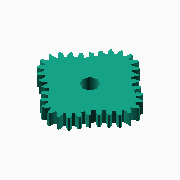

Source: [`functions/lobed/curve_gear_lobed.scad`](functions/lobed/curve_gear_lobed.scad)

**Parameters:**

No parameters

**Returns:**

No return

Back to [module description](#module-executable-examples).

### Function `lobed_curve_gear_body`

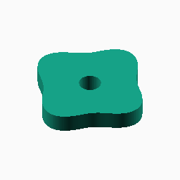

Source: [`functions/lobed/curve_gear_lobed_body.scad`](functions/lobed/curve_gear_lobed_body.scad)

**Parameters:**

No parameters

**Returns:**

No return

Back to [module description](#module-executable-examples).

### Function `lobed_curve_gear_centre_distance`

Source: [`functions/lobed/curve_gear_lobed_centre_distance.scad`](functions/lobed/curve_gear_lobed_centre_distance.scad)

The result is deliberately emitted as an OpenSCAD console value because
this callable returns a number rather than geometry.

**Parameters:**

No parameters

**Returns:**

No return

Back to [module description](#module-executable-examples).

### Function `lobed_curve_gear_mate`

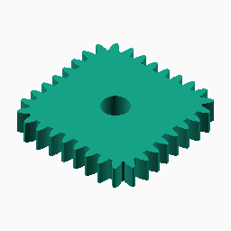

Source: [`functions/lobed/curve_gear_lobed_mate.scad`](functions/lobed/curve_gear_lobed_mate.scad)

**Parameters:**

No parameters

**Returns:**

No return

Back to [module description](#module-executable-examples).

### Function `lobed_curve_gear_mate_rotation`

Source: [`functions/lobed/curve_gear_lobed_mate_rotation.scad`](functions/lobed/curve_gear_lobed_mate_rotation.scad)

The result is deliberately emitted as an OpenSCAD console value because
this callable returns a number rather than geometry.

**Parameters:**

No parameters

**Returns:**

No return

Back to [module description](#module-executable-examples).

### Function `lobed_curve_gear_pair`

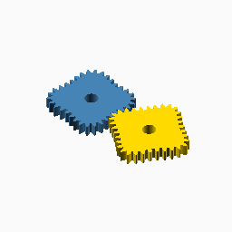

Source: [`functions/lobed/curve_gear_lobed_pair.scad`](functions/lobed/curve_gear_lobed_pair.scad)

**Parameters:**

No parameters

**Returns:**

No return

Back to [module description](#module-executable-examples).

### Function `logarithmic_spiral_curve_gear`

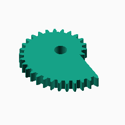

Source: [`functions/logarithmic_spiral/curve_gear_logarithmic_spiral.scad`](functions/logarithmic_spiral/curve_gear_logarithmic_spiral.scad)

**Parameters:**

No parameters

**Returns:**

No return

Back to [module description](#module-executable-examples).

### Function `logarithmic_spiral_curve_gear_body`

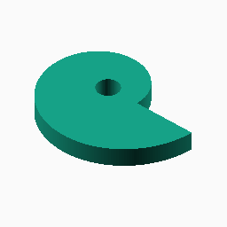

Source: [`functions/logarithmic_spiral/curve_gear_logarithmic_spiral_body.scad`](functions/logarithmic_spiral/curve_gear_logarithmic_spiral_body.scad)

**Parameters:**

No parameters

**Returns:**

No return

Back to [module description](#module-executable-examples).

### Function `logarithmic_spiral_curve_gear_mate`

Source: [`functions/logarithmic_spiral/curve_gear_logarithmic_spiral_mate.scad`](functions/logarithmic_spiral/curve_gear_logarithmic_spiral_mate.scad)

**Parameters:**

No parameters

**Returns:**

No return

Back to [module description](#module-executable-examples).

### Function `logarithmic_spiral_curve_gear_pair`

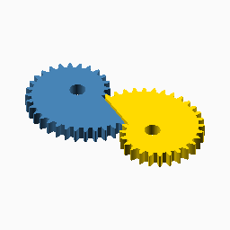

Source: [`functions/logarithmic_spiral/curve_gear_logarithmic_spiral_pair.scad`](functions/logarithmic_spiral/curve_gear_logarithmic_spiral_pair.scad)

**Parameters:**

No parameters

**Returns:**

No return

Back to [module description](#module-executable-examples).

### Function `logarithmic_spiral_curve_gear_reference_separation`

Source: [`functions/logarithmic_spiral/curve_gear_logarithmic_spiral_reference_separation.scad`](functions/logarithmic_spiral/curve_gear_logarithmic_spiral_reference_separation.scad)

The result is deliberately emitted as an OpenSCAD console value because
this callable returns a number rather than geometry.

**Parameters:**

No parameters

**Returns:**

No return

Back to [module description](#module-executable-examples).

### Function `pascal_curve_gear`

Source: [`functions/pascal/curve_gear_pascal.scad`](functions/pascal/curve_gear_pascal.scad)

**Parameters:**

No parameters

**Returns:**

No return

Back to [module description](#module-executable-examples).

### Function `pascal_curve_gear_body`

Source: [`functions/pascal/curve_gear_pascal_body.scad`](functions/pascal/curve_gear_pascal_body.scad)

**Parameters:**

No parameters

**Returns:**

No return

Back to [module description](#module-executable-examples).

### Function `pascal_curve_gear_centre_distance`

Source: [`functions/pascal/curve_gear_pascal_centre_distance.scad`](functions/pascal/curve_gear_pascal_centre_distance.scad)

The result is deliberately emitted as an OpenSCAD console value because
this callable returns a number rather than geometry.

**Parameters:**

No parameters

**Returns:**

No return

Back to [module description](#module-executable-examples).

### Function `pascal_curve_gear_mate`

Source: [`functions/pascal/curve_gear_pascal_mate.scad`](functions/pascal/curve_gear_pascal_mate.scad)

**Parameters:**

No parameters

**Returns:**

No return

Back to [module description](#module-executable-examples).

### Function `pascal_curve_gear_mate_rotation`

Source: [`functions/pascal/curve_gear_pascal_mate_rotation.scad`](functions/pascal/curve_gear_pascal_mate_rotation.scad)

The result is deliberately emitted as an OpenSCAD console value because
this callable returns a number rather than geometry.

**Parameters:**

No parameters

**Returns:**

No return

Back to [module description](#module-executable-examples).

### Function `pascal_curve_gear_pair`

Source: [`functions/pascal/curve_gear_pascal_pair.scad`](functions/pascal/curve_gear_pascal_pair.scad)

**Parameters:**

No parameters

**Returns:**

No return

Back to [module description](#module-executable-examples).

### Function `superformula_curve_gear`

Source: [`functions/superformula/curve_gear_superformula.scad`](functions/superformula/curve_gear_superformula.scad)

**Parameters:**

No parameters

**Returns:**

No return

Back to [module description](#module-executable-examples).

### Function `superformula_curve_gear_body`

Source: [`functions/superformula/curve_gear_superformula_body.scad`](functions/superformula/curve_gear_superformula_body.scad)

**Parameters:**

No parameters

**Returns:**

No return

Back to [module description](#module-executable-examples).

### Function `superformula_curve_gear_centre_distance`

Source: [`functions/superformula/curve_gear_superformula_centre_distance.scad`](functions/superformula/curve_gear_superformula_centre_distance.scad)

The result is deliberately emitted as an OpenSCAD console value because
this callable returns a number rather than geometry.

**Parameters:**

No parameters

**Returns:**

No return

Back to [module description](#module-executable-examples).

### Function `superformula_curve_gear_mate`

Source: [`functions/superformula/curve_gear_superformula_mate.scad`](functions/superformula/curve_gear_superformula_mate.scad)

**Parameters:**

No parameters

**Returns:**

No return

Back to [module description](#module-executable-examples).

### Function `superformula_curve_gear_mate_rotation`

Source: [`functions/superformula/curve_gear_superformula_mate_rotation.scad`](functions/superformula/curve_gear_superformula_mate_rotation.scad)

The result is deliberately emitted as an OpenSCAD console value because
this callable returns a number rather than geometry.

**Parameters:**

No parameters

**Returns:**

No return

Back to [module description](#module-executable-examples).

### Function `superformula_curve_gear_pair`

Source: [`functions/superformula/curve_gear_superformula_pair.scad`](functions/superformula/curve_gear_superformula_pair.scad)

**Parameters:**

No parameters

**Returns:**

No return

Back to [module description](#module-executable-examples).

### Function `tooth_construction`

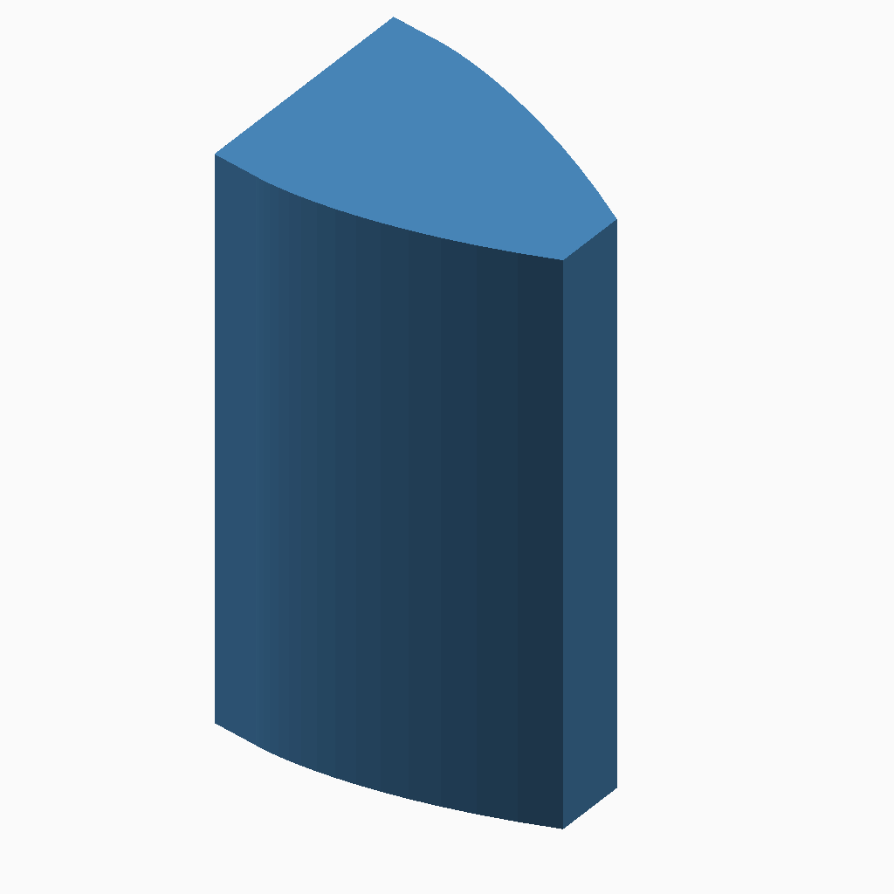

Source: [`tooth/construction.scad`](tooth/construction.scad)

This is the standalone output of tooth/generation.scad. It is intentionally
local rather than attached to a curve, so the involute flanks and top
closure can be inspected without placement hiding their shape.

**Parameters:**

No parameters

**Returns:**

No return

Back to [module description](#module-executable-examples).

### Function `tooth_placement`

Source: [`tooth/placement.scad`](tooth/placement.scad)

This diagnostic deliberately uses a rectangular body with a multi-period
sine-wave upper edge. Teeth are displayed only on that edge, so changing
tangents, normals, hills, valleys and source-point spacing can be inspected
without the rest of a closed gear hiding the placement behaviour. The body
is inset beneath the source curve, while the production tooth
boundary is shown in full so each tooth visibly stands on the edge.

**Parameters:**

No parameters

**Returns:**

No return

Back to [module description](#module-executable-examples).

### Function `tooth_assembly`

Source: [`tooth/assembly.scad`](tooth/assembly.scad)

The left panel keeps the canonical body and accepted placed tooth
boundaries separate. The right panel is the single outline returned by
_cg_final_outline_from_placements, so the body intervals replaced by teeth
can be checked as one continuous polygon.

**Parameters:**

No parameters

**Returns:**

No return

Back to [module description](#module-executable-examples).

Back to [top](#).

---

[Back to the CurveGears README](../README.md)

*Generated by Doxydown from repository source comments; do not edit this page directly.*
