# Executable API examples

## Documentation navigation

- [README](../README.md)
- Families
  - [Bézier](../docs/bezier.md) · [Cassini](../docs/cassini.md) · [Circle](../docs/circle.md) · [Cosine Quintic](../docs/cosine_quintic.md) · [Cusp](../docs/cusp.md) · [Ellipse](../docs/ellipse.md) · [Epitrochoid](../docs/epitrochoid.md)
  - [Fourier](../docs/fourier.md) · [Hypotrochoid](../docs/hypotrochoid.md) · [Lobed](../docs/lobed.md) · [Logarithmic spiral](../docs/logarithmic_spiral.md) · [Logistic Dwell](../docs/logistic_dwell.md) · [Pascal](../docs/pascal.md) · [Superformula](../docs/superformula.md) · [Tanh Triad](../docs/tanh_triad.md) · [Temple Fay](../docs/temple_fay.md)
- Shared
  - [Examples catalogue](README.md) · [Test layout](../tests/README.md)
  - [Tooth construction](../docs/tooth-construction.md) · [Tooth placement](../docs/tooth-placement.md) · [Mate motion](../docs/mate-motion.md) · [Mate generation](../docs/mate-generation.md) · [Pair assembly](../docs/pair-assembly.md)

Each entry is catalogued as a function in one Doxydown examples module. The source link is authoritative; generated images remain beside the corresponding example.

## Module `Executable examples`

Executable examples for the public API and shared construction layers.
Examples use the logo palette from `palette.scad`: petrol teal (#087F8C)
for drivers and their parts, and warm copper (#C87533) for mates.
The 3D placement and assembly diagrams use pale violet (#EDC4FF) for tooth
details, defined separately in `tooth/palette.scad`. The 2D construction
diagram uses the shared white fill and teal outline.

Every family has a contrasting gear alternative and a separated pair
alternative. In the family pages, image 1 is the canonical example and
image 2 is the alternative. First compare the contours, then read the
changed controls, and finally inspect the separated driver and mate.
Circle and Cusp retain their fixed pitch laws; their alternatives contrast
tooth scale or body proportions. Spiral pairs remain static references.

### Brief content:

**Functions**:

> [`bezier_curve_gear`](#function-bezier_curve_gear): Render a smooth asymmetric Bézier gear with a soft teardrop outline.

> [`bezier_curve_gear_alternative`](#function-bezier_curve_gear_alternative): Bézier alternative: An elongated asymmetric oval replaces the compact canonical outline. Unequal left/right handles and a narrow vertical span expose the effect of control-point geometry.

> [`bezier_curve_gear_body`](#function-bezier_curve_gear_body): Render the Bézier body before tooth placement.

> [`bezier_curve_gear_mate`](#function-bezier_curve_gear_mate): Render the conjugate Bézier mate generated from the driver pitch curve.

> [`bezier_curve_gear_pair`](#function-bezier_curve_gear_pair): Render a complete Bézier gear pair with derived conjugate motion.

> [`bezier_curve_gear_pair_alternative`](#function-bezier_curve_gear_pair_alternative): Bézier alternative pair: The alternative curve and its mate displayed separately for inspection.

> [`cassini_curve_gear`](#function-cassini_curve_gear): Render a thin-waisted peanut-shaped Cassini gear.

> [`cassini_curve_gear_alternative`](#function-cassini_curve_gear_alternative): Cassini alternative: A low focus ratio of 0.35 produces a compact oval rather than the canonical 0.92 peanut waist. Twenty coarse teeth make the limiting near-circular form clear.

> [`cassini_curve_gear_body`](#function-cassini_curve_gear_body): Render the Cassini body before tooth placement.

> [`cassini_curve_gear_centre_distance`](#function-cassini_curve_gear_centre_distance): Show the Cassini centre-distance calculation used for pair placement.

> [`cassini_curve_gear_mate`](#function-cassini_curve_gear_mate): Render the conjugate Cassini mate generated from the driver pitch curve.

> [`cassini_curve_gear_mate_rotation`](#function-cassini_curve_gear_mate_rotation): Show the Cassini mate-rotation calculation used for pair assembly.

> [`cassini_curve_gear_pair`](#function-cassini_curve_gear_pair): Render a complete Cassini gear pair with derived conjugate motion.

> [`cassini_curve_gear_pair_alternative`](#function-cassini_curve_gear_pair_alternative): Cassini alternative pair: The alternative curve and its mate displayed separately for inspection.

> [`circle_curve_gear`](#function-circle_curve_gear): Render a Circle gear from the documented pitch-curve family.

> [`circle_curve_gear_alternative`](#function-circle_curve_gear_alternative): Circle alternative: Twelve coarse teeth replace the fine-toothed reference; the bore remains 4.8 mm. Circle has no non-circular shape control; the circular pitch law is deliberately preserved.

> [`circle_curve_gear_body`](#function-circle_curve_gear_body): Render the Circle body before tooth placement.

> [`circle_curve_gear_mate`](#function-circle_curve_gear_mate): Render the conjugate Circle mate generated from the driver pitch curve.

> [`circle_curve_gear_pair`](#function-circle_curve_gear_pair): Render a complete Circle gear pair with derived conjugate motion.

> [`circle_curve_gear_pair_alternative`](#function-circle_curve_gear_pair_alternative): Circle alternative pair: The alternative curve and its mate displayed separately for inspection.

> [`cosine_quintic_curve_gear_alternative`](#function-cosine_quintic_curve_gear_alternative): Cosine Quintic alternative: Three pronounced signed-cosine plateaux replace the canonical two-harmonic form. Harmonic 3 and depth 0.16 expose how the fifth power concentrates the radial excursions.

> [`cosine_quintic_curve_gear_pair_alternative`](#function-cosine_quintic_curve_gear_pair_alternative): Cosine Quintic alternative pair: The alternative curve and its mate displayed separately for inspection.

> [`curve_gear_bezier_2d`](#function-curve_gear_bezier_2d): Render the complete bezier gear profile as flat 2D geometry.

> [`curve_gear_bezier_body_2d`](#function-curve_gear_bezier_body_2d): Render the bezier body as flat 2D geometry with a 2 mm inward outer-contour shrink.

> [`curve_gear_cassini_2d`](#function-curve_gear_cassini_2d): Render the complete cassini gear profile as flat 2D geometry.

> [`curve_gear_cassini_body_2d`](#function-curve_gear_cassini_body_2d): Render the cassini body as flat 2D geometry with a 2 mm inward outer-contour shrink.

> [`curve_gear_circle_2d`](#function-curve_gear_circle_2d): Render the complete circle gear profile as flat 2D geometry.

> [`curve_gear_circle_body_2d`](#function-curve_gear_circle_body_2d): Render the circle body as flat 2D geometry with a 2 mm inward outer-contour shrink.

> [`curve_gear_cosine_quintic_2d_example`](#function-curve_gear_cosine_quintic_2d_example)

> [`curve_gear_cosine_quintic_body_2d_example`](#function-curve_gear_cosine_quintic_body_2d_example)

> [`curve_gear_cosine_quintic_body_example`](#function-curve_gear_cosine_quintic_body_example)

> [`curve_gear_cosine_quintic_centre_distance_example`](#function-curve_gear_cosine_quintic_centre_distance_example)

> [`curve_gear_cosine_quintic_example`](#function-curve_gear_cosine_quintic_example): Cosine Quintic gear example.

> [`curve_gear_cosine_quintic_mate_example`](#function-curve_gear_cosine_quintic_mate_example)

> [`curve_gear_cosine_quintic_mate_rotation_example`](#function-curve_gear_cosine_quintic_mate_rotation_example)

> [`curve_gear_cosine_quintic_pair_example`](#function-curve_gear_cosine_quintic_pair_example)

> [`curve_gear_cusp_2d`](#function-curve_gear_cusp_2d): Render the complete cusp gear profile as flat 2D geometry.

> [`curve_gear_cusp_body_2d`](#function-curve_gear_cusp_body_2d): Render the cusp body as flat 2D geometry with a 2 mm inward outer-contour shrink.

> [`curve_gear_ellipse_2d`](#function-curve_gear_ellipse_2d): Render the complete ellipse gear profile as flat 2D geometry.

> [`curve_gear_ellipse_body_2d`](#function-curve_gear_ellipse_body_2d): Render the ellipse body as flat 2D geometry with a 2 mm inward outer-contour shrink.

> [`curve_gear_epitrochoid_2d`](#function-curve_gear_epitrochoid_2d): Render the complete epitrochoid gear profile as flat 2D geometry.

> [`curve_gear_epitrochoid_body_2d`](#function-curve_gear_epitrochoid_body_2d): Render the epitrochoid body as flat 2D geometry with a 2 mm inward outer-contour shrink.

> [`curve_gear_fourier_2d`](#function-curve_gear_fourier_2d): Render the complete fourier gear profile as flat 2D geometry.

> [`curve_gear_fourier_body_2d`](#function-curve_gear_fourier_body_2d): Render the fourier body as flat 2D geometry with a 2 mm inward outer-contour shrink.

> [`curve_gear_hypotrochoid_2d`](#function-curve_gear_hypotrochoid_2d): Render the complete hypotrochoid gear profile as flat 2D geometry.

> [`curve_gear_hypotrochoid_body_2d`](#function-curve_gear_hypotrochoid_body_2d): Render the hypotrochoid body as flat 2D geometry with a 2 mm inward outer-contour shrink.

> [`curve_gear_lobed_2d`](#function-curve_gear_lobed_2d): Render the complete lobed gear profile as flat 2D geometry.

> [`curve_gear_lobed_body_2d`](#function-curve_gear_lobed_body_2d): Render the lobed body as flat 2D geometry with a 2 mm inward outer-contour shrink.

> [`curve_gear_logarithmic_spiral_2d`](#function-curve_gear_logarithmic_spiral_2d): Render the complete logarithmic_spiral gear profile as flat 2D geometry.

> [`curve_gear_logarithmic_spiral_body_2d`](#function-curve_gear_logarithmic_spiral_body_2d): Render the logarithmic_spiral body as flat 2D geometry with a 2 mm inward outer-contour shrink.

> [`curve_gear_logistic_dwell_2d_example`](#function-curve_gear_logistic_dwell_2d_example)

> [`curve_gear_logistic_dwell_body_2d_example`](#function-curve_gear_logistic_dwell_body_2d_example)

> [`curve_gear_logistic_dwell_body_example`](#function-curve_gear_logistic_dwell_body_example)

> [`curve_gear_logistic_dwell_centre_distance_example`](#function-curve_gear_logistic_dwell_centre_distance_example)

> [`curve_gear_logistic_dwell_example`](#function-curve_gear_logistic_dwell_example): Logistic Dwell gear example.

> [`curve_gear_logistic_dwell_mate_example`](#function-curve_gear_logistic_dwell_mate_example)

> [`curve_gear_logistic_dwell_mate_rotation_example`](#function-curve_gear_logistic_dwell_mate_rotation_example)

> [`curve_gear_logistic_dwell_pair_example`](#function-curve_gear_logistic_dwell_pair_example)

> [`curve_gear_pascal_2d`](#function-curve_gear_pascal_2d): Render the complete pascal gear profile as flat 2D geometry.

> [`curve_gear_pascal_body_2d`](#function-curve_gear_pascal_body_2d): Render the pascal body as flat 2D geometry with a 2 mm inward outer-contour shrink.

> [`curve_gear_superformula_2d`](#function-curve_gear_superformula_2d): Render the complete superformula gear profile as flat 2D geometry.

> [`curve_gear_superformula_body_2d`](#function-curve_gear_superformula_body_2d): Render the superformula body as flat 2D geometry with a 2 mm inward outer-contour shrink.

> [`curve_gear_tanh_triad_2d_example`](#function-curve_gear_tanh_triad_2d_example): Tanh Triad 2D example.

> [`curve_gear_tanh_triad_body_2d_example`](#function-curve_gear_tanh_triad_body_2d_example): Tanh Triad body 2D example.

> [`curve_gear_tanh_triad_body_example`](#function-curve_gear_tanh_triad_body_example): Tanh Triad body example.

> [`curve_gear_tanh_triad_centre_distance_example`](#function-curve_gear_tanh_triad_centre_distance_example): Tanh Triad centre-distance example.

> [`curve_gear_tanh_triad_example`](#function-curve_gear_tanh_triad_example): Tanh Triad gear example.

> [`curve_gear_tanh_triad_mate_example`](#function-curve_gear_tanh_triad_mate_example): Tanh Triad mate example.

> [`curve_gear_tanh_triad_mate_rotation_example`](#function-curve_gear_tanh_triad_mate_rotation_example): Tanh Triad mate-rotation example.

> [`curve_gear_tanh_triad_pair_example`](#function-curve_gear_tanh_triad_pair_example): Tanh Triad pair example.

> [`curve_gear_temple_fay_2d_example`](#function-curve_gear_temple_fay_2d_example)

> [`curve_gear_temple_fay_body_2d_example`](#function-curve_gear_temple_fay_body_2d_example)

> [`curve_gear_temple_fay_body_example`](#function-curve_gear_temple_fay_body_example)

> [`curve_gear_temple_fay_centre_distance_example`](#function-curve_gear_temple_fay_centre_distance_example)

> [`curve_gear_temple_fay_example`](#function-curve_gear_temple_fay_example): Temple Fay gear example.

> [`curve_gear_temple_fay_mate_example`](#function-curve_gear_temple_fay_mate_example)

> [`curve_gear_temple_fay_mate_rotation_example`](#function-curve_gear_temple_fay_mate_rotation_example)

> [`curve_gear_temple_fay_pair_example`](#function-curve_gear_temple_fay_pair_example)

> [`cusp_curve_gear`](#function-cusp_curve_gear): Render the three-cusp gear with radial teeth whose roots follow the cusp branches.

> [`cusp_curve_gear_alternative`](#function-cusp_curve_gear_alternative): Cusp alternative: Five cusps replace the canonical three-cusp deltoid. With 60 tooth positions, each cusp sector retains twelve tooth positions; the bore remains 4.8 mm. Set `cusps=5` and keep tooth count and samples divisible by five.

> [`cusp_curve_gear_body`](#function-cusp_curve_gear_body): Render the three-cusp deltoid body with its integrated cusp-tip teeth.

> [`cusp_curve_gear_centre_distance`](#function-cusp_curve_gear_centre_distance): Show the solved centre distance for the deltoid cusp pair.

> [`cusp_curve_gear_mate`](#function-cusp_curve_gear_mate): Render the standalone deltoid cusp gear mate.

> [`cusp_curve_gear_mate_rotation`](#function-cusp_curve_gear_mate_rotation): Show the calculated mate rotation at 45 degrees of driver motion.

> [`cusp_curve_gear_pair`](#function-cusp_curve_gear_pair): Render the deltoid cusp gear with its conjugate motion mate.

> [`cusp_curve_gear_pair_alternative`](#function-cusp_curve_gear_pair_alternative): Cusp alternative pair: The alternative curve and its mate displayed separately for inspection.

> [`ellipse_curve_gear`](#function-ellipse_curve_gear): Render a Ellipse gear from the documented pitch-curve family.

> [`ellipse_curve_gear_alternative`](#function-ellipse_curve_gear_alternative): Ellipse alternative: Eccentricity 0.94 produces a long narrow ellipse rather than the canonical 0.72 oval. The sharper ends and narrow transverse span reveal where tooth placement becomes demanding.

> [`ellipse_curve_gear_body`](#function-ellipse_curve_gear_body): Render the Ellipse body before tooth placement.

> [`ellipse_curve_gear_centre_distance`](#function-ellipse_curve_gear_centre_distance): Show the Ellipse centre-distance calculation used for pair placement.

> [`ellipse_curve_gear_mate`](#function-ellipse_curve_gear_mate): Render the conjugate Ellipse mate generated from the driver pitch curve.

> [`ellipse_curve_gear_mate_rotation`](#function-ellipse_curve_gear_mate_rotation): Show the Ellipse mate-rotation calculation used for pair assembly.

> [`ellipse_curve_gear_pair`](#function-ellipse_curve_gear_pair): Render a complete Ellipse gear pair with derived conjugate motion.

> [`ellipse_curve_gear_pair_alternative`](#function-ellipse_curve_gear_pair_alternative): Ellipse alternative pair: The alternative curve and its mate displayed separately for inspection.

> [`epitrochoid_curve_gear`](#function-epitrochoid_curve_gear): Render a scalloped Epitrochoid gear showing the rolling-pen profile.

> [`epitrochoid_curve_gear_alternative`](#function-epitrochoid_curve_gear_alternative): Epitrochoid alternative: A rolling ratio of 2:1 produces broad two-fold shaping instead of the canonical four-fold scallops. Offset 0.65 strengthens the excursions of the generating point.

> [`epitrochoid_curve_gear_body`](#function-epitrochoid_curve_gear_body): Render the Epitrochoid body before tooth placement.

> [`epitrochoid_curve_gear_centre_distance`](#function-epitrochoid_curve_gear_centre_distance): Show the Epitrochoid centre-distance calculation used for pair placement.

> [`epitrochoid_curve_gear_mate`](#function-epitrochoid_curve_gear_mate): Render the conjugate Epitrochoid mate generated from the driver pitch curve.

> [`epitrochoid_curve_gear_mate_rotation`](#function-epitrochoid_curve_gear_mate_rotation): Show the Epitrochoid mate-rotation calculation used for pair assembly.

> [`epitrochoid_curve_gear_pair`](#function-epitrochoid_curve_gear_pair): Render a complete Epitrochoid gear pair with derived conjugate motion.

> [`epitrochoid_curve_gear_pair_alternative`](#function-epitrochoid_curve_gear_pair_alternative): Epitrochoid alternative pair: The alternative curve and its mate displayed separately for inspection.

> [`fourier_curve_gear`](#function-fourier_curve_gear): Render a two-harmonic Fourier gear with visibly modulated lobes.

> [`fourier_curve_gear_alternative`](#function-fourier_curve_gear_alternative): Fourier alternative: A single strong third harmonic produces three clear lobes instead of the canonical mixed second/third-harmonic oval. This isolates harmonic count from mixed-phase asymmetry.

> [`fourier_curve_gear_body`](#function-fourier_curve_gear_body): Render the Fourier body before tooth placement.

> [`fourier_curve_gear_centre_distance`](#function-fourier_curve_gear_centre_distance): Show the Fourier centre-distance calculation used for pair placement.

> [`fourier_curve_gear_mate`](#function-fourier_curve_gear_mate): Render the conjugate Fourier mate generated from the driver pitch curve.

> [`fourier_curve_gear_mate_rotation`](#function-fourier_curve_gear_mate_rotation): Show the Fourier mate-rotation calculation used for pair assembly.

> [`fourier_curve_gear_pair`](#function-fourier_curve_gear_pair): Render a complete Fourier gear pair with derived conjugate motion.

> [`fourier_curve_gear_pair_alternative`](#function-fourier_curve_gear_pair_alternative): Fourier alternative pair: The alternative curve and its mate displayed separately for inspection.

> [`hypotrochoid_curve_gear`](#function-hypotrochoid_curve_gear): Render a triangular inner-rolling Hypotrochoid form.

> [`hypotrochoid_curve_gear_alternative`](#function-hypotrochoid_curve_gear_alternative): Hypotrochoid alternative: A 5:1 rolling ratio and offset 0.35 produce five-fold shaping rather than the canonical three-fold outline. The alternative changes the curve itself, not merely the pair spacing.

> [`hypotrochoid_curve_gear_body`](#function-hypotrochoid_curve_gear_body): Render the Hypotrochoid body before tooth placement.

> [`hypotrochoid_curve_gear_centre_distance`](#function-hypotrochoid_curve_gear_centre_distance): Show the Hypotrochoid centre-distance calculation used for pair placement.

> [`hypotrochoid_curve_gear_mate`](#function-hypotrochoid_curve_gear_mate): Render the conjugate Hypotrochoid mate generated from the driver pitch curve.

> [`hypotrochoid_curve_gear_mate_rotation`](#function-hypotrochoid_curve_gear_mate_rotation): Show the Hypotrochoid mate-rotation calculation used for pair assembly.

> [`hypotrochoid_curve_gear_pair`](#function-hypotrochoid_curve_gear_pair): Render a complete Hypotrochoid gear pair with derived conjugate motion.

> [`hypotrochoid_curve_gear_pair_alternative`](#function-hypotrochoid_curve_gear_pair_alternative): Hypotrochoid alternative pair: The alternative curve and its mate displayed separately for inspection.

> [`lobed_curve_gear`](#function-lobed_curve_gear): Render a square four-lobed gear with a clear radial rhythm.

> [`lobed_curve_gear_alternative`](#function-lobed_curve_gear_alternative): Lobed alternative: Two deep lobes replace the canonical shallow four-lobed square form. Lobe count 2 and depth 0.28 show the transition to an elongated, waisted pitch curve.

> [`lobed_curve_gear_body`](#function-lobed_curve_gear_body): Render the Lobed body before tooth placement.

> [`lobed_curve_gear_centre_distance`](#function-lobed_curve_gear_centre_distance): Show the Lobed centre-distance calculation used for pair placement.

> [`lobed_curve_gear_mate`](#function-lobed_curve_gear_mate): Render the conjugate Lobed mate generated from the driver pitch curve.

> [`lobed_curve_gear_mate_rotation`](#function-lobed_curve_gear_mate_rotation): Show the Lobed mate-rotation calculation used for pair assembly.

> [`lobed_curve_gear_pair`](#function-lobed_curve_gear_pair): Render a complete Lobed gear pair with derived conjugate motion.

> [`lobed_curve_gear_pair_alternative`](#function-lobed_curve_gear_pair_alternative): Lobed alternative pair: The alternative curve and its mate displayed separately for inspection.

> [`logarithmic_spiral_curve_gear`](#function-logarithmic_spiral_curve_gear): Render a Logarithmic spiral gear from the documented pitch-curve family.

> [`logarithmic_spiral_curve_gear_alternative`](#function-logarithmic_spiral_curve_gear_alternative): Logarithmic spiral alternative: Three spiral sectors replace the canonical single return. Growth 1.22 increases the radial sweep. Returns are broad transitions without ordinary teeth, and the pair is a static reference rather than a validated conjugate transmission.

> [`logarithmic_spiral_curve_gear_body`](#function-logarithmic_spiral_curve_gear_body): Render the Logarithmic spiral body before tooth placement.

> [`logarithmic_spiral_curve_gear_mate`](#function-logarithmic_spiral_curve_gear_mate): Render the conjugate Logarithmic spiral mate generated from the driver pitch curve.

> [`logarithmic_spiral_curve_gear_pair`](#function-logarithmic_spiral_curve_gear_pair): Render a complete Logarithmic spiral gear pair with derived conjugate motion.

> [`logarithmic_spiral_curve_gear_pair_alternative`](#function-logarithmic_spiral_curve_gear_pair_alternative): Logarithmic spiral alternative pair: The alternative curve and its mate displayed separately for inspection.

> [`logarithmic_spiral_curve_gear_reference_separation`](#function-logarithmic_spiral_curve_gear_reference_separation): Show the Logarithmic spiral reference-separation calculation.

> [`logistic_dwell_curve_gear_alternative`](#function-logistic_dwell_curve_gear_alternative): Logistic Dwell alternative: Depth 0.46 and gain 3 replace the canonical shallow, steep logistic gate. The larger radial variation and smoother transitions distinguish curve amplitude from gate sharpness; coarse teeth expose the contour.

> [`logistic_dwell_curve_gear_pair_alternative`](#function-logistic_dwell_curve_gear_pair_alternative): Logistic Dwell alternative pair: The alternative curve and its mate displayed separately for inspection.

> [`pascal_curve_gear`](#function-pascal_curve_gear): Render a heart-like Pascal gear with a pronounced non-convex waist.

> [`pascal_curve_gear_alternative`](#function-pascal_curve_gear_alternative): Pascal alternative: Eccentricity 0.28 gives a convex egg-like outline instead of the canonical non-convex 0.60 limacon. Twenty coarse teeth emphasise the body contour. This contrasts the regular conjugate domain with the experimental dimpled case.

> [`pascal_curve_gear_body`](#function-pascal_curve_gear_body): Render the Pascal body before tooth placement.

> [`pascal_curve_gear_centre_distance`](#function-pascal_curve_gear_centre_distance): Show the Pascal centre-distance calculation used for pair placement.

> [`pascal_curve_gear_mate`](#function-pascal_curve_gear_mate): Render the conjugate Pascal mate generated from the driver pitch curve.

> [`pascal_curve_gear_mate_rotation`](#function-pascal_curve_gear_mate_rotation): Show the Pascal mate-rotation calculation used for pair assembly.

> [`pascal_curve_gear_pair`](#function-pascal_curve_gear_pair): Render a complete Pascal gear pair with derived conjugate motion.

> [`pascal_curve_gear_pair_alternative`](#function-pascal_curve_gear_pair_alternative): Pascal alternative pair: The alternative curve and its mate displayed separately for inspection.

> [`superformula_curve_gear`](#function-superformula_curve_gear): Render a Superformula gear from the documented pitch-curve family.

> [`superformula_curve_gear_alternative`](#function-superformula_curve_gear_alternative): Superformula alternative: A rounded square with symmetry 4 and exponents 8 replaces the canonical five-pointed star. This demonstrates the superformula's ability to change its shape class through exponents and symmetry.

> [`superformula_curve_gear_body`](#function-superformula_curve_gear_body): Render the Superformula body before tooth placement.

> [`superformula_curve_gear_centre_distance`](#function-superformula_curve_gear_centre_distance): Show the Superformula centre-distance calculation used for pair placement.

> [`superformula_curve_gear_mate`](#function-superformula_curve_gear_mate): Render the conjugate Superformula mate generated from the driver pitch curve.

> [`superformula_curve_gear_mate_rotation`](#function-superformula_curve_gear_mate_rotation): Show the Superformula mate-rotation calculation used for pair assembly.

> [`superformula_curve_gear_pair`](#function-superformula_curve_gear_pair): Render a complete Superformula gear pair with derived conjugate motion.

> [`superformula_curve_gear_pair_alternative`](#function-superformula_curve_gear_pair_alternative): Superformula alternative pair: The alternative curve and its mate displayed separately for inspection.

> [`tanh_triad_curve_gear_alternative`](#function-tanh_triad_curve_gear_alternative): Tanh Triad alternative: A broad smooth triad with transition 0.8 and crest 0.32 replaces the canonical sharper, corrected triad. Removing the sixth-harmonic correction isolates the three-lobed tanh law; coarse teeth expose its boundary.

> [`tanh_triad_curve_gear_pair_alternative`](#function-tanh_triad_curve_gear_pair_alternative): Tanh Triad alternative pair: The alternative curve and its mate displayed separately for inspection.

> [`temple_fay_curve_gear_alternative`](#function-temple_fay_curve_gear_alternative): Temple Fay alternative: Wing 0.32 and fold 0.12 strengthen the diagonal wing and waist structure compared with the canonical 0.18/0.05 form. The two Fourier harmonics are varied within the named family, without implying a literal butterfly curve.

> [`temple_fay_curve_gear_pair_alternative`](#function-temple_fay_curve_gear_pair_alternative): Temple Fay alternative pair: The alternative curve and its mate displayed separately for inspection.

> [`tooth_assembly`](#function-tooth_assembly): Tooth assembly preview: Compare placed tooth boundaries with the final assembled outline.

> [`tooth_construction`](#function-tooth_construction): Tooth construction preview: Render one validated cached local tooth candidate in 2D.

> [`tooth_placement`](#function-tooth_placement): Tooth placement preview: Render cached teeth placed along a sinusoidal edge of a body.

## Functions

The module `Executable examples` defines the following functions.

### Function `bezier_curve_gear`

| curve_gear_bezier example preview | ⠀ |
| --- | --- |
|  |  |

Source: [`functions/bezier/curve_gear_bezier.scad`](functions/bezier/curve_gear_bezier.scad)

**Parameters:**

No parameters

**Returns:**

No return

Back to [module description](#module-executable-examples).

### Function `bezier_curve_gear_alternative`

| Bézier gear alternative | ⠀ |
| --- | --- |
|  |  |

Source: [`functions/bezier/curve_gear_bezier_alternative.scad`](functions/bezier/curve_gear_bezier_alternative.scad)
An elongated asymmetric oval replaces the compact canonical outline. Unequal left/right handles and a narrow vertical span expose the effect of control-point geometry.

**Parameters:**

No parameters

**Returns:**

No return

Back to [module description](#module-executable-examples).

### Function `bezier_curve_gear_body`

| curve_gear_bezier_body example preview | ⠀ |
| --- | --- |
|  |  |

Source: [`functions/bezier/curve_gear_bezier_body.scad`](functions/bezier/curve_gear_bezier_body.scad)

**Parameters:**

No parameters

**Returns:**

No return

Back to [module description](#module-executable-examples).

### Function `bezier_curve_gear_mate`

| curve_gear_bezier_mate example preview | ⠀ |
| --- | --- |
|  |  |

Source: [`functions/bezier/curve_gear_bezier_mate.scad`](functions/bezier/curve_gear_bezier_mate.scad)

**Parameters:**

No parameters

**Returns:**

No return

Back to [module description](#module-executable-examples).

### Function `bezier_curve_gear_pair`

| curve_gear_bezier_pair example preview | ⠀ |
| --- | --- |
|  |  |

Source: [`functions/bezier/curve_gear_bezier_pair.scad`](functions/bezier/curve_gear_bezier_pair.scad)

**Parameters:**

No parameters

**Returns:**

No return

Back to [module description](#module-executable-examples).

### Function `bezier_curve_gear_pair_alternative`

| Bézier pair alternative | ⠀ |
| --- | --- |
|  |  |

Source: [`functions/bezier/curve_gear_bezier_pair_alternative.scad`](functions/bezier/curve_gear_bezier_pair_alternative.scad)
An elongated asymmetric oval replaces the compact canonical outline. Unequal left/right handles and a narrow vertical span expose the effect of control-point geometry.

**Parameters:**

No parameters

**Returns:**

No return

Back to [module description](#module-executable-examples).

### Function `cassini_curve_gear`

| curve_gear_cassini example preview | ⠀ |
| --- | --- |
|  |  |

Source: [`functions/cassini/curve_gear_cassini.scad`](functions/cassini/curve_gear_cassini.scad)

**Parameters:**

No parameters

**Returns:**

No return

Back to [module description](#module-executable-examples).

### Function `cassini_curve_gear_alternative`

| Cassini gear alternative | ⠀ |
| --- | --- |
| [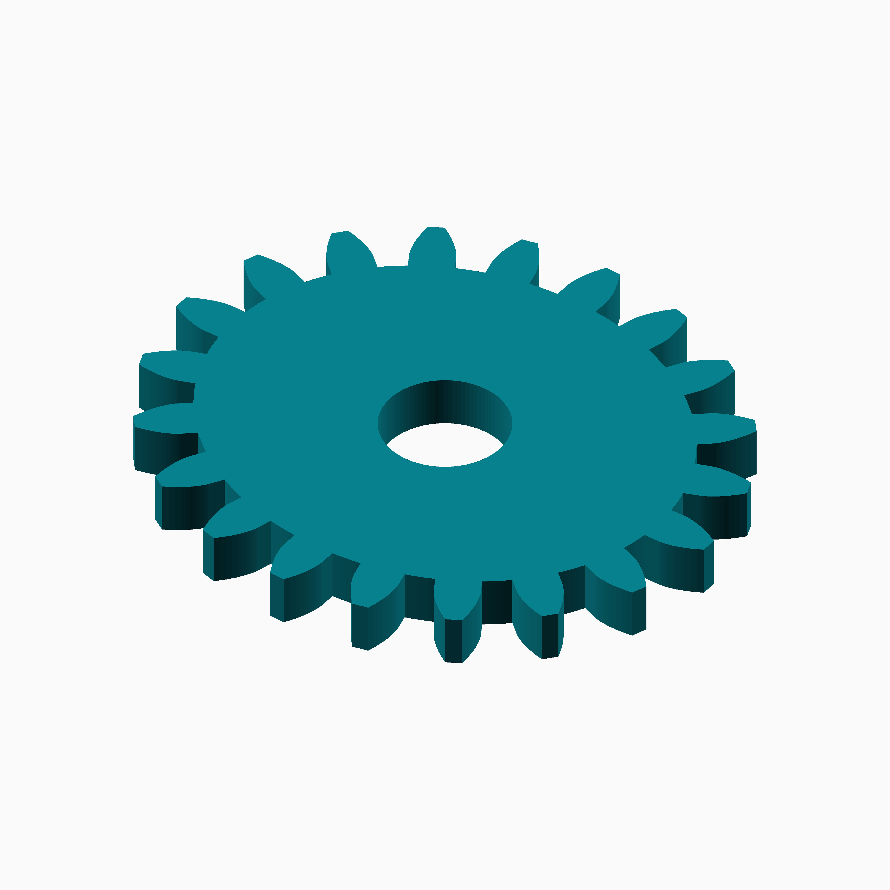](../images/functions/cassini/curve_gear_cassini_alternative.png) |  |

Source: [`functions/cassini/curve_gear_cassini_alternative.scad`](functions/cassini/curve_gear_cassini_alternative.scad)
A low focus ratio of 0.35 produces a compact oval rather than the canonical 0.92 peanut waist. Twenty coarse teeth make the limiting near-circular form clear.

**Parameters:**

No parameters

**Returns:**

No return

Back to [module description](#module-executable-examples).

### Function `cassini_curve_gear_body`

| curve_gear_cassini_body example preview | ⠀ |
| --- | --- |
|  |  |

Source: [`functions/cassini/curve_gear_cassini_body.scad`](functions/cassini/curve_gear_cassini_body.scad)

**Parameters:**

No parameters

**Returns:**

No return

Back to [module description](#module-executable-examples).

### Function `cassini_curve_gear_centre_distance`

Source: [`functions/cassini/curve_gear_cassini_centre_distance.scad`](functions/cassini/curve_gear_cassini_centre_distance.scad)

**Parameters:**

No parameters

**Returns:**

No return

Back to [module description](#module-executable-examples).

### Function `cassini_curve_gear_mate`

| curve_gear_cassini_mate example preview | ⠀ |
| --- | --- |
|  |  |

Source: [`functions/cassini/curve_gear_cassini_mate.scad`](functions/cassini/curve_gear_cassini_mate.scad)

**Parameters:**

No parameters

**Returns:**

No return

Back to [module description](#module-executable-examples).

### Function `cassini_curve_gear_mate_rotation`

Source: [`functions/cassini/curve_gear_cassini_mate_rotation.scad`](functions/cassini/curve_gear_cassini_mate_rotation.scad)

**Parameters:**

No parameters

**Returns:**

No return

Back to [module description](#module-executable-examples).

### Function `cassini_curve_gear_pair`

| curve_gear_cassini_pair example preview | ⠀ |
| --- | --- |
|  |  |

Source: [`functions/cassini/curve_gear_cassini_pair.scad`](functions/cassini/curve_gear_cassini_pair.scad)

**Parameters:**

No parameters

**Returns:**

No return

Back to [module description](#module-executable-examples).

### Function `cassini_curve_gear_pair_alternative`

| Cassini pair alternative | ⠀ |
| --- | --- |
| [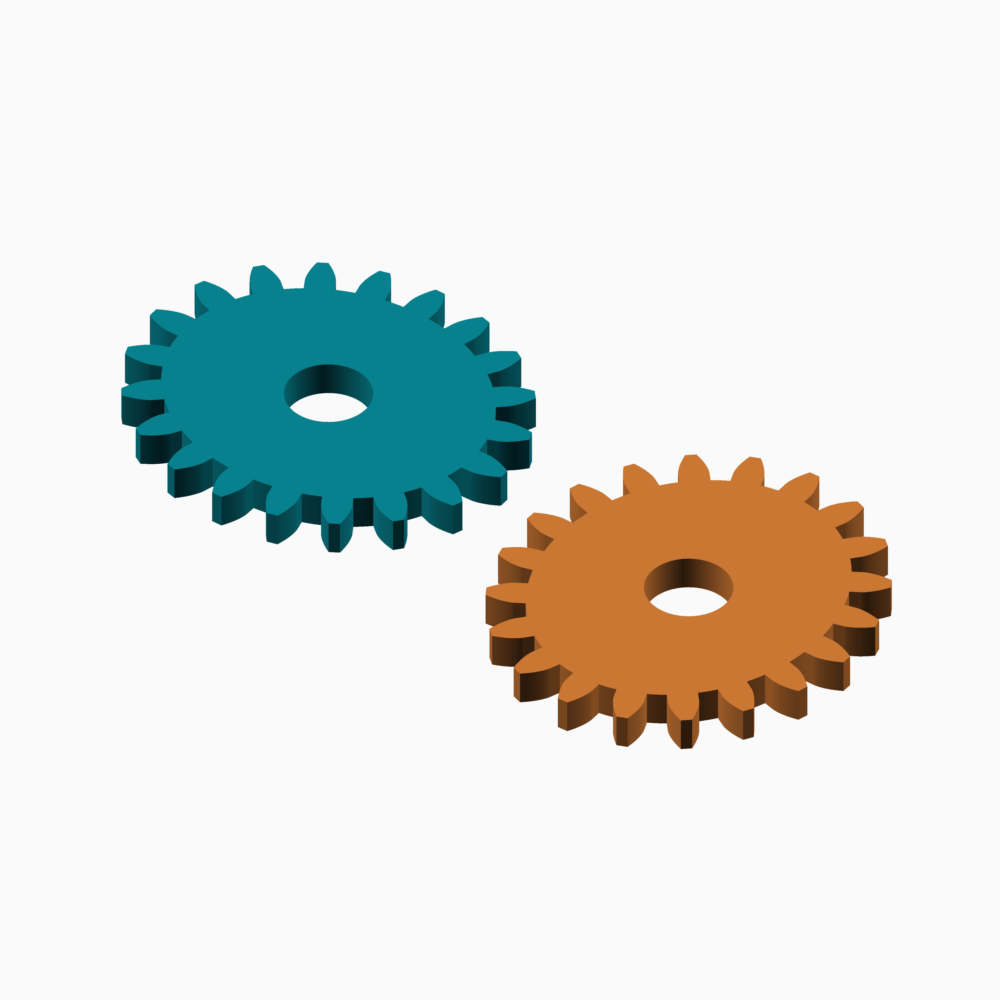](../images/functions/cassini/curve_gear_cassini_pair_alternative.png) |  |

Source: [`functions/cassini/curve_gear_cassini_pair_alternative.scad`](functions/cassini/curve_gear_cassini_pair_alternative.scad)
A low focus ratio of 0.35 produces a compact oval rather than the canonical 0.92 peanut waist. Twenty coarse teeth make the limiting near-circular form clear.

**Parameters:**

No parameters

**Returns:**

No return

Back to [module description](#module-executable-examples).

### Function `circle_curve_gear`

| curve gear circle preview | ⠀ |
| --- | --- |
|  |  |

Source: [`functions/circle/curve_gear_circle.scad`](functions/circle/curve_gear_circle.scad)

**Parameters:**

No parameters

**Returns:**

No return

Back to [module description](#module-executable-examples).

### Function `circle_curve_gear_alternative`

| Circle gear alternative | ⠀ |
| --- | --- |
|  |  |

Source: [`functions/circle/curve_gear_circle_alternative.scad`](functions/circle/curve_gear_circle_alternative.scad)
Twelve coarse teeth replace the fine-toothed reference; the bore remains 4.8 mm. Circle has no non-circular shape control; the circular pitch law is deliberately preserved.

**Parameters:**

No parameters

**Returns:**

No return

Back to [module description](#module-executable-examples).

### Function `circle_curve_gear_body`

| curve gear circle body preview | ⠀ |
| --- | --- |
|  |  |

Source: [`functions/circle/curve_gear_circle_body.scad`](functions/circle/curve_gear_circle_body.scad)

**Parameters:**

No parameters

**Returns:**

No return

Back to [module description](#module-executable-examples).

### Function `circle_curve_gear_mate`

| curve gear circle mate preview | ⠀ |
| --- | --- |
|  |  |

Source: [`functions/circle/curve_gear_circle_mate.scad`](functions/circle/curve_gear_circle_mate.scad)

**Parameters:**

No parameters

**Returns:**

No return

Back to [module description](#module-executable-examples).

### Function `circle_curve_gear_pair`

| curve gear circle pair preview | ⠀ |
| --- | --- |
|  |  |

Source: [`functions/circle/curve_gear_circle_pair.scad`](functions/circle/curve_gear_circle_pair.scad)

**Parameters:**

No parameters

**Returns:**

No return

Back to [module description](#module-executable-examples).

### Function `circle_curve_gear_pair_alternative`

| Circle pair alternative | ⠀ |
| --- | --- |
|  |  |

Source: [`functions/circle/curve_gear_circle_pair_alternative.scad`](functions/circle/curve_gear_circle_pair_alternative.scad)
Twelve coarse teeth replace the fine-toothed reference; the bore remains 4.8 mm. Circle has no non-circular shape control; the circular pitch law is deliberately preserved.

**Parameters:**

No parameters

**Returns:**

No return

Back to [module description](#module-executable-examples).

### Function `cosine_quintic_curve_gear_alternative`

| Cosine Quintic gear alternative | ⠀ |
| --- | --- |
| [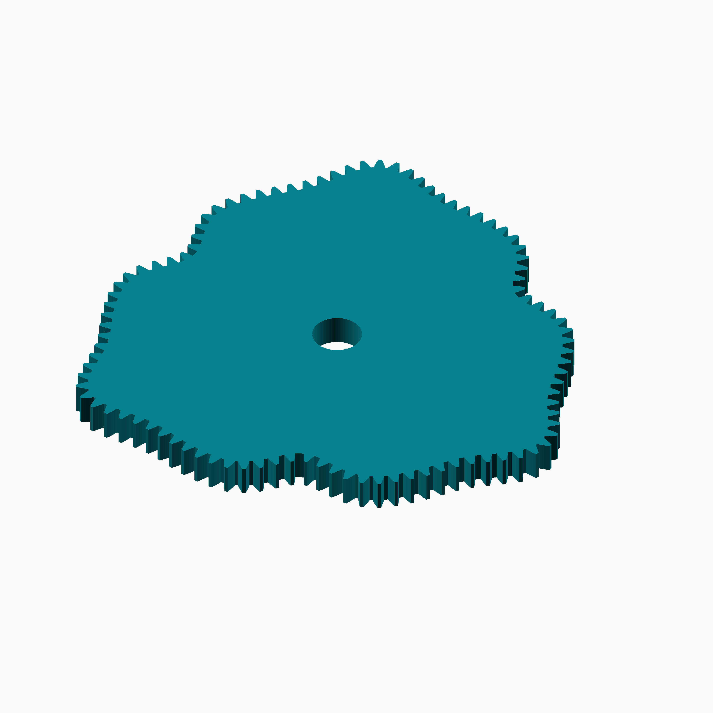](../images/functions/cosine_quintic/curve_gear_cosine_quintic_alternative.png) |  |

Source: [`functions/cosine_quintic/curve_gear_cosine_quintic_alternative.scad`](functions/cosine_quintic/curve_gear_cosine_quintic_alternative.scad)
Three pronounced signed-cosine plateaux replace the canonical two-harmonic form. Harmonic 3 and depth 0.16 expose how the fifth power concentrates the radial excursions.

**Parameters:**

No parameters

**Returns:**

No return

Back to [module description](#module-executable-examples).

### Function `cosine_quintic_curve_gear_pair_alternative`

| Cosine Quintic pair alternative | ⠀ |
| --- | --- |
| [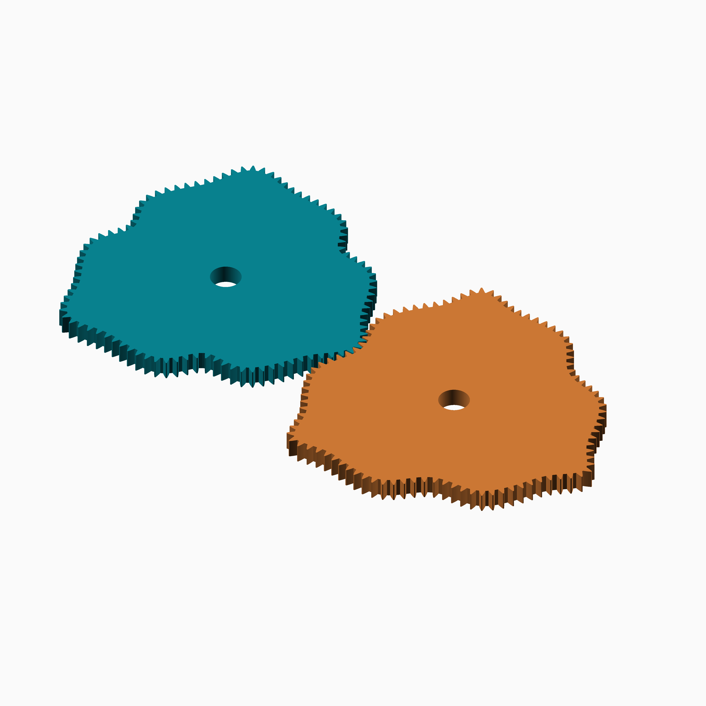](../images/functions/cosine_quintic/curve_gear_cosine_quintic_pair_alternative.png) |  |

Source: [`functions/cosine_quintic/curve_gear_cosine_quintic_pair_alternative.scad`](functions/cosine_quintic/curve_gear_cosine_quintic_pair_alternative.scad)
Three pronounced signed-cosine plateaux replace the canonical two-harmonic form. Harmonic 3 and depth 0.16 expose how the fifth power concentrates the radial excursions.

**Parameters:**

No parameters

**Returns:**

No return

Back to [module description](#module-executable-examples).

### Function `curve_gear_bezier_2d`

| bezier 2D gear outline | ⠀ |
| --- | --- |
|  |  |

Source: [`functions/bezier/curve_gear_bezier_2d.scad`](functions/bezier/curve_gear_bezier_2d.scad)

**Parameters:**

No parameters

**Returns:**

No return

Back to [module description](#module-executable-examples).

### Function `curve_gear_bezier_body_2d`

| bezier 2D body outline | ⠀ |
| --- | --- |
|  |  |

Source: [`functions/bezier/curve_gear_bezier_body_2d.scad`](functions/bezier/curve_gear_bezier_body_2d.scad)

**Parameters:**

No parameters

**Returns:**

No return

Back to [module description](#module-executable-examples).

### Function `curve_gear_cassini_2d`

| cassini 2D gear outline | ⠀ |
| --- | --- |
|  |  |

Source: [`functions/cassini/curve_gear_cassini_2d.scad`](functions/cassini/curve_gear_cassini_2d.scad)

**Parameters:**

No parameters

**Returns:**

No return

Back to [module description](#module-executable-examples).

### Function `curve_gear_cassini_body_2d`

| cassini 2D body outline | ⠀ |
| --- | --- |
|  |  |

Source: [`functions/cassini/curve_gear_cassini_body_2d.scad`](functions/cassini/curve_gear_cassini_body_2d.scad)

**Parameters:**

No parameters

**Returns:**

No return

Back to [module description](#module-executable-examples).

### Function `curve_gear_circle_2d`

| circle 2D gear outline | ⠀ |
| --- | --- |
|  |  |

Source: [`functions/circle/curve_gear_circle_2d.scad`](functions/circle/curve_gear_circle_2d.scad)

**Parameters:**

No parameters

**Returns:**

No return

Back to [module description](#module-executable-examples).

### Function `curve_gear_circle_body_2d`

| circle 2D body outline | ⠀ |
| --- | --- |
|  |  |

Source: [`functions/circle/curve_gear_circle_body_2d.scad`](functions/circle/curve_gear_circle_body_2d.scad)

**Parameters:**

No parameters

**Returns:**

No return

Back to [module description](#module-executable-examples).

### Function `curve_gear_cosine_quintic_2d_example`

**Parameters:**

No parameters

**Returns:**

No return

Back to [module description](#module-executable-examples).

### Function `curve_gear_cosine_quintic_body_2d_example`

**Parameters:**

No parameters

**Returns:**

No return

Back to [module description](#module-executable-examples).

### Function `curve_gear_cosine_quintic_body_example`

**Parameters:**

No parameters

**Returns:**

No return

Back to [module description](#module-executable-examples).

### Function `curve_gear_cosine_quintic_centre_distance_example`

**Parameters:**

No parameters

**Returns:**

No return

Back to [module description](#module-executable-examples).

### Function `curve_gear_cosine_quintic_example`

Cosine Quintic gear example.

**Parameters:**

No parameters

**Returns:**

No return

Back to [module description](#module-executable-examples).

### Function `curve_gear_cosine_quintic_mate_example`

**Parameters:**

No parameters

**Returns:**

No return

Back to [module description](#module-executable-examples).

### Function `curve_gear_cosine_quintic_mate_rotation_example`

**Parameters:**

No parameters

**Returns:**

No return

Back to [module description](#module-executable-examples).

### Function `curve_gear_cosine_quintic_pair_example`

**Parameters:**

No parameters

**Returns:**

No return

Back to [module description](#module-executable-examples).

### Function `curve_gear_cusp_2d`

| cusp 2D gear outline | ⠀ |
| --- | --- |
|  |  |

Source: [`functions/cusp/curve_gear_cusp_2d.scad`](functions/cusp/curve_gear_cusp_2d.scad)

**Parameters:**

No parameters

**Returns:**

No return

Back to [module description](#module-executable-examples).

### Function `curve_gear_cusp_body_2d`

| cusp 2D body outline | ⠀ |
| --- | --- |
|  |  |

Source: [`functions/cusp/curve_gear_cusp_body_2d.scad`](functions/cusp/curve_gear_cusp_body_2d.scad)

**Parameters:**

No parameters

**Returns:**

No return

Back to [module description](#module-executable-examples).

### Function `curve_gear_ellipse_2d`

| ellipse 2D gear outline | ⠀ |
| --- | --- |
| [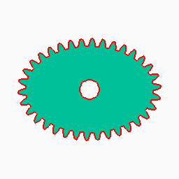](../images/functions/ellipse/curve_gear_ellipse_2d.png) |  |

Source: [`functions/ellipse/curve_gear_ellipse_2d.scad`](functions/ellipse/curve_gear_ellipse_2d.scad)

**Parameters:**

No parameters

**Returns:**

No return

Back to [module description](#module-executable-examples).

### Function `curve_gear_ellipse_body_2d`

| ellipse 2D body outline | ⠀ |
| --- | --- |
| [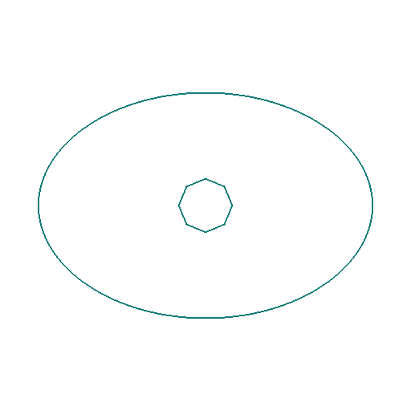](../images/functions/ellipse/curve_gear_ellipse_body_2d.png) |  |

Source: [`functions/ellipse/curve_gear_ellipse_body_2d.scad`](functions/ellipse/curve_gear_ellipse_body_2d.scad)

**Parameters:**

No parameters

**Returns:**

No return

Back to [module description](#module-executable-examples).

### Function `curve_gear_epitrochoid_2d`

| epitrochoid 2D gear outline | ⠀ |
| --- | --- |
|  |  |

Source: [`functions/epitrochoid/curve_gear_epitrochoid_2d.scad`](functions/epitrochoid/curve_gear_epitrochoid_2d.scad)

**Parameters:**

No parameters

**Returns:**

No return

Back to [module description](#module-executable-examples).

### Function `curve_gear_epitrochoid_body_2d`

| epitrochoid 2D body outline | ⠀ |
| --- | --- |
|  |  |

Source: [`functions/epitrochoid/curve_gear_epitrochoid_body_2d.scad`](functions/epitrochoid/curve_gear_epitrochoid_body_2d.scad)

**Parameters:**

No parameters

**Returns:**

No return

Back to [module description](#module-executable-examples).

### Function `curve_gear_fourier_2d`

| fourier 2D gear outline | ⠀ |
| --- | --- |
| [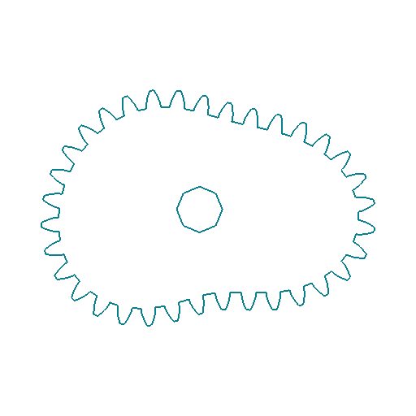](../images/functions/fourier/curve_gear_fourier_2d.png) |  |

Source: [`functions/fourier/curve_gear_fourier_2d.scad`](functions/fourier/curve_gear_fourier_2d.scad)

**Parameters:**

No parameters

**Returns:**

No return

Back to [module description](#module-executable-examples).

### Function `curve_gear_fourier_body_2d`

| fourier 2D body outline | ⠀ |
| --- | --- |
| [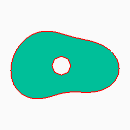](../images/functions/fourier/curve_gear_fourier_body_2d.png) |  |

Source: [`functions/fourier/curve_gear_fourier_body_2d.scad`](functions/fourier/curve_gear_fourier_body_2d.scad)

**Parameters:**

No parameters

**Returns:**

No return

Back to [module description](#module-executable-examples).

### Function `curve_gear_hypotrochoid_2d`

| hypotrochoid 2D gear outline | ⠀ |
| --- | --- |
|  |  |

Source: [`functions/hypotrochoid/curve_gear_hypotrochoid_2d.scad`](functions/hypotrochoid/curve_gear_hypotrochoid_2d.scad)

**Parameters:**

No parameters

**Returns:**

No return

Back to [module description](#module-executable-examples).

### Function `curve_gear_hypotrochoid_body_2d`

| hypotrochoid 2D body outline | ⠀ |
| --- | --- |
|  |  |

Source: [`functions/hypotrochoid/curve_gear_hypotrochoid_body_2d.scad`](functions/hypotrochoid/curve_gear_hypotrochoid_body_2d.scad)

**Parameters:**

No parameters

**Returns:**

No return

Back to [module description](#module-executable-examples).

### Function `curve_gear_lobed_2d`

| lobed 2D gear outline | ⠀ |
| --- | --- |
| [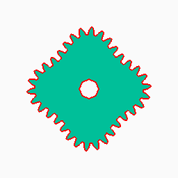](../images/functions/lobed/curve_gear_lobed_2d.png) |  |

Source: [`functions/lobed/curve_gear_lobed_2d.scad`](functions/lobed/curve_gear_lobed_2d.scad)

**Parameters:**

No parameters

**Returns:**

No return

Back to [module description](#module-executable-examples).

### Function `curve_gear_lobed_body_2d`

| lobed 2D body outline | ⠀ |
| --- | --- |
| [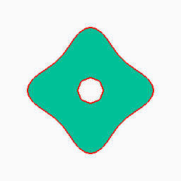](../images/functions/lobed/curve_gear_lobed_body_2d.png) |  |

Source: [`functions/lobed/curve_gear_lobed_body_2d.scad`](functions/lobed/curve_gear_lobed_body_2d.scad)

**Parameters:**

No parameters

**Returns:**

No return

Back to [module description](#module-executable-examples).

### Function `curve_gear_logarithmic_spiral_2d`

| logarithmic_spiral 2D gear outline | ⠀ |
| --- | --- |
| [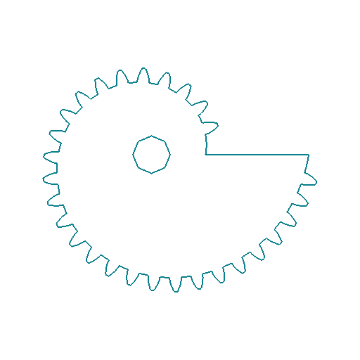](../images/functions/logarithmic_spiral/curve_gear_logarithmic_spiral_2d.png) |  |

Source: [`functions/logarithmic_spiral/curve_gear_logarithmic_spiral_2d.scad`](functions/logarithmic_spiral/curve_gear_logarithmic_spiral_2d.scad)

**Parameters:**

No parameters

**Returns:**

No return

Back to [module description](#module-executable-examples).

### Function `curve_gear_logarithmic_spiral_body_2d`

| logarithmic_spiral 2D body outline | ⠀ |
| --- | --- |
| [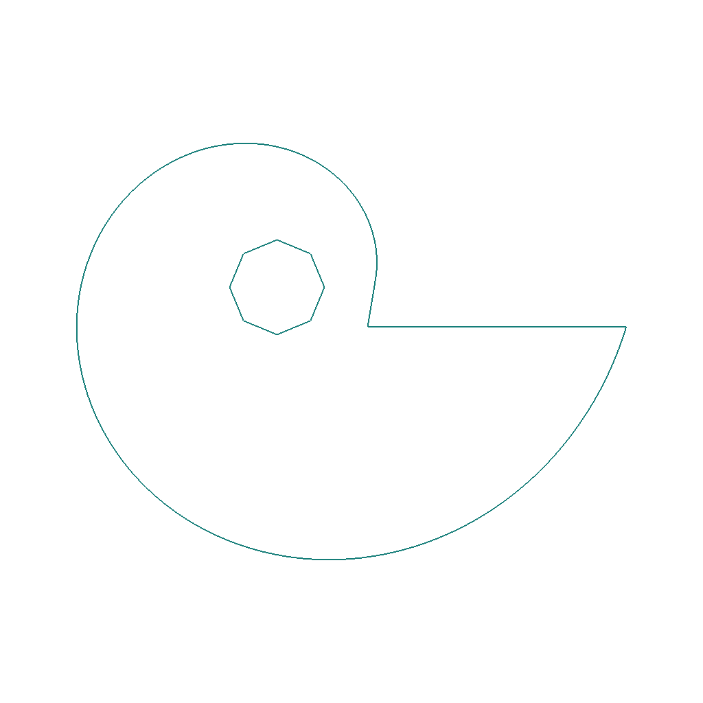](../images/functions/logarithmic_spiral/curve_gear_logarithmic_spiral_body_2d.png) |  |

Source: [`functions/logarithmic_spiral/curve_gear_logarithmic_spiral_body_2d.scad`](functions/logarithmic_spiral/curve_gear_logarithmic_spiral_body_2d.scad)

**Parameters:**

No parameters

**Returns:**

No return

Back to [module description](#module-executable-examples).

### Function `curve_gear_logistic_dwell_2d_example`

**Parameters:**

No parameters

**Returns:**

No return

Back to [module description](#module-executable-examples).

### Function `curve_gear_logistic_dwell_body_2d_example`

**Parameters:**

No parameters

**Returns:**

No return

Back to [module description](#module-executable-examples).

### Function `curve_gear_logistic_dwell_body_example`

**Parameters:**

No parameters

**Returns:**

No return

Back to [module description](#module-executable-examples).

### Function `curve_gear_logistic_dwell_centre_distance_example`

**Parameters:**

No parameters

**Returns:**

No return

Back to [module description](#module-executable-examples).

### Function `curve_gear_logistic_dwell_example`

Logistic Dwell gear example.

**Parameters:**

No parameters

**Returns:**

No return

Back to [module description](#module-executable-examples).

### Function `curve_gear_logistic_dwell_mate_example`

**Parameters:**

No parameters

**Returns:**

No return

Back to [module description](#module-executable-examples).

### Function `curve_gear_logistic_dwell_mate_rotation_example`

**Parameters:**

No parameters

**Returns:**

No return

Back to [module description](#module-executable-examples).

### Function `curve_gear_logistic_dwell_pair_example`

**Parameters:**

No parameters

**Returns:**

No return

Back to [module description](#module-executable-examples).

### Function `curve_gear_pascal_2d`

| pascal 2D gear outline | ⠀ |
| --- | --- |
| [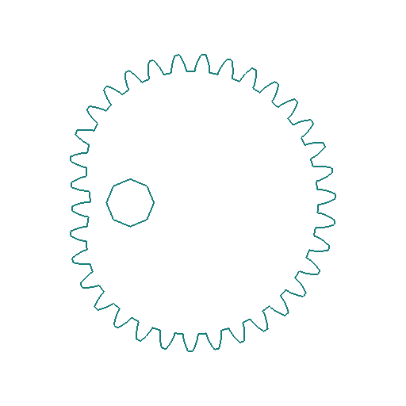](../images/functions/pascal/curve_gear_pascal_2d.png) |  |

Source: [`functions/pascal/curve_gear_pascal_2d.scad`](functions/pascal/curve_gear_pascal_2d.scad)

**Parameters:**

No parameters

**Returns:**

No return

Back to [module description](#module-executable-examples).

### Function `curve_gear_pascal_body_2d`

| pascal 2D body outline | ⠀ |
| --- | --- |
| [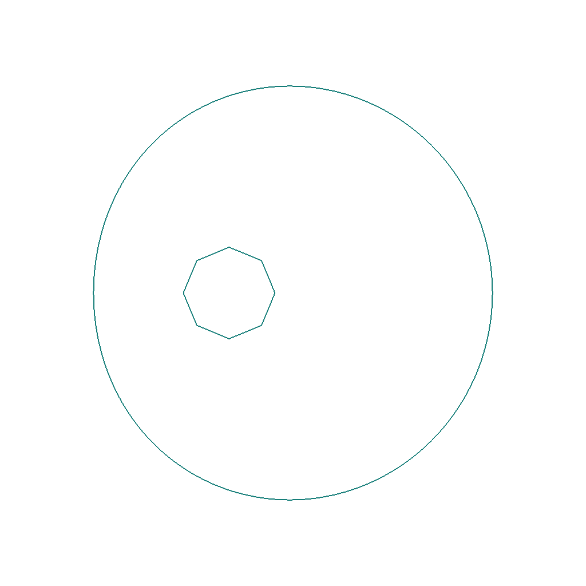](../images/functions/pascal/curve_gear_pascal_body_2d.png) |  |

Source: [`functions/pascal/curve_gear_pascal_body_2d.scad`](functions/pascal/curve_gear_pascal_body_2d.scad)

**Parameters:**

No parameters

**Returns:**

No return

Back to [module description](#module-executable-examples).

### Function `curve_gear_superformula_2d`

| superformula 2D gear outline | ⠀ |
| --- | --- |
| [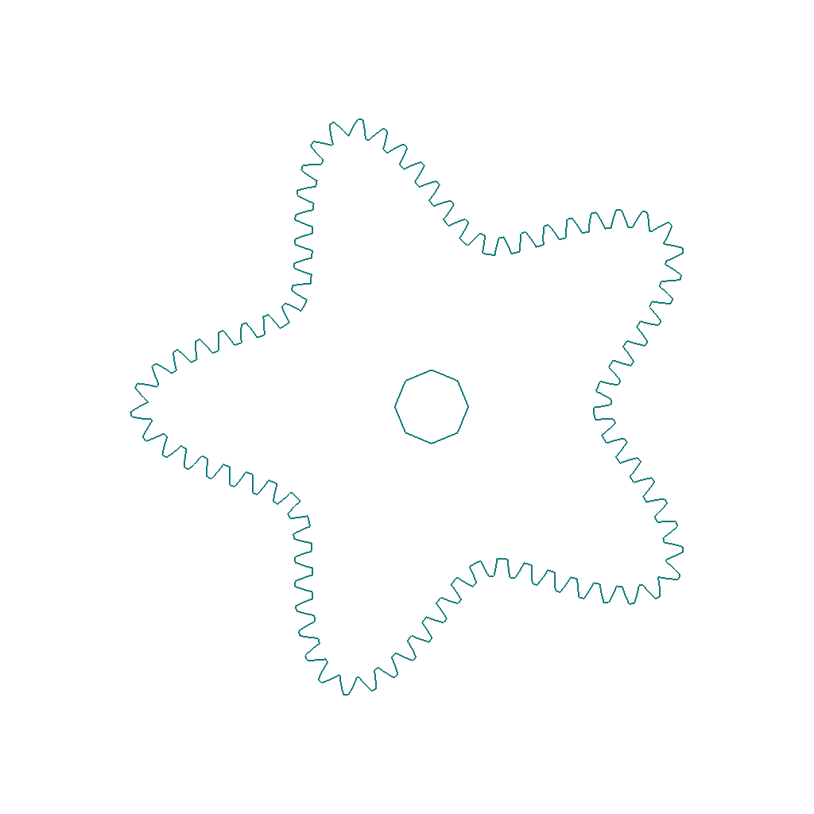](../images/functions/superformula/curve_gear_superformula_2d.png) |  |

Source: [`functions/superformula/curve_gear_superformula_2d.scad`](functions/superformula/curve_gear_superformula_2d.scad)

**Parameters:**

No parameters

**Returns:**

No return

Back to [module description](#module-executable-examples).

### Function `curve_gear_superformula_body_2d`

| superformula 2D body outline | ⠀ |
| --- | --- |
| [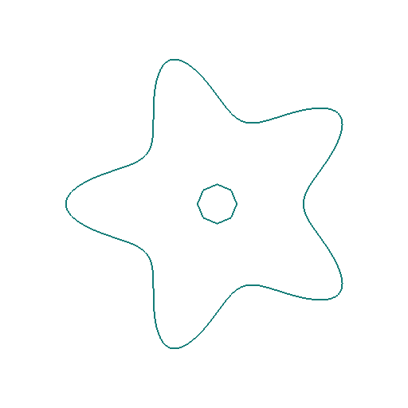](../images/functions/superformula/curve_gear_superformula_body_2d.png) |  |

Source: [`functions/superformula/curve_gear_superformula_body_2d.scad`](functions/superformula/curve_gear_superformula_body_2d.scad)

**Parameters:**

No parameters

**Returns:**

No return

Back to [module description](#module-executable-examples).

### Function `curve_gear_tanh_triad_2d_example`

Tanh Triad 2D example.

**Parameters:**

No parameters

**Returns:**

No return

Back to [module description](#module-executable-examples).

### Function `curve_gear_tanh_triad_body_2d_example`

Tanh Triad body 2D example.

**Parameters:**

No parameters

**Returns:**

No return

Back to [module description](#module-executable-examples).

### Function `curve_gear_tanh_triad_body_example`

Tanh Triad body example.

**Parameters:**

No parameters

**Returns:**

No return

Back to [module description](#module-executable-examples).

### Function `curve_gear_tanh_triad_centre_distance_example`

Tanh Triad centre-distance example.

**Parameters:**

No parameters

**Returns:**

No return

Back to [module description](#module-executable-examples).

### Function `curve_gear_tanh_triad_example`

Tanh Triad gear example.

**Parameters:**

No parameters

**Returns:**

No return

Back to [module description](#module-executable-examples).

### Function `curve_gear_tanh_triad_mate_example`

Tanh Triad mate example.

**Parameters:**

No parameters

**Returns:**

No return

Back to [module description](#module-executable-examples).

### Function `curve_gear_tanh_triad_mate_rotation_example`

Tanh Triad mate-rotation example.

**Parameters:**

No parameters

**Returns:**

No return

Back to [module description](#module-executable-examples).

### Function `curve_gear_tanh_triad_pair_example`

Tanh Triad pair example.

**Parameters:**

No parameters

**Returns:**

No return

Back to [module description](#module-executable-examples).

### Function `curve_gear_temple_fay_2d_example`

**Parameters:**

No parameters

**Returns:**

No return

Back to [module description](#module-executable-examples).

### Function `curve_gear_temple_fay_body_2d_example`

**Parameters:**

No parameters

**Returns:**

No return

Back to [module description](#module-executable-examples).

### Function `curve_gear_temple_fay_body_example`

**Parameters:**

No parameters

**Returns:**

No return

Back to [module description](#module-executable-examples).

### Function `curve_gear_temple_fay_centre_distance_example`

**Parameters:**

No parameters

**Returns:**

No return

Back to [module description](#module-executable-examples).

### Function `curve_gear_temple_fay_example`

Temple Fay gear example.

**Parameters:**

No parameters

**Returns:**

No return

Back to [module description](#module-executable-examples).

### Function `curve_gear_temple_fay_mate_example`

**Parameters:**

No parameters

**Returns:**

No return

Back to [module description](#module-executable-examples).

### Function `curve_gear_temple_fay_mate_rotation_example`

**Parameters:**

No parameters

**Returns:**

No return

Back to [module description](#module-executable-examples).

### Function `curve_gear_temple_fay_pair_example`

**Parameters:**

No parameters

**Returns:**

No return

Back to [module description](#module-executable-examples).

### Function `cusp_curve_gear`

Source: [`cusp/curve_gear_cusp.scad`](cusp/curve_gear_cusp.scad)

**Parameters:**

No parameters

**Returns:**

No return

Back to [module description](#module-executable-examples).

### Function `cusp_curve_gear_alternative`

| Cusp gear alternative | ⠀ |
| --- | --- |
| [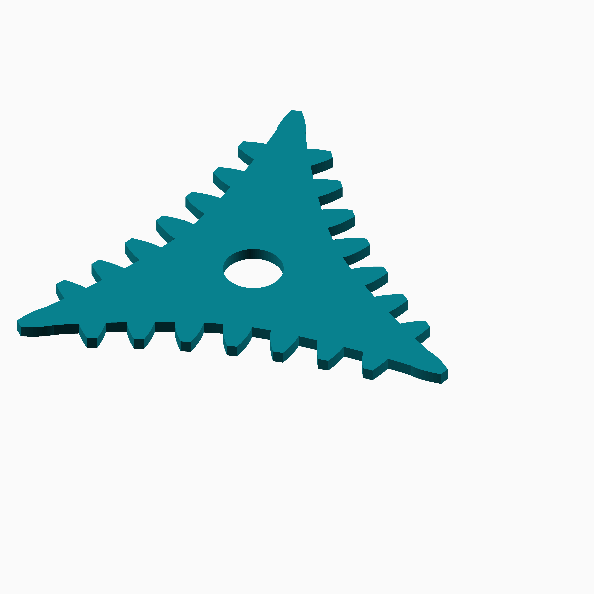](../images/functions/cusp/curve_gear_cusp_alternative.png) |  |

Source: [`functions/cusp/curve_gear_cusp_alternative.scad`](functions/cusp/curve_gear_cusp_alternative.scad)
Five cusps replace the canonical three-cusp deltoid. With 60 tooth positions, each cusp sector retains twelve tooth positions; the bore remains 4.8 mm. Set `cusps=5` and keep tooth count and samples divisible by five.

**Parameters:**

No parameters

**Returns:**

No return

Back to [module description](#module-executable-examples).

### Function `cusp_curve_gear_body`

Source: [`cusp/curve_gear_cusp_body.scad`](cusp/curve_gear_cusp_body.scad)

**Parameters:**

No parameters

**Returns:**

No return

Back to [module description](#module-executable-examples).

### Function `cusp_curve_gear_centre_distance`

Source: [`cusp/curve_gear_cusp_centre_distance.scad`](cusp/curve_gear_cusp_centre_distance.scad)

**Parameters:**

No parameters

**Returns:**

No return

Back to [module description](#module-executable-examples).

### Function `cusp_curve_gear_mate`

Source: [`cusp/curve_gear_cusp_mate.scad`](cusp/curve_gear_cusp_mate.scad)

**Parameters:**

No parameters

**Returns:**

No return

Back to [module description](#module-executable-examples).

### Function `cusp_curve_gear_mate_rotation`

Source: [`cusp/curve_gear_cusp_mate_rotation.scad`](cusp/curve_gear_cusp_mate_rotation.scad)

**Parameters:**

No parameters

**Returns:**

No return

Back to [module description](#module-executable-examples).

### Function `cusp_curve_gear_pair`

Source: [`cusp/curve_gear_cusp_pair.scad`](cusp/curve_gear_cusp_pair.scad)

**Parameters:**

No parameters

**Returns:**

No return

Back to [module description](#module-executable-examples).

### Function `cusp_curve_gear_pair_alternative`

| Cusp pair alternative | ⠀ |
| --- | --- |
| [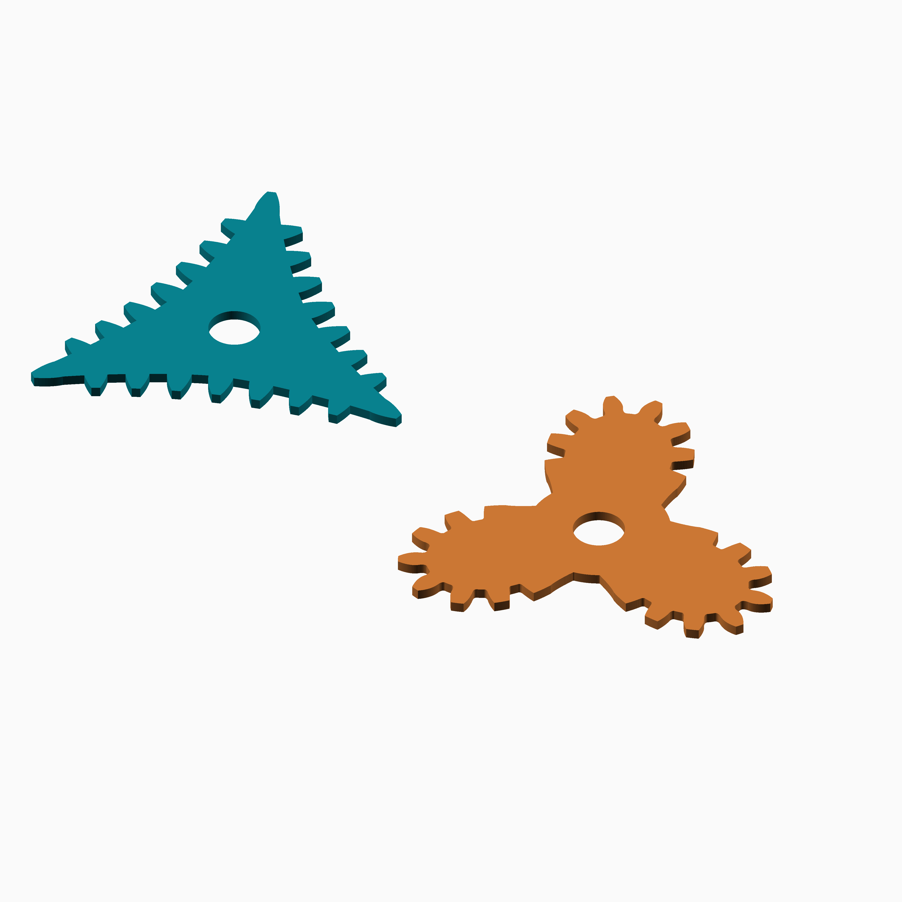](../images/functions/cusp/curve_gear_cusp_pair_alternative.png) |  |

Source: [`functions/cusp/curve_gear_cusp_pair_alternative.scad`](functions/cusp/curve_gear_cusp_pair_alternative.scad)
Five cusps replace the canonical three-cusp deltoid. With 60 tooth positions, each cusp sector retains twelve tooth positions; the bore remains 4.8 mm. Set `cusps=5` and keep tooth count and samples divisible by five.

**Parameters:**

No parameters

**Returns:**

No return

Back to [module description](#module-executable-examples).

### Function `ellipse_curve_gear`

| curve_gear_ellipse example preview | ⠀ |
| --- | --- |
| [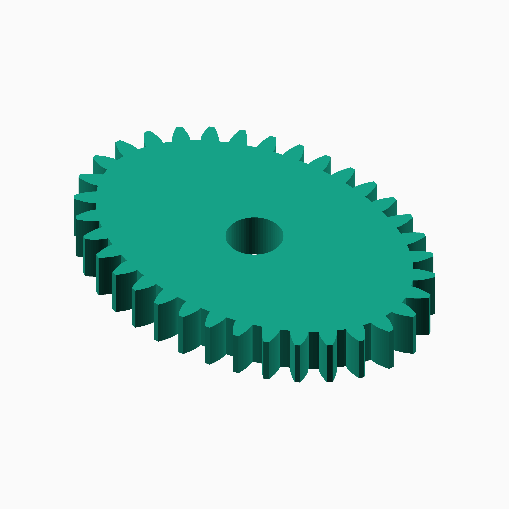](../images/functions/ellipse/curve_gear_ellipse.png) |  |

Source: [`functions/ellipse/curve_gear_ellipse.scad`](functions/ellipse/curve_gear_ellipse.scad)

**Parameters:**

No parameters

**Returns:**

No return

Back to [module description](#module-executable-examples).

### Function `ellipse_curve_gear_alternative`

| Ellipse gear alternative | ⠀ |
| --- | --- |
| [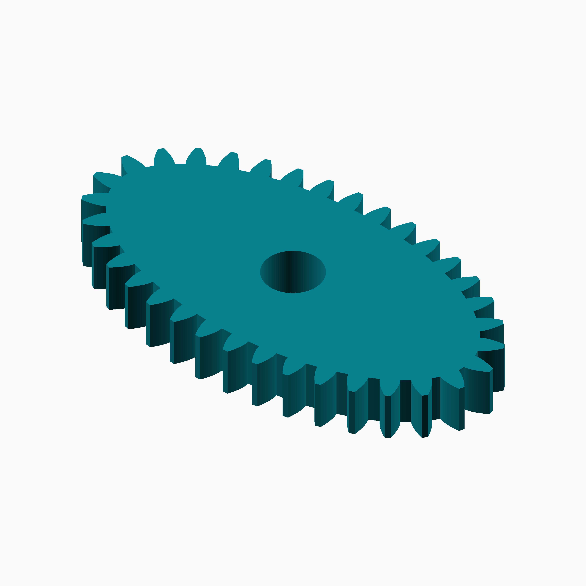](../images/functions/ellipse/curve_gear_ellipse_alternative.png) |  |

Source: [`functions/ellipse/curve_gear_ellipse_alternative.scad`](functions/ellipse/curve_gear_ellipse_alternative.scad)
Eccentricity 0.94 produces a long narrow ellipse rather than the canonical 0.72 oval. The sharper ends and narrow transverse span reveal where tooth placement becomes demanding.

**Parameters:**

No parameters

**Returns:**

No return

Back to [module description](#module-executable-examples).

### Function `ellipse_curve_gear_body`

| curve_gear_ellipse_body example preview | ⠀ |
| --- | --- |
| [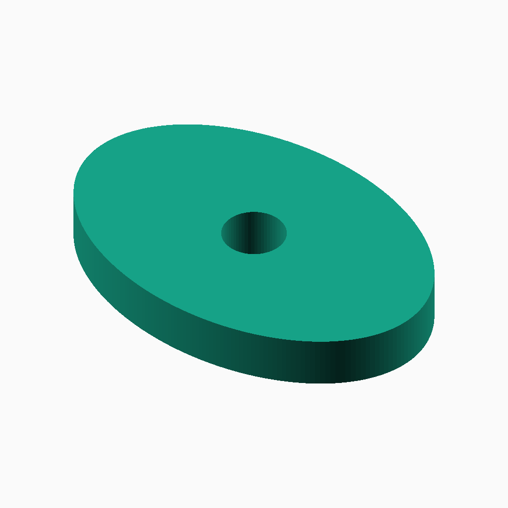](../images/functions/ellipse/curve_gear_ellipse_body.png) |  |

Source: [`functions/ellipse/curve_gear_ellipse_body.scad`](functions/ellipse/curve_gear_ellipse_body.scad)

**Parameters:**

No parameters

**Returns:**

No return

Back to [module description](#module-executable-examples).

### Function `ellipse_curve_gear_centre_distance`

Source: [`functions/ellipse/curve_gear_ellipse_centre_distance.scad`](functions/ellipse/curve_gear_ellipse_centre_distance.scad)

The result is deliberately emitted as an OpenSCAD console value because
this callable returns a number rather than geometry.

**Parameters:**

No parameters

**Returns:**

No return

Back to [module description](#module-executable-examples).

### Function `ellipse_curve_gear_mate`

| curve_gear_ellipse_mate example preview | ⠀ |
| --- | --- |
| [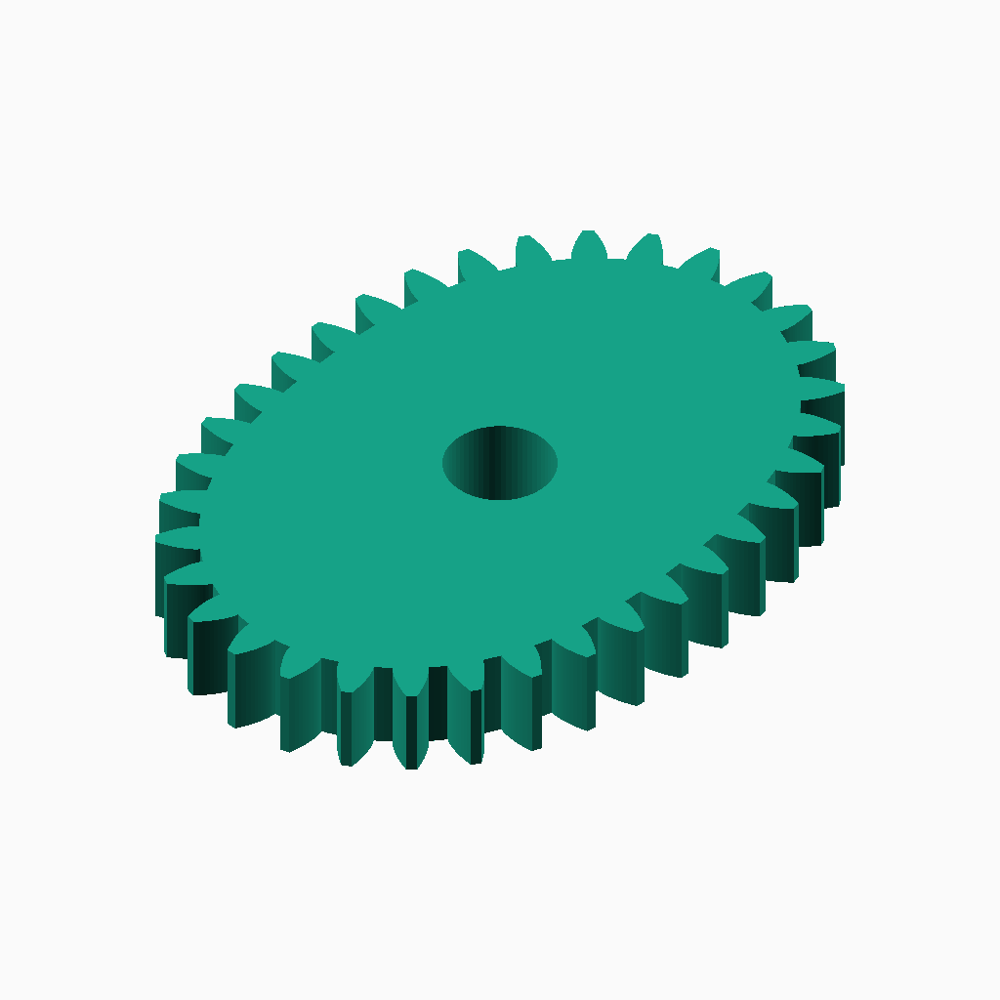](../images/functions/ellipse/curve_gear_ellipse_mate.png) |  |

Source: [`functions/ellipse/curve_gear_ellipse_mate.scad`](functions/ellipse/curve_gear_ellipse_mate.scad)

**Parameters:**

No parameters

**Returns:**

No return

Back to [module description](#module-executable-examples).

### Function `ellipse_curve_gear_mate_rotation`

Source: [`functions/ellipse/curve_gear_ellipse_mate_rotation.scad`](functions/ellipse/curve_gear_ellipse_mate_rotation.scad)

The result is deliberately emitted as an OpenSCAD console value because
this callable returns a number rather than geometry.

**Parameters:**

No parameters

**Returns:**

No return

Back to [module description](#module-executable-examples).

### Function `ellipse_curve_gear_pair`

| curve_gear_ellipse_pair example preview | ⠀ |
| --- | --- |
| [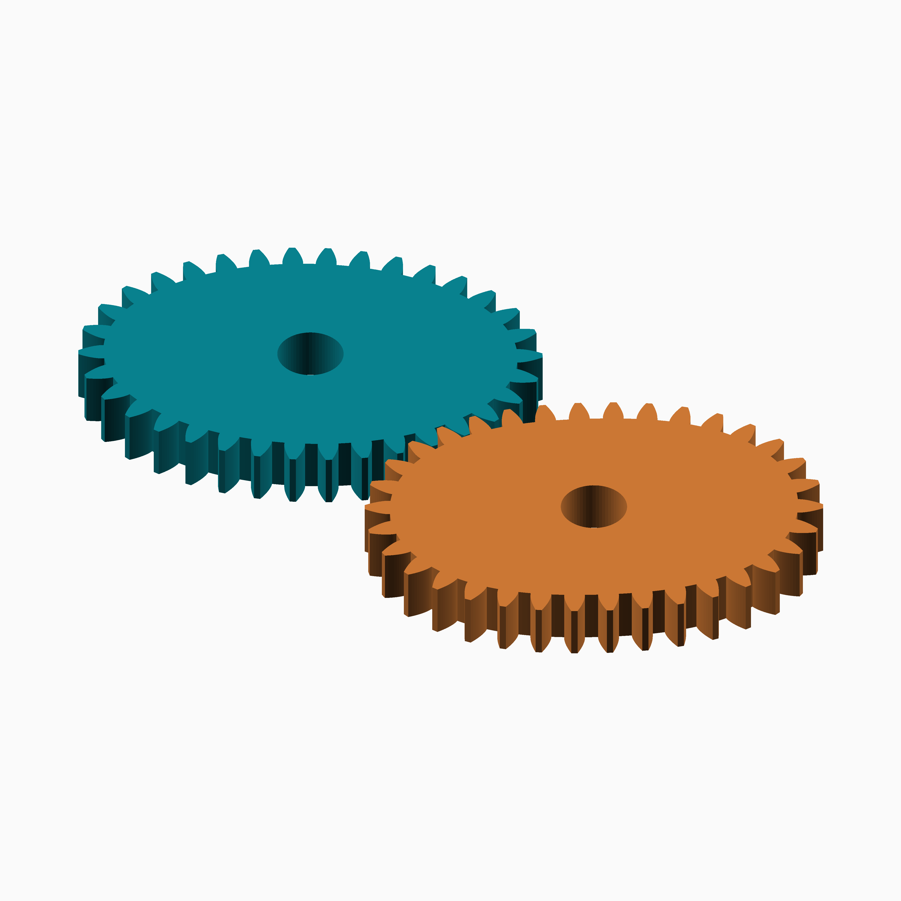](../images/functions/ellipse/curve_gear_ellipse_pair.png) |  |

Source: [`functions/ellipse/curve_gear_ellipse_pair.scad`](functions/ellipse/curve_gear_ellipse_pair.scad)

**Parameters:**

No parameters

**Returns:**

No return

Back to [module description](#module-executable-examples).

### Function `ellipse_curve_gear_pair_alternative`

| Ellipse pair alternative | ⠀ |
| --- | --- |
| [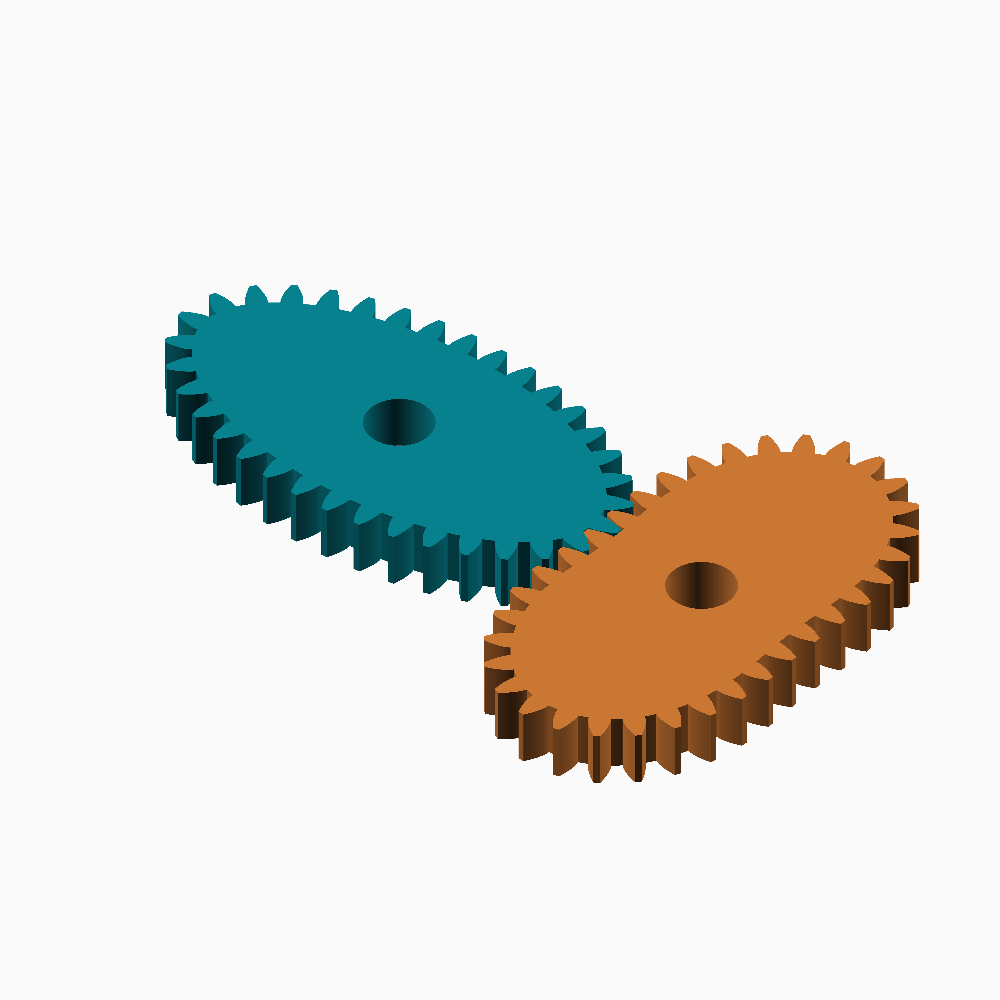](../images/functions/ellipse/curve_gear_ellipse_pair_alternative.png) |  |

Source: [`functions/ellipse/curve_gear_ellipse_pair_alternative.scad`](functions/ellipse/curve_gear_ellipse_pair_alternative.scad)
Eccentricity 0.94 produces a long narrow ellipse rather than the canonical 0.72 oval. The sharper ends and narrow transverse span reveal where tooth placement becomes demanding.

**Parameters:**

No parameters

**Returns:**

No return

Back to [module description](#module-executable-examples).

### Function `epitrochoid_curve_gear`

| curve_gear_epitrochoid example preview | ⠀ |
| --- | --- |
|  |  |

Source: [`functions/epitrochoid/curve_gear_epitrochoid.scad`](functions/epitrochoid/curve_gear_epitrochoid.scad)

**Parameters:**

No parameters

**Returns:**

No return

Back to [module description](#module-executable-examples).

### Function `epitrochoid_curve_gear_alternative`

| Epitrochoid gear alternative | ⠀ |
| --- | --- |
|  |  |

Source: [`functions/epitrochoid/curve_gear_epitrochoid_alternative.scad`](functions/epitrochoid/curve_gear_epitrochoid_alternative.scad)
A rolling ratio of 2:1 produces broad two-fold shaping instead of the canonical four-fold scallops. Offset 0.65 strengthens the excursions of the generating point.

**Parameters:**

No parameters

**Returns:**

No return

Back to [module description](#module-executable-examples).

### Function `epitrochoid_curve_gear_body`

| curve_gear_epitrochoid_body example preview | ⠀ |
| --- | --- |
|  |  |

Source: [`functions/epitrochoid/curve_gear_epitrochoid_body.scad`](functions/epitrochoid/curve_gear_epitrochoid_body.scad)

**Parameters:**

No parameters

**Returns:**

No return

Back to [module description](#module-executable-examples).

### Function `epitrochoid_curve_gear_centre_distance`

Source: [`functions/epitrochoid/curve_gear_epitrochoid_centre_distance.scad`](functions/epitrochoid/curve_gear_epitrochoid_centre_distance.scad)

The result is deliberately emitted as an OpenSCAD console value because
this callable returns a number rather than geometry.

**Parameters:**

No parameters

**Returns:**

No return

Back to [module description](#module-executable-examples).

### Function `epitrochoid_curve_gear_mate`

| curve_gear_epitrochoid_mate example preview | ⠀ |
| --- | --- |
|  |  |

Source: [`functions/epitrochoid/curve_gear_epitrochoid_mate.scad`](functions/epitrochoid/curve_gear_epitrochoid_mate.scad)

**Parameters:**

No parameters

**Returns:**

No return

Back to [module description](#module-executable-examples).

### Function `epitrochoid_curve_gear_mate_rotation`

Source: [`functions/epitrochoid/curve_gear_epitrochoid_mate_rotation.scad`](functions/epitrochoid/curve_gear_epitrochoid_mate_rotation.scad)

The result is deliberately emitted as an OpenSCAD console value because
this callable returns a number rather than geometry.

**Parameters:**

No parameters

**Returns:**

No return

Back to [module description](#module-executable-examples).

### Function `epitrochoid_curve_gear_pair`

| curve_gear_epitrochoid_pair example preview | ⠀ |
| --- | --- |
|  |  |

Source: [`functions/epitrochoid/curve_gear_epitrochoid_pair.scad`](functions/epitrochoid/curve_gear_epitrochoid_pair.scad)

**Parameters:**

No parameters

**Returns:**

No return

Back to [module description](#module-executable-examples).

### Function `epitrochoid_curve_gear_pair_alternative`

| Epitrochoid pair alternative | ⠀ |
| --- | --- |
|  |  |

Source: [`functions/epitrochoid/curve_gear_epitrochoid_pair_alternative.scad`](functions/epitrochoid/curve_gear_epitrochoid_pair_alternative.scad)
A rolling ratio of 2:1 produces broad two-fold shaping instead of the canonical four-fold scallops. Offset 0.65 strengthens the excursions of the generating point.

**Parameters:**

No parameters

**Returns:**

No return

Back to [module description](#module-executable-examples).

### Function `fourier_curve_gear`

| curve_gear_fourier example preview | ⠀ |
| --- | --- |
| [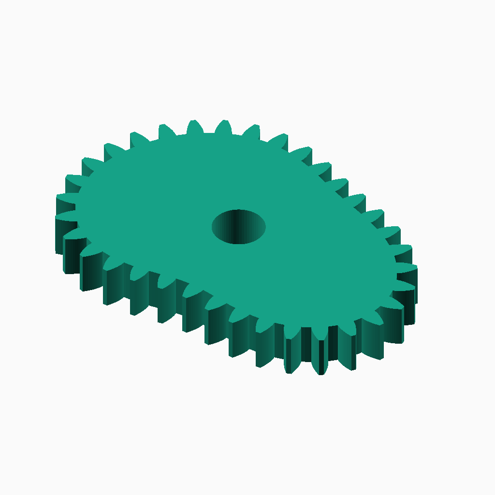](../images/functions/fourier/curve_gear_fourier.png) |  |

Source: [`functions/fourier/curve_gear_fourier.scad`](functions/fourier/curve_gear_fourier.scad)

**Parameters:**

No parameters

**Returns:**

No return

Back to [module description](#module-executable-examples).

### Function `fourier_curve_gear_alternative`

| Fourier gear alternative | ⠀ |
| --- | --- |
| [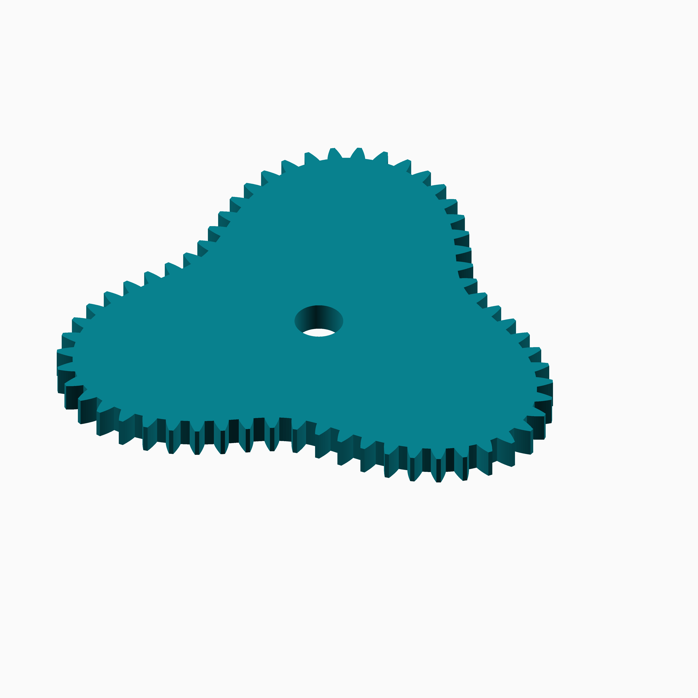](../images/functions/fourier/curve_gear_fourier_alternative.png) |  |

Source: [`functions/fourier/curve_gear_fourier_alternative.scad`](functions/fourier/curve_gear_fourier_alternative.scad)
A single strong third harmonic produces three clear lobes instead of the canonical mixed second/third-harmonic oval. This isolates harmonic count from mixed-phase asymmetry.

**Parameters:**

No parameters

**Returns:**

No return

Back to [module description](#module-executable-examples).

### Function `fourier_curve_gear_body`

| curve_gear_fourier_body example preview | ⠀ |
| --- | --- |
| [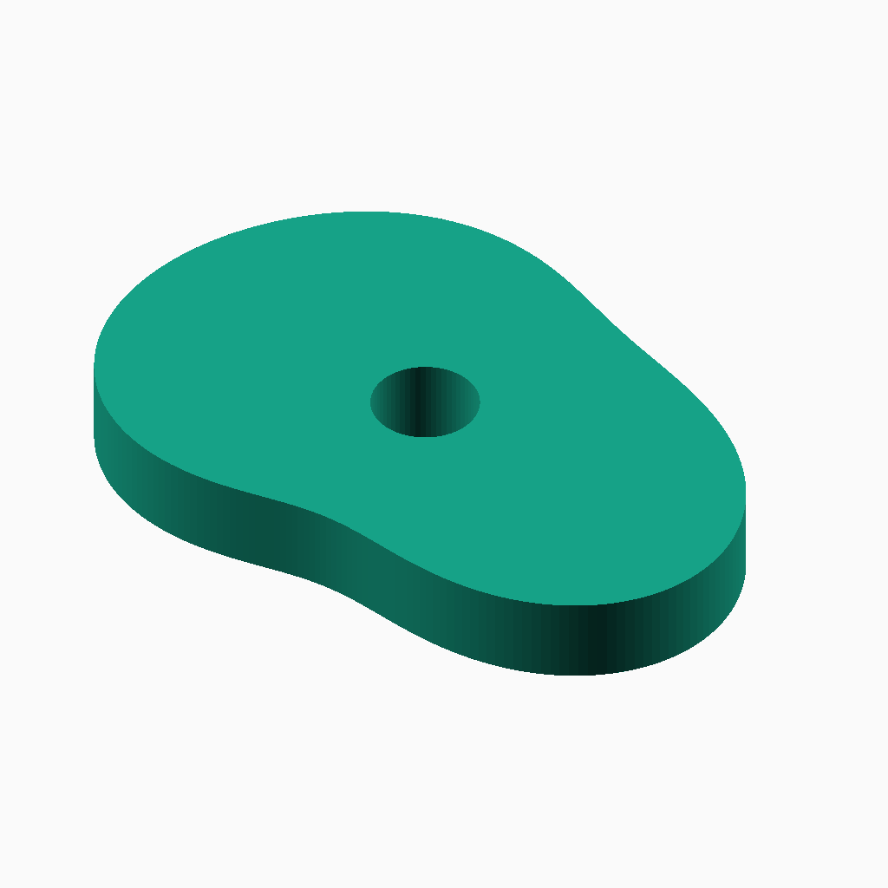](../images/functions/fourier/curve_gear_fourier_body.png) |  |

Source: [`functions/fourier/curve_gear_fourier_body.scad`](functions/fourier/curve_gear_fourier_body.scad)

**Parameters:**

No parameters

**Returns:**

No return

Back to [module description](#module-executable-examples).

### Function `fourier_curve_gear_centre_distance`

Source: [`functions/fourier/curve_gear_fourier_centre_distance.scad`](functions/fourier/curve_gear_fourier_centre_distance.scad)

The result is deliberately emitted as an OpenSCAD console value because
this callable returns a number rather than geometry.

**Parameters:**

No parameters

**Returns:**

No return

Back to [module description](#module-executable-examples).

### Function `fourier_curve_gear_mate`

| curve_gear_fourier_mate example preview | ⠀ |
| --- | --- |
| [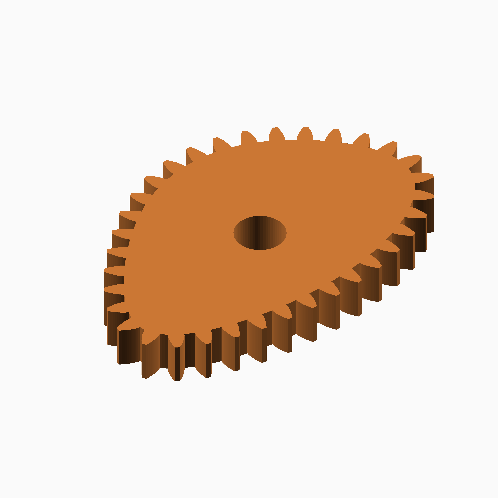](../images/functions/fourier/curve_gear_fourier_mate.png) |  |

Source: [`functions/fourier/curve_gear_fourier_mate.scad`](functions/fourier/curve_gear_fourier_mate.scad)

**Parameters:**

No parameters

**Returns:**

No return

Back to [module description](#module-executable-examples).

### Function `fourier_curve_gear_mate_rotation`

Source: [`functions/fourier/curve_gear_fourier_mate_rotation.scad`](functions/fourier/curve_gear_fourier_mate_rotation.scad)

The result is deliberately emitted as an OpenSCAD console value because
this callable returns a number rather than geometry.

**Parameters:**

No parameters

**Returns:**

No return

Back to [module description](#module-executable-examples).

### Function `fourier_curve_gear_pair`

| curve_gear_fourier_pair example preview | ⠀ |
| --- | --- |
| [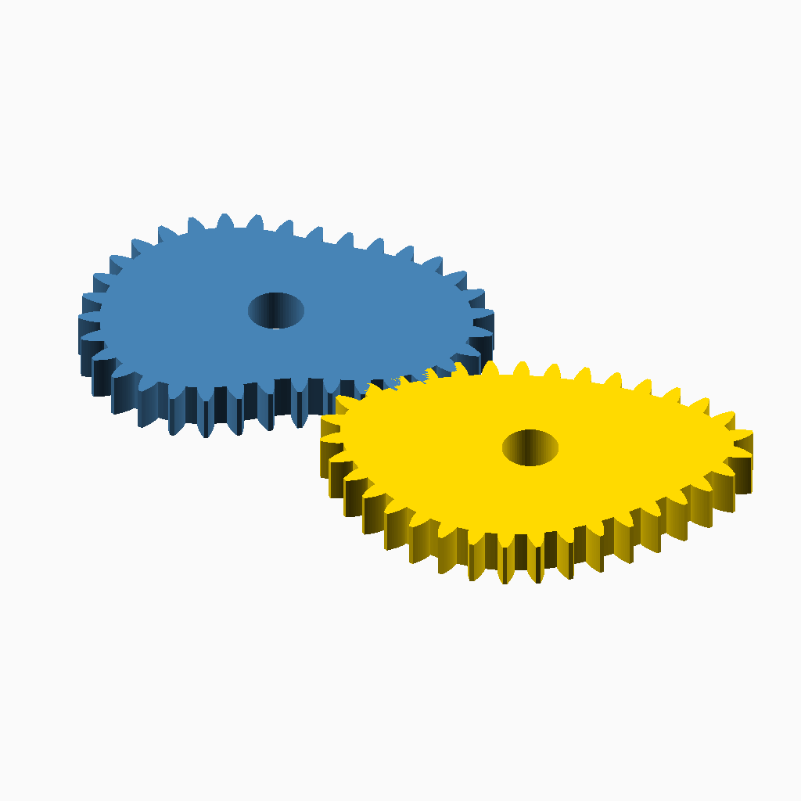](../images/functions/fourier/curve_gear_fourier_pair.png) |  |

Source: [`functions/fourier/curve_gear_fourier_pair.scad`](functions/fourier/curve_gear_fourier_pair.scad)

**Parameters:**

No parameters

**Returns:**

No return

Back to [module description](#module-executable-examples).

### Function `fourier_curve_gear_pair_alternative`

| Fourier pair alternative | ⠀ |
| --- | --- |
| [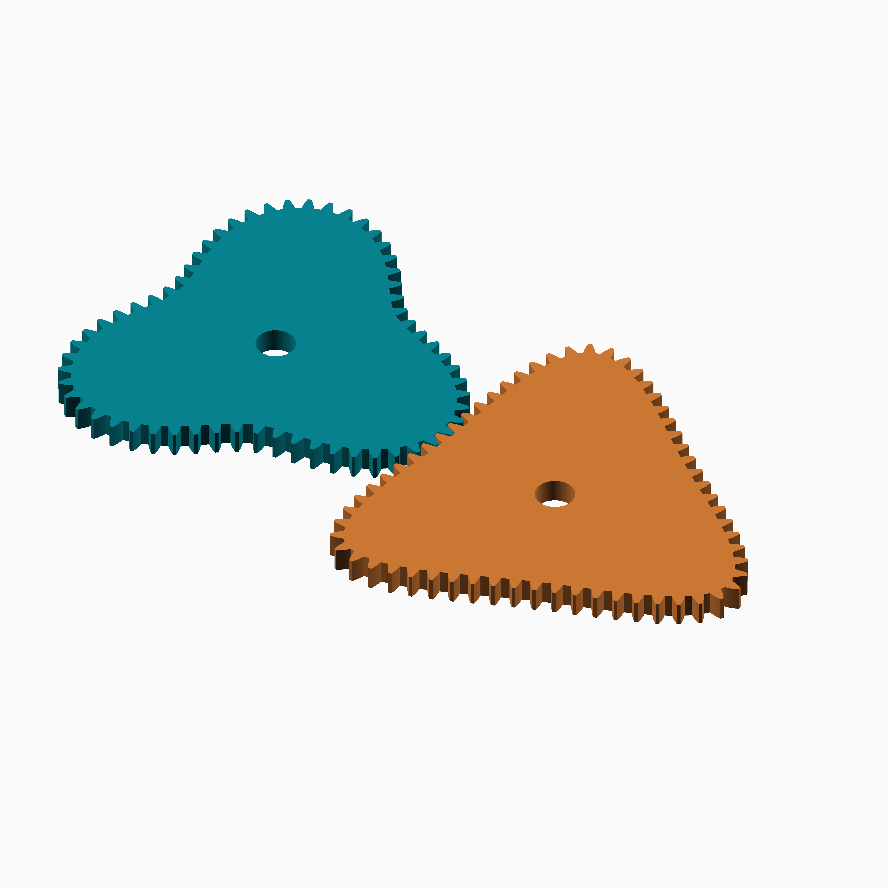](../images/functions/fourier/curve_gear_fourier_pair_alternative.png) |  |

Source: [`functions/fourier/curve_gear_fourier_pair_alternative.scad`](functions/fourier/curve_gear_fourier_pair_alternative.scad)
A single strong third harmonic produces three clear lobes instead of the canonical mixed second/third-harmonic oval. This isolates harmonic count from mixed-phase asymmetry.

**Parameters:**

No parameters

**Returns:**

No return

Back to [module description](#module-executable-examples).

### Function `hypotrochoid_curve_gear`

| curve_gear_hypotrochoid example preview | ⠀ |
| --- | --- |
|  |  |

Source: [`functions/hypotrochoid/curve_gear_hypotrochoid.scad`](functions/hypotrochoid/curve_gear_hypotrochoid.scad)

**Parameters:**

No parameters

**Returns:**

No return

Back to [module description](#module-executable-examples).

### Function `hypotrochoid_curve_gear_alternative`

| Hypotrochoid gear alternative | ⠀ |
| --- | --- |
| [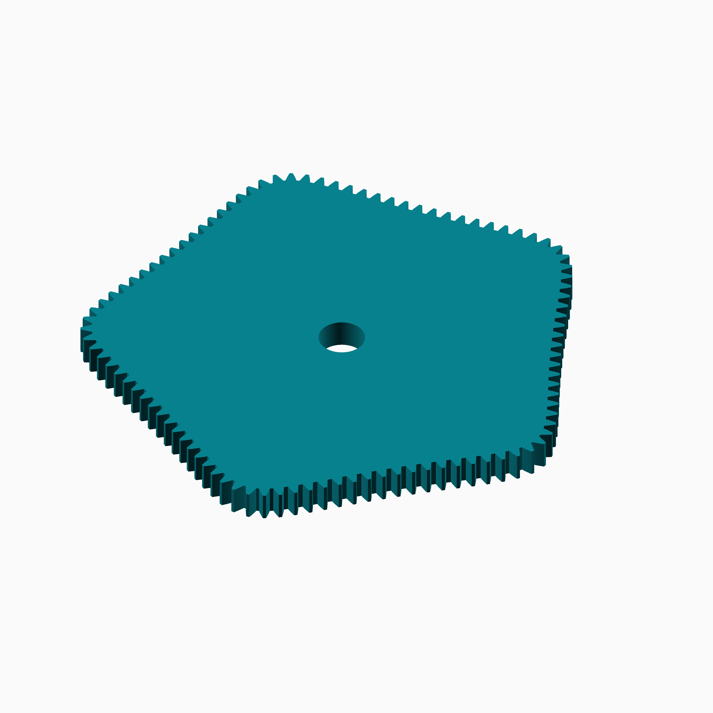](../images/functions/hypotrochoid/curve_gear_hypotrochoid_alternative.png) |  |

Source: [`functions/hypotrochoid/curve_gear_hypotrochoid_alternative.scad`](functions/hypotrochoid/curve_gear_hypotrochoid_alternative.scad)
A 5:1 rolling ratio and offset 0.35 produce five-fold shaping rather than the canonical three-fold outline. The alternative changes the curve itself, not merely the pair spacing.

**Parameters:**

No parameters

**Returns:**

No return

Back to [module description](#module-executable-examples).

### Function `hypotrochoid_curve_gear_body`

| curve_gear_hypotrochoid_body example preview | ⠀ |
| --- | --- |
|  |  |

Source: [`functions/hypotrochoid/curve_gear_hypotrochoid_body.scad`](functions/hypotrochoid/curve_gear_hypotrochoid_body.scad)

**Parameters:**

No parameters

**Returns:**

No return

Back to [module description](#module-executable-examples).

### Function `hypotrochoid_curve_gear_centre_distance`

Source: [`functions/hypotrochoid/curve_gear_hypotrochoid_centre_distance.scad`](functions/hypotrochoid/curve_gear_hypotrochoid_centre_distance.scad)

**Parameters:**

No parameters

**Returns:**

No return

Back to [module description](#module-executable-examples).

### Function `hypotrochoid_curve_gear_mate`

| curve_gear_hypotrochoid_mate example preview | ⠀ |
| --- | --- |
|  |  |

Source: [`functions/hypotrochoid/curve_gear_hypotrochoid_mate.scad`](functions/hypotrochoid/curve_gear_hypotrochoid_mate.scad)

**Parameters:**

No parameters

**Returns:**

No return

Back to [module description](#module-executable-examples).

### Function `hypotrochoid_curve_gear_mate_rotation`

Source: [`functions/hypotrochoid/curve_gear_hypotrochoid_mate_rotation.scad`](functions/hypotrochoid/curve_gear_hypotrochoid_mate_rotation.scad)

**Parameters:**

No parameters

**Returns:**

No return

Back to [module description](#module-executable-examples).

### Function `hypotrochoid_curve_gear_pair`

| curve_gear_hypotrochoid_pair example preview | ⠀ |
| --- | --- |
|  |  |

Source: [`functions/hypotrochoid/curve_gear_hypotrochoid_pair.scad`](functions/hypotrochoid/curve_gear_hypotrochoid_pair.scad)

**Parameters:**

No parameters

**Returns:**

No return

Back to [module description](#module-executable-examples).

### Function `hypotrochoid_curve_gear_pair_alternative`

| Hypotrochoid pair alternative | ⠀ |
| --- | --- |
|  |  |

Source: [`functions/hypotrochoid/curve_gear_hypotrochoid_pair_alternative.scad`](functions/hypotrochoid/curve_gear_hypotrochoid_pair_alternative.scad)
A 5:1 rolling ratio and offset 0.35 produce five-fold shaping rather than the canonical three-fold outline. The alternative changes the curve itself, not merely the pair spacing.

**Parameters:**

No parameters

**Returns:**

No return

Back to [module description](#module-executable-examples).

### Function `lobed_curve_gear`

| curve_gear_lobed example preview | ⠀ |
| --- | --- |
| [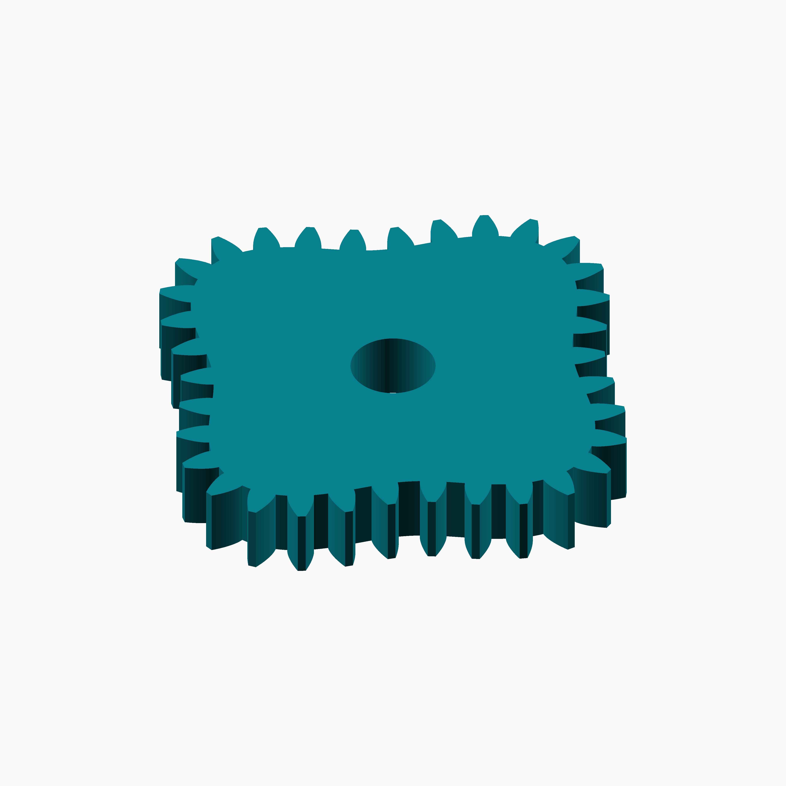](../images/functions/lobed/curve_gear_lobed.png) |  |

Source: [`functions/lobed/curve_gear_lobed.scad`](functions/lobed/curve_gear_lobed.scad)

**Parameters:**

No parameters

**Returns:**

No return

Back to [module description](#module-executable-examples).

### Function `lobed_curve_gear_alternative`

| Lobed gear alternative | ⠀ |
| --- | --- |
| [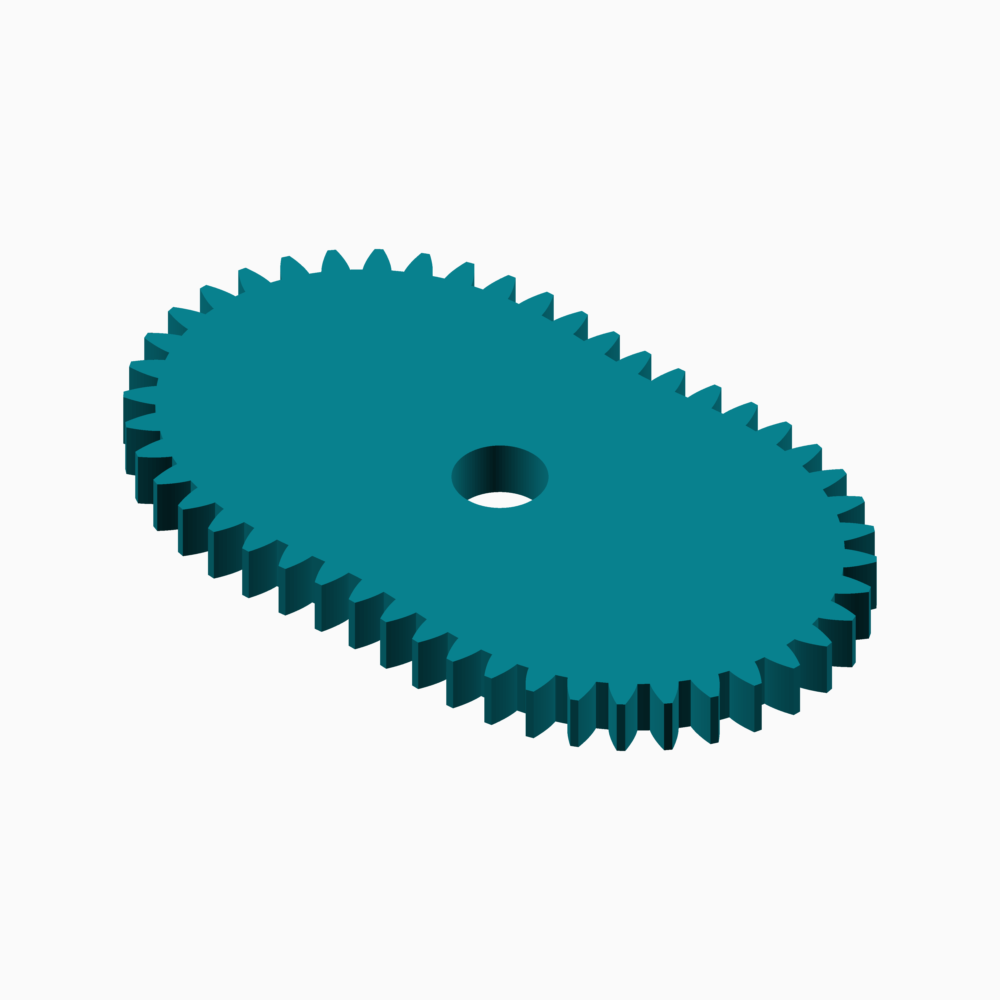](../images/functions/lobed/curve_gear_lobed_alternative.png) |  |

Source: [`functions/lobed/curve_gear_lobed_alternative.scad`](functions/lobed/curve_gear_lobed_alternative.scad)
Two deep lobes replace the canonical shallow four-lobed square form. Lobe count 2 and depth 0.28 show the transition to an elongated, waisted pitch curve.

**Parameters:**

No parameters

**Returns:**

No return

Back to [module description](#module-executable-examples).

### Function `lobed_curve_gear_body`

| curve_gear_lobed_body example preview | ⠀ |
| --- | --- |
| [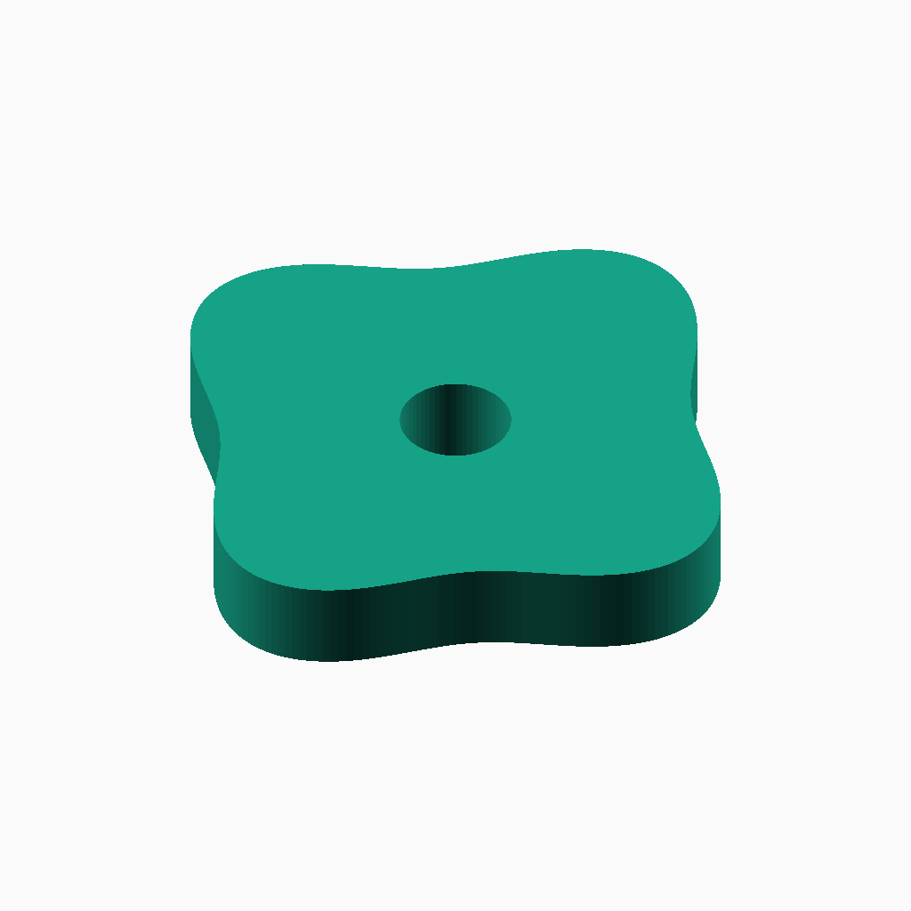](../images/functions/lobed/curve_gear_lobed_body.png) |  |

Source: [`functions/lobed/curve_gear_lobed_body.scad`](functions/lobed/curve_gear_lobed_body.scad)

**Parameters:**

No parameters

**Returns:**

No return

Back to [module description](#module-executable-examples).

### Function `lobed_curve_gear_centre_distance`

Source: [`functions/lobed/curve_gear_lobed_centre_distance.scad`](functions/lobed/curve_gear_lobed_centre_distance.scad)

The result is deliberately emitted as an OpenSCAD console value because
this callable returns a number rather than geometry.

**Parameters:**

No parameters

**Returns:**

No return

Back to [module description](#module-executable-examples).

### Function `lobed_curve_gear_mate`

| curve_gear_lobed_mate example preview | ⠀ |
| --- | --- |
| [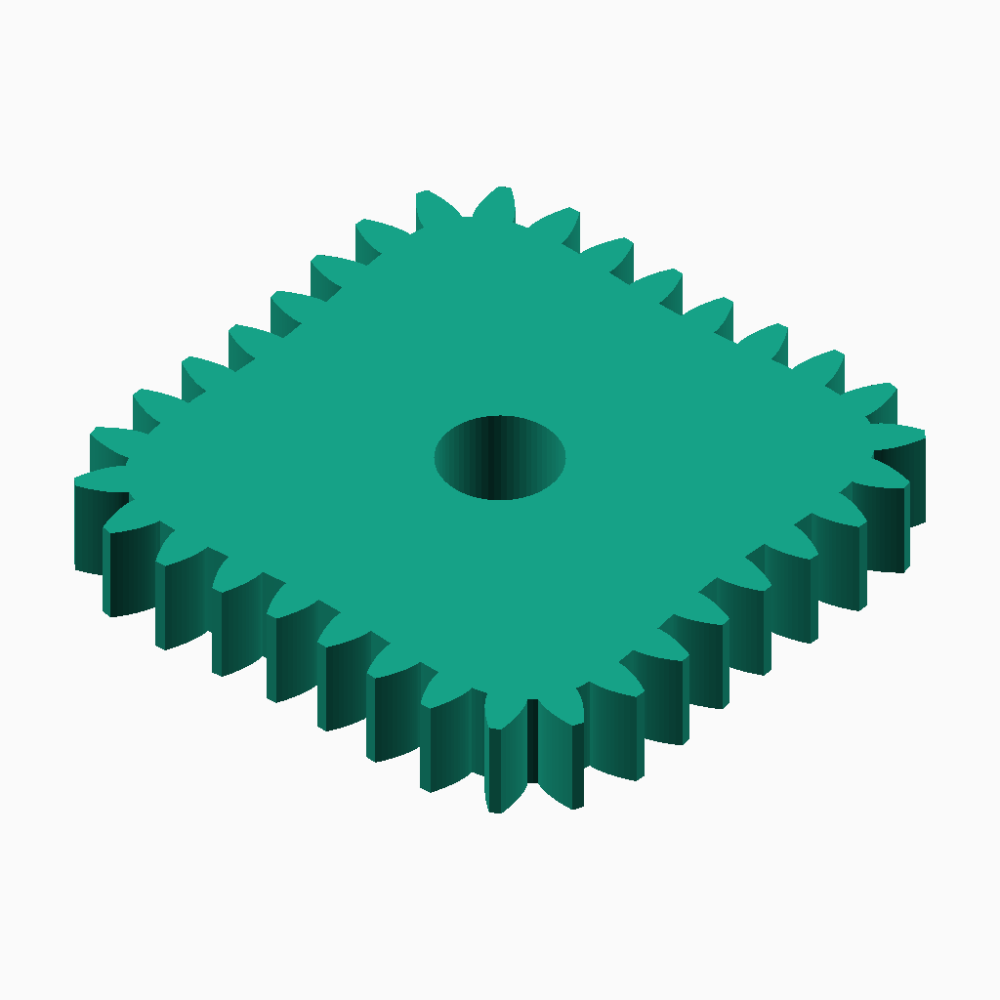](../images/functions/lobed/curve_gear_lobed_mate.png) |  |

Source: [`functions/lobed/curve_gear_lobed_mate.scad`](functions/lobed/curve_gear_lobed_mate.scad)

**Parameters:**

No parameters

**Returns:**

No return

Back to [module description](#module-executable-examples).

### Function `lobed_curve_gear_mate_rotation`

Source: [`functions/lobed/curve_gear_lobed_mate_rotation.scad`](functions/lobed/curve_gear_lobed_mate_rotation.scad)

The result is deliberately emitted as an OpenSCAD console value because
this callable returns a number rather than geometry.

**Parameters:**

No parameters

**Returns:**

No return

Back to [module description](#module-executable-examples).

### Function `lobed_curve_gear_pair`

| curve_gear_lobed_pair example preview | ⠀ |
| --- | --- |
| [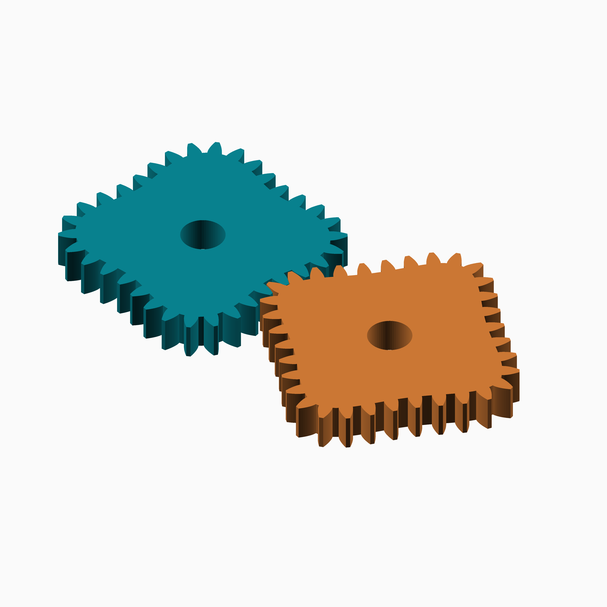](../images/functions/lobed/curve_gear_lobed_pair.png) |  |

Source: [`functions/lobed/curve_gear_lobed_pair.scad`](functions/lobed/curve_gear_lobed_pair.scad)

**Parameters:**

No parameters

**Returns:**

No return

Back to [module description](#module-executable-examples).

### Function `lobed_curve_gear_pair_alternative`

| Lobed pair alternative | ⠀ |
| --- | --- |
| [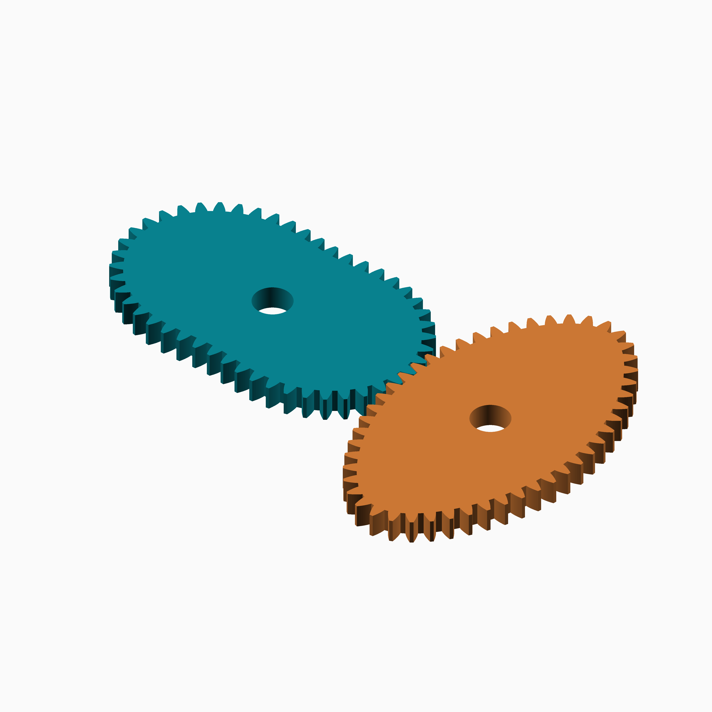](../images/functions/lobed/curve_gear_lobed_pair_alternative.png) |  |

Source: [`functions/lobed/curve_gear_lobed_pair_alternative.scad`](functions/lobed/curve_gear_lobed_pair_alternative.scad)
Two deep lobes replace the canonical shallow four-lobed square form. Lobe count 2 and depth 0.28 show the transition to an elongated, waisted pitch curve.

**Parameters:**

No parameters

**Returns:**

No return

Back to [module description](#module-executable-examples).

### Function `logarithmic_spiral_curve_gear`

| curve_gear_logarithmic_spiral example preview | ⠀ |
| --- | --- |
|  |  |

Source: [`functions/logarithmic_spiral/curve_gear_logarithmic_spiral.scad`](functions/logarithmic_spiral/curve_gear_logarithmic_spiral.scad)

**Parameters:**

No parameters

**Returns:**

No return

Back to [module description](#module-executable-examples).

### Function `logarithmic_spiral_curve_gear_alternative`

| Logarithmic spiral gear alternative | ⠀ |
| --- | --- |
| [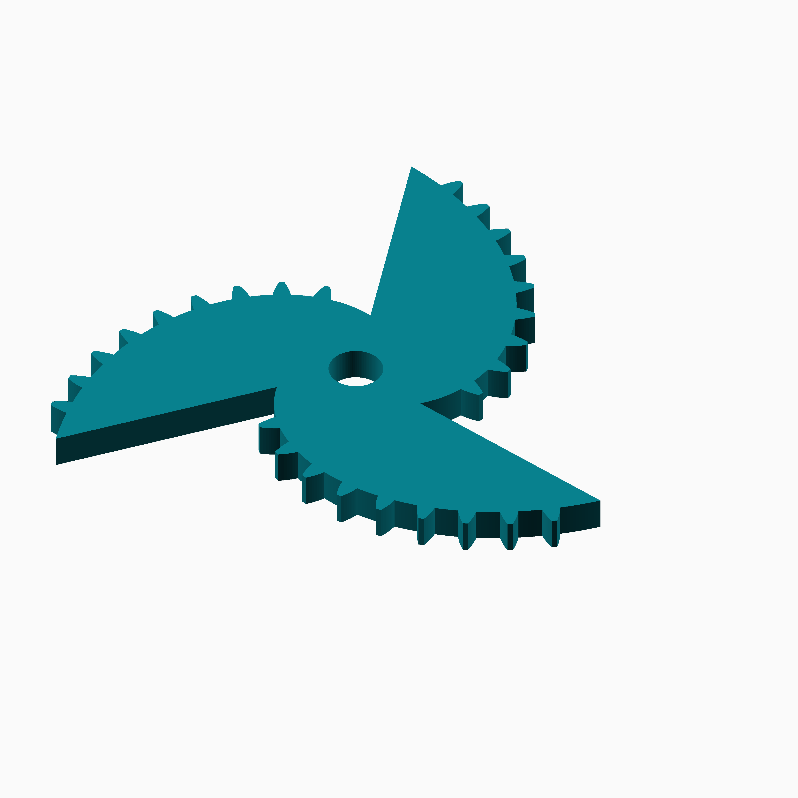](../images/functions/logarithmic_spiral/curve_gear_logarithmic_spiral_alternative.png) |  |

Source: [`functions/logarithmic_spiral/curve_gear_logarithmic_spiral_alternative.scad`](functions/logarithmic_spiral/curve_gear_logarithmic_spiral_alternative.scad)
Three spiral sectors replace the canonical single return. Growth 1.22 increases the radial sweep. Returns are broad transitions without ordinary teeth, and the pair is a static reference rather than a validated conjugate transmission.

**Parameters:**

No parameters

**Returns:**

No return

Back to [module description](#module-executable-examples).

### Function `logarithmic_spiral_curve_gear_body`

| curve_gear_logarithmic_spiral_body example preview | ⠀ |
| --- | --- |
| [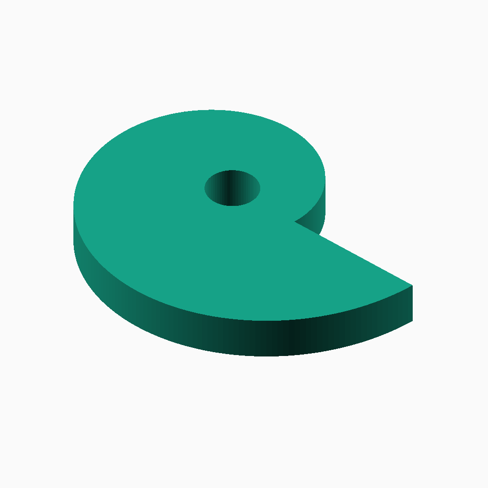](../images/functions/logarithmic_spiral/curve_gear_logarithmic_spiral_body.png) |  |

Source: [`functions/logarithmic_spiral/curve_gear_logarithmic_spiral_body.scad`](functions/logarithmic_spiral/curve_gear_logarithmic_spiral_body.scad)

**Parameters:**

No parameters

**Returns:**

No return

Back to [module description](#module-executable-examples).

### Function `logarithmic_spiral_curve_gear_mate`

| curve_gear_logarithmic_spiral_mate example preview | ⠀ |
| --- | --- |
| [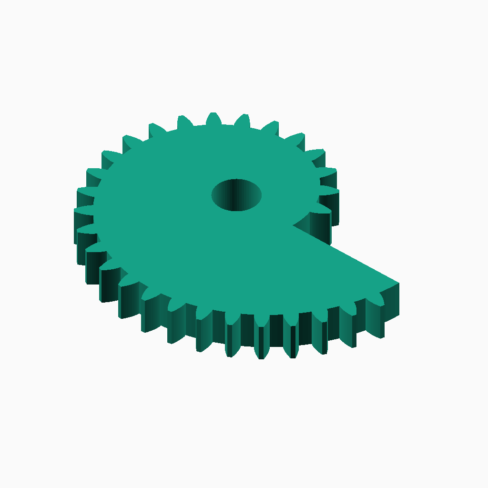](../images/functions/logarithmic_spiral/curve_gear_logarithmic_spiral_mate.png) |  |

Source: [`functions/logarithmic_spiral/curve_gear_logarithmic_spiral_mate.scad`](functions/logarithmic_spiral/curve_gear_logarithmic_spiral_mate.scad)

**Parameters:**

No parameters

**Returns:**

No return

Back to [module description](#module-executable-examples).

### Function `logarithmic_spiral_curve_gear_pair`

| curve_gear_logarithmic_spiral_pair example preview | ⠀ |
| --- | --- |
| [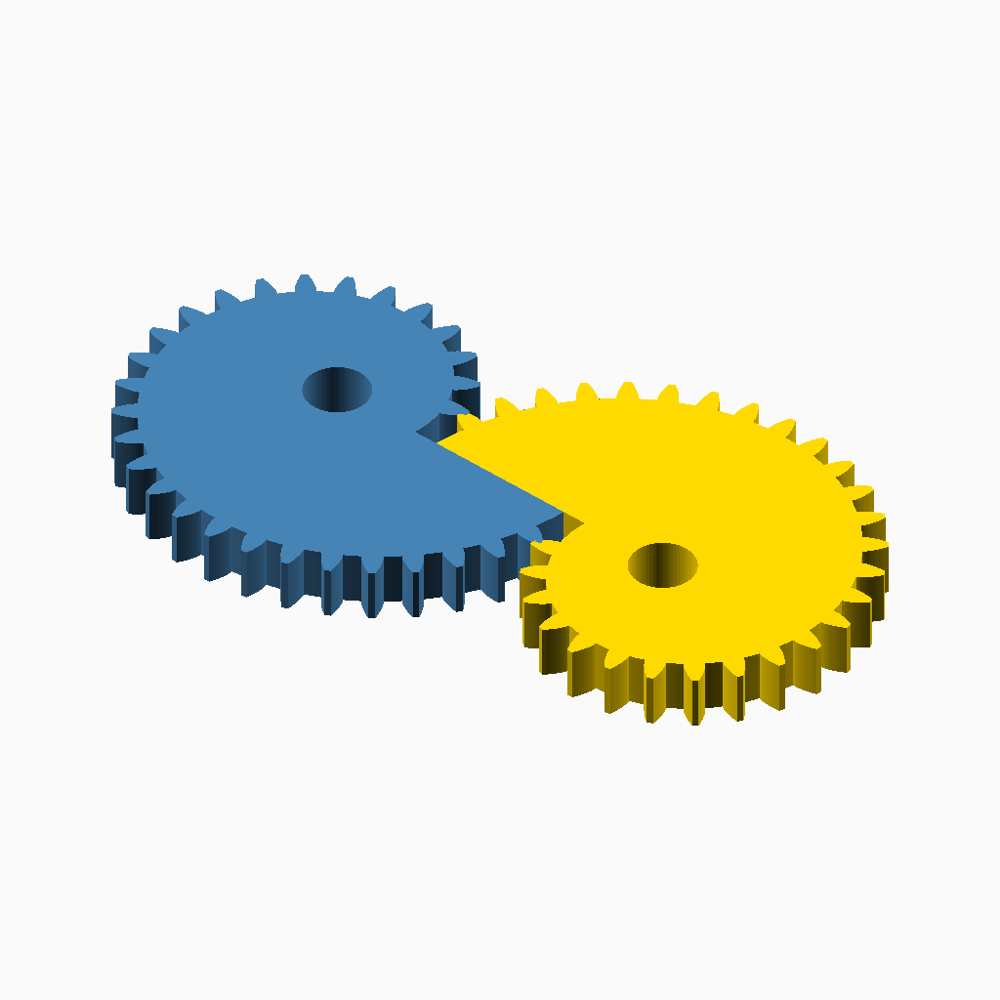](../images/functions/logarithmic_spiral/curve_gear_logarithmic_spiral_pair.png) |  |

Source: [`functions/logarithmic_spiral/curve_gear_logarithmic_spiral_pair.scad`](functions/logarithmic_spiral/curve_gear_logarithmic_spiral_pair.scad)

**Parameters:**

No parameters

**Returns:**

No return

Back to [module description](#module-executable-examples).

### Function `logarithmic_spiral_curve_gear_pair_alternative`

| Logarithmic spiral pair alternative | ⠀ |
| --- | --- |
| [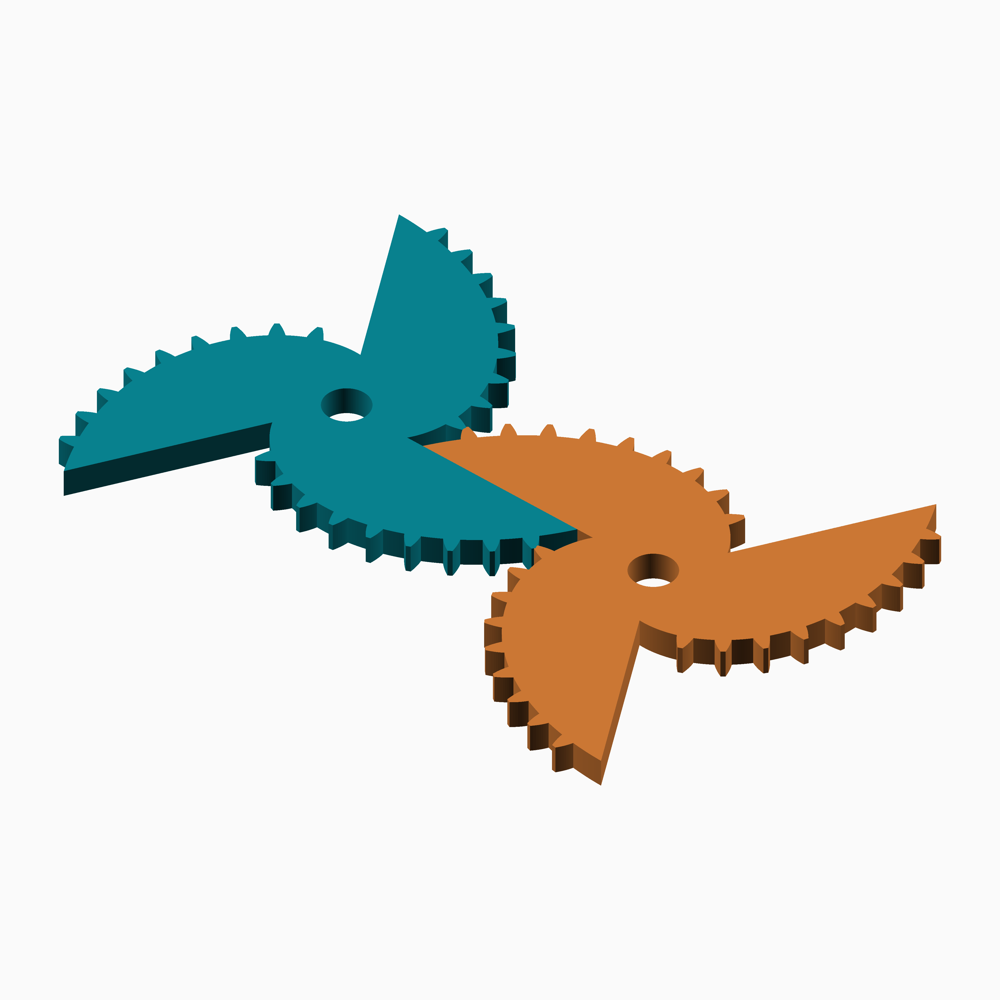](../images/functions/logarithmic_spiral/curve_gear_logarithmic_spiral_pair_alternative.png) |  |

Source: [`functions/logarithmic_spiral/curve_gear_logarithmic_spiral_pair_alternative.scad`](functions/logarithmic_spiral/curve_gear_logarithmic_spiral_pair_alternative.scad)
Three spiral sectors replace the canonical single return. Growth 1.22 increases the radial sweep. Returns are broad transitions without ordinary teeth, and the pair is a static reference rather than a validated conjugate transmission.

**Parameters:**

No parameters

**Returns:**

No return

Back to [module description](#module-executable-examples).

### Function `logarithmic_spiral_curve_gear_reference_separation`

Source: [`functions/logarithmic_spiral/curve_gear_logarithmic_spiral_reference_separation.scad`](functions/logarithmic_spiral/curve_gear_logarithmic_spiral_reference_separation.scad)

The result is deliberately emitted as an OpenSCAD console value because
this callable returns a number rather than geometry.

**Parameters:**

No parameters

**Returns:**

No return

Back to [module description](#module-executable-examples).

### Function `logistic_dwell_curve_gear_alternative`

| Logistic Dwell gear alternative | ⠀ |
| --- | --- |
| [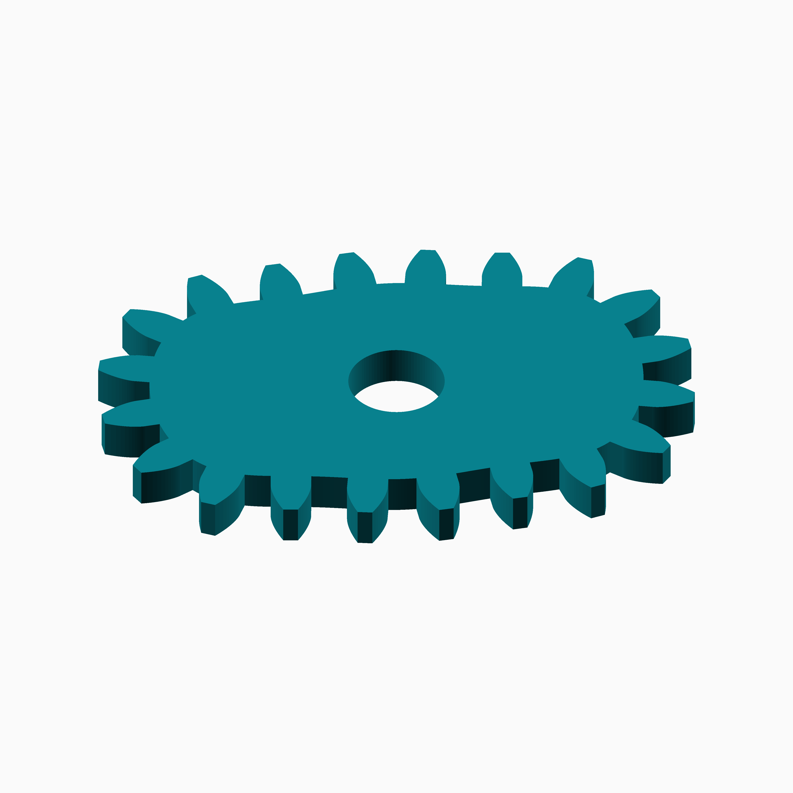](../images/functions/logistic_dwell/curve_gear_logistic_dwell_alternative.png) |  |

Source: [`functions/logistic_dwell/curve_gear_logistic_dwell_alternative.scad`](functions/logistic_dwell/curve_gear_logistic_dwell_alternative.scad)
Depth 0.46 and gain 3 replace the canonical shallow, steep logistic gate. The larger radial variation and smoother transitions distinguish curve amplitude from gate sharpness; coarse teeth expose the contour.

**Parameters:**

No parameters

**Returns:**

No return

Back to [module description](#module-executable-examples).

### Function `logistic_dwell_curve_gear_pair_alternative`

| Logistic Dwell pair alternative | ⠀ |
| --- | --- |
| [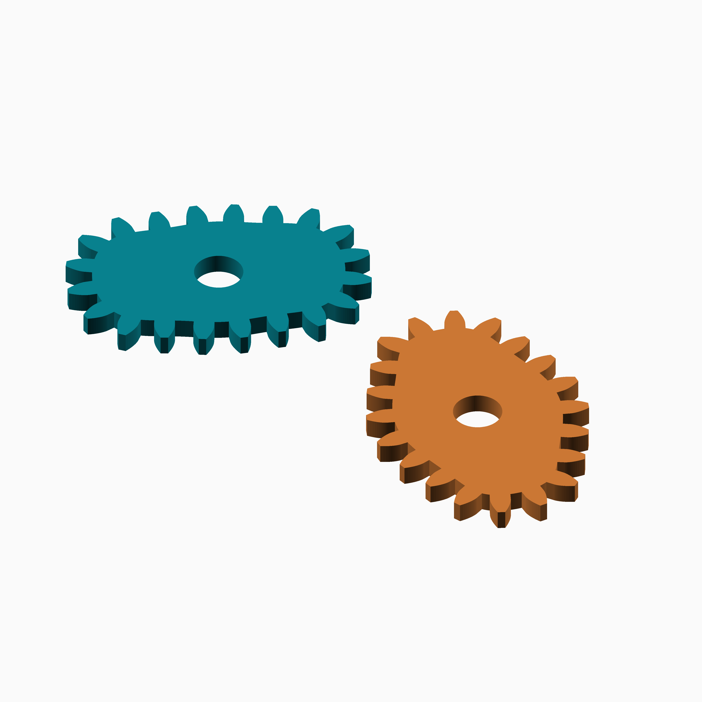](../images/functions/logistic_dwell/curve_gear_logistic_dwell_pair_alternative.png) |  |

Source: [`functions/logistic_dwell/curve_gear_logistic_dwell_pair_alternative.scad`](functions/logistic_dwell/curve_gear_logistic_dwell_pair_alternative.scad)
Depth 0.46 and gain 3 replace the canonical shallow, steep logistic gate. The larger radial variation and smoother transitions distinguish curve amplitude from gate sharpness; coarse teeth expose the contour.

**Parameters:**

No parameters

**Returns:**

No return

Back to [module description](#module-executable-examples).

### Function `pascal_curve_gear`

| curve_gear_pascal example preview | ⠀ |
| --- | --- |
| [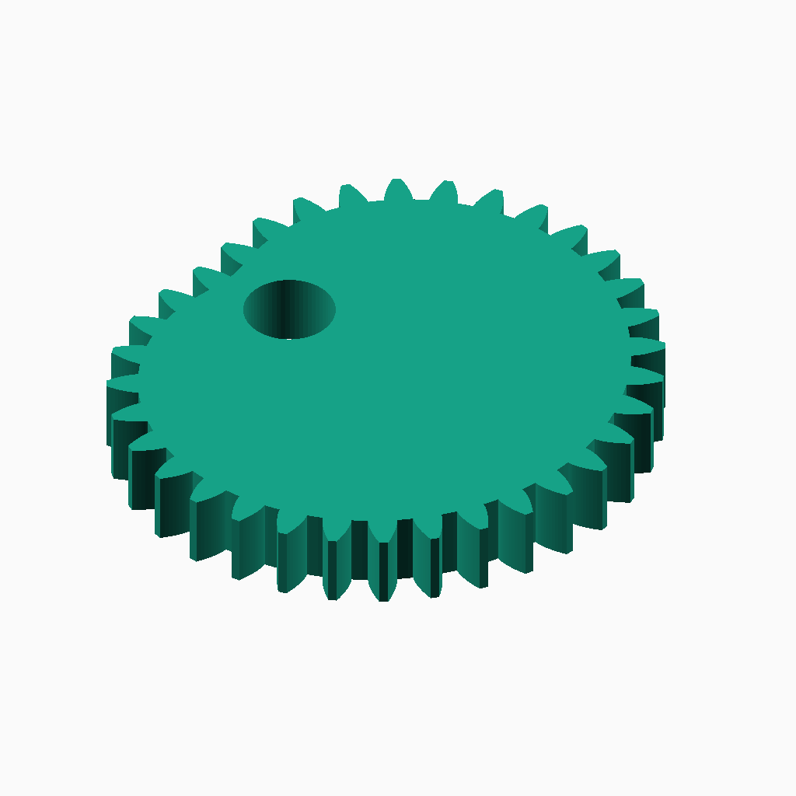](../images/functions/pascal/curve_gear_pascal.png) |  |

Source: [`functions/pascal/curve_gear_pascal.scad`](functions/pascal/curve_gear_pascal.scad)

**Parameters:**

No parameters

**Returns:**

No return

Back to [module description](#module-executable-examples).

### Function `pascal_curve_gear_alternative`

| Pascal gear alternative | ⠀ |
| --- | --- |
|  |  |

Source: [`functions/pascal/curve_gear_pascal_alternative.scad`](functions/pascal/curve_gear_pascal_alternative.scad)
Eccentricity 0.28 gives a convex egg-like outline instead of the canonical non-convex 0.60 limacon. Twenty coarse teeth emphasise the body contour. This contrasts the regular conjugate domain with the experimental dimpled case.

**Parameters:**

No parameters

**Returns:**

No return

Back to [module description](#module-executable-examples).

### Function `pascal_curve_gear_body`

| curve_gear_pascal_body example preview | ⠀ |
| --- | --- |
| [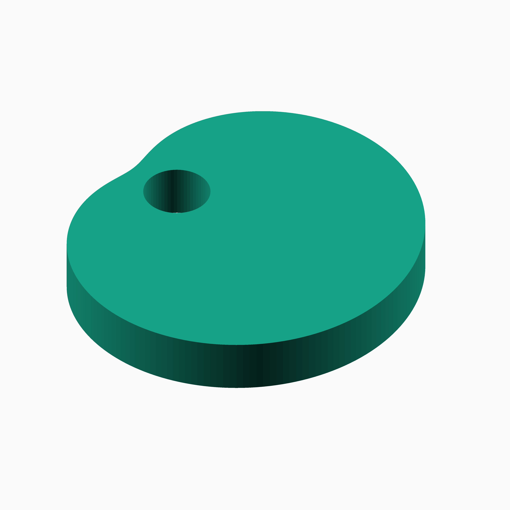](../images/functions/pascal/curve_gear_pascal_body.png) |  |

Source: [`functions/pascal/curve_gear_pascal_body.scad`](functions/pascal/curve_gear_pascal_body.scad)

**Parameters:**

No parameters

**Returns:**

No return

Back to [module description](#module-executable-examples).

### Function `pascal_curve_gear_centre_distance`

Source: [`functions/pascal/curve_gear_pascal_centre_distance.scad`](functions/pascal/curve_gear_pascal_centre_distance.scad)

The result is deliberately emitted as an OpenSCAD console value because
this callable returns a number rather than geometry.

**Parameters:**

No parameters

**Returns:**

No return

Back to [module description](#module-executable-examples).

### Function `pascal_curve_gear_mate`

| curve_gear_pascal_mate example preview | ⠀ |
| --- | --- |
| [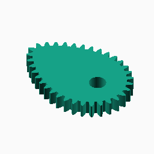](../images/functions/pascal/curve_gear_pascal_mate.png) |  |

Source: [`functions/pascal/curve_gear_pascal_mate.scad`](functions/pascal/curve_gear_pascal_mate.scad)

**Parameters:**

No parameters

**Returns:**

No return

Back to [module description](#module-executable-examples).

### Function `pascal_curve_gear_mate_rotation`

Source: [`functions/pascal/curve_gear_pascal_mate_rotation.scad`](functions/pascal/curve_gear_pascal_mate_rotation.scad)

The result is deliberately emitted as an OpenSCAD console value because
this callable returns a number rather than geometry.

**Parameters:**

No parameters

**Returns:**

No return

Back to [module description](#module-executable-examples).

### Function `pascal_curve_gear_pair`

| curve_gear_pascal_pair example preview | ⠀ |
| --- | --- |
| [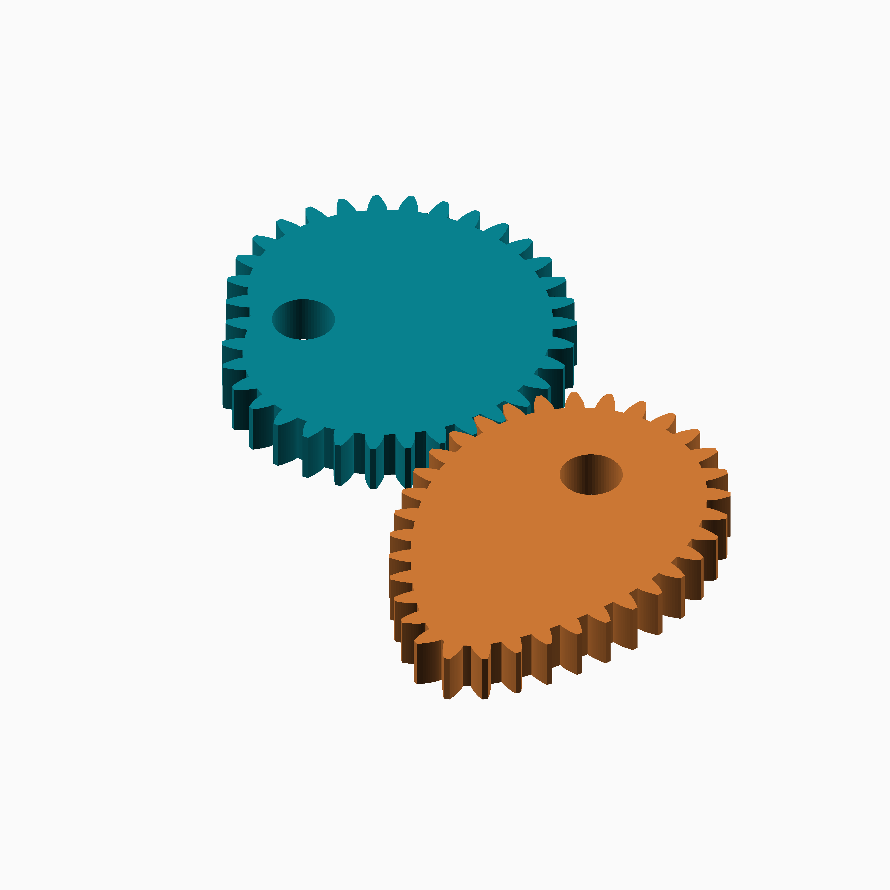](../images/functions/pascal/curve_gear_pascal_pair.png) |  |

Source: [`functions/pascal/curve_gear_pascal_pair.scad`](functions/pascal/curve_gear_pascal_pair.scad)

**Parameters:**

No parameters

**Returns:**

No return

Back to [module description](#module-executable-examples).

### Function `pascal_curve_gear_pair_alternative`

| Pascal pair alternative | ⠀ |
| --- | --- |
| [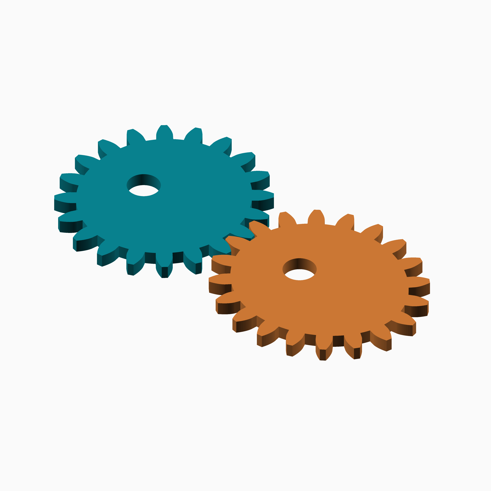](../images/functions/pascal/curve_gear_pascal_pair_alternative.png) |  |

Source: [`functions/pascal/curve_gear_pascal_pair_alternative.scad`](functions/pascal/curve_gear_pascal_pair_alternative.scad)
Eccentricity 0.28 gives a convex egg-like outline instead of the canonical non-convex 0.60 limacon. Twenty coarse teeth emphasise the body contour. This contrasts the regular conjugate domain with the experimental dimpled case.

**Parameters:**

No parameters

**Returns:**

No return

Back to [module description](#module-executable-examples).

### Function `superformula_curve_gear`

| curve_gear_superformula example preview | ⠀ |
| --- | --- |
| [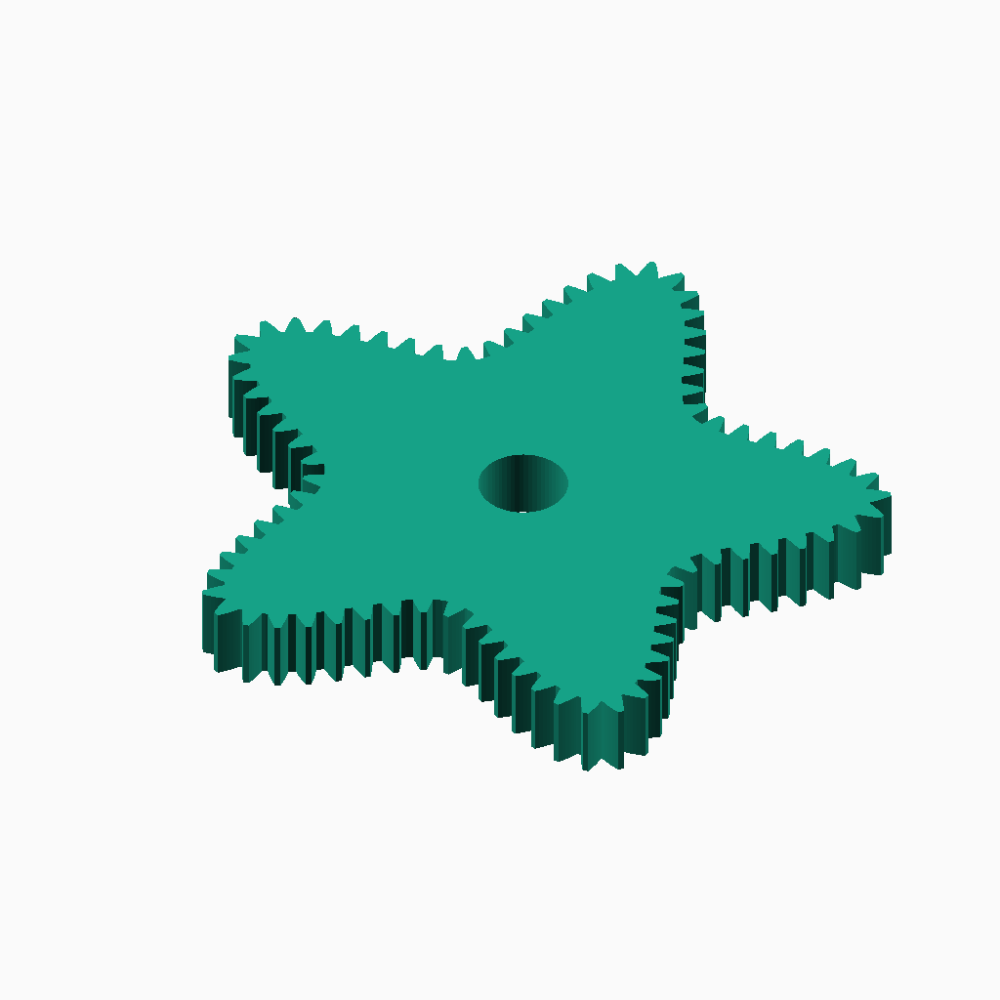](../images/functions/superformula/curve_gear_superformula.png) |  |

Source: [`functions/superformula/curve_gear_superformula.scad`](functions/superformula/curve_gear_superformula.scad)

**Parameters:**

No parameters

**Returns:**

No return

Back to [module description](#module-executable-examples).

### Function `superformula_curve_gear_alternative`

| Superformula gear alternative | ⠀ |
| --- | --- |
| [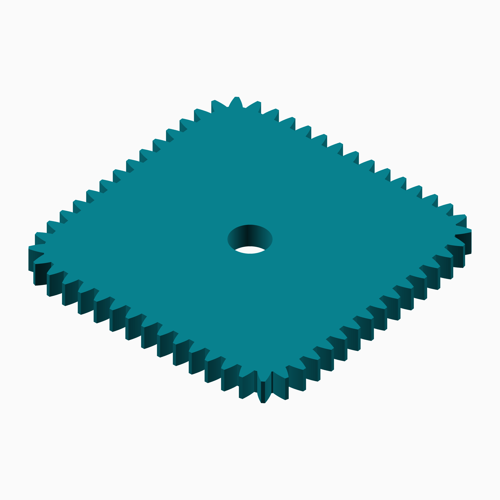](../images/functions/superformula/curve_gear_superformula_alternative.png) |  |

Source: [`functions/superformula/curve_gear_superformula_alternative.scad`](functions/superformula/curve_gear_superformula_alternative.scad)
A rounded square with symmetry 4 and exponents 8 replaces the canonical five-pointed star. This demonstrates the superformula's ability to change its shape class through exponents and symmetry.

**Parameters:**

No parameters

**Returns:**

No return

Back to [module description](#module-executable-examples).

### Function `superformula_curve_gear_body`

| curve_gear_superformula_body example preview | ⠀ |
| --- | --- |
| [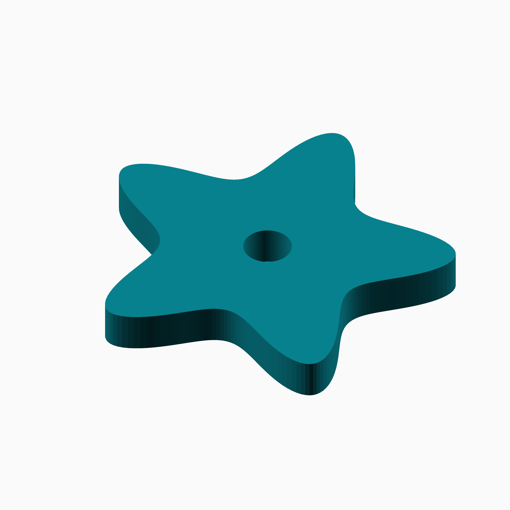](../images/functions/superformula/curve_gear_superformula_body.png) |  |

Source: [`functions/superformula/curve_gear_superformula_body.scad`](functions/superformula/curve_gear_superformula_body.scad)

**Parameters:**

No parameters

**Returns:**

No return

Back to [module description](#module-executable-examples).

### Function `superformula_curve_gear_centre_distance`

Source: [`functions/superformula/curve_gear_superformula_centre_distance.scad`](functions/superformula/curve_gear_superformula_centre_distance.scad)

The result is deliberately emitted as an OpenSCAD console value because
this callable returns a number rather than geometry.

**Parameters:**

No parameters

**Returns:**

No return

Back to [module description](#module-executable-examples).

### Function `superformula_curve_gear_mate`

| curve_gear_superformula_mate example preview | ⠀ |
| --- | --- |
| [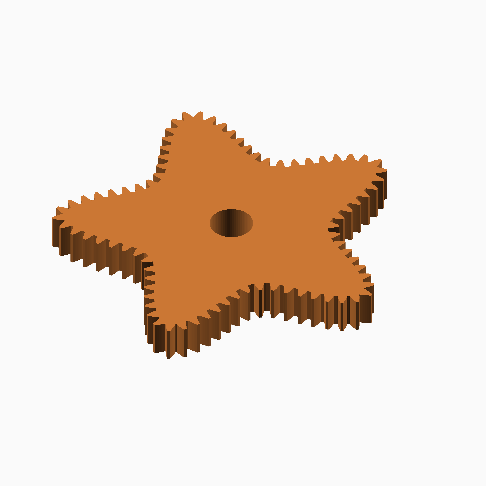](../images/functions/superformula/curve_gear_superformula_mate.png) |  |

Source: [`functions/superformula/curve_gear_superformula_mate.scad`](functions/superformula/curve_gear_superformula_mate.scad)

**Parameters:**

No parameters

**Returns:**

No return

Back to [module description](#module-executable-examples).

### Function `superformula_curve_gear_mate_rotation`

Source: [`functions/superformula/curve_gear_superformula_mate_rotation.scad`](functions/superformula/curve_gear_superformula_mate_rotation.scad)

The result is deliberately emitted as an OpenSCAD console value because
this callable returns a number rather than geometry.

**Parameters:**

No parameters

**Returns:**

No return

Back to [module description](#module-executable-examples).

### Function `superformula_curve_gear_pair`

| curve_gear_superformula_pair example preview | ⠀ |
| --- | --- |
| [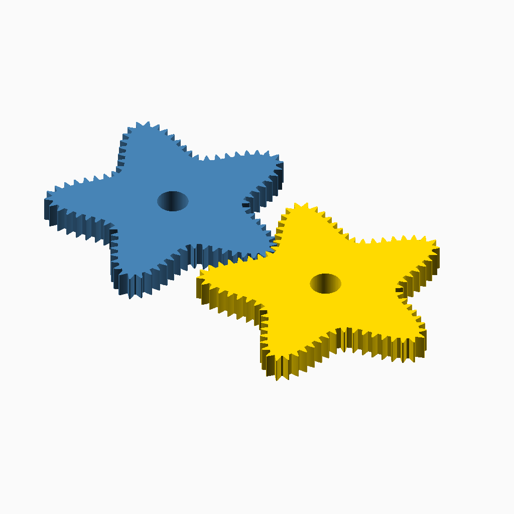](../images/functions/superformula/curve_gear_superformula_pair.png) |  |

Source: [`functions/superformula/curve_gear_superformula_pair.scad`](functions/superformula/curve_gear_superformula_pair.scad)

**Parameters:**

No parameters

**Returns:**

No return

Back to [module description](#module-executable-examples).

### Function `superformula_curve_gear_pair_alternative`

| Superformula pair alternative | ⠀ |
| --- | --- |
| [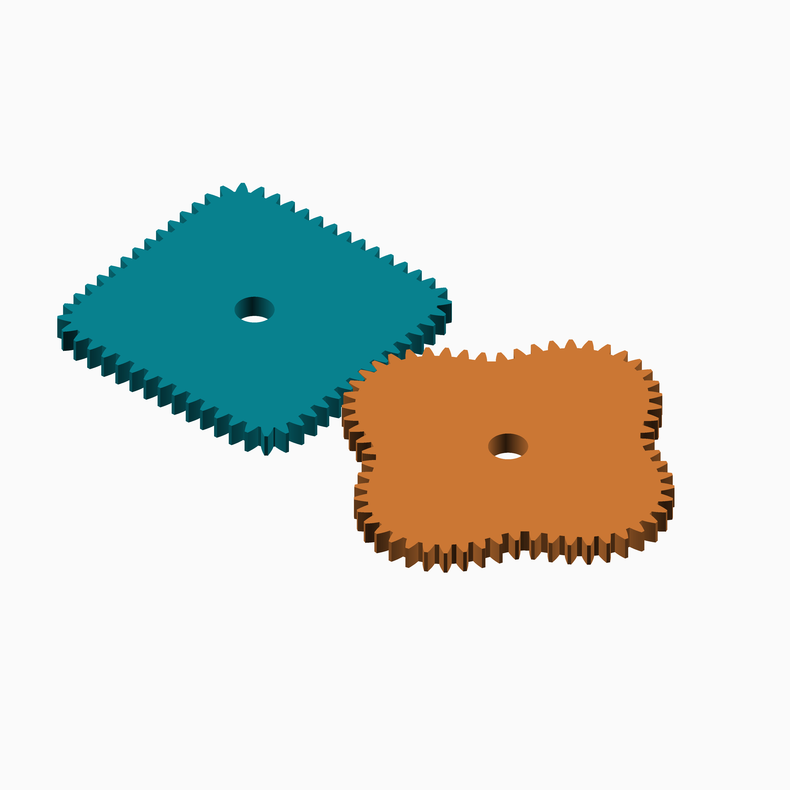](../images/functions/superformula/curve_gear_superformula_pair_alternative.png) |  |

Source: [`functions/superformula/curve_gear_superformula_pair_alternative.scad`](functions/superformula/curve_gear_superformula_pair_alternative.scad)
A rounded square with symmetry 4 and exponents 8 replaces the canonical five-pointed star. This demonstrates the superformula's ability to change its shape class through exponents and symmetry.

**Parameters:**

No parameters

**Returns:**

No return

Back to [module description](#module-executable-examples).

### Function `tanh_triad_curve_gear_alternative`

| Tanh Triad gear alternative | ⠀ |
| --- | --- |
| [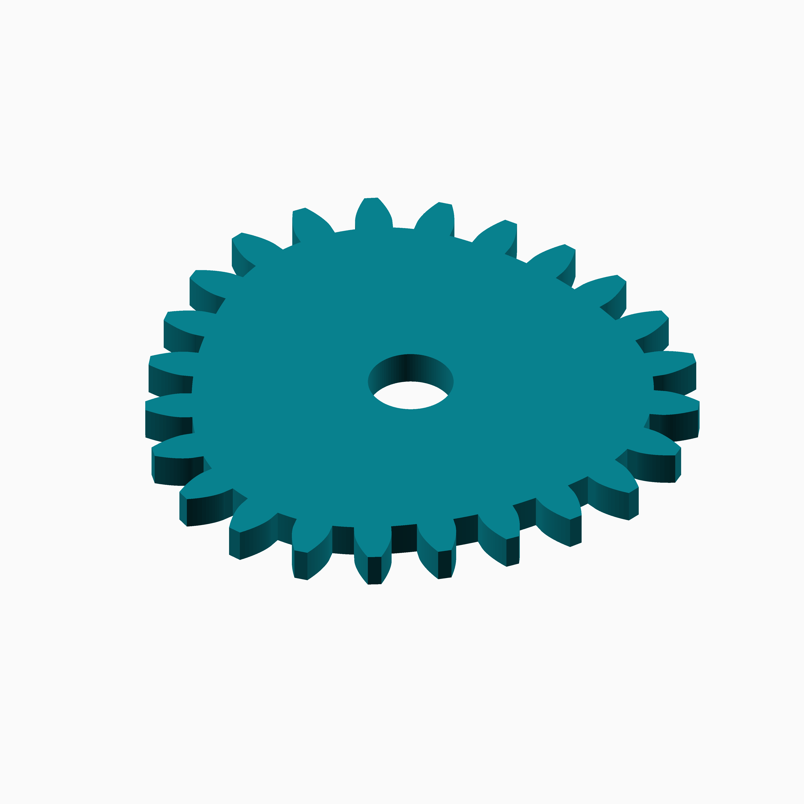](../images/functions/tanh_triad/curve_gear_tanh_triad_alternative.png) |  |

Source: [`functions/tanh_triad/curve_gear_tanh_triad_alternative.scad`](functions/tanh_triad/curve_gear_tanh_triad_alternative.scad)
A broad smooth triad with transition 0.8 and crest 0.32 replaces the canonical sharper, corrected triad. Removing the sixth-harmonic correction isolates the three-lobed tanh law; coarse teeth expose its boundary.

**Parameters:**

No parameters

**Returns:**

No return

Back to [module description](#module-executable-examples).

### Function `tanh_triad_curve_gear_pair_alternative`

| Tanh Triad pair alternative | ⠀ |
| --- | --- |
| [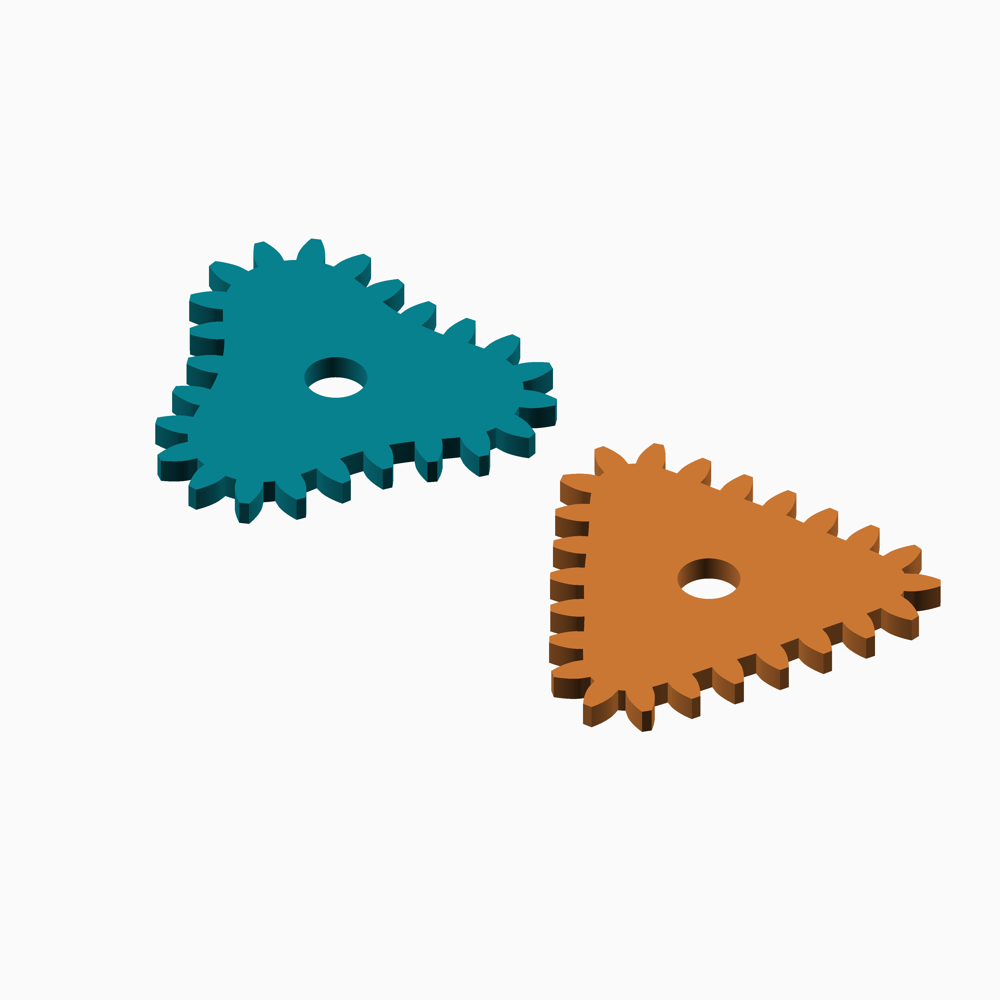](../images/functions/tanh_triad/curve_gear_tanh_triad_pair_alternative.png) |  |

Source: [`functions/tanh_triad/curve_gear_tanh_triad_pair_alternative.scad`](functions/tanh_triad/curve_gear_tanh_triad_pair_alternative.scad)
A broad smooth triad with transition 0.8 and crest 0.32 replaces the canonical sharper, corrected triad. Removing the sixth-harmonic correction isolates the three-lobed tanh law; coarse teeth expose its boundary.

**Parameters:**

No parameters

**Returns:**

No return

Back to [module description](#module-executable-examples).

### Function `temple_fay_curve_gear_alternative`

| Temple Fay gear alternative | ⠀ |
| --- | --- |
| [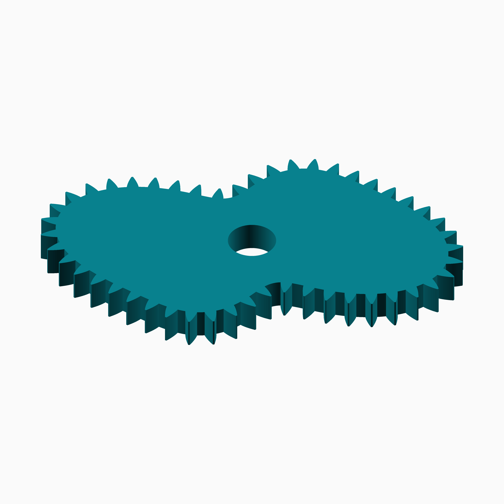](../images/functions/temple_fay/curve_gear_temple_fay_alternative.png) |  |

Source: [`functions/temple_fay/curve_gear_temple_fay_alternative.scad`](functions/temple_fay/curve_gear_temple_fay_alternative.scad)
Wing 0.32 and fold 0.12 strengthen the diagonal wing and waist structure compared with the canonical 0.18/0.05 form. The two Fourier harmonics are varied within the named family, without implying a literal butterfly curve.

**Parameters:**

No parameters

**Returns:**

No return

Back to [module description](#module-executable-examples).

### Function `temple_fay_curve_gear_pair_alternative`

| Temple Fay pair alternative | ⠀ |
| --- | --- |
| [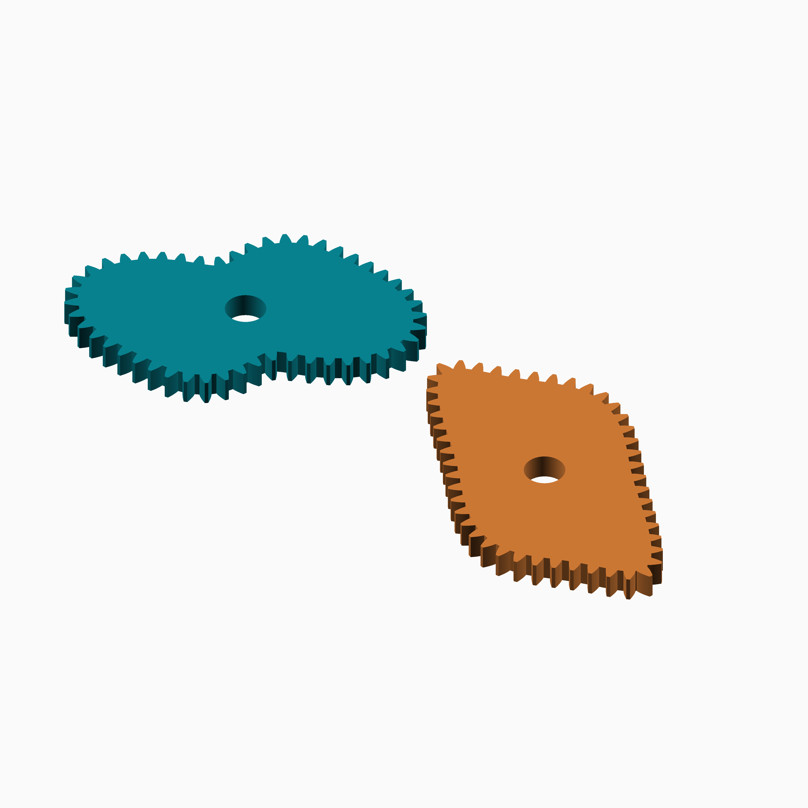](../images/functions/temple_fay/curve_gear_temple_fay_pair_alternative.png) |  |

Source: [`functions/temple_fay/curve_gear_temple_fay_pair_alternative.scad`](functions/temple_fay/curve_gear_temple_fay_pair_alternative.scad)
Wing 0.32 and fold 0.12 strengthen the diagonal wing and waist structure compared with the canonical 0.18/0.05 form. The two Fourier harmonics are varied within the named family, without implying a literal butterfly curve.

**Parameters:**

No parameters

**Returns:**

No return

Back to [module description](#module-executable-examples).

### Function `tooth_assembly`

| Tooth assembly preview preview | ⠀ |
| --- | --- |
|  |  |

Source: [`tooth/assembly.scad`](tooth/assembly.scad)

The left panel keeps the canonical body and accepted placed tooth
boundaries separate. The right panel is the single outline returned by
_cg_final_outline_from_placements, so the body intervals replaced by teeth
can be checked as one continuous polygon.

**Parameters:**

No parameters

**Returns:**

No return

Back to [module description](#module-executable-examples).

### Function `tooth_construction`

| Tooth construction preview preview | ⠀ |
| --- | --- |
| [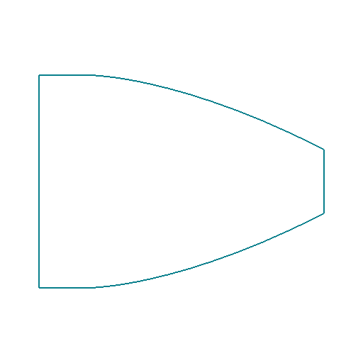](../images/tooth/construction_2d.png) |  |

Source: [`tooth/construction_2d.scad`](tooth/construction_2d.scad)

This is the standalone output of tooth/generation.scad. It is intentionally
a 2D polygon rather than attached to a curve, so the involute flanks and top
closure can be inspected without placement hiding their shape.

**Parameters:**

No parameters

**Returns:**

No return

Back to [module description](#module-executable-examples).

### Function `tooth_placement`

| Tooth placement preview preview | ⠀ |
| --- | --- |
| [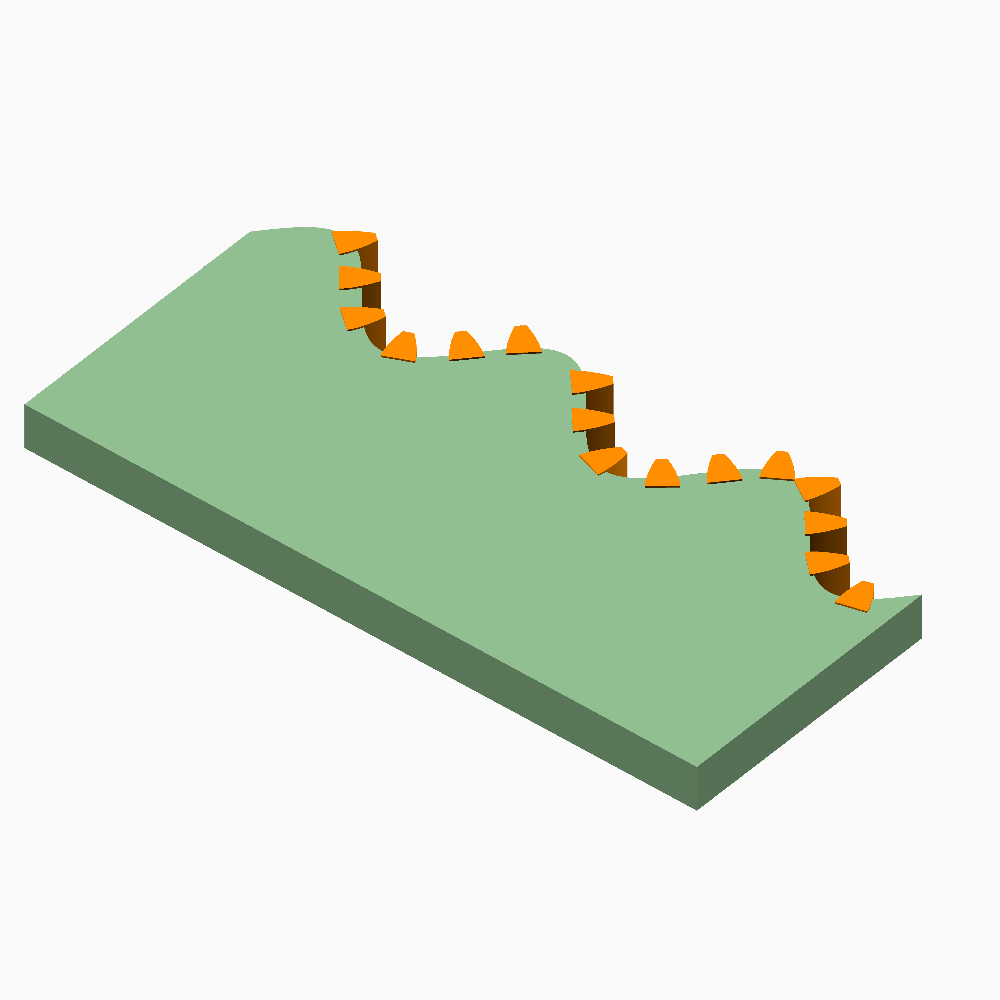](../images/tooth/placement.png) |  |

Source: [`tooth/placement.scad`](tooth/placement.scad)

This diagnostic deliberately uses a rectangular body with a multi-period
sine-wave upper edge. Teeth are displayed only on that edge, so changing
tangents, normals, hills, valleys and source-point spacing can be inspected
without the rest of a closed gear hiding the placement behaviour. The body
is inset beneath the source curve, while the production tooth
boundary is shown in full so each tooth visibly stands on the edge.

**Parameters:**

No parameters

**Returns:**

No return

Back to [module description](#module-executable-examples).

Back to [top](#).

---

[Back to the CurveGears README](../README.md)

*Generated by Doxydown from repository source comments; do not edit this page directly.*
